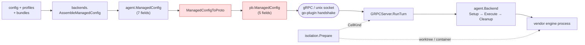

# Engine & launch layer

How ctxloom turns "run this agent" into a running vendor engine process. This
directory documents `internal/lm` (the backend registry, the gRPC plugin wire, the
isolation seam, and the conformance suite) and the six per-engine adapters.

**The one architectural fact to carry into everything else**: ctxloom holds no
provider SDK and makes no direct model-API call. Every backend reaches its model by
spawning the **vendor's own binary** or that vendor's ACP adapter. This is a
licensing invariant, not a style preference, and it lives in the *shape* of the
registry table (`internal/lm/backends/registry.go:239-260`).

## Start here

| If you want to know… | Read |
|---|---|
| **"Does engine X support Y?"** | **[Capability matrix](capability-matrix.md)** — engine × capability, every cell sourced |
| What the `Backend` interface is, who implements it, how engines register | [Backend abstraction & registry](backend-abstraction.md) |
| How a run gets from the host to an engine process — and which fields do *not* survive the trip | [The plugin wire](grpc-wire.md) |
| What "isolated" actually means, per axis and per engine | [Isolation](isolation.md) |

## Per-engine adapters

| Page | Backend id | Drive | `plan` enforced? | Notable |
|---|---|---|---|---|
| [claude](claude.md) | `claude-code` | ACP adapter (`claude-code-acp`) | **yes** | The exercised default; the **only** engine with a native per-tool deny list and the only one with an out-of-cwd redirect (`SharedRealization`) |
| [codex](codex.md) | `codex` | ACP adapter (`codex-acp`) | **yes** | Owns `CODEX_HOME`; prompts and skills are **global-only**; experimental, never run against a real account |
| [kiro](kiro.md) | `kiro` | ACP **native** (`kiro-cli acp`) | **yes** | Strongest native-surfaces citizen; commands and skills share one dir; container auth needs `KIRO_API_KEY` |
| [antigravity](antigravity.md) | `antigravity` | **bespoke** prose loop over `agy -p` | **no — collapses** | `--mode plan` is emitted and not enforced; host+worktree isolation is *refused*, not degraded |
| [opencode](opencode.md) | `opencode` | ACP **native** (`opencode acp`) | **yes** | Transient-overlay config; the **only** engine with a live `History()`; support status undeclared |
| [mockengine](mockengine.md) | *(not a backend)* | it *is* the engine | n/a | A fake vendor CLI that proves context delivery — and what a mock-only pass does not prove |

The generic `acp` backend (`registry.go:391`) drives *any* ACP-speaking command
config supplies, so new ACP agents become **config, not code**. It registers no
settings writer and no exports; it has no page of its own and appears as a row in
the matrix.

## The shape of the launch path

The highlighted hop is where the Go struct's 7 fields become the proto's 5.

## Facts worth knowing before you read any source here

These are documented in full on the pages above; they are collected here because
each one contradicts what the surrounding code looks like it does.

1. **`ManagedConfig.Skills` and `ManagedConfig.DenyTools` never reach a launched engine.** The Go struct has 7 fields (`internal/shared/agent/backend.go:348-363`); the proto has 5 (`internal/lm/grpc/llm.proto:425-431`); the converters drop both in both directions (`internal/lm/grpc/managed.go:22-43`). `internal/lm/grpc/server.go:204` is the only site constructing `SetupRequest.Managed`, so there is no in-process bypass. They *do* reach the host-side `profile materialize` path, and `DenyTools` alone reaches `apply-hooks`. → [wire](grpc-wire.md), [matrix §3](capability-matrix.md)
2. **antigravity's `--mode plan` is emitted and not enforced.** Live-verified 2026-07-15 against authenticated agy 1.1.2: a sentinel write landed exactly like the bypass control. The compensation is `EnforcesReadOnlyPlan("antigravity") == false`, which makes `CollapsePlanIfUnenforced` turn `plan` into `default`. → [antigravity](antigravity.md)
3. **`wire.Hook.PreToolFallback` is persisted, bundled, trust-hashed, and always `false` on the engine side** — its only consumer is antigravity, whose own comment calls it "the only way it ever fires on agy". → [wire](grpc-wire.md)
4. **`ChatRequest.Runtime` does not cross the wire**, so a container-bound `ctxloom acp` session runs the engine on the host while the session summary reports container isolation. → [wire](grpc-wire.md)
5. **`ContentCommands` / `RegisterFromContent` is implemented by six backends and invoked zero times** — `LaunchBackend.commands` is assigned at `internal/shared/agent/launch_backend.go:92` and read nowhere. → [backend abstraction](backend-abstraction.md)
6. **An unprofiled backend's container inherits claude's credentials.** The `default:` arm of `containerProfileFor` (`internal/lm/isolation/profile.go:500-510`) returns `resolveClaudeContainerAuth` for any unrecognized engine — and a generic `acp` backend is registered. → [isolation](isolation.md)
7. **Only `claude-code` can isolate a shared cwd without a container.** Every other engine returns `nil, false` from `SharedRealization`, so concurrent per-agent isolation needs a worktree or a container cell. → [matrix §4](capability-matrix.md)
8. **Four of five engines deleted their transcript scrapers outright** rather than demoting them; only opencode has a live `History()`, via `opencode session list` / `opencode export`. → [matrix §6](capability-matrix.md)

## Scope

Covered here: `internal/lm/backends`, `internal/lm/conformance`, `internal/lm/grpc`,
`internal/lm/isolation`, `internal/claude`, `internal/codex`, `internal/kiro`,
`internal/antigravity`, `internal/opencode`, `internal/mockengine`.

Types shared with the rest of the system — `agent.Backend`, `agent.ManagedConfig`,
`agent.PermissionMode`, `agent.SurfaceInputs`, `agent.CellKind` — live in
`internal/shared/agent` and are documented here from the launch layer's point of
view.

These pages record **behavior**, not verdicts. Defect triage lives in `FINDINGS.md`;
where behavior diverges from what a doc comment or interface implies, the divergence
is stated as a fact with a `file:line` and nothing more.
