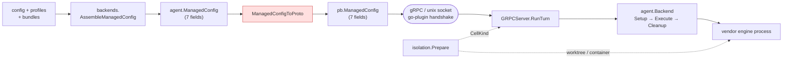

# Engine & launch layer

How ctxloom turns "run this agent" into a running vendor engine process. This
directory documents `internal/lm` (the backend registry, the gRPC plugin wire, the
isolation seam, and the conformance suite) and the five per-engine adapters.

The antigravity engine (Google's `agy` CLI) was removed in 0.7.0 — its page
and every antigravity-specific fact below have been retired along with it,
not archived; see git history before this removal for the prior content.

**The one architectural fact to carry into everything else**: ctxloom holds no
provider SDK and makes no direct model-API call. Every backend reaches its model by
spawning the **vendor's own binary** or that vendor's ACP adapter. This is a
licensing invariant, not a style preference, and it lives in the *shape* of the
registry table (`internal/lm/backends/registry.go:239-260`).

## Start here

| If you want to know… | Read |
|---|---|
| **"Does engine X support Y?"** | **[Capability matrix](capability-matrix.md)** — engine × capability, every cell sourced |
| What the `Backend` interface is, who implements it, how engines register | [Backend abstraction & registry](backend-abstraction.md) |
| How a run gets from the host to an engine process — and which fields do *not* survive the trip | [The plugin wire](grpc-wire.md) |
| What "isolated" actually means, per axis and per engine | [Isolation](isolation.md) |

## Per-engine adapters

| Page | Backend id | Drive | `plan` enforced? | Notable |
|---|---|---|---|---|
| [claude](claude.md) | `claude-code` | ACP adapter (`claude-code-acp`) | **yes** | The exercised default; the **only** engine with a native per-tool deny list and the only one with an out-of-cwd redirect (`SharedRealization`) |
| [codex](codex.md) | `codex` | ACP adapter (`codex-acp`) | **yes** | Owns `CODEX_HOME`; prompts and skills are **global-only**; experimental, never run against a real account |
| [kiro](kiro.md) | `kiro` | ACP **native** (`kiro-cli acp`) | **yes** | Strongest native-surfaces citizen; commands and skills share one dir; container auth needs `KIRO_API_KEY` |
| [opencode](opencode.md) | `opencode` | ACP **native** (`opencode acp`) | **yes** | Transient-overlay config; the **only** engine with a live `History()`; support status undeclared |
| [mockengine](mockengine.md) | *(not a backend)* | it *is* the engine | n/a | A fake vendor CLI that proves context delivery — and what a mock-only pass does not prove |

The generic `acp` backend (`registry.go:391`) drives *any* ACP-speaking command
config supplies, so new ACP agents become **config, not code**. It registers no
settings writer and no exports; it has no page of its own and appears as a row in
the matrix.

## The shape of the launch path

The highlighted hop is hand-written and has no compiler link to the Go struct — it
carries all 7 fields today, and a reflective total-struct parity sweep
(`internal/lm/grpc/arch_test.go`, `40b49a7f`) is what keeps it that way. **It
used to carry 5**, silently zeroing `Skills` and `DenyTools` in transit.

## Facts worth knowing before you read any source here

These are documented in full on the pages above; they are collected here because
each one contradicts what the surrounding code looks like it does.

1. **The launch wire is hand-written and nothing but a test binds it to the Go struct.** `internal/shared/agent.ManagedConfig` and proto `ManagedConfig` agree on 7 fields today; they disagreed on 2 until `40b49a7f`, and `Skills` + `DenyTools` reached **no** launched engine for as long as that lasted. The guard is now `internal/lm/grpc/arch_test.go` — a reflective sweep that names no field, so it covers fields added after it. → [wire](grpc-wire.md), [matrix §3](capability-matrix.md)
2. ~~**`wire.Hook.PreToolFallback` is always `false` on the engine side**~~ — **RESOLVED `40b49a7f`.** It is persisted, bundled, trust-hashed and now carried; the field's one consumer (antigravity) was removed in 0.7.0, and the field stays wired for whichever future engine needs it next. → [wire](grpc-wire.md)
3. ~~**`ChatRequest.Runtime` does not cross the wire**~~ — **RESOLVED `40b49a7f`.** It used to mean a container-bound `ctxloom acp` session ran the engine on the host while the session summary reported container isolation. Repairing it *activated* an `internal/acp` path-confinement hole it had been masking, which is why confinement landed first (`73ea8d7f`). → [wire](grpc-wire.md)
4. **`ContentCommands` / `RegisterFromContent` is implemented by five backends and invoked zero times** — `LaunchBackend.commands` is assigned at `internal/shared/agent/launch_backend.go:92` and read nowhere. → [backend abstraction](backend-abstraction.md)
5. **An unprofiled backend's container inherits claude's credentials.** The `default:` arm of `containerProfileFor` (`internal/lm/isolation/profile.go:500-510`) returns `resolveClaudeContainerAuth` for any unrecognized engine — and a generic `acp` backend is registered. → [isolation](isolation.md)
6. **Only `claude-code` can isolate a shared cwd without a container.** Every other engine returns `nil, false` from `SharedRealization`, so concurrent per-agent isolation needs a worktree or a container cell. → [matrix §4](capability-matrix.md)
7. **Three of four engines deleted their transcript scrapers outright** rather than demoting them; only opencode has a live `History()`, via `opencode session list` / `opencode export`. → [matrix §6](capability-matrix.md)

## Scope

Covered here: `internal/lm/backends`, `internal/lm/conformance`, `internal/lm/grpc`,
`internal/lm/isolation`, `internal/claude`, `internal/codex`, `internal/kiro`,
`internal/opencode`, `internal/mockengine`.

Types shared with the rest of the system — `agent.Backend`, `agent.ManagedConfig`,
`agent.PermissionMode`, `agent.SurfaceInputs`, `agent.CellKind` — live in
`internal/shared/agent` and are documented here from the launch layer's point of
view.

These pages record **behavior**, not verdicts. Defect triage lives in `FINDINGS.md`;
where behavior diverges from what a doc comment or interface implies, the divergence
is stated as a fact with a `file:line` and nothing more.
