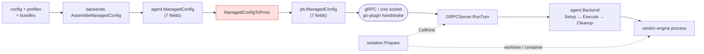

# Engine & launch layer

How ctxloom turns "run this agent" into a running vendor engine process. This
directory documents `internal/lm` (the backend registry, the gRPC plugin wire, the
isolation seam, and the conformance suite) and the per-engine adapters.

**The one architectural fact to carry into everything else**: ctxloom holds no
provider SDK and makes no direct model-API call. Every backend reaches its model by
spawning the **vendor's own binary**. This is a
licensing invariant, not a style preference, and it lives in the *shape* of the
registry table — the doc comment above `init()` in
`internal/lm/backends/registry.go` states it.

## Start here

| If you want to know… | Read |
|---|---|
| **"Does engine X support Y?"** | **[Capability matrix](capability-matrix.md)** — engine × capability, every cell sourced |
| What the `Backend` interface is, who implements it, how engines register | [Backend abstraction & registry](backend-abstraction.md) |
| How a run gets from the host to an engine process — and which fields do *not* survive the trip | [The plugin wire](grpc-wire.md) |
| What "isolated" actually means, per axis and per engine | [Isolation](isolation.md) |

## Per-engine adapters

| Page | Backend id | Drive | `plan` enforced? | Notable |
|---|---|---|---|---|
| [claude](claude.md) | `claude-code` | vendor CLI | **yes** | The exercised default. Carries a native per-tool deny list, and its approaches declare an out-of-cwd form (`agent.OutOfCwd`) so a shared cwd is never written into |
| [mockengine](mockengine.md) | *(not a backend)* | it *is* the engine | n/a | A fake vendor CLI that proves context delivery — and what a mock-only pass does not prove |

The in-process test doubles (`config.BackendMock` and its siblings) are
registered backends too; they have no page of their own and are described
alongside the registry in [Backend abstraction & registry](backend-abstraction.md).

## The shape of the launch path

```mermaid
flowchart LR
    CFG["config + profiles<br/>+ bundles"] --> ASM["backends.<br/>AssembleManagedConfig"]
    ASM --> MC["agent.ManagedConfig<br/>(7 fields)"]
    MC --> CONV["ManagedConfigToProto"]
    CONV --> PB["pb.ManagedConfig<br/>(7 fields)"]
    PB --> WIRE(["gRPC / unix socket<br/>go-plugin handshake"])
    WIRE --> SRV["GRPCServer.RunTurn"]
    SRV --> BE["agent.Backend<br/>Setup → Execute → Cleanup"]
    BE --> ENG["vendor engine process"]

    ISO["isolation.Prepare"] -.->|CellKind| SRV
    ISO -.->|worktree / container| ENG

    style CONV fill:#f884,stroke:#c44
```

The highlighted hop is hand-written and has no compiler link to the Go struct — it
carries all 7 fields today, and a reflective total-struct parity sweep
(`internal/lm/grpc/arch_test.go`, `40b49a7f`) is what keeps it that way. **It
used to carry 5**, silently zeroing `Skills` and `DenyTools` in transit.

## Facts worth knowing before you read any source here

These are documented in full on the pages above; they are collected here because
each one contradicts what the surrounding code looks like it does.

1. **The launch wire is hand-written and nothing but a test binds it to the Go struct.** `internal/core/agent.ManagedConfig` and proto `ManagedConfig` agree on 7 fields today; they disagreed on 2 until `40b49a7f`, and `Skills` + `DenyTools` reached **no** launched engine for as long as that lasted. The guard is now `internal/lm/grpc/arch_test.go` — a reflective sweep that names no field, so it covers fields added after it. → [wire](grpc-wire.md), [matrix §3](capability-matrix.md)
2. ~~**`wire.Hook.PreToolFallback` is always `false` on the engine side**~~ — **RESOLVED `40b49a7f`.** It is persisted, bundled, trust-hashed and now carried; no registered engine reads it at launch today, and it stays wired for whichever engine needs it next. → [wire](grpc-wire.md)
3. ~~**`ChatRequest.Runtime` does not cross the wire**~~ — **RESOLVED `40b49a7f`.** It used to mean a container-bound structured session ran the engine on the host while the session summary reported container isolation. Repairing it *activated* a path-confinement hole it had been masking, which is why confinement landed first (`73ea8d7f`). → [wire](grpc-wire.md)
4. ~~**An unprofiled backend's container inherits claude's credentials.**~~ — **RESOLVED `a6d9bd95`.** The `default:` arm of `engineContainerSpecFor` returned `resolveClaudeContainerAuth` for any unrecognized engine. It now fails closed, and `runtime: container-*` for an engine with no auth mapping is refused when the binding is *written*, not when it is launched. → [isolation](isolation.md)
5. **Isolating a shared cwd without a container requires `agent.OutOfCwd`.** claude-code's approaches declare it; a backend whose approaches lack it falls back to the loudly-warned well-known write, and concurrent per-agent isolation for it needs a worktree or a container cell. → [matrix §4](capability-matrix.md)
6. **No registered backend has a live transcript scraper.** claude-code's was deleted outright rather than demoted (its descriptor's `NoLegacyHistoryReason` says so), and a `nil` `History()` fails loudly at both consumers; canonical capture is written runner-side into `internal/adapters/transcript`. → [matrix §6](capability-matrix.md)

## Scope

Covered here: `internal/lm/backends`, `internal/lm/conformance`, `internal/lm/grpc`,
`internal/adapters/isolation`, `internal/claude`, `internal/mockengine`.

Types shared with the rest of the system — `agent.Backend`, `agent.ManagedConfig`,
`agent.PermissionMode`, `agent.SurfaceInputs`, `agent.CellKind` — live in
`internal/core/agent` and are documented here from the launch layer's point of
view.

These pages record **behavior**, not verdicts. Defect triage lives in `FINDINGS.md`;
where behavior diverges from what a doc comment or interface implies, the divergence
is stated as a fact with a `file:line` and nothing more.
