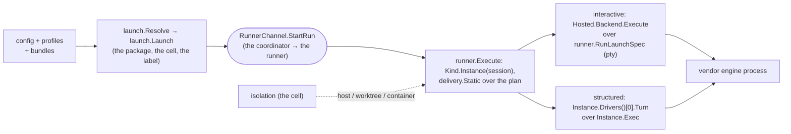

# Engine & launch layer

How ctxloom turns "run this agent" into a running vendor engine process. This
directory documents `internal/engines` (the composition root, the per-engine
packages and the conformance suite) and `internal/adapters/isolation` (the
isolation seam).

**The one architectural fact to carry into everything else**: ctxloom holds no
provider SDK and makes no direct model-API call. Every engine reaches its model by
spawning the **vendor's own binary**. This is a licensing invariant, not a style
preference, and it lives in the *shape* of every engine's `Instance.Exec`: an
argv for the vendor's binary, never an HTTP client.

## The definition / instance split

An engine is two halves on one port (`internal/core/engine`):

- **The DEFINITION — declarative, in `internal/core/engine`.** An engine KIND
  is a value: the engine package's struct embedding `engine.Base`, whose
  `Definition` declares one typed approach per surface kind (`Context`, `MCP`,
  `Settings`, `Hooks`, `Commands`, `Skills`), the optional `Dynamic` approach,
  the modes and their argv grammars (`CLI`, derived from the L1 `EngineCLI`),
  and the export schema; the engine's permission model rides beside it
  (`Engine.Permissions`). `Base` derives every view
  (`Surfaces`, `Carries`, `Static`), decides static-vs-dynamic delegation
  once (`Delegate`), and `Validate`s coherence in the ONE plain constructor
  each engine package exposes (`claude.Build`, `mock.New`/`mock.Build`).
  `engines.Build()` composes the kinds into an `engine.Registry` value.
  `core/engine/conformance` asserts the declarative half for every kind;
  each engine package runs it against its own constructor.
- **The INSTANCE — what runs a session, on the port.** `Engine.Instance(Session)`
  binds one session and is where REQUIREDNESS is refused (a kind whose
  `Definition` lacks the context surface the session needs refuses it by
  name, `engine.ErrUnsupported`); `Instance.Exec(presented)` is the ONE
  place an engine's argv/env/cwd is composed — for claude, `buildArgs` and
  `Chat` are projections onto it and the launch golden
  (`engines/claude/testdata/exec_parity.golden`) pins every launch of the
  matrix byte-identical; `Instance.Drivers()` are the engine's native
  structured drivers (claude: a per-turn stream-json driver assembled from
  `kit.ProcessTurn`; empty means
  pty-only and a Structured launch is refused with
  `ErrUnsupported{drive}`); `Instance.Resume(key)` re-attaches a native
  session. The engine's own stories are the kind's methods: `Home()`
  (`engine.HomeSpec`, the zero value the null object; `Vars` are the home
  vars isolation binds, every one of them, by `engine.BindHome`: the first names
  the session home, each further one a directory beneath it; `Auth` names the env
  var the engine reads its long-lived token from), `Container()` (a spec or a refusal),
  `Transcripts()` (readers the composition root hands in — they are
  transcript adapters an engine must not import) and `Hooks()` (the
  engine's hook wire, `engine.HookCodec`: `Decode` a native payload into a
  neutral `HookEvent`, `Encode` a neutral `HookResponse` into the native
  stdout and exit status, `ContextLimit`, and `InvokedSkill` — see
  [hooks](../cli/hooks.md#the-hook-codec)). `adapters/isolation` reads those facts off the engine
  (`isolation.FactsOf`), and `adapters/runner.Execute` binds the Instance
  before delivering. `core/engine/conformance` asserts both halves
  for every kind.
- **The composition root and the seam's remainder.** `engines.Compose()`
  builds the shipped kinds once per process (`engines.Registry()` is what
  every adapter that resolves an engine by name reads; `engines.Use` is the
  test seam; `isolation.RegistryFacts` is installed beside it by the root
  that composed). What `agent.Backend` still needs that the port does not
  carry — the backend constructor, the typed config, the named-form table a
  binding's `surfaces:` is validated against, the settings writer `manage
  status` reads, the project/global settings collision guard — is
  `agent.Hosted`, implemented by each engine VALUE and asserted on the
  registry's value (`engines.Hosted`); the L1 process-surface grammar the
  standalone mock impersonates is `agent.EngineCLIProvider` on the same
  value (`engines.EngineCLIs`). Both leave with `agent.Backend`. The
  structured drive is per turn (`Instance.Drivers()[0].Turn`); the
  interactive launch is the hosted engine's `Backend.Execute` over the
  runner's launcher (`runner.RunLaunchSpec`, a plain pty via
  `ptyrunner.RunInteractive`). The managed-hooks assembly is `operations/managedhooks`.

Outside INITIAL SETUP nothing names or chooses an engine: engine-specific
behaviour is reached only through the Definition, its approaches and its
declared capabilities, through the registry. Initial setup is defined by
structure, not by a list: the registry root (the package `internal/engines`,
the composition root) and each engine's own tree `internal/engines/<id>/**`
for a registered engine ID — so a shared package beside the engines, the
engine kit `internal/engines/kit`, is not setup and names no engine — every
`package main` (a binary's composition root), an
engine's family package (one whose last path element is a registered
engine's ID, such as `transcript/vendorreader/claude`), and a lean binary's
own engine registry (`internal/<bin>/engine`). `tests/arch`'s
`TestArch_EngineIdentity_OnlyInitialSetupNamesAnEngine`
(`engine_identity_arch_test.go`) holds it with no allowlist: outside that
set no production file imports a concrete engine package or spells a
registered engine name or ID, as a literal or as any constant expression
the gate can fold. A roster of engines is therefore always a DERIVED view
over the registry, filtered by what each Definition declares. The gate's
residual gaps (an identity built at run time; an identity check dressed as
a capability) are stated in its file doc.

## Shared engine components: `internal/engines/kit`

What every engine would otherwise write the same way lives once in
`internal/engines/kit`, as SHAPE with a hole for the engine's content: a
component takes the engine-specific part as a value (a func, a name, a line
mapper) and never branches on which engine it serves. Content (argv flags,
config dialects, renderers, failure tables) stays in each engine.

- **`kit.ProcessTurn`**: the per-turn subprocess driver, an
  `engine.StructuredDriver`. It opens the turn's process from the Exec
  (`kit.Spawn`: piped stdio, its own process group, interrupt then kill
  after `kit.DefaultInterruptGrace`), writes the prompt, reads stdout as
  lines through the engine's `kit.LineMapper` (`Map` per line, `End` once at
  stdout's end), relays every event, and classifies the turn: native key,
  answer (the last completion's text), denials joined across completions,
  the engine's own exit status, and `kit.ErrTurnProcessDied` for a process
  that ended with no completion and a failed exit. The engine supplies
  `Argv`, `WritePrompt` and `NewMapper` (claude: `instance.turnArgv`, its
  NDJSON user message, `turnStream`).
- **`kit.ComposeEnv`, `kit.PresentedArgs`**: the Exec composition every
  engine's `Instance.Exec` starts from: home vars at their bound paths then
  each presentation's env in delivery order; each presentation's argv in
  delivery order, with an optional per-presentation refusal (claude's
  untrusted-repository vetoes). claude and the mock both use them.

**The kit rule: a component enters `internal/engines/kit` only when two
engines use it in the same slice.** A component with one user is that
engine's code, however generic it looks. kit imports no engine (layering
rule `enginekit-imports-no-engine`, enforced by archlint) and spells no
engine's name (`tests/arch`'s no-engine-name scan treats kit as a
non-home). Recorded exception: `kit.ProcessTurn` entered with claude as its
only user, ahead of the opencode runner that is its second; the owner
approved that slice (opencode-seams plan, S1) before the rule was written
down. The mock's driver is in-process and does not spawn, so it is not a
second user.

## Start here

| If you want to know… | Read |
|---|---|
| **"Does engine X support Y?"** | **[Capability matrix](capability-matrix.md)** — engine × capability, every cell sourced |
| What the `Backend` interface still is, and how engines are composed | [Backend abstraction & registry](backend-abstraction.md) |
| What "isolated" actually means, per axis and per engine | [Isolation](isolation.md) |

## Per-engine adapters

| Page | Backend id | Drive | `plan` enforced? | Notable |
|---|---|---|---|---|
| [claude](claude.md) | `claude-code` | vendor CLI | **yes** | The exercised default. Carries a native per-tool deny list, and its approaches declare an out-of-cwd form (`agent.OutOfCwd`) so a shared cwd is never written into |
| [mockengine](mockengine.md) | *(not a backend)* | it *is* the engine | n/a | A fake vendor CLI that proves context delivery — and what a mock-only pass does not prove |

The in-process test doubles (`mock.Name` and its siblings, `mock.Doubles`) are
composed engines too; they have no page of their own and are described
alongside the composition in [Backend abstraction & registry](backend-abstraction.md).

## The shape of the launch path

```mermaid
flowchart LR
    CFG["config + profiles<br/>+ bundles"] --> LNCH["launch.Resolve → launch.Launch<br/>(the package, the cell, the label)"]
    LNCH --> CH(["RunnerChannel.StartRun<br/>(the coordinator → the runner)"])
    CH --> RUN["runner.Execute: Kind.Instance(session),<br/>delivery.Static over the plan"]
    RUN --> INT["interactive: Hosted.Backend.Execute<br/>over runner.RunLaunchSpec (pty)"]
    RUN --> STR["structured: Instance.Drivers()[0].Turn<br/>over Instance.Exec"]
    INT --> ENG["vendor engine process"]
    STR --> ENG

    ISO["isolation (the cell)"] -.->|host / worktree / container| RUN
```

The runner is the ONE unit on both cells: `ctxloom runner <engine>` hosts the
launch on the host or as a container's foreground, and the Launch it decodes
is the same value the originator resolved — there is no hand-written wire
projection of a managed config left to drift.

## Facts worth knowing before you read any source here

These are documented in full on the pages above; they are collected here because
each one contradicts what the surrounding code looks like it does.

1. ~~**An unprofiled backend's container inherits claude's credentials.**~~ — **RESOLVED `a6d9bd95`.** The `default:` arm of `engineContainerSpecFor` returned `resolveClaudeContainerAuth` for any unrecognized engine. It now fails closed, and `runtime: container-*` for an engine with no auth mapping is refused when the binding is *written*, not when it is launched. → [isolation](isolation.md)
2. **Isolating a shared cwd without a container requires `agent.OutOfCwd`.** claude-code's approaches declare it; a backend whose approaches lack it falls back to the loudly-warned well-known write, and concurrent per-agent isolation for it needs a worktree or a container cell. → [matrix §4](capability-matrix.md)
3. **No composed engine has a live transcript scraper.** `agent.Backend` carries no history accessor: canonical capture, written runner-side into `internal/adapters/transcript`, is the only transcript. → [matrix §6](capability-matrix.md)

## Scope

Covered here: `internal/engines` (the composition root), `internal/engines/conformance`,
`internal/engines/kit`, `internal/adapters/isolation`, `internal/engines/claude`,
`internal/engines/mock`.

Types shared with the rest of the system — `agent.Backend`, `agent.ManagedConfig`,
`agent.Declaration` — live in
`internal/core/agent` and are documented here from the launch layer's point of
view.

These pages record **behavior**, not verdicts. Defect triage lives in `FINDINGS.md`;
where behavior diverges from what a doc comment or interface implies, the divergence
is stated as a fact with a `file:line` and nothing more.
