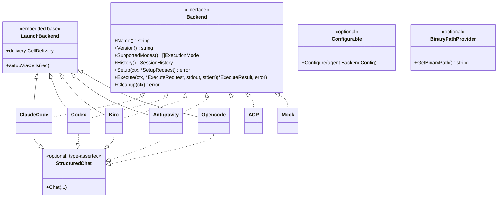

# The `Backend` abstraction and the engine registry

`internal/lm/backends` is the **registry and dispatch table** for every engine
ctxloom can launch. It owns one contract: given a backend *name* string, hand
back a constructed `agent.Backend`, its typed config decoder, its settings
writer, its surface builder, its command/skill exporters, and its declared
capabilities — without any shared code ever type-switching on a concrete engine.
The interface itself (`agent.Backend`) lives one layer down in
`internal/shared/agent` so the plugin side can implement it without importing the
registry.

The load-bearing design rule: **adding an engine means registering ONE descriptor**
(`agentDescriptor`, `internal/lm/backends/registry.go:37-81`), not touching four
parallel maps. Every cross-backend dispatch in the package is a view over that
one table.

## The interface and its implementors

`Backend` (`internal/shared/agent/backend.go:65-79`) is deliberately **narrow**:
identity, modes, history, and the `Setup → Execute → Cleanup` lifecycle. It does
*not* carry hook/command/context/MCP accessors — those are an engine's internal
setup wiring, reached through the surfaces seam instead, because forcing them
onto every backend produced a nil-returning contract nobody consumed (see the
type's own doc comment).

### Core types

| Symbol | Location | Meaning |
|---|---|---|
| `Backend` | `internal/shared/agent/backend.go:65` | The runner-facing launch contract (7 methods). |
| `BackendConfig` | `internal/shared/agent/backend.go:22` | Marker interface for an engine's typed config; `BackendType()` is the discriminator. |
| `ExecutionMode` | `internal/shared/agent/backend.go:29` | `ModeInteractive` (0) / `ModeOneshot` (1). |
| `SetupRequest` | `internal/shared/agent/backend.go:324-339` | WorkDir, Fragments, Env, Verbosity, `Managed *ManagedConfig`, `CellKind`. |
| `ManagedConfig` | `internal/shared/agent/backend.go:348-363` | Host-assembled config/bundle payload. **7 fields.** See [the plugin wire](grpc-wire.md). |
| `ExecuteRequest` | `internal/shared/agent/backend.go:366-397` | Prompt, WorkDir, Mode, Model, Env, DryRun, `Permissions`, Temperature, `SkipSetup`, `CellKind`, Stdin, Resize. |
| `ExecuteResult` | `internal/shared/agent/backend.go:400-403` | ExitCode + ModelInfo. |
| `SessionHistory` | `internal/shared/agent/backend.go:95-116` | Transcript reading + `/clear` recovery. Returned by `Backend.History()`. |
| `Session` / `SessionEntry` | `internal/shared/agent/backend.go:119`, `:153` | The normalized transcript IR (see [transcript IR](#the-transcript-ir)). |
| `Fragment` | `internal/shared/agent/backend.go:40-48` | One piece of injected context. Distinct from slash commands, which ride `ManagedConfig.Commands`. |
| `CellKind` | `internal/shared/agent/cells.go:249-264` | Shared / DirectoryIsolated / ProcessIsolated — the resolved isolation cell, decided host-side. |
| `SurfaceInputs` | `internal/shared/agent/cells.go:147-182` | Everything a backend's surface builders consume. **Has `Skills` (`:166`) and `DenyTools` (`:181`).** |

### Registry API

| Symbol | Location | Meaning |
|---|---|---|
| `Register(name, ctor)` | `internal/lm/backends/registry.go:104` | Incremental registration (tests / piecemeal). |
| `Get(name) agent.Backend` | `internal/lm/backends/registry.go:109` | Construct a fresh instance; `nil` when unknown. |
| `List() []string` | `internal/lm/backends/registry.go:117` | All names with a constructor. |
| `Exists(name) bool` | `internal/lm/backends/registry.go:128` | Registration predicate. |
| `EnforcesReadOnlyPlan(name) bool` | `internal/lm/backends/registry.go:148` | **The plan-collapse authority.** Unregistered name → `false`. |
| `ACPTransportFor(name) agent.ACPTransport` | `internal/lm/backends/registry.go:160` | Declared ACP transport for consumers with no live instance (`doctor`, init PRIME, container image fragments). Unregistered → zero value (`ACPNative`). |
| `GetDefaultBinary(name) string` | `internal/lm/backends/registry.go:176` | Instantiates and asks via `BinaryPathProvider`. |
| `IsAvailable(name) bool` | `internal/lm/backends/registry.go:192` | Binary resolvable on inherited PATH *or* login-shell PATH (`shellenv.Resolve`). |
| `Configurable` | `internal/lm/backends/registry.go:20-22` | Optional: backend accepts its own typed config. |
| `BinaryPathProvider` | `internal/lm/backends/registry.go:171-173` | Optional: `agent.BaseBackend` satisfies it, so every embedding backend is one. |

### Registered backends

All seven are registered in one `init()` at `internal/lm/backends/registry.go:261-450`.

| Name | Constructor | Descriptor line | Settings writer | Surfaces | Cmd export | Skill export |
|---|---|---|---|---|---|---|
| `claude-code` | `claude.NewClaudeCode()` | `:266` | yes | yes | yes | yes |
| `antigravity` | `antigravity.NewAntigravity()` | `:301` | yes | yes | yes | yes |
| `codex` | `codex.NewCodex()` | `:322` | yes | yes | yes | yes |
| `kiro` | `kiro.NewKiro()` | `:355` | yes | yes | yes | yes |
| `acp` (generic) | `acp.NewACP()` | `:391` | **no** | `EmptySurfaceSet` | **no** | **no** |
| `opencode` | `opencode.NewOpencode()` | `:422` | yes | yes | yes | yes |
| `mock` | `backends.NewMock()` | `:443` | **no** | **no** | **no** | **no** |

The generic `acp` backend drives *whatever* ACP-speaking command config supplies
(`command: "kiro-cli acp"`, `claude-code-acp`, …), so **new ACP agents become
config, not code** (`registry.go:381-390`). It registers no settings writer and
no exports precisely because a generic agent has no known native config format to
materialize.

## Invariants this layer owns

### 1. No provider SDK — ever

`registry.go:239-260` states it as a **licensing invariant, not a style
preference**: every registered backend reaches its model by spawning the vendor's
own binary (`claude`, `codex`, `kiro-cli`, `agy`, `opencode`) or that vendor's ACP
adapter. ctxloom holds no provider SDK and makes no direct model-API call. The
compliance lives in the *shape of the registry table*, not in any one backend.
Adding `anthropic-sdk-go` / `openai-go` / `langchaingo` "to simplify the launcher"
would forfeit that standing.

### 2. `PermissionMode` is one vocabulary, mapped per engine

`agent.PermissionMode` (`internal/shared/agent/permissions.go:15-33`) mirrors
claude's `--permission-mode` vocabulary so one vocabulary spans every client. Four
tiers:

| Tier | Value | Meaning | Wire spelling |
|---|---|---|---|
| `PermissionDefault` | 0 (zero value) | Engine's normal in-tool approval prompting. | `default` |
| `PermissionAcceptEdits` | 1 | Auto-accept file edits, still prompt for the rest. | `acceptEdits` |
| `PermissionPlan` | 2 | Read-only / planning: inspect but not mutate. | `plan` |
| `PermissionBypass` | 3 | No in-engine prompting at all. Blast radius = whatever contains the process. | `bypass` |

Supporting functions: `String()` (`:36`), `AllowsWithoutPrompt()` (`:53` — only
`bypass`), `ParsePermissionMode()` (`:61` — returns `ok=false` so callers can tell
"unset" from explicit "default"), `PermissionModeNames()` (`:78`), `WireMode()`
(`:86` — unknown → `default`, the fail-safe posture), `ResolveDefault()` (`:98`),
`SafeHeadless()` (`:127` — only `bypass` and `plan`).

### 3. `plan` collapses on engines that cannot enforce it

`CollapsePlanIfUnenforced` (`internal/shared/agent/permissions.go:116-121`) returns
`PermissionDefault` in place of `PermissionPlan` when the backend has no genuine
read-only tier — so `plan` **never runs unrestrained**. Its input comes from
`backends.EnforcesReadOnlyPlan` (`registry.go:148`). Two call sites apply it:

- `internal/cli/run.go:1499` (interactive run resolver, fed at `run.go:952`)
- `internal/operations/oneshot.go:417` (headless fan-out)

Per-engine truth, from the descriptor table:

| Engine | `enforcesReadOnlyPlan` | Mechanism | Descriptor |
|---|---|---|---|
| `claude-code` | **true** | `--permission-mode plan` | `registry.go:297` |
| `codex` | **true** | `--sandbox read-only` (both subcommands) | `registry.go:342` |
| `kiro` | **true** | `--trust-tools=fs_read` — LIVE VERIFIED 2026-07-15 (kiro-cli 2.12.1) | `registry.go:370-377` |
| `opencode` | **true** | `opencode.json permission {edit:deny, bash:deny}` — stricter than opencode's own `plan` agent, which leaves bash allowed | `registry.go:437` |
| `antigravity` | **false** | Passes `--mode plan`, but the flag was LIVE VERIFIED 2026-07-15 (agy 1.1.2) **not** to enforce read-only headlessly | `registry.go:133-151` |
| `acp` (generic) | **false** | No read-only tier | (unset) |
| `mock` | **false** | (unset) | (unset) |

The antigravity case is a deliberate, documented exception: the flag *is* emitted
by `buildArgs`, but a sentinel write and a probe shell command both succeeded
unblocked and the engine self-reported "not in read-only mode". Flipping the
descriptor `true` would tell the resolver to trust a flag proven not to work. See
[antigravity](antigravity.md).

### 4. ACP transport is declared once per engine

`agent.ACPTransportKind` (`internal/shared/agent/chat.go:156-168`) has three values:

- `ACPNative` (zero) — the engine's own binary speaks ACP (`kiro-cli acp`, `opencode acp`).
- `ACPAdapter` — a separate PATH-resolved adapter binary wraps a CLI with no ACP mode.
- `ACPBespoke` — the backend implements `StructuredChat` over its own driver, bypassing the `acp` package entirely.

| Engine | Kind | Adapter binary | Install | Declared at |
|---|---|---|---|---|
| `claude-code` | `ACPAdapter` | `claude-code-acp` | `npm install -g @zed-industries/claude-code-acp` (Zed Industries) | `internal/claude/chat.go:28-34` |
| `codex` | `ACPAdapter` | `codex-acp` | `npm install -g @zed-industries/codex-acp` (Zed Industries) | `internal/codex/chat.go:21-27` |
| `kiro` | `ACPNative` | — | — | `internal/lm/backends/registry.go:221` |
| `opencode` | `ACPNative` | — | — | `internal/lm/backends/registry.go:224` |
| `antigravity` | `ACPBespoke` | — | — | `internal/lm/backends/registry.go:229` |
| `acp` (generic) | `ACPNative` | (config's own `command`) | — | `internal/lm/backends/registry.go:236` |

The two **adapter** engines declare their transport in their *own* packages so
their constructors set it on every instance including direct construction outside
the registry — an un-injected instance would default to `ACPNative` and silently
skip its adapter (`registry.go:208-220`).

## The transcript IR

`SessionEntry` (`internal/shared/agent/backend.go:153-224`) is the normalized,
ACP-shaped conversation IR every backend's `History()` produces. Beyond the
original flat fields (`Timestamp`, `Type`, `Content`, `ToolName`, `ToolInput`,
`ToolOutput`, `IsError`), the IR2 revision added optional richness — every field
zero-valued means "the producing backend didn't have one":

- `Sidechain` (`:167`) — entry belongs to an engine's *own* in-harness subagent, not the main thread. `MainThreadEntries()` (`:297`) is the single filter for "the conversation the user had"; distillation and session-load replay both use it so they cannot drift.
- `ToolCallID` (`:185`) — engine-native tool-call id, so a re-emission reuses the same id instead of pairing by tool *name*.
- `ToolKind` (`:191`), `ToolLocations` (`:195`), `ToolContent` (`:201`), `ContentBlocks` (`:209`).
- `SystemKind` (`:220`) + `Plan` (`:223`) — discriminates an ACP `plan` update (`SystemKindPlan`) from a freeform notice (`SystemKindNotice`, the zero value).

Entry types (`:310-321`): `user`, `assistant`, `thinking`, `tool_use`,
`tool_result`, `system`.

## The cross-agent conformance suite — `internal/lm/conformance`

A **tag-gated cross-agent equity suite**. Its only non-test file
(`internal/lm/conformance/doc.go`, 16 lines) declares zero types, funcs, consts and
vars; it exists purely so `go test ./...` does not fail with "build constraints
exclude all Go files" (`doc.go:13-15`). The suite itself lives in
`conformance_test.go` behind `//go:build conformance` and asserts that each agent's
`agent.SettingsWriter` honours one shared contract: fault-tolerant load, write +
backup, hook-event coverage, MCP auto-register, and managed removal preserving user
settings. Every assertion goes through the public interface, so it is format-agnostic
across claude JSON / antigravity JSON / codex TOML.

| Entry point | Location |
|---|---|
| `settingsWriter` interface (`agent.SettingsWriter` + `SettingsPath`) | `conformance_test.go:27` |
| `agentCase` (`name`, `newWriter`, `userFile`, `userMarker`) | `:34` |
| `agentCases()` — **the single place to add an agent** | `:43` |
| `coveredEvents` (`conf-sessionstart`, `conf-pretool`, `conf-posttool`, `conf-preshell`, `conf-postfileedit`) | `:57` |
| `standardHooks()` — every hook command's executable token is `ctxloom`, so writers recognize it as managed | `:65` |
| `TestConformance_FaultTolerantLoad` / `AtomicWriteBackup` / `HookEventCoverage` / `MCPAutoRegister` / `RemovePreservesUser` | `:82` / `:101` / `:121` / `:139` / `:155` |
| Invocation | `just test-conformance` → `go test -race -tags conformance ./internal/lm/conformance/...` (`justfile:349-350`) |

**It runs against 3 of the 5 backends that implement `SettingsWriter`**:
`claude-code` (`:48`), `antigravity` (`:49`), `codex` (`:50`). **Absent: `opencode`
(`internal/opencode/settings.go:465`) and `kiro` (`internal/kiro/settings.go:48`)**,
both of which implement the interface. `acp` and `mock` legitimately have no writer.

How strongly each test constrains, rather than merely exercises:

- `RemovePreservesUser` (`:155`) — **constrains**: round-trips write→remove and asserts both directions against the file. The strongest test.
- `AtomicWriteBackup` (`:101`) — constrains the **backup** only; nothing tests atomicity.
- `HookEventCoverage` (`:121`) — partially constrains: `assert.Containsf(t, string(data), ev, …)` (`:131`) greps the whole file (`:128`), so an agent mapping all five unified events onto `SessionStart` would pass.
- `FaultTolerantLoad` (`:82`) — grades via the writer's own `Status(projectDir).HooksPresent` (`:94`).
- `MCPAutoRegister` (`:139`) — merely exercises: the sole assertion is the writer's own `st.MCPPresent` (`:148`), never whether the entry reached the file.

Not covered: opencode, kiro, atomicity, hook-event *mapping*, and `SessionEnd`
(deliberately excluded — codex's CLI has no such event, `conformance_test.go:63-64`).
Note the suite's subjects are `internal/claude`, `internal/antigravity` and
`internal/codex` — **none under `internal/lm/`**, despite where it lives.

Two facts about its operation, stated factually: `rg` over
`.github/workflows/*.yml` and `lefthook.yml` for `conformance` returns **zero hits**,
and `justfile:349` is the only invocation with no recipe depending on it (runtime is
0.03s, so cost is not the obstacle). At the time of review it was **failing**:
`just test-conformance` exits 1 on `TestConformance_FaultTolerantLoad/claude-code` —
a genuine equity divergence, since claude's writer now **refuses and backs up** on a
corrupt settings file while antigravity and codex still **warn and continue**.

## Divergences from what the abstraction implies

*Stated factually; defect triage lives in `FINDINGS.md`, not here.*

- **`ContentCommands` is implemented six times and invoked zero times.** The interface at `internal/shared/agent/launch_backend.go:51` has a real `RegisterFromContent` body in claude, antigravity, acp, kiro, codex, and opencode. `LaunchBackend.commands` is assigned at `launch_backend.go:92` and read nowhere; production call sites of `RegisterFromContent` number zero. A future backend author reading the interface will believe it must be implemented.
- **`ManagedConfig.Skills` and `ManagedConfig.DenyTools` never reach any backend.** The Go struct has 7 fields; the proto carries 5. Full chain in [the plugin wire](grpc-wire.md). `SurfaceInputs` is fully wired to consume both (`cells.go:166`, `:181`), and `setupViaCells` reads them (`launch_backend.go:255`, `:257`) — they are simply always empty in-plugin.
- **`binary_path` has two incompatible meanings**, decided by an unexported type switch at `internal/cli/llm_resolve.go:89-100`: on claude / codex / antigravity it flips the run onto the external go-plugin path and **drops isolation**; on kiro / opencode / acp it is merely a CLI override. The config schema documents it identically for all six.
- **A backend in neither `credentialSeedSpecs` nor `curatedHomeSpecs` gets zero engine-global isolation, silently** (`internal/lm/isolation/auth.go:341` bare `return nil`; `Env()` at `:526` emits nothing). The registered generic `acp` backend (`registry.go:391`) hits that branch. See [isolation](isolation.md).
- **Two backends are marked LIVE-UNTESTED in the registry itself**: `codex` (`registry.go:319-321`) and `kiro` (`registry.go:352-354`) have never been run against a real authenticated account on any dev host.

## See also

- [Capability matrix](capability-matrix.md) — engine × capability, the fastest way to answer "does engine X support Y?"
- [The plugin wire](grpc-wire.md) — `ManagedConfig` → proto → plugin → engine process.
- [Isolation](isolation.md) — cells, containers, credentials.
