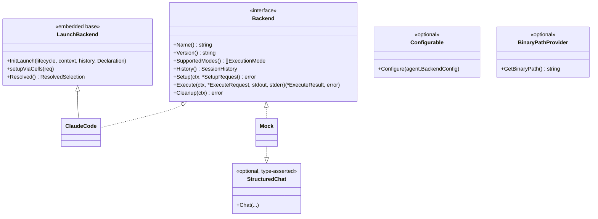

# The `Backend` abstraction and the engine registry

`internal/lm/backends` is the **registry and dispatch table** for every engine
ctxloom can launch. It owns one contract: given a backend *name* string, hand
back a constructed `agent.Backend`, its typed config decoder, its settings
writer, its `agent.Declaration` of surface approaches (`backends.Declared`),
its command/skill exporters, and its declared capabilities — without any
shared code ever type-switching on a concrete engine.
The interface itself (`agent.Backend`) lives one layer down in
`internal/core/agent` so the plugin side can implement it without importing the
registry.

The load-bearing design rule: **adding an engine means registering ONE descriptor**
(`agentDescriptor`, `internal/lm/backends/registry.go`), not touching four
parallel maps. Every cross-backend dispatch in the package is a view over that
one table.

## The interface and its implementors

```mermaid
classDiagram
    class Backend {
        <<interface>>
        +Name() string
        +Version() string
        +SupportedModes() []ExecutionMode
        +History() SessionHistory
        +Setup(ctx, *SetupRequest) error
        +Execute(ctx, *ExecuteRequest, stdout, stderr) (*ExecuteResult, error)
        +Cleanup(ctx) error
    }

    class LaunchBackend {
        <<embedded base>>
        +InitLaunch(lifecycle, context, history, Declaration)
        +setupViaCells(req)
        +Resolved() ResolvedSelection
    }

    class StructuredChat {
        <<optional, type-asserted>>
        +Chat(...)
    }
    class Configurable {
        <<optional>>
        +Configure(agent.BackendConfig)
    }
    class BinaryPathProvider {
        <<optional>>
        +GetBinaryPath() string
    }

    Backend <|.. ClaudeCode
    Backend <|.. Mock

    LaunchBackend <|-- ClaudeCode

    Mock ..|> StructuredChat
```

`Backend` (`internal/core/agent/backend.go:65-79`) is deliberately **narrow**:
identity, modes, history, and the `Setup → Execute → Cleanup` lifecycle. It does
*not* carry hook/command/context/MCP accessors — those are an engine's internal
setup wiring, reached through the surfaces seam instead, because forcing them
onto every backend produced a nil-returning contract nobody consumed (see the
type's own doc comment).

### Core types

| Symbol | Location | Meaning |
|---|---|---|
| `Backend` | `internal/core/agent/backend.go:65` | The runner-facing launch contract (7 methods). |
| `BackendConfig` | `internal/core/agent/backend.go:22` | Marker interface for an engine's typed config; `BackendType()` is the discriminator. |
| `ExecutionMode` | `internal/core/agent/backend.go:29` | `ModeInteractive` (0) / `ModeOneshot` (1). |
| `SetupRequest` | `internal/core/agent/backend.go:324-339` | WorkDir, Fragments, Env, Verbosity, `Managed *ManagedConfig`, `CellKind`. |
| `ManagedConfig` | `internal/core/agent/backend.go:348-363` | Host-assembled config/bundle payload. **7 fields.** See [the plugin wire](grpc-wire.md). |
| `ExecuteRequest` | `internal/core/agent/backend.go:366-397` | Prompt, WorkDir, Mode, Model, Env, DryRun, `Permissions`, Temperature, `CellKind`, Stdin, Resize. No launch form: where surfaces land is resolved by `Setup`, and Execute emits what Setup resolved. |
| `ExecuteResult` | `internal/core/agent/backend.go:400-403` | ExitCode + ModelInfo. |
| `SessionHistory` | `internal/core/agent/backend.go:95-116` | Transcript reading + `/clear` recovery. Returned by `Backend.History()`. |
| `Session` / `SessionEntry` | `internal/core/agent/backend.go:119`, `:153` | The normalized transcript IR (see [transcript IR](#the-transcript-ir)). |
| `Fragment` | `internal/core/agent/backend.go:40-48` | One piece of injected context. Distinct from slash commands, which ride `ManagedConfig.Commands`. |
| `CellKind` | `internal/core/agent/cells.go:249-264` | Shared / DirectoryIsolated / ProcessIsolated — the resolved isolation cell, decided host-side. |
| `SurfaceInputs` | `internal/core/agent/cells.go` | One run's content — everything an engine's approach constructors (`agent.Construct`) consume. Carries no roots; those reach the built approach at `Present`/`Deliver` time. |

### Registry API

| Symbol | Location | Meaning |
|---|---|---|
| `Register(name, ctor)` | `internal/lm/backends/registry.go:104` | Incremental registration (tests / piecemeal). |
| `Get(name) agent.Backend` | `internal/lm/backends/registry.go:109` | Construct a fresh instance; `nil` when unknown. |
| `List() []string` | `internal/lm/backends/registry.go:117` | All names with a constructor. |
| `Exists(name) bool` | `internal/lm/backends/registry.go:128` | Registration predicate. |
| `EnforcesReadOnlyPlan(name) bool` | `internal/lm/backends/registry.go:148` | **The plan-collapse authority.** Unregistered name → `false`. |
| `GetDefaultBinary(name) string` | `internal/lm/backends/registry.go:176` | Instantiates and asks via `BinaryPathProvider`. |
| `IsAvailable(name) bool` | `internal/lm/backends/registry.go:192` | Binary resolvable on inherited PATH *or* login-shell PATH (`shellenv.Resolve`). |
| `Configurable` | `internal/lm/backends/registry.go:20-22` | Optional: backend accepts its own typed config. |
| `BinaryPathProvider` | `internal/lm/backends/registry.go:171-173` | Optional: `agent.BaseBackend` satisfies it, so every embedding backend is one. |

### Registered backends

All of them are registered in one `init()` in `internal/lm/backends/registry.go`;
`backends.List()` is the authoritative roster. Two kinds of descriptor live
there:

- **`claude-code`** (`config.BackendClaudeCode`, constructed via
  `claude.NewClaudeCode()`) — the one vendor engine. It registers every
  optional descriptor field: settings writer, surfaces, command and skill
  exports, an instance-config writer, a credential projector, a version
  command, and the in-tree agent-home contributor.
- **The test doubles** (`config.BackendMock` and its `config.BackendMock*`
  siblings, all flagged `testOnly`) — each registers the *complete*
  descriptor except for the one deliberate gap that double exists to model
  (a declared-unsupported hook kind, launch-only settings delivery, a missing
  skills mapper). The gaps are the point, and each descriptor's doc comment
  says which gap it carries and why it must not be "completed".

The two kinds are deliberate: a double that delivered only some surfaces let
fixtures come to depend on the gaps, and a gap depended upon breaks something
the day it closes — so `mock` is complete, and every *modelled* absence is a
separate named double.

## Invariants this layer owns

### 1. No provider SDK — ever

The doc comment above `init()` in `registry.go` states it as a **licensing
invariant, not a style preference**: every registered backend reaches its model
by spawning the vendor's own binary. ctxloom holds no provider SDK and makes no
direct model-API call. The
compliance lives in the *shape of the registry table*, not in any one backend.
Adding `anthropic-sdk-go` / `openai-go` / `langchaingo` "to simplify the launcher"
would forfeit that standing.

### 2. `PermissionMode` is one vocabulary, mapped per engine

`agent.PermissionMode` (`internal/core/agent/permissions.go:15-33`) mirrors
claude's `--permission-mode` vocabulary so one vocabulary spans every client. Four
tiers:

| Tier | Value | Meaning | Wire spelling |
|---|---|---|---|
| `PermissionDefault` | 0 (zero value) | Engine's normal in-tool approval prompting. | `default` |
| `PermissionAcceptEdits` | 1 | Auto-accept file edits, still prompt for the rest. | `acceptEdits` |
| `PermissionPlan` | 2 | Read-only / planning: inspect but not mutate. | `plan` |
| `PermissionBypass` | 3 | No in-engine prompting at all. Blast radius = whatever contains the process. | `bypass` |

Supporting functions: `String()` (`:36`), `AllowsWithoutPrompt()` (`:53` — only
`bypass`), `ParsePermissionMode()` (`:61` — returns `ok=false` so callers can tell
"unset" from explicit "default"), `PermissionModeNames()` (`:78`), `WireMode()`
(`:86` — unknown → `default`, the fail-safe posture), `ResolveDefault()` (`:98`),
`SafeHeadless()` (`:127` — only `bypass` and `plan`).

### 3. `plan` collapses on engines that cannot enforce it

`CollapsePlanIfUnenforced` (`internal/core/agent/permissions.go:116-121`) returns
`PermissionDefault` in place of `PermissionPlan` when the backend has no genuine
read-only tier — so `plan` **never runs unrestrained**. Its input comes from
`backends.EnforcesReadOnlyPlan` (`registry.go:148`). Two call sites apply it:

- `internal/cli/run.go:1499` (interactive run resolver, fed at `run.go:952`)
- `internal/operations/oneshot.go:417` (headless fan-out)

Per-engine truth comes from the descriptor's `enforcesReadOnlyPlan` field:
`claude-code` declares it `true` (`--permission-mode plan` is a genuine
read-only tier); the test doubles leave it unset, so `plan` collapses on them.
`TestEnforcesReadOnlyPlan` pins both, plus the unregistered case.

The field is opt-in `true` for a reason worth keeping: an engine that merely
*emits* a plan-mode flag does not earn it. A vendor flag has been observed to be
accepted and yet not enforce read-only headlessly — a sentinel write landing
exactly as it does under bypass — and flipping the descriptor `true` on the
strength of the flag's existence would tell the resolver to trust a mechanism
proven not to work. Only a live-verified read-only tier earns `true`, and the
predicate is pinned so it cannot degrade into "is this backend known?".

## The transcript IR

`SessionEntry` (`internal/core/agent/backend.go:153-224`) is the normalized
conversation IR every backend's `History()` produces. Beyond the
original flat fields (`Timestamp`, `Type`, `Content`, `ToolName`, `ToolInput`,
`ToolOutput`, `IsError`), the IR2 revision added optional richness — every field
zero-valued means "the producing backend didn't have one":

- `Sidechain` (`:167`) — entry belongs to an engine's *own* in-harness subagent, not the main thread. `MainThreadEntries()` (`:297`) is the single filter for "the conversation the user had"; distillation and session-load replay both use it so they cannot drift.
- `ToolCallID` (`:185`) — engine-native tool-call id, so a re-emission reuses the same id instead of pairing by tool *name*.
- `ToolKind` (`:191`), `ToolLocations` (`:195`), `ToolContent` (`:201`), `ContentBlocks` (`:209`).
- `SystemKind` (`:220`) + `Plan` (`:223`) — discriminates a `plan` update (`SystemKindPlan`) from a freeform notice (`SystemKindNotice`, the zero value).

Entry types (`:310-321`): `user`, `assistant`, `thinking`, `tool_use`,
`tool_result`, `system`.

## The cross-agent conformance suite — `internal/lm/conformance`

A **tag-gated cross-agent equity suite**. Its only non-test file
(`internal/lm/conformance/doc.go`) declares zero types, funcs, consts and vars;
it exists purely so `go test ./...` does not fail with "build constraints
exclude all Go files". The suite itself lives in `conformance_test.go` behind
`//go:build conformance` and asserts that each listed agent's
`agent.SettingsWriter` honours one shared contract: refuse rather than
overwrite an unparseable prior settings file, atomic write, hook-event *reach*,
MCP write fidelity, and managed removal preserving user settings. Every
assertion goes through the public interface, so the suite holds no per-agent
format knowledge — which is also why it proves reach and not native-slot
attachment (`doc.go` spells out that distinction).

**Its subjects are exactly what `agentCases()` lists — the single place to add
an agent — and today that is `claude-code` alone.** The premise of the suite is
cross-agent equity, and with one row it covers one agent and proves nothing
cross-format; `agentCases`' own comment says not to read a green run as equity
evidence until a second row restores the premise. The test doubles have a
settings writer but are not listed, for the structural reason given there: a
new row inherits the whole suite unconditionally. Note that its subject
(`internal/claude`) is not under `internal/lm/`, despite where the suite lives.

`coveredEvents` names the unified hook events every listed agent must emit;
`SessionEnd` is deliberately absent because not every engine CLI has such an
event. `standardHooks()` makes every hook command's executable token `ctxloom`,
so writers recognise it as managed. Invocation is `just test-conformance`.

## Divergences from what the abstraction implies

*Stated factually; defect triage lives in `FINDINGS.md`, not here.*

- ~~**`ManagedConfig.Skills` and `ManagedConfig.DenyTools` never reach any backend.**~~ **RESOLVED `40b49a7f`** — the proto carries all 7 fields, and `SurfaceInputs`/`setupViaCells` (`cells.go:166`, `:181`; `launch_backend.go`) now receive real values rather than always-empty ones. Full chain in [the plugin wire](grpc-wire.md). Kept on this page because it is the abstraction's sharpest lesson: **the Go interface looked complete at every layer** — the host populated the fields, the struct declared them, the consumer read them — and the only broken link was a hand-written converter with no compiler binding. The parity sweep (`internal/lm/grpc/arch_test.go`) is what supplies that binding now.
- **A backend with no engine-global isolation lever gets a worktree with none** — every registered engine now declares its `Home` (provided, or absent with a reason) on its descriptor, and `Worktree.PrepareWorkspace` records a `ClassIsolation` finding rather than passing silently. See [isolation](isolation.md).

## See also

- [Capability matrix](capability-matrix.md) — engine × capability, the fastest way to answer "does engine X support Y?"
- [The plugin wire](grpc-wire.md) — `ManagedConfig` → proto → plugin → engine process.
- [Isolation](isolation.md) — cells, containers, credentials.
