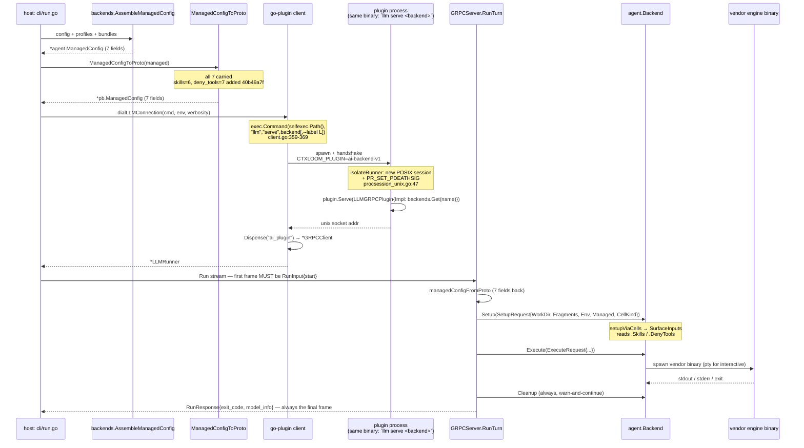

# The plugin wire — `internal/lm/grpc`

`internal/lm/grpc` is the **host ↔ engine-backend plugin seam**: a HashiCorp
go-plugin / gRPC transport plus the complete Go⇄proto marshalling layer for it.
Everything above it (`internal/cli`, `internal/operations`, `internal/memory`,
`internal/agentcoord/coord`, `internal/lm/isolation`) thinks purely in
`internal/shared/agent` types; everything below it — the launch backends — receives
`agent.SetupRequest` / `agent.ExecuteRequest` / `agent.ChatRequest`. The seam exists
so a backend can run host-local, self-invoked, or containerized without any caller
changing.

The contract it owns is `internal/lm/grpc/llm.proto` (657 lines, the **only**
git-tracked wire artifact): one service `LLM`, 7 RPCs, 52 messages, 2 enums, plus
the go-plugin handshake identity at `internal/lm/grpc/shared.go:15-27`.

> **Generated code is not in the repo.** `.gitignore:26` is `*.pb.go`. `llm.pb.go`
> (4349 lines) and `llm_grpc.pb.go` (409 lines) are untracked build output,
> regenerated by `buf generate` (`.github/workflows/ci.yml:131`). Reason from
> `llm.proto`, never from the `.pb.go`.

## The launch sequence

### Transport and handshake

- gRPC over a go-plugin-negotiated **unix socket**. `AllowedProtocols` pins `plugin.ProtocolGRPC` at both dial sites (`client.go:247`, `client.go:267`). No AutoMTLS, no health service, no reflection, no interceptors.
- `HandshakeConfig` (`shared.go:15-19`): `ProtocolVersion: 1`, `MagicCookieKey: "CTXLOOM_PLUGIN"`, `MagicCookieValue: "ai-backend-v1"`. **This is the only auth** — the host stamps the cookie env var, the child refuses to serve without it.
- `LLMPluginKey = "ai_plugin"` (`shared.go:22`); `PluginMap` (`shared.go:25-27`) holds `&LLMGRPCPlugin{}`.
- **Host and plugin are the same binary**, always built and launched together. That version-lock is load-bearing and is cited in the schema itself (`llm.proto:189-197`, `:518-527`) as the reason breaking wire-type changes ship with no migration (e.g. `auto_approve` bool → `permission_mode` string).

### Four ways in

| Path | Entry point | Used by |
|---|---|---|
| Self-invoked (production default) | `NewSelfInvokingClientForLabelEnv` (`client.go:359`) via `DefaultClientFactory` (`interface.go:65`) | 8 production callers |
| Explicit binary | `NewLLMRunner` (`client.go:321`) | `internal/cli/run.go:1024` |
| Container | `NewContainerClient` (`client.go:334`) → `dialContainerConnection` (`client.go:261`) with `plugin.UnixSocketConfig` + an `AddrTranslator` mapping the in-container socket back to the host mount | `internal/lm/isolation/runtime.go:309` |
| Bare self-exec (**no handshake**) | `StartHostRunner` (`host_runner.go:56`) | coordinator; readiness observed by `RunnerChannel` dial-home, not here (`host_runner.go:22-30`) |

### Teardown

- Host: `LLMRunner.Kill` (`client.go:394`) → `realLLMConnection.Kill` (`client.go:213`) reads `runnerSessionPID` **before** `plugin.Client.Kill()` (documented order dependency, `client.go:222-223`), then `killSession` (`procsession_unix.go:77`) SIGKILLs every pid in that POSIX session, sweeping grandchildren.
- Plugin: `InstallRunnerTeardown` (`procsession_unix.go:143`) handles SIGTERM → `ReapRunnerDescendants` (`procsession_unix.go:121`, refuses unless self is session leader) → `os.Exit(143)`. Required because `plugin.Serve` swallows SIGINT and leaves SIGTERM at default.
- On host death, `PR_SET_PDEATHSIG` (`pdeath_linux.go:26`) fires SIGTERM into the plugin, which then sweeps its own session.
- **Windows: all four `procsession_windows.go` functions (`:13`, `:19`, `:24`, `:27`) are documented no-ops** — no process-session isolation or sweep exists there.

## The service

| RPC | Shape | proto | Server | Client |
|---|---|---|---|---|
| `Info(Empty) → LLMInfo` | unary | `llm.proto:10` | `server.go:45` | `client.go:33` |
| `Run(stream RunInput) → stream RunResponse` | bidi | `llm.proto:16` | `server.go:64` | `client.go:59` |
| `GetSession(GetSessionRequest) → SessionData` | unary | `llm.proto:24` | `sessionhistory.go:243` | `sessionhistory.go:278` |
| `WatchSession(WatchSessionRequest) → stream WatchEvent` | server-stream | `llm.proto:34` | `sessionwatch.go:103` | `sessionwatch.go:239` |
| `Chat(stream ChatInput) → stream ChatEvent` | bidi | `llm.proto:42` | `chat.go:245` | `chat.go:327` |
| `ListSessions(ListSessionsRequest) → SessionList` | unary | `llm.proto:46` | `sessionhistory.go:257` | `sessionhistory.go:288` |
| `GetPlans(GetPlansRequest) → PlansData` | unary | `llm.proto:53` | `plans.go:81` | `plans.go:86` |

## What crosses the wire — and what does not

This is the section to read before assuming a field reaches a backend. Every
converter in this package is a **hand-written, exhaustive-looking struct literal**.
There is no compiler link between the Go struct and the proto message: adding a Go
field cannot fail a build and produces no warning — the field is simply zeroed in
transit.

**What now catches that is a test, not the compiler.** `internal/lm/grpc/parity_test.go`
(`40b49a7f`) is a reflective **total-struct parity sweep**: it populates every field
at every depth with distinguishable non-zero values, round-trips, and requires the
whole struct back. It **names no field**, so a field added later is covered without
anyone updating the test. It covers all **27** hand-mirrored pairs in this package,
with an AST-walking gate that fails when a pair is added without a sweep entry; two
exclusions each carry a written reason and an anti-rot test.

> **Why this section exists at all.** Until `40b49a7f` **eight** fields on this seam
> had no proto number and were silently dropped in both directions. The previous
> round-trip test asserted `req.MCPServers == back.MCPServers` — one *named* field,
> not `req == back` — so it could not see them. A dropped field is an **absent
> statement**: no coverage, mutation or complexity metric can point at a line nobody
> wrote. Three of the eight were found *by the parity sweep*, not by the review that
> prompted it.

### `ManagedConfig` — 7 Go fields, 7 proto fields

| Go field (`internal/shared/agent/backend.go:348-363`) | Proto (`llm.proto:458-478`) | Crosses? |
|---|---|---|
| `Commands []CommandExport` (`:349`) | `repeated CommandExport commands = 1` | yes |
| `Skills []SkillExport` (`:350`) | `repeated SkillExport skills = 6` | yes — **added `40b49a7f`** |
| `Hooks *wire.HooksConfig` (`:351`) | `HooksConfig hooks = 2` | yes (including `PreToolFallback`, below) |
| `MCP *wire.MCPConfig` (`:352`) | `MCPConfig mcp = 3` | yes |
| `BundleMCP map[string]wire.MCPServer` (`:353`) | `map<string, MCPServer> bundle_mcp = 5` | yes |
| `ManageStatusline bool` (`:354`) | `bool manage_statusline = 4` | yes |
| `DenyTools []string` (`:362`) | `repeated string deny_tools = 7` | yes — **added `40b49a7f`** |

`ManagedConfigToProto` (`internal/lm/grpc/managed.go:18`) sets all seven;
`managedConfigFromProto` reads all seven back.

**The full chain, end to end:**

1. The host populates both fields — `internal/lm/backends/managed.go:52` (`Skills:`) and `:57` (`DenyTools:`), reached from `internal/cli/run.go` and `internal/operations/oneshot.go`.
2. `ManagedConfigToProto` carries them (`managed.go:26`, `:31`).
3. `managedConfigFromProto` restores them (`managed.go:43`, `:48`).
4. `internal/lm/grpc/server.go` is the **only** site in the repo that constructs `SetupRequest.Managed`, so there is no in-process bypass — and no bypass is needed any more.
5. `setupViaCells` reads both into `SurfaceInputs` (`internal/shared/agent/launch_backend.go`).
6. `SurfaceInputs` is fully wired for them (`internal/shared/agent/cells.go:166`, `:181`), and five of seven registered engines declare a `skillExports` function.

> **This was broken and it mattered.** Before `40b49a7f`, every engine launched over
> this wire received **zero** Agent Skills and applied **zero** `deny_tools`, with
> exit 0 and no diagnostic. `DenyTools` is security-relevant by its own doc
> (`backend.go:355-362`) — it exists to block Claude Code's built-in sub-agent `Task`
> tool, "which ctxloom cannot mediate" — so the hole its comment calls "the
> deny-tools.md root-cause fix" was inert from the day it was written. Note that
> `DenyTools` and `Skills` *did* reach engines by **other** routes the whole time
> (`AssembleManagedDenyTools` writing settings files directly; each engine's own
> `surfaces.go`); it was the **launch path specifically** that dropped them.

### `wire.Hook` — 9 Go fields, 8 proto fields

Proto `Hook` (`llm.proto:516`): `matcher=1, command=2, type=3, prompt=4,
timeout=5, async=6, scm=7, pre_tool_fallback=8`.

`wire.Hook` (`internal/shared/wire/hooks.go:14-39`) has one field that does not cross:

- `ContextHash` — correctly excluded (`mapstructure:"-"`, in-process only), and deliberately re-derived agent-side.

**`PreToolFallback` (`hooks.go:38`) crosses since `40b49a7f`** — `hookToProto`
(`managed.go:180`) and `hookFromProto` (`managed.go:196`) both carry it. It is
persisted (`yaml:"pre_tool_fallback"`), carried through bundles
(`internal/bundles/bundles.go:148`, `:639`), part of the hook **trust preimage**, and
read at launch by its sole consumer `internal/antigravity/antigravity.go:388` — whose
own comment calls it "the only way it ever fires on agy".

> **It used to be dropped**, so an antigravity `session_start` hook declared
> `pre_tool_fallback: true` fired under `ctxloom apply-hooks` and never under
> `ctxloom run`. The trust consequence is worth stating precisely, because it is easy
> to over- or under-claim: the exec preimage is built **host-side**
> (`internal/lm/backends/managed.go`'s `hookExecPayload`) from the `wire.Hook` that
> always carried the true flag, so **the gate never hashed a wrong value and no
> signature, hash, grant or countersignature changed** when the field was added.
> What was broken was the other half of the correspondence — the hook *delivered* to
> the engine had the flag cleared, so it differed from the hook the grant covered.
> No `ExecPreimageContract` bump was needed or wanted.

### `ChatRequest` — 11 Go fields, 8 proto fields

Proto `ChatStart` (`llm.proto:189-221`): `work_dir=1, model=2, env=3,
permission_mode=4, forward_permissions=5, mcp_servers=6, transcript_raw_policy=7,
forward_terminal=8`.

Since `40b49a7f` the proto also carries `runtime = 9` and `resume_session_id = 10`
(`llm.proto:228`, `:234`), and `chatStartToProto` / `chatStartFromProto` carry both
(`chat.go:33`, `:34`, `:59`, `:60`). One Go field still does not cross:

| Field | Crosses? | Why |
|---|---|---|
| `Runtime` | yes — **added `40b49a7f`** | Carries the agent binding's resolved runtime axis. |
| `ResumeSessionID` | yes — **added `40b49a7f`** | Return half is `ChatSessionInfo.session_id = 5` / `resumable = 6`, added in the same change. |
| `ModelQuirk` | **no, deliberately** | Set **plugin-side** by the backend (`internal/claude/chat.go`), never sent host→plugin. It is a written, tested exclusion in the parity sweep (`parity_test.go:65`), not a drop. |

> **Both used to be dropped, with consequences worth keeping on record.**
> `Runtime` had no carrier of any kind — no proto field and no env var — so a
> container-bound `ctxloom acp` session ran the engine **on the host** while
> `engine_session.go` reported container isolation in the session summary. That is
> also why repairing this wire had to wait: fixing `Runtime` *activates* the
> `internal/acp` path-confinement hole it was masking, so confinement landed first
> (`73ea8d7f`) and this second (`40b49a7f`). See fix-ordering constraint 1 in
> `FINDINGS.md`.
> `ResumeSessionID` dropping meant a delegated child's resume silently started a
> fresh session under the resumed id's name, with both plugin-side "fail loudly"
> guards unreachable. Its **return** half (`ChatSessionInfo.session_id`,
> `.resumable`) was found by the parity sweep rather than by the review — fixing
> only the request side would have shipped a half-wired feature.

`transcript_raw_policy` always carries `""` today — a documented deferral
(`llm.proto:210-216`), not a drop.

### `Fragment` — 7 Go fields, 6 proto fields

Proto (`llm.proto:509-516`): `name, version, tags, content, is_distilled,
distilled_by`. `agent.Fragment` (`internal/shared/agent/backend.go:40-48`)
additionally carries `Installation`, which the proto lacks. Of the six that do
cross, only `content` is ever read downstream
(`internal/shared/agent/contextfile.go:92-104`;
`internal/codex/surfaces.go:108-120`).

### `RunOptions` — 11 fields (`llm.proto:518-542`)

`work_dir=1, permission_mode=2, mode=3, env=4, dry_run=5, verbosity=6, model=7,
temperature=8, max_tokens=9, skip_setup=10, cell_kind=11`. Decoded wholesale at
`server.go:157-160` and `:233-247`.

- `max_tokens` is **dead end to end** — zero hits outside the generated file, and no mirror field on the Go side.
- `temperature` travels from nowhere to nowhere — two repo hits total: the declaration (`internal/shared/agent/backend.go:381`) and the copy (`server.go:242`). Nothing constructs it; no backend reads it.
- `verbosity` bands (`0=silent, 16=commands,32=args, 48+=debug`) exist only in a proto comment.

### Presence semantics

Exactly **1 of ~120 scalar fields** uses proto3 `optional`:
`MCPConfig.auto_register_ctxloom` (`llm.proto:502`), which needs the
unset/true/false tri-state. Everywhere else, absent and zero are indistinguishable.

## Converters, and where values are defaulted or added

| Family | Location | Note |
|---|---|---|
| Managed | `managed.go:18-300` | `ManagedConfigToProto`/`…FromProto` (all 7 fields since `40b49a7f`), `commandExports*` (all 7 fields), `hookToProto`/`hookFromProto` (`:174`/`:190`, all 8 including `PreToolFallback`; the `Timeout: int32(...)` narrowing is the one lossy conversion over user-authored YAML), `unifiedHooks*` (`:140`/`:151`, 6-event vocabulary), `hooksConfig*` (`:165`/`:183`, `fromProto` materializes a non-nil `Plugins` map to match the host shape), `mcpServer*` (`:204`/`:215`, all 6), `mcpServerMap*` (`:233`/`:244`, `len==0 → nil` is load-bearing for round-trip identity), `mcpConfig*` (`:255`/`:279`) |
| Chat | `chat.go:23-236` | ~215 lines of pure conversion. `chatEventToProto`/`…FromProto` (`:71`/`:88`) dispatch a 5-pointer tagged union; `fromProto`'s `default:` degrades an unknown variant to Raw-only (deliberate forward-compat). `turnMeta*` (`:170`/`:189`) performs 8 unchecked `int→int32` narrowings. |
| Session | `sessionhistory.go:21-233` | `timeToUnix` (`:21`) / `unixToTime` (`:28`) overload `0` as the zero-time sentinel and discard sub-second precision. `EntryToProto` (`:39`) is the 15-field transcript-turn converter shared by `sessionhistory`, `sessionwatch`, `chat`, and `operations/sessionfeed`. |
| Server | `server.go:298-360` | `CellKindToProto` (`:298`) / `cellKindFromProto` (`:312`) — total, explicit, pinned by `cellkind_test.go:39`. `convertFragment` (`:324`), `convertModelInfoToProto` (`:351`). |

Values **added or defaulted on decode**, none of which the caller sent:

- `env == nil` → fresh map (`server.go:161-163`).
- nil `RunOptions` → fully-default, via nil-safe `Get*` (`server.go:154-157`).
- **`CELL_KIND_UNSPECIFIED` → `agent.CellKindShared`** (`server.go:314-319` `default:` arm) — the *least*-isolated cell. Pinned by test.
- Empty `permission_mode` → `PermissionDefault` via `agent.WireMode` (`server.go:241`).
- **ONESHOT + a posture that is not `SafeHeadless()` → `PermissionBypass`** (`server.go:253-255`) — the headless floor, so a oneshot cannot hang on an engine approval prompt.
- `SkipSetup` + non-empty fragments → fragments are **smuggled into the prompt**, framed with `agent.FrameProjectContext(agent.AssembleContext(...))` (`server.go:187-192`). This is how context reaches a run whose `Setup` never executes.
- `ExecutionMode` is converted by **raw numeric cast in both directions** (`server.go:49`, `server.go:236`) — no mapping function and no pinning test, unlike its `CellKind` neighbour.

## Invariants

**Structural**

1. Host and plugin are the same binary; the handshake cookie + `ProtocolVersion 1` is the whole compatibility story. A mismatch fails at `plugin.NewClient`/`Dispense` before any RPC.
2. gRPC-only. `AllowedProtocols` pinning `ProtocolGRPC` is the sole thing preventing `LLMGRPCPlugin`'s nil-embedded `plugin.Plugin` (`server.go:18`) from nil-panicking on the net/rpc path — the guard (`client.go:247`, `:267`) is two files away from the hazard, with nothing linking them.
3. One `Send` at a time per stream, enforced by a **shared pointer to one mutex** across both `streamWriter`s (`server.go:78-80`). Handing them different mutexes breaks the invariant with no compile error.
4. "Every field the launch path depends on must survive the round trip" — **now enforced**, by the reflective total-struct parity sweep in `parity_test.go` (`40b49a7f`) rather than by the field-naming round-trip test that stated it and could not see the five fields it was violated by (`Skills`, `DenyTools`, `PreToolFallback`, `Runtime`, `ResumeSessionID`). The sweep names no field, so it covers fields added after it.

**Lifecycle / ordering**

5. The first `RunInput` MUST carry `start` (`server.go:69-72`); `stdin`/`resize` only thereafter. Same for `Chat`'s first `ChatInput` (`chat.go:248-252`).
6. `RunResponse{exit_code}` + `model_info` is always the final frame (`server.go:138-141`).
7. `Setup → Execute → Cleanup`, with **Cleanup on both Execute paths**. Setup and Cleanup failures warn and continue (`server.go:210-218`, `:271-279`); only an Execute error aborts.
8. Dial failure calls `conn.Kill()` on every path (`client.go:293-316`), so a half-started plugin or container never leaks.
9. `procSessionID` returns `-1` on every parse failure (`procsession_unix.go:157`) — a value no real session id equals, so callers fail safe.
10. `ReapRunnerDescendants` refuses to sweep unless self is the session leader (`procsession_unix.go:121`) — the entire safety argument for a SIGKILL-an-arbitrary-process primitive.
11. `sessionWatcher.step` (`sessionwatch.go:52`) assumes entry counts never decrease; `w.sent` only ever moves upward (`:63`, `:76`).

**On plugin crash**

12. Host side: `Run`'s `Recv` returns non-EOF; `RunWithModelInfo` returns `1, err` — exit code 1 on transport failure is this package's convention (`client.go:45`).
13. Plugin side: `PR_SET_PDEATHSIG` fires SIGTERM → `InstallRunnerTeardown` sweeps the session → exit 143. Without it, the runner would strand the engine subprocess it had isolated into its own process group.
14. `HostRunner`'s `hostRunnerWaitDelay` (10 s, `host_runner.go:49`) bounds the gap between process exit and stderr-pipe close, because a grandchild holding the pipe wedges `Wait` — and a wedged `Wait` is an unreaped child.

**Error vocabulary**

15. gRPC status codes are available but unused: every hand-written handler returns a bare `fmt.Errorf`, hence `codes.Unknown` (`server.go:67`, `:71`; `chat.go:248`, `:252`; `sessionhistory.go:246`, `:260`; `sessionwatch.go:106`). The single exception — `chat.go:257`, `status.Errorf(codes.Unimplemented, …)`, asserted by `chat_test.go:146` — proves the mechanism works. Callers therefore cannot distinguish "backend has no session history" from "transport died". Client methods return RPC errors unwrapped (`sessionhistory.go:281`, `:291`; `plans.go:89`).

## Key exported surface

| Symbol | Location | Meaning |
|---|---|---|
| `Client` | `interface.go:12` | The host's entire view of an engine plugin — 9 methods (`Info` `:14`, `Run` `:19`, `RunWithModelInfo` `:22`, `GetSession` `:27`, `WatchSession` `:33`, `Chat` `:40`, `ListSessions` `:44`, `GetPlans` `:47`, `Kill` `:50`). |
| `ClientFactory` | `interface.go:59` | `func(backendName, label string, verbosity int) (Client, error)` — the DI seam (18 files). An empty `label` triggers a map-ordered backend scan. |
| `DefaultClientFactory` | `interface.go:65` | Production factory over `NewSelfInvokingClientForLabel`. |
| `LLMRunner` | `client.go:160` | The production `Client`: `{conn llmConnection; grpc *GRPCClient}`. |
| `GRPCClient` | `client.go:28` | Thin adapter over the generated `LLMClient` stub; the object go-plugin dispenses. |
| `RunResult` | `client.go:38` | `{ExitCode int32; ModelInfo *ModelInfo}`. Carries no "was an exit code reported" bit. |
| `ContainerRunnerFunc` | `client.go:25` | Type **alias** for go-plugin's `RunnerFunc` shape — naming only, no added type safety. |
| `HostRunner` / `StartHostRunner` | `host_runner.go:31` / `:56` | The bare self-exec path (no handshake). `Wait` (`:110`) folds the stderr tail into the error; `StderrTail` (`:123`). |
| `LLMGRPCPlugin` | `server.go:17` | go-plugin `GRPCPlugin` adapter. `GRPCServer` (`:25`) registers the service; `GRPCClient` (`:31`) dispenses the client. |
| `GRPCServer` | `server.go:36` | Runner-side service impl; methods spread across `server.go`, `chat.go`, `plans.go`, `sessionhistory.go`, `sessionwatch.go`. |
| `RunTurn` | `server.go:153` | The shared `Setup → Execute → Cleanup` core, driven by both the go-plugin stream and `ctxloom llm turn` (the docker-exec TTY transport). |
| `ManagedConfigToProto` | `managed.go:18` | Host→wire setup payload converter. |
| `CellKindToProto` | `server.go:298` | `agent.CellKind` → wire enum. |
| `EntryToProto` | `sessionhistory.go:39` | 15-field transcript-turn converter. |
| `ReadPlanFiles` | `plans.go:49` | Reads `*.plan.md` from the harp's session dir, name-sorted. |
| `SessionReader` | `session_reader.go:20` | Host-side facade that spawns a short-lived runner per read (`withClient`, `:78`, `defer c.Kill()`); `WatchSession` (`:104`) deliberately binds plugin lifetime to stream lifetime instead. |
| `CanonicalFallbackSource` | `canonical_source.go:68` | Canonical-transcript-first `SessionSource` with an optional legacy leg. Lives here only to dodge a `transcript → grpc → transcript` import cycle (`canonical_source.go:24-28`). |
| `RetiredScraperBackends` | `canonical_source.go:50` | Exported **mutable** map of backends whose legacy transcript scraper was deleted: codex, kiro, antigravity, claude-code. |
| `MockClient` / `MockClientFactory` | `mock_client.go:13` / `:163` | Cross-package test double shipped in a non-test file. |
| `HandshakeConfig` / `LLMPluginKey` / `PluginMap` | `shared.go:15` / `:22` / `:25` | go-plugin identity. |
| `isolateRunner` / `killSession` / `ReapRunnerDescendants` / `InstallRunnerTeardown` | `procsession_unix.go:47` / `:77` / `:121` / `:143` | POSIX process-lifetime primitives; no-ops on Windows. |

## Divergences from what the interface implies

*Stated factually. Triage and severity live in `FINDINGS.md`.*

- ~~`ManagedConfig` carries 5 of its 7 documented fields~~ · ~~`wire.Hook.PreToolFallback` is always `false` on the far side~~ · ~~`ChatRequest.Runtime` is dropped~~ · ~~`ChatRequest.ResumeSessionID` is dropped~~ — **all RESOLVED in `40b49a7f`**, along with `ChatPermissionRequest.kind`, `ChatSessionInfo.session_id` and `ChatSessionInfo.resumable`. Eight fields, one proto change, one regen. Kept struck rather than deleted because the parity sweep above exists *because of* these, and a reader who finds the sweep should be able to find what it was built to catch.
- **`CanonicalFallbackSource.ListSessions` returns `(nil, nil)` on a failed index read** for any retired-scraper backend (`canonical_source.go:185`, `:187-192`), which consumers render as "no sessions".
- **`CanonicalFallbackSource.GetSession` discards the first canonical error** (`canonical_source.go:131`), collapsing three distinct causes that `internal/transcript/history.go:81,83,85` distinguishes into one "no canonical transcript" message.
- **`RunWithModelInfo` cannot distinguish "exit 0" from "stream ended with no exit code"** (`client.go:134`, `:137-139`, `:156`) — there is no seen-flag. Defensive today, since `server.go:138` always sends it.
- **`NewContainerClient`'s `backendName` and `label` parameters are documented as "carried for parity/diagnostics" and the body reads neither** (`client.go:334-336`), though the caller passes real values.
- **`ReadPlanFiles` returns "no plans" for four distinct failures with zero diagnostic** (`plans.go:50-52`, `:53-56`, `:57-60`, `:66-69`), while the rest of the package warns on every degraded path.
- **`WatchHistoryByPath` / `WatchCanonicalTranscript` return an `errs` channel that is never written to** (`sessionwatch.go:155`, `:201`; error branches only `clidiag.Warn` at `:165`, `:211`), yet it is plumbed to callers as a real error source via `internal/operations/sessionfeed.go:470,482,499`.
- **The `Chat` inbound pump swallows `stream.Send` errors and exits** without pushing to `errs` (`chat.go:402-406`), leaving the unbuffered `in` channel (`chat.go:336`) with no reader.
- **The chat user-turn tap requires `msg.Text != ""`** (`chat.go:396`), so a `ContentBlocks`-only turn reaches the engine but is recorded nowhere.
- **`GRPCServer.GetSession` returning a typed-nil `SessionData` decodes client-side to a non-nil empty `agent.Session`** (`sessionhistory.go:155-158`, `:171-174`, `:243-252`).
- **`verbosityToHclogLevel`'s doc contradicts its body** — the comment says "1=Warn, 2=Info" (`client.go:166`); the code returns Info for 1 and Debug for 2 (`:172`, `:174`), asserted by `grpc_test.go:60,65`.
- **`StartHostRunner` with empty `args` starts bare `ctxloom`** (cobra prints help, exits 0), returns a healthy-looking `*HostRunner`, and the coordinator then waits out the full 5-minute `defaultRunnerAwaitTimeout` (`coord/children.go:605`) for a dial-home that can never come.
- **`MockClient`'s mutex guards 3 of 7 counters** (guarded `:69-71`, `:99-101`, `:149-151`; unguarded `:59`, `:80`, `:89`; `Chat`/`GetPlans` have none).
- **Windows builds silently lose all process isolation and teardown** (`procsession_windows.go:13,19,24,27`).

## See also

- [The `Backend` abstraction and registry](backend-abstraction.md)
- [Capability matrix](capability-matrix.md)
- [Isolation](isolation.md)
