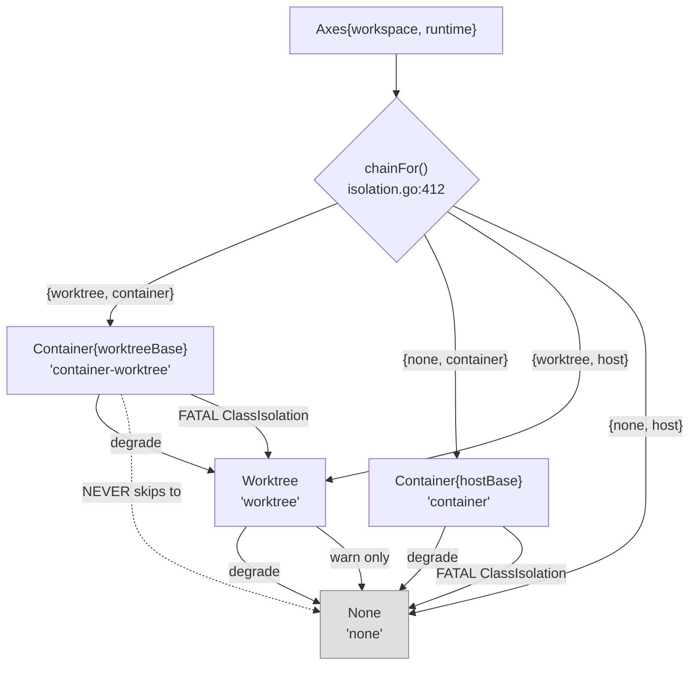

# Isolation — `internal/lm/isolation`

`internal/lm/isolation` decides **where an agent's working directory lives** and
**where its engine process executes**, prepares that workspace, and hands back
either a `pb.Client` (go-plugin transport) or a transport-free `RunnerHandle`. It
owns an **ordered degrade chain whose floor is always the host**, and the rule that
every drop of an explicitly-requested boundary is *reported* — a
`strictness.Fail(ClassIsolation, …)` finding that aborts unless `--degraded`, never
a silently weaker cell. It also owns the agent container image lifecycle and the
host-side half of credential delivery.

It deliberately does **not** import `internal/lm/backends` or `internal/operations`.
Backend names cross as bare string keys (documented connascence of name), and
`EngineStarter` (`isolation.go:179`) and `SetBinaryVersion` (`imagebuild.go:530`)
exist purely to keep the dependency direction one-way.

## Two axes, four postures

Isolation is **not** one enum. It is two independent axes
(`internal/lm/isolation/isolation.go:240-244`):

- **`WorkspaceAxis`** (`isolation.go:246`) — declared at the orchestration level (`--workspace`, project default). `WorkspaceShared = "none"` (`:250`), `WorkspaceWorktree = "worktree"` (`:253`).
- **`RuntimeAxis`** (`isolation.go:257`) — declared as an *agent* trait (`runtime:` on the binding). `RuntimeHost = "host"` (`:261`), `RuntimeContainer = "container"` (`:264`).

`Axes` (`isolation.go:281`) combines them, with `WantsWorktree` (`:288`),
`WantsContainer` (`:292`), `Zero` (`:297`).



| Axes | Policy | `Name()` | Isolates | Does **not** isolate |
|---|---|---|---|---|
| `{none, host}` | `None` (`none.go:25`) | `"none"` | nothing — the fault-tolerant floor | everything |
| `{worktree, host}` | `Worktree` (`worktree.go:55`) | `"worktree"` | cwd (detached git worktree at `HEAD`) + **one host lever per backend**: a scoped config-home env var (`CLAUDE_CONFIG_DIR` / `CODEX_HOME` / `KIRO_HOME` / `XDG_DATA_HOME`) or a curated scratch `$HOME` | engine *global* state where the engine ignores the var; the git common dir; credentials (they are **copied in**, not withheld) |
| `{none, container}` | `Container{hostBase}` (`container.go:70`) | `"container"` | process, fs view, fresh `$HOME`; project mounted at its **identical absolute path** | the project dir (mounted RW) and the whole `.git` common dir (mounted RW, `container.go:807`) |
| `{worktree, container}` | `Container{worktreeBase}` (`container_worktree.go:35`) | `"container-worktree"` | as above + a per-agent checkout as cwd | the git common dir is still whole-dir RW |

### Degrade rules

`chainFor` (`isolation.go:412`, documented `:402-410`) builds the ordered chain.
**Each step drops exactly one axis**: a container tier never degrades *into* a
worktree that was not requested, and a requested worktree is never dropped because
the container failed.

- Container requested with no runtime reachable → `strictness.Fail(ClassIsolation, …)` (`isolation.go:424`, `:427`).
- `prepareChain` (`isolation.go:523`) classifies any **container → non-container** transition as fatal (`:548`, via `IsContainerPolicyName`).
- A **worktree → None** transition is `clidiag.Warn` only — deliberate (`isolation.go:108-110`).
- `warnUnknownAxes` (`isolation.go:334`): an unknown *workspace* value warns; an unknown *runtime* value is a **fatal** `ClassIsolation` finding (`:339`). Empty string = unset = host default, no diagnostic.
- `Prepare` (`isolation.go:488`) **never returns an error** — the chain always terminates in a workspace, because `None.PrepareWorkspace` (`none.go:39`) cannot fail.

**Zero-value polarity is correct throughout these axes.** They are strings where
`""` means unset (host default), and a non-empty unknown runtime raises a fatal
finding. This does *not* repeat the `CELL_KIND_UNSPECIFIED → Shared` inversion found
in `llm.proto` (see [grpc-wire](grpc-wire.md)); two reviewers independently confirmed
that inversion is local, not a house style.

### Cells — the plugin-side mirror

`agent.CellKind` (`internal/shared/agent/cells.go:249-264`) is what actually crosses
to the plugin: `CellKindShared` (zero), `CellKindDirectoryIsolated`,
`CellKindProcessIsolated`. A backend's `buildArgs` switches on it directly rather
than inferring the cell from `WorkDir` — claude gates its out-of-cwd launch flags
on `CellKindShared`, since an isolated cell reads the engine's well-known files in
its private cwd instead.

## Container mechanics

### Image build — two stages

**Stage 1 (base)** precedence, `baseForIdentity` (`imagebuild.go:88`): **user
Containerfile > devcontainer > embedded default**. The embedded default
(`defaultBaseStage`, `imagebuild.go:172`) is `FROM node:22-slim` and bakes `git`,
`ripgrep`, `curl`, `ca-certificates`, `unzip`, `jq`, `strace` plus
`TERM=xterm-256color`.

**Stage 2 (agent)**, rendered by `composeAgentContainerfile(engines)`
(`imagebuild.go:399`), in order:

1. `ARG BASE_IMAGE` → `FROM ${BASE_IMAGE}`
2. `baseContractLayer` (`:383`) — best-effort apt tool layer
3. `overlayUserLayer` (`:441`) — creates uid/gid 1000 `ctxloom`, installs gosu where apt exists
4. `overlayUserGate` (`:465`) — **fails the build** without `id ctxloom` and without a privilege-drop path (`setpriv`, or `gosu` + `usermod` + `groupmod`)
5. `COPY ctxloom-entrypoint` + `ENTRYPOINT`
6. version/provenance `LABEL`s
7. **one `RUN` layer per engine** (independently cacheable)
8. `COPY ctxloom` + `COPY companions/`
9. `RUN /usr/local/bin/ctxloom version`
10. `companionGate` (`:483`) — drops ABI-incompatible companions with a warning rather than failing

Identity is content-keyed: `composedContentHash` (`imagebuild.go:65`) is
`sha256(base content ‖ NUL ‖ joined engines)`, tagged `ctxloom-agent:<hash>` by
`composedImageTagFor` (`:78`). Provenance (`HostProvenanceDigest`, `:551`) hashes the
running ctxloom plus each present companion and is stamped as
`LABEL ctxloom.provenance`, checked by `imageStale` (`:788`).

Build orchestration: `ensureImage` (`:660`, single-flight per `(runtime, tag)`) →
`runEnsureImage` (`:698`) → `buildFromSource` (`:852`) → `buildBaseImage` (`:880`) →
`buildImage` (`:1075`). **No implicit pull** — an absent image is either built from a
known source or the policy degrades (`imagePresent`, `container.go:830`).

Devcontainer resolution (`resolveDevBase`, `devcontainer.go:83`) strips JSONC and
handles image / build / compose forms. Declared devcontainer **features are warned
about, not honored** (`warnDevcontainerFeatures`, `devcontainer.go:144`).

### Run mechanics

In-container conventions (`container.go:31-38`): image `ctxloom-agent:latest`,
binary `/usr/local/bin/ctxloom`, `HOME=/home/ctxloom`, socket dir
`/run/ctxloom/plugin`.

`Container.PrepareWorkspace` (`container.go:236`) is the whole gate:
**gate → host scratch → base workspace → shared-FS probe → mounts/env**. Failure at
any point returns an error and produces a loud degrade; a panic guard removes the
scratch.

**Mounts** (`Mount{Host, Container, ReadOnly}`, `runtime.go:189`):

- The project dir at its **identical absolute path** (`ExposeIdentical`, `runtime.go:254`).
- `gitdirMirrorMount` (`container.go:531`) when `.git` is a pointer file; `gitCommonDirMount` (`container.go:798`) mirrors the whole common dir **read-write** at an identical path.
- `containerConfigOverlay` (`container.go:743`) — one scratch-backed bind per profile `overlayDirs`, seeded by `seedOverlay` (`:819`), with the target pre-created (`:756-762`) so the mountpoint is never root-owned.
- `sessionStateMounts` (`statemounts.go:76`) — scoped RW mounts: engine transcripts (at `profile.transcriptStoreRel` under container `HOME`), the session persist dir, and **this project's** task log `~/.ctxloom/tasks/<project-id>.jsonl` plus its `.lock` sidecar — two single files, never the `~/.ctxloom/tasks` dir, which holds every project on the machine. `safePathSegment` (`statemounts.go:44`) validates the harp, and `paths.HomeTasksLogPath` the project id, before they become host paths.

**Env** (`renderRunSpec`, `runtime.go:530`): entries are emitted as `-e <entry>` and
are **either** a bare `NAME` (value read by the runtime from the launcher's own
`os.Environ()`) **or** a literal `KEY=VAL`. The bare form exists so credential
*values* never enter the world-readable argv (`auth.go:47-52`).

**Uid remap / entrypoint**: the image `ENTRYPOINT` is
`/usr/local/bin/ctxloom-entrypoint`; `identityEnvArgs` (`runtime.go:355`) passes
`-e PUID=<getuid> -e PGID=<getgid>` and — only under `strictness.Degraded()` —
`CTXLOOM_ALLOW_ROOT=1`. **The entrypoint otherwise refuses to run the engine as
root.** Rootless podman additionally gets `--userns=keep-id` (`runtime.go:399`).

**Network**: nothing in the package sets any `--network` flag; no network isolation
is applied or claimed. Host reach-back is by **unix-socket bind mount**, not TCP —
`containerAddrTranslator` (`runner.go:172`) prefix-swaps the go-plugin socket path
across the namespace boundary. The transport-free path (`buildRunnerSpec`,
`direct_runner.go:61`) has no socket and no port at all; "the absences are the
security contract".

### Three launch paths

| Path | Entry | Shape |
|---|---|---|
| go-plugin over a mounted socket | `SpawnClient` (`container.go:697`) → `launchSpec` (`:713`) → `ociRuntime.spawn` (`runtime.go:289`) | linux-only gate at `runtime.go:274` |
| Attached `docker run`, transport-free | `StartRunner` (`direct_runner.go:39`) → `startDirectRunner` (`:119`) | stderr to a bounded ring; background reap (`reapRunProcess`, `:185` — the fix for a measured 846-zombie PID leak); teardown `removeContainer` (`:204`) |
| Piped stdio for a caller with its own protocol | `RunAttached` (`attach.go:71`) → `AttachedContainer` (`attach.go:23`) | used by `internal/acp`'s JSON-RPC container transport |

### Shared-FS verification

An identical-path bind mount does not resolve through every daemon (Docker Desktop,
remote daemons, DinD). Before launch, `mountProbeRoots` (`sharedfs.go:110`) derives
the real host roots, `sharedFSProbe` (`:151`) memoizes but **only latches definitive
outcomes** (`definitiveProbe`, `:81`), and `probeOneRoot` (`:197`) writes a marker
inside the real root and reads it back through a scratch container. `runSharedFSProbe`
(`:176`) **errors on an empty root set** rather than reporting "ok".
`sharedFSGateError` (`container.go:325`) distinguishes a definitive
`*sharedFSMismatch` from a transient probe failure.

## Credential delivery

`containerAuth{mode, envPassthrough, mounts}` (`auth.go:44`) is resolved per backend.
`containerAuthMode` (`auth.go:12`) is `authNone` (**zero value — least privilege**),
`authEnv`, `authCredentialMount`. `resolveEnvOrMountAuth` (`auth.go:83`) is
trigger-then-mount-then-degrade, shared by claude / kiro / codex / opencode.
`presentEnvKeys` (`auth.go:413`) filters an allowlist down to *set* variables only —
**names only cross the boundary**.

| Engine | Env trigger | Mount | Site |
|---|---|---|---|
| claude | `ANTHROPIC_API_KEY` / `ANTHROPIC_AUTH_TOKEN` | copies `.credentials.json` into scratch, mounts **RW** (claude refreshes the token in place) | `claudeCredentialCopyMounts`, `auth.go:449`. `~/.claude.json` is deliberately not copied (`:438-447`) |
| codex | `OPENAI_API_KEY` (`CODEX_API_KEY` is **not** a confirmed trigger and is deliberately excluded, `auth.go:186-196`) | **RO** mount of `~/.codex/auth.json` — safe because non-interactive codex never refreshes in place | `codexCredentialMounts`, `auth.go:226` |
| opencode | `OPENROUTER_API_KEY` | **RO** mount of XDG `auth.json` | `opencodeCredentialMounts`, `auth.go:293` |
| kiro | `KIRO_API_KEY` (**sole** trigger; `AWS_*` ride along but are not standalone) | **none** | `resolveKiroContainerAuth`, `auth.go:182` |
| antigravity | **none** | mount-only, **deliberately not** via `resolveEnvOrMountAuth` so no `ANTHROPIC_*` trigger can leak in | `resolveAntigravityContainerAuth`, `auth.go:356` |
| **unprofiled** (`acp`, `mock`, unknown, empty) | — | **inherits `resolveClaudeContainerAuth`** | `profile.go:500-510` |

Host/worktree seeding is `hostCredentialSeed` + `copyCredentialFile` (writes at
0600). Two exported seams reuse it for callers whose home relocation is not
driven by a `Policy` at all: `SeedCodexHome` (used by `internal/codex`'s `Setup`)
and `SeedClaudeHome` (used by `operations.InTreeAgentHomeEnv`, below).

## Engine config homes

An engine's **home** is where it keeps what is not project-specific: config,
global prompts / skills / steering / agents, session state, and credentials.
Every engine names one env var that relocates it. ctxloom points that var at a
home **it** provisioned, so an agent run does not read or write the human's own.

An engine's **cwd-keyed** surfaces are a different thing entirely and are never
relocated: `CLAUDE.md`, `.claude/`, `.kiro/`, `opencode.json`, `AGENTS.md` live
at the project root, where the engine natively looks.

| Engine | Var | Container | Worktree | In-tree, `config_home: project` | In-tree, undeclared / `host` / no binding |
|---|---|---|---|---|---|
| codex | `CODEX_HOME` | fresh `$HOME/.codex` | per-agent scratch | `<WorkDir>/.ctxloom/state/engines/codex/.codex` | same (codex ignores this key — see below) |
| claude-code | `CLAUDE_CONFIG_DIR` | fresh `$HOME/.claude` | per-agent scratch | `<WorkDir>/.ctxloom/state/engines/claude-code/claude` | **real `~/.claude`** |
| kiro | `KIRO_HOME` | fresh `$HOME/.kiro` | per-agent scratch | `<WorkDir>/.ctxloom/state/engines/kiro/kiro` | **real `~/.kiro`** |
| opencode | `XDG_CONFIG_HOME` / `XDG_DATA_HOME` | fresh `$HOME` | per-agent scratch | **not controlled** | **not controlled** |

Every project-scoped home resolves through one helper, `paths.EngineStateHome`,
reached via the owning engine package's own `StateHome` — `codex.StateHome`,
`claude.StateHome`, `kiro.StateHome`. That single ownership is the point: before
it existed codex's run path and its static writers derived the location
separately and wrote to different roots. The **state** tier is deliberate: these
homes hold seeded credentials and a user's hand-edits, so they are gitignored
*and* unrebuildable.

### The rule: `config_home: project`, declared, on the in-tree axis only

Each agent binding declares its own policy, `agents.<name>.config_home:
project|host`:

```yaml
agents:
  coder:
    config_home: project   # a ctxloom-controlled home under .ctxloom/state/engines/<engine>
    # or: host             # the engine's real host home (also the default)
```

**Empty (undeclared) DEFAULTS TO `host`.** The controlled home is strictly
opt-in — naming an agent, on its own, is *not* enough to relocate its config
home. A binding that wants its runs kept off the human's real `~/.claude` or
`~/.kiro` has to say `config_home: project` explicitly.

**A declared value WINS on every invocation path that binding resolves
through** — a bare `ctxloom run` under `default_agent`, `run --agent`, a
delegated child, a oneshot fan member, alike. Invocation never matters for a
declared binding; only whether a binding is in play at all does. A run with
**no agent binding whatsoever** (no `--agent`, no `default_agent`) has no
`config_home` to read in the first place, and always keeps the real host
home — there is no binding through which it could even opt in. Decided in
`operations.InTreeAgentHomeEnv` off the resolved binding's *effective*
`ConfigHome` (`operations.ResolveConfigHome`), the single place the condition
lives; contributed by `cli/run.go`'s `prepareWorkspace`,
`operations/delegate.go`'s `bindIsolatedSpawn`/`startOneshot`, and
`operations/oneshot.go`'s `runResolvedAgent`.

A delegated child, a fan-out member, a `run --agent` — these ARE ctxloom's
processes, and pointing one at `~/.claude` or `~/.kiro` hands it the human's
memory, plugins, personal MCP registrations, global agents and steering, and
lets it write session state and settings edits back into them. That is the
pollution `config_home: project` lets a binding opt out of — but nothing takes
it on by default; a project asks for it by name, on the binding that wants it.

**Why codex is asymmetric.** codex relocates on every in-tree run regardless of
`config_home` — it does not read this key at all. That is history, not
inconsistency: ctxloom has *always* pointed `CODEX_HOME` at a project-scoped
directory, so there was never a real `~/.codex` in use in-tree to take away,
and so no opt-in was ever needed. claude and kiro *did* use the real host
home, so for them the same move is a taking, and it happens only for a
binding that both is agent-bound AND asked for it.

**opencode is excluded**, pending its own decision: its only lever is
`XDG_CONFIG_HOME` / `XDG_DATA_HOME`, which are not engine-private. Relocating
them moves git's, fish's and every other XDG-aware tool's config for the child
too.

### Three exclusions, and one fail-loud

The in-tree contribution declines, each condition independently sufficient:

1. **the effective `config_home` is not `project`** — the rule above (this
   covers no binding, an undeclared binding, and an explicit `host`);
2. **not the in-tree axis** — a container's fresh `$HOME` already *is* the
   controlled home, and a worktree's per-agent home is already provisioned and
   seeded by this package, UNCONDITIONALLY — `config_home` does not reach the
   worktree axis at all. An in-tree path handed to either names a directory the
   boundary cannot see;
3. **the var is already set** — isolation's own `Env()`, or the user's `--env`,
   wins outright. This fills gaps; it never overrides.

Credentials follow the home for claude (`.credentials.json` is copied from
`~/.claude`, never moved, never written back) and **do not** for kiro, whose
subscription auth lives in a global sqlite under `XDG_DATA_HOME` that `KIRO_HOME`
does not relocate — which is exactly why a fresh `KIRO_HOME` stays authenticated
and why `XDG_DATA_HOME` is deliberately *not* relocated alongside it.

When claude's credentials cannot be seeded (no `ANTHROPIC_API_KEY`, no host
`~/.claude/.credentials.json`), ctxloom records a `ClassIsolation` finding and
contributes **nothing** — the run aborts at the choke gate, or under `--degraded`
falls back to the host's own home. Handing the engine a controlled home it cannot
authenticate against would trade a working run for a mysterious 401.

## Per-engine container profiles

`containerProfileFor(backend)` — `profile.go:400`. `composableEngines()`
(`profile.go:357`) returns exactly
`["antigravity", "claude-code", "codex", "kiro", "opencode"]`. `resolveEngines`
(`profile.go:368`) filters a configured `isolation_engines` set against that list,
in that order, never widening.

| Backend | Image | Install fragment | Build validate gate | `overlayDirs` | `transcriptStoreRel` |
|---|---|---|---|---|---|
| `claude-code` | `ctxloom-agent:latest` (`:404`) | npm (`:411`) — no official image resolves | `claude --version` + `adapterRunGate` (`:213`) | `.claude`, `.ctxloom/cache` (`:415`) | `.claude/projects` (`:416`) |
| `kiro` | `ctxloom-agent-kiro:latest` (`:420`) | official installer (`:424`) | `kiro-cli --version` **+** `nativeACPRunGate("kiro-cli","acp")` (`:238`) | `kiroOverlayDirs` (`:428`) | `.kiro` (`:440`) |
| `codex` | default tag (`:453`) | npm `@openai/codex` **+** `@zed-industries/codex-acp` (`:454`) | `codex --version` + adapter ACP gate | `codexOverlayDirs` (`:458`) | `.codex/sessions` (`:459`) |
| `opencode` | default tag (`:462`) | official script, relocated from `$HOME/.opencode/bin` (`:467`) | `opencode --version` + `nativeACPRunGate` — gates on **text, not exit status** (opencode exits 0 with no `acp` command, measured 2026-07-24) | `opencodeOverlayDirs` (`:471`) | `.local/share/opencode` (`:472`) |
| `antigravity` | default tag (`:489`) | official `install.sh` (`:490`) | `agy --version` only (no ACP gate) | **nil** (`:497`) | `.gemini/antigravity-cli/brain` (`:498`) |
| **default arm** | `ctxloom-agent:latest` (`:502`) | none | none | `defaultOverlayDirs` (`:505`) | `.claude/projects` (`:508`) |

The build gates verify the engine is **runnable**, not merely installed: every
fragment ends in `<client> --version`, and for ACP-driven engines an ACP-surface run
gate that asserts on **output text**.

## The trace probe — read observation

`traceprobe.go` verifies *what files the engine actually reads* inside a cell.

- `TraceProbe{HostDir, ContainerDir, OutFile, Syscalls, SeccompProfile}` (`traceprobe.go:44`) is a field on `RunSpec` (`runtime.go:171`) — the seccomp override is a **structural** decision at the render site.
- Gate: `traceProbeFromEnv` (`traceprobe.go:95`) returns non-nil **iff** `CTXLOOM_ISOLATION_PROBE_TRACE_DIR` is set, and materializes the loosened seccomp JSON. A write failure leaves `SeccompProfile=""`, i.e. Docker's default profile — failing toward *more* isolation. Called from `runner.go:305` and `direct_runner.go:100`.
- Render: `renderRunSpec` emits `--security-opt seccomp=<path>` (`runtime.go:544`), mounts the trace dir, and wraps the engine exec via `straceWrapPrefix` (`traceprobe.go:125`) at `runtime.go:592`.
- Parse: `ParseStraceReads` (`traceprobe.go:179`) → sorted, deduplicated `[]TraceRead` (`:138`). `TraceRead.Failed()` is `Result != "ok"` (`:146`). **ENOENT is first-class.** Consumer: `tests/acceptance/isolation_probe.go:939`.

`strace` is baked into the default base image and is harmless without
`CAP_SYS_PTRACE`.

Two further diagnostics: `Diagnose` (`diagnose.go:46`) backs `ctxloom container check`
(read-only, never errors by design), and `ReapOrphanedWorktrees`
(`worktree_reap.go:135`) sweeps orphaned ephemeral worktrees at startup, leaking
rather than destroying anything WIP-bearing.

## Key exported surface

| Symbol | Location | Meaning |
|---|---|---|
| `Policy` | `isolation.go:97` | The seam: `Name` / `Approvals` / `PrepareWorkspace` / `SpawnClient` / `StartRunner` |
| `Workspace` / `EnvWorkspace` | `isolation.go:85` / `:202` | dir + teardown; optional per-agent config-home env. `EnvWorkspace` is implemented **only** by `worktreeWorkspace` (`worktree.go:434`) |
| `Axes` / `WorkspaceAxis` / `RuntimeAxis` | `isolation.go:281` / `:246` / `:257` | The isolation request |
| `WorkspaceNames` / `RuntimeNames` | `isolation.go:302` / `:307` | Single source for validation, completion, schema |
| `Prepare` | `isolation.go:488` | Public entry; never returns an error |
| `IsContainerPolicyName` | `isolation.go:470` | The security predicate: "did we keep the boundary?" |
| `Isolated` | `isolation.go:234` | `p.Name() != "none"`; gates per-member config writes |
| `StarterForWorkspace` / `FactoryForWorkspace` / `WorkspaceEnv` | `isolation.go:190` / `:222` / `:211` | Binding adapters for `internal/operations` |
| `EngineStarter` / `RunnerHandle` | `isolation.go:179` / `:145` | Launch closure; `{Name, Kill func(), Wait, StderrTail}` |
| `ImageConfig` | `isolation.go:355` | `Image`, `BaseContainerfile`, `AppRoot`, `NoDevcontainerBase`, `DevcontainerService`, `Engines` |
| `None` / `Container` / `Worktree` | `none.go:25` / `container.go:70` / `worktree.go:55` | The three policy types (four postures) |
| `RunAttached` / `AttachedContainer` | `attach.go:71` / `:23` | Foreground stdio container for `internal/acp` |
| `SeedCodexHome` / `SeedClaudeHome` | `auth.go` | The exported seeding seams, for homes relocated outside a `Policy` |
| `Runtime` / `Docker` / `Podman` / `Host` | `runtime.go:22` / `:321` / `:379` / `:434` | Pluggable launcher substrate |
| `SelectRuntime` | `runtime.go:719` | Preference-then-detect; `Host{}` when none; never errors |
| `InContainer` | `runtime.go:668` | Self-detection (sentinel files + env + cgroup v1) |
| `RunSpec` / `LaunchSpec` / `Mount` | `runtime.go:171` / `:142` / `:189` | Run description / spawn params / bind mount |
| `SessionState` / `SessionStateFromEnv` | `statemounts.go:22` / `:32` | Harp + project id threaded into the seam |
| `TraceProbe` / `TraceRead` / `ParseStraceReads` | `traceprobe.go:44` / `:138` / `:179` | Read-observation vocabulary |
| `Diagnosis` / `Diagnose` | `diagnose.go:17` / `:46` | `container check` report |
| `BuildAgentImage` / `ImageBuildOptions` / `HostProvenanceDigest` | `imagebuild.go:991` / `:921` / `:551` | `container build` / `container provenance` |
| `ReapOrphanedWorktrees` / `WorktreeReapResult` | `worktree_reap.go:135` / `:90` | Startup orphan sweep |

## Invariants

1. **Degrade drops one axis at a time** (`isolation.go:400-411`, `chainFor:412`).
2. **Every lost container boundary is a finding** — `strictness.Fail(ClassIsolation)` at `isolation.go:424`, `:427`, and a fatal container→non-container transition at `prepareChain:548`. Aborts unless `--degraded`.
3. **The chain always terminates in a workspace**; `Prepare` never errors.
4. **Unknown runtime axis is fail-closed; unknown workspace axis warns** (`warnUnknownAxes:334-342`).
5. **Auth env values never enter argv** — `envPassthrough` carries names only, because `/proc/<pid>/cmdline` is world-readable (`auth.go:47-52`).
6. **`containerAuth`'s zero value fails closed** (`authNone`, no credentials cross).
7. **No implicit pull** — an absent image is built from a known source or the policy degrades.
8. **An unverifiable image *identity* fails loud; an unverifiable *label* reads as stale and triggers a rebuild** — opposite directions, both deliberate (`imageIdentityConfig` errors at `imagebuild.go:826`; `imageLabels` returns nil at `:798`).
9. **A user-owned (run-as-is) image must satisfy the identity contract** — a ctxloom-governed entrypoint or a non-root user, else `ClassIsolation` (`checkRunAsIsIdentity`, `container.go:906`).
10. **The engine never runs as root in a governed image** unless `--degraded` sets `CTXLOOM_ALLOW_ROOT=1`; the build itself fails without a privilege-drop path (`overlayUserGate`, `imagebuild.go:465`).
11. **The build gates that the engine is runnable**, not merely installed.
12. **A composed base stage is content-keyed** — base content and engine set are both in the tag.
13. **Identical-path bind mounts are verified, not assumed**; an empty root set is an error, not an "ok".
14. **Commits from an agent never impersonate the human** — `gitIdentity` (`worktree.go:561`) yields `"ctxloom agent <id>" <sanitized>@agents.ctxloom.local`.
15. **Worktree teardown leaks rather than destroys** — `force=false`, unknown-dirty treated as dirty, and a WIP-bearing orphan is SPARED (`worktree.go:630`, `worktree_reap.go:200`).
16. **`worktreeReapOutcome`'s zero value is `Skipped` (never touch)**, with unknown outcomes funnelled there by `default:` (`worktree_reap.go:69`, `:158`).
17. **`credentialSeedSpecs` and `curatedHomeSpecs` are mutually exclusive** — asserted in prose in three files (`worktree.go:136-145`, `auth.go:604-609`, `curatedhome.go:70-78`) and **enforced nowhere in code**.
18. **Session state names are path-validated** before becoming host paths (`safePathSegment`, `statemounts.go:44`).

## Divergences from documented or implied behavior

*Stated factually; triage lives in `FINDINGS.md`.*

**Credential and coverage gaps**

- **The default (unprofiled) container profile authenticates with claude credentials** (`profile.go:500-510`): the `default:` arm returns a claude-oriented profile with `resolveClaudeContainerAuth`, passing `ANTHROPIC_*` and copy-mounting `~/.claude` into *any* unrecognized engine's container. Reachable — `registry.go:391` registers a generic `acp` backend, and `internal/acp/container_transport.go:24-38` documents that an unrecognized or empty `agent_engine` passes through unchanged. The codex / opencode / antigravity branches exist specifically to close this edge.
- **A backend in neither `credentialSeedSpecs` nor `curatedHomeSpecs` gets a worktree with zero engine-global isolation and no finding at all** (`auth.go:341` bare `return nil`; `Env():526` emits nothing) while the run reports "worktree". Live for `acp` and `mock`. `auth.go:650-653` names this exact branch as the bug that was fixed *for opencode only*.
- **The curated-HOME allowlist symlinks the whole `~/.ssh`** (`curatedhome.go:65`, `[".gitconfig", ".ssh"]`) while the adjacent comment excludes `.netrc` / `.npmrc` / `.gnupg` on secret-exclusion grounds.
- **On every plain host codex run the OpenAI credential is copied into the project working tree** (`internal/codex/backend.go:287` → `auth.go:685-702`) and no `Cleanup` path removes it; ctxloom's managed ignore set covers `.codex/config.toml` but not `.codex/auth.json`.
- **`copyCredentialFile` follows a symlink at the destination** (`auth.go:904`, `os.WriteFile` semantics), and `SeedCodexHome`'s `destDir` is unvalidated.
- **The worktree reaper's scope is `~/.ctxloom/sessions/*/ephemeral/` only** (`worktree_reap.go:184`); worktrees on the `os.TempDir()` fallback are permanently unreapable, and nothing sweeps the sibling `ctxloom-cfg-*` / `ctxloom-home-*` / `ctxloom-tmp-*` dirs — so a crashed run leaves 0600 credential copies on disk indefinitely.
- **`Cleanup`'s idempotence guard is `dir` alone** (`worktree.go:583-585`), short-circuiting removal of `configHome` / `curatedHome` / `scratchDir` — one of which holds those credential copies.

**Green build, nothing delivered**

- **`composeAgentContainerfile(nil)` renders a complete, buildable, gate-passing image with zero engine layers.** Reachable via a typo'd `isolation_engines`: `resolveEngines` (`profile.go:368`) warns about unknown *names* but never about the resulting empty *set*, and no `len(engines)==0` guard exists anywhere in the package.
- **The staleness gate fails open**: `combineProvenance` returns `""` on unresolvable provenance (`imagebuild.go:571-580`) and `imageStale("")` returns `false` (`:788-793`), so any present image runs as-is with no diagnostic.
- **A stale image that cannot rebuild because `resolveSelfExe` failed launches with no warning and no finding** (`imagebuild.go:713-718`), while the parallel "rebuild failed" path raises a fatal `ClassIsolation` for the identical outcome. `selfLinuxExe` errors unconditionally off Linux (`:1045`), so this is the **default path on macOS and Windows** dev hosts.
- **`provisionCuratedHome` returns success having created an empty HOME and linked zero dotfiles** (`curatedhome.go:161-177`): `os.UserHomeDir`'s error is discarded and every `os.Symlink` failure is `_ =`-discarded. The "isolated" agent then runs with no `~/.gitconfig` or `~/.ssh`.
- **`overlayContainerfile` emits its client-validation `RUN` only when `validate != ""`** (`imagebuild.go:353-355`), and the default profile's `validate` is `""` — so `container build <unprofiled> --base-image X` tags an image never checked to contain any engine.
- **`sessionStateMounts` skips the transcript mount silently when `transcriptStoreRel == ""`** (`statemounts.go:99-105`); a missing harp or project id degrades behind `clidiag.WarnOnce` (`:80`, `:116`) — *once per process*, so in a fan-out only the first member's data loss is announced.

**Claims that overstate the boundary**

- **`gitCommonDirMount` mounts the entire git common dir read-write** (`container.go:807`). The accepted risk is recorded in an implementation comment (`:779-797`) and not in the user-facing isolation claim or `docs/trust-model.md`. A member can therefore rewrite main's refs/objects/index and other agents' worktree admin dirs.
- **`containerHandshakeEnv` promises "ONLY the go-plugin handshake vars" but prefix-matches `PLUGIN_*` across the full host env** (`runner.go:331-333`); `SkipHostEnv` is set nowhere, so any host `PLUGIN_*` variable crosses the boundary and lands in world-readable argv.
- **`TraceProbe`'s doc claims the loosened seccomp profile is structurally unreachable from a normal run**, but the gate is a plain `os.Getenv` (`traceprobe.go:95-99`) — any parent exporting `CTXLOOM_ISOLATION_PROBE_TRACE_DIR` makes every container run in that process ptrace-permitted and strace-wrapped.
- **`Env()` advertises `HomeVar` target directories that nothing creates** (`worktree.go:531`); isolation then depends on each engine choosing to `mkdir -p` rather than falling back to its global home.
- **`ImageConfig`'s doc claims "zero value = devcontainer auto-detect ON"** (`isolation.go:353-354`) but `resolveDevBase` (`devcontainer.go:84`) turns detection *off* when `AppRoot == ""`.
- **The antigravity container profile sets `overlayDirs = nil`** justified by "antigravity's writers all target GLOBAL `~/.gemini/*` paths, not anything under the project dir" (`profile.go:494-497`). Every antigravity surface in fact writes project-relative `.agents/…` files (`internal/antigravity/antigravity.go:67`, `:83`, `:532`).

**Signal quality**

- **`ParseStraceReads` records `Result:"ok"` whenever the errno group is empty, ignoring the captured return value** (`traceprobe.go:186-193`) — a failed syscall with no named errno reports success, inverting the probe's signal.
- **REAPED vs SPARED is decided by `if _, statErr := os.Stat(wtDir); statErr != nil`** (`worktree_reap.go:235-238`), so any stat error reports REAPED — and that number is printed to the user.
- **`SelectRuntime` silently substitutes**: an explicit `podman` preference that is unknown or unavailable falls through to auto-detection with only a comment (`runtime.go:725-732`), and the function never errors, so no caller can detect it.
- **Severity inversion in the worktree half**: total loss of the config-home is a `clidiag.Warn` (`worktree.go:302-311`) while *partial* loss is a `strictness.Fail(ClassIsolation)` (`:350-354`).
- **`IsContainerPolicyName` matches duplicated string literals** (`isolation.go:471`) rather than the constants the policies return, so a rename silently downgrades `prepareChain`'s fatal finding to a warn.
- **`RunAttached` silently depends on *not* setting `cmd.Env`** (`attach.go:72`) — the bare-name `-e` passthrough needs the launcher's own environment — while both sibling launch paths set it explicitly. A hygiene "fix" here would make every containerized ACP run start unauthenticated.

**Dead structure worth knowing before reading the package**

- The `Chroot` runtime (`runtime.go:487-525`) is unreachable by construction: `Available()` returns literal `false`, and `SelectRuntime`'s map contains only docker and podman.
- `Approvals` + `Policy.Approvals()` and all four implementations have zero production consumers (`isolation.go:58`).
- `Resolve` (`isolation.go:391`) is test-only.
- `WorktreeReapResult.Spared` / `.Skipped` are computed on every sweep and never read in production — `Spared` is the sweep's highest-value signal and the user is never told.
- `pidalive_unix.go` and `pidalive_windows.go` are byte-identical with one call site.

## See also

- [Capability matrix](capability-matrix.md) — the per-engine isolation summary table
- [The plugin wire](grpc-wire.md) — how `CellKind` reaches the plugin, and why `ChatRequest.Runtime` does not
- [The `Backend` abstraction and registry](backend-abstraction.md)
