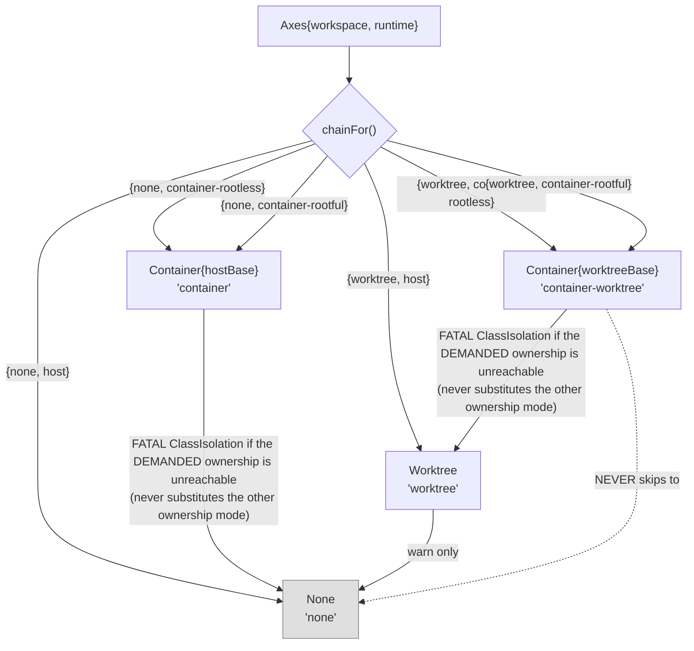

# Isolation — `internal/lm/isolation`

`internal/lm/isolation` decides **where an agent's working directory lives** and
**where its engine process executes**, prepares that workspace, and hands back
either a `pb.Client` (go-plugin transport) or a transport-free `RunnerHandle`. It
owns an **ordered degrade chain whose floor is always the host**, and the rule that
every drop of an explicitly-requested boundary is *reported* — a
`strictness.Fail(ClassIsolation, …)` finding that aborts unless `--degraded`, never
a silently weaker cell. It also owns the agent container image lifecycle and the
host-side half of credential delivery.

It deliberately does **not** import `internal/lm/backends` or `internal/operations`.
Backend names cross as bare string keys (documented connascence of name), and
`EngineStarter` and `SetBinaryVersion` exist purely to keep the dependency
direction one-way.

## Two axes, six postures

Isolation is **not** one enum. It is two independent axes:

- **`WorkspaceAxis`** — declared at the orchestration level (`--workspace`, project
  default). `WorkspaceShared = "none"`, `WorkspaceWorktree = "worktree"`.
- **`RuntimeAxis`** — declared as an *agent* trait (`runtime:` on the binding).
  `RuntimeHost = "host"`, `RuntimeContainerRootless = "container-rootless"`,
  `RuntimeContainerRootful = "container-rootful"`. There is deliberately no "any
  container" value (`IsContainerRuntimeAxis` is the "is a container requested at
  all?" predicate): rootless and rootful containers differ in UID mapping, so a
  workload can genuinely require one, and a caller that could not say which one
  used to silently get whichever the daemon offered.

`Axes` combines them, with `WantsWorktree`, `WantsContainer`, `Zero`.

Two workspace values × three runtime values is **six** requestable combinations,
not four. All three runtime values that name a container (`container-rootless`,
`container-rootful`) still realize the SAME two policy identities as before —
ownership decides which `Runtime` (`SelectRuntime`) is allowed to SERVE the
request, not which `Policy` realizes it — so the six combinations resolve to the
same four `Policy` identities in the table below, split by which container
ownership each one demands.



| Axes | Policy | `Name()` | Ownership demanded | Isolates | Does **not** isolate |
|---|---|---|---|---|---|
| `{none, host}` | `None` | `"none"` | — | nothing — the fault-tolerant floor | everything |
| `{worktree, host}` | `Worktree` | `"worktree"` | — | cwd (detached git worktree at `HEAD`) + **one host lever per backend**: a scoped config-home env var (`CLAUDE_CONFIG_DIR` / `CODEX_HOME` / `KIRO_HOME`) | engine *global* state where the engine ignores the var; the git common dir; credentials (they are **copied in**, not withheld) |
| `{none, container-rootless}` | `Container{hostBase}` | `"container"` | rootless only | process, fs view, fresh `$HOME`; project mounted at its **identical absolute path** | the project dir (mounted RW) and the whole `.git` common dir (mounted RW) |
| `{none, container-rootful}` | `Container{hostBase}` | `"container"` | rootful only | same as the rootless row | same as the rootless row |
| `{worktree, container-rootless}` | `Container{worktreeBase}` | `"container-worktree"` | rootless only | as above + a per-agent checkout as cwd | the git common dir is still whole-dir RW |
| `{worktree, container-rootful}` | `Container{worktreeBase}` | `"container-worktree"` | rootful only | same as the rootless row | same as the rootless row |

### Degrade rules

`chainFor` builds the ordered chain. **Each step drops exactly one axis**: a
container tier never degrades *into* a worktree that was not requested, and a
requested worktree is never dropped because the container failed.

- Container requested with no runtime reachable **that provides the demanded
  ownership** → `strictness.Fail(ClassIsolation, …)`. `SelectRuntime` picks a
  container runtime only when it is launchable AND its probed ownership
  (`ownershipAxis`, off the daemon's actual rootless-ness) IS the demanded one; a
  rootful request never lands on a rootless daemon and vice versa. A mismatch
  and "no runtime at all" both return `Host{}` from `SelectRuntime` and take the
  same fatal path — **an ownership mismatch is never a substitution, only ever a
  fatal `ClassIsolation` finding** (the exit-code-3 fatal-findings path). `
  --degraded` falls back to the **HOST**, never to the other ownership mode:
  silently satisfying a rootful request with a rootless container (or the
  reverse) is the identical substitution wearing a flag.
- `prepareChain` classifies any **container → non-container** transition as
  fatal (`IsContainerPolicyName`).
- A **worktree → None** transition is `clidiag.Warn` only — deliberate.
- `warnUnknownAxes`: an unknown *workspace* value warns; an unknown *runtime*
  value (including a typo of `container-rootless`/`container-rootful`) is a
  **fatal** `ClassIsolation` finding. Empty string = unset = host default, no
  diagnostic.
- `Prepare` **never returns an error** — the chain always terminates in a
  workspace, because `None.PrepareWorkspace` cannot fail.

**Zero-value polarity is correct throughout these axes.** They are strings where
`""` means unset (host default), and a non-empty unknown runtime raises a fatal
finding. This does *not* repeat the `CELL_KIND_UNSPECIFIED → Shared` inversion found
in `llm.proto` (see [grpc-wire](grpc-wire.md)); two reviewers independently confirmed
that inversion is local, not a house style.

### Cells — the plugin-side mirror

`agent.CellKind` is what actually crosses to the plugin: `CellKindShared`
(zero), `CellKindDirectoryIsolated`, `CellKindProcessIsolated` — note this is a
THREE-value enum, one per **workspace posture** the plugin can observe (shared /
worktree / container), not a mirror of the six-value runtime-ownership space:
`CellKindProcessIsolated` covers a container cell in **either** ownership mode,
since ownership is a host-side launch decision the plugin itself never needs to
see. A backend's `buildArgs` switches on it directly rather than inferring the
cell from `WorkDir` — claude gates its out-of-cwd launch flags on
`CellKindShared`, since an isolated cell reads the engine's well-known files in
its private cwd instead.

## Container mechanics

### Image build — two stages

**Stage 1 (base)** precedence, `baseForIdentity`: **user Containerfile >
devcontainer > embedded default**. The embedded default (`defaultBaseStage`) is
`FROM node:22-slim` and bakes `git`, `ripgrep`, `curl`, `ca-certificates`,
`unzip`, `jq`, `strace` plus `TERM=xterm-256color`.

**Stage 2 (agent)**, rendered by `composeAgentContainerfile(engines)`, in order:

1. `ARG BASE_IMAGE` → `FROM ${BASE_IMAGE}`
2. `baseContractLayer` — best-effort apt tool layer
3. `overlayUserLayer` — creates uid/gid 1000 `ctxloom`, installs gosu where apt exists
4. `overlayUserGate` — **fails the build** without `id ctxloom` and without a privilege-drop path (`setpriv`, or `gosu` + `usermod` + `groupmod`)
5. `COPY ctxloom-entrypoint` + `ENTRYPOINT`
6. version/provenance `LABEL`s
7. **one `RUN` layer per engine** (independently cacheable)
8. `COPY ctxloom` + `COPY companions/`
9. `RUN /usr/local/bin/ctxloom version`
10. `companionGate` — drops ABI-incompatible companions with a warning rather than failing

Identity is content-keyed: `composedContentHash` is `sha256(base content ‖ NUL ‖
joined engines)`, tagged `ctxloom-agent:<hash>` by `composedImageTagFor`.
Provenance (`HostProvenanceDigest`) hashes the running ctxloom plus each present
companion and is stamped as `LABEL ctxloom.provenance`, checked by `imageStale`.

Build orchestration: `Container.ensureImage` (single-flight per `(runtime, tag)`)
→ `runEnsureImage` → `buildFromSource` → `buildBaseImage` → `buildImage`. **No
implicit pull** — an absent image is either built from a known source or the
policy degrades (`Container.imagePresent`).

Devcontainer resolution (`resolveDevBase`) strips JSONC and handles image /
build / compose forms. Declared devcontainer **features are warned about, not
honored** (`warnDevcontainerFeatures`).

### Run mechanics

In-container conventions: image `ctxloom-agent:latest`, binary
`/usr/local/bin/ctxloom`, `HOME=/home/ctxloom`, socket dir `/run/ctxloom/plugin`.

`Container.PrepareWorkspace` is the whole gate: **gate → host scratch → base
workspace → shared-FS probe → mounts/env**. Failure at any point returns an
error and produces a loud degrade; a panic guard removes the scratch.

**Mounts** (`Mount{Host, Container, ReadOnly}`):

- The project dir at its **identical absolute path** (`ociRuntime.Expose`).
- `gitdirMirrorMount` when `.git` is a pointer file; `gitCommonDirMount` mirrors the whole common dir **read-write** at an identical path.
- `containerConfigOverlay` — one scratch-backed bind per profile `overlayDirs`, seeded by `seedOverlay`, with the target pre-created so the mountpoint is never root-owned.
- `sessionStateMounts` — scoped RW mounts: engine transcripts (at `engineContainerSpec.transcriptStoreRel` under container `HOME`), the session persist dir, and **this project's** task log `~/.ctxloom/tasks/<project-id>.jsonl` plus its `.lock` sidecar — two single files, never the `~/.ctxloom/tasks` dir, which holds every project on the machine. `safePathSegment` validates the harp, and `paths.HomeTasksLogPath` the project id, before they become host paths.

**Env** (`renderRunSpec`): entries are emitted as `-e <entry>` and are **either**
a bare `NAME` (value read by the runtime from the launcher's own
`os.Environ()`) **or** a literal `KEY=VAL`. The bare form exists so credential
*values* never enter the world-readable argv.

**Uid remap / entrypoint**: the image `ENTRYPOINT` is
`/usr/local/bin/ctxloom-entrypoint`; `identityEnvArgs` passes `-e
PUID=<getuid> -e PGID=<getgid>` and — only under `strictness.Degraded()` —
`CTXLOOM_ALLOW_ROOT=1`. **The entrypoint otherwise refuses to run the engine as
root.** Rootless podman additionally gets `--userns=keep-id`.

**Network**: nothing in the package sets any `--network` flag; no network isolation
is applied or claimed. Host reach-back is by **unix-socket bind mount**, not TCP —
`containerAddrTranslator` prefix-swaps the go-plugin socket path across the
namespace boundary. The transport-free path (`Container.buildRunnerSpec`) has no
socket and no port at all; "the absences are the security contract".

### Three launch paths

| Path | Entry | Shape |
|---|---|---|
| go-plugin over a mounted socket | `Container.SpawnClient` → `Container.launchSpec` → `ociRuntime.spawn` | linux-only gate, `containerSpawnUnsupportedErr` |
| Attached `docker run`, transport-free | `Container.StartRunner` → `startDirectRunner` | stderr to a bounded ring; background reap (`reapRunProcess` — the fix for a measured 846-zombie PID leak); teardown `removeContainer` |
| Piped stdio for a caller with its own protocol | `RunAttached` → `AttachedContainer` | used by `internal/acp`'s container transport (`acp.isolationBackendFor` / `containerTransport`) |

### Shared-FS verification

An identical-path bind mount does not resolve through every daemon (Docker Desktop,
remote daemons, DinD). Before launch, `mountProbeRoots` derives the real host
roots, `sharedFSProbe` memoizes but **only latches definitive outcomes**
(`definitiveProbe`), and `probeOneRoot` writes a marker inside the real root and
reads it back through a scratch container. `runSharedFSProbe` **errors on an
empty root set** rather than reporting "ok". `sharedFSGateError` distinguishes a
definitive `*sharedFSMismatch` from a transient probe failure.

## Credential delivery

`containerAuth{mode, envPassthrough, mounts}` is resolved per backend.
`containerAuthMode` is `authNone` (**zero value — least privilege**), `authEnv`,
`authCredentialMount`. `resolveEnvOrMountAuth` is trigger-then-mount-then-degrade,
shared by claude / kiro / codex / opencode. `presentEnvKeys` filters an allowlist
down to *set* variables only — **names only cross the boundary**.

| Engine | Env trigger | Mount | Site |
|---|---|---|---|
| claude | `ANTHROPIC_API_KEY` / `ANTHROPIC_AUTH_TOKEN` | bind-mounts the **real** `~/.claude/.credentials.json` **RW** — no copy — so claude's single-use token refresh lands in the one real file (see [Single-use refresh tokens](#single-use-refresh-tokens-why-the-three-axes-differ) below) | `resolveClaudeContainerAuth` / `claudeCredentialMounts`. `~/.claude.json` is deliberately never mounted |
| codex | `OPENAI_API_KEY` (`CODEX_API_KEY` is **not** a confirmed trigger and is deliberately excluded) | **RO** mount of `~/.codex/auth.json` — safe because non-interactive codex never refreshes in place | `resolveCodexContainerAuth` / `codexCredentialMounts` |
| opencode | `OPENROUTER_API_KEY` | **RO** mount of XDG `auth.json` | `resolveOpencodeContainerAuth` / `opencodeCredentialMounts` |
| kiro | `KIRO_API_KEY` (**sole** trigger; `AWS_*` ride along but are not standalone) | **none** | `resolveKiroContainerAuth` |
| mock | none needed | none | `resolveMockContainerAuth` — the one resolver that never returns `ok=false`: mock authenticates against no vendor |
| **unmapped/empty backend** (e.g. a generic `acp` engine) | — | — | `noContainerAuth` — **fails closed**; the containerized run aborts at `PrepareWorkspace`'s auth gate rather than inheriting any other engine's credentials |

Host/worktree seeding is `hostCredentialSeed` + `copyCredentialFile` (writes at
0600). Two exported seams reuse it for callers whose home relocation is not
driven by a `Policy` at all: `PrepareCodexHome` and `PrepareClaudeHome`, both
used by `operations.InTreeAgentHomeEnv` (below) to populate a per-session
instance home. They are named *Prepare* because the destination is created at
instance time and thrown away at session end — the copy is one-way, from the
real host home in, never back.

### Single-use refresh tokens: why the three axes differ

The credential ctxloom hands an isolated claude run is not inert. A claude
subscription login stores an OAuth **refresh token**, and that token is
**single-use and rotating**: the moment any holder refreshes, the provider
mints a replacement and invalidates the token that was just spent. So a *copy*
of `.credentials.json` is a latent trap — if the copy ever refreshes, it
rotates the live token out from under **every** other holder, **including your
host login**, silently logging you out of your own machine. This is the fact
the three claude-credential axes are built around, and it is why they do not
all handle the credential the same way.

- **Worktree** (`{worktree, host}`) and **in-tree instance**
  (`config_home: project`) both **COPY** the credential into a per-agent /
  per-session home, and both copies are **access-token-ONLY**: the refresh
  token is **stripped** as the bytes cross (`copyCredentialFile`'s projector →
  claude's `ProjectAmbientCredential`). A stripped copy *cannot* refresh, so it
  can never rotate the host's single-use token. The deliberate trade: such a
  run authenticates only until its access token expires, then must be
  **re-launched** to pick up a fresh copy — it does not refresh in place, so a
  long session pays a re-launch at expiry. These axes exist to isolate the
  child from host config in the first place, so a stripped, copied credential
  is coherent with what they are for.

- **Container** (either ownership) does the **opposite**: it bind-mounts the
  **real** `~/.claude/.credentials.json` **read-write**, with **no copy**
  (`claudeCredentialMounts`). The container's refresh lands in the one real
  file — the single source of truth the host also holds — so host and container
  share the same rotating token and nothing ever desyncs. A container therefore
  **keeps refresh** (no re-launch at expiry), the reverse of the two host axes'
  trade. A container is already a separate execution context where sharing the
  real credential is the natural idiom, and rotation safety is worth more there
  than file-level credential isolation. The **`ctxloom-never-writes-real-home`**
  invariant still holds: ctxloom only *declares* the bind mount;
  claude-the-binary writes the credential through it, exactly as it does on a
  non-containerized run. ctxloom itself never opens the real credential for
  writing.

The two host axes were switched to access-token-only stripping in the same
change that established the single-use-rotation model by live experiment; the
container axis was switched to the real-home mount immediately after. All three
are now coherent: **no copy of the credential that can refresh exists anywhere**
— the only thing that refreshes is either the real file (container) or nothing
at all (stripped host copies).

## Engine config homes

An engine's **home** is where it keeps what is not project-specific: config,
global prompts / skills / steering / agents, session state, and credentials.
Every engine names one env var that relocates it.

**Your real `~/.claude`, `~/.codex` and `~/.kiro` are the durable truth, and
ctxloom never writes them.** Engines natively keep per-project durable facts
there, path-keyed (codex's `[projects."<abs path>"]` trust entries, claude's
per-project keys). That stays the single durable location.

What an opted-in agent run gets instead is a **per-session INSTANCE**,
`<WorkDir>/.ctxloom/state/<harp>/home/<engine-leaf>`, created at session start
and disposable. Three content classes live in it: ctxloom-generated content
(context, prompts, skills, config fragments) regenerated at each launch;
engine-specific scaffolding (codex's `config.toml` tables and trust pre-seed)
synthesized by the engine packages; and **ambient** content whose origin is your
real host home (credentials today), **copied in one way** at instance time. For
claude that copy is **access-token-only** — the single-use refresh token is
stripped so the instance can never rotate the host's token (see [Single-use
refresh tokens](#single-use-refresh-tokens-why-the-three-axes-differ)).

**There is no sync-back, ever.** Two accepted costs follow, and they are
deliberate: an instance's stripped credential does not refresh in place — the
run re-launches to pick up a fresh copy once its access token expires — and
trust/onboarding answers given inside an instance die with it (re-prompted next
session unless the engine's own answer already lives in the real home and rides
the next copy-in). The **container** axis is the deliberate exception: it mounts
the real credential read-write and so *does* refresh in place, because a mount —
unlike a copy — shares the host's one rotating token rather than forking it.

An engine's **cwd-keyed** surfaces are a different thing entirely and are never
relocated: `CLAUDE.md`, `.claude/`, `.kiro/`, `opencode.json`, `AGENTS.md` live
at the project root, where the engine natively looks.

| Engine | Var | Container | Worktree | In-tree, `config_home: project` | In-tree, undeclared / `host` / no binding |
|---|---|---|---|---|---|
| codex | `CODEX_HOME` | fresh `$HOME/.codex` | per-agent scratch | `<WorkDir>/.ctxloom/state/<harp>/home/.codex` | **real `~/.codex`** |
| claude-code | `CLAUDE_CONFIG_DIR` | fresh `$HOME/.claude` | per-agent scratch | `<WorkDir>/.ctxloom/state/<harp>/home/claude` | **real `~/.claude`** |
| kiro | `KIRO_HOME` | fresh `$HOME/.kiro` | per-agent scratch | `<WorkDir>/.ctxloom/state/<harp>/home/kiro` | **real `~/.kiro`** |
| opencode | `XDG_CONFIG_HOME` / `XDG_DATA_HOME` | fresh `$HOME` | per-agent scratch | **not controlled** | **not controlled** |

The instance root resolves through one helper, `paths.SessionHomePath`, and each
engine appends its OWN leaf through its own package — `codex.SessionHome`,
`claude.SessionConfigDir`, `kiro.SessionHome`. The three leaves are pairwise
distinct by construction, so one session root hosts every engine that session
runs. The **state** tier is deliberate: an instance holds copied credentials, so
it is gitignored *and* unrebuildable — see [the `.ctxloom` layout
page](../../layout.md) for the three trees, the wipe costs and the gitignore
contract that keeps that credential out of git.

**Instances are per SESSION, not per project.** Two concurrent sessions in one
checkout get two homes — isolation the in-tree axis did not have while the home
was project-scoped. Two runs *within* one session (a coordinator and its in-tree
delegated child, which inherits the harp on `req.Env`) deliberately share one
instance. A run with no session name gets no instance at all and keeps the
engine's real home; there is no session-less fallback, because a shared one
would be the project-scoped home this model replaced.

### The rule: `config_home: project`, declared, on the in-tree axis only

Each agent binding declares its own policy, `agents.<name>.config_home:
project|host`:

```yaml
agents:
  coder:
    config_home: project   # a per-session instance under .ctxloom/state/<harp>/home/
    # or: host             # the engine's real host home (also the default)
```

**Empty (undeclared) DEFAULTS TO `host`.** The controlled home is strictly
opt-in — naming an agent, on its own, is *not* enough to relocate its config
home. A binding that wants its runs kept off the human's real `~/.claude` or
`~/.kiro` has to say `config_home: project` explicitly.

**A declared value WINS on every invocation path that binding resolves
through** — a bare `ctxloom run` under `default_agent`, `run --agent`, a
delegated child, a oneshot fan member, alike. Invocation never matters for a
declared binding; only whether a binding is in play at all does. A run with
**no agent binding whatsoever** (no `--agent`, no `default_agent`) has no
`config_home` to read in the first place, and always keeps the real host
home — there is no binding through which it could even opt in. Decided in
`operations.InTreeAgentHomeEnv` off the resolved binding's *effective*
`ConfigHome` (`operations.ResolveConfigHome`), the single place the condition
lives; contributed by `cli/run.go`'s `prepareWorkspace`,
`operations/delegate.go`'s `bindIsolatedSpawn`/`startOneshot`, and
`operations/oneshot.go`'s `runResolvedAgent`.

A delegated child, a fan-out member, a `run --agent` — these ARE ctxloom's
processes, and pointing one at `~/.claude` or `~/.kiro` hands it the human's
memory, plugins, personal MCP registrations, global agents and steering, and
lets it write session state and settings edits back into them. That is the
pollution `config_home: project` lets a binding opt out of — but nothing takes
it on by default; a project asks for it by name, on the binding that wants it.

**codex's asymmetry has ENDED.** codex used to relocate `CODEX_HOME` on every
in-tree run regardless of `config_home`, and that was defensible while the
relocation target was DURABLE: ctxloom had always pointed `CODEX_HOME` at a
project-scoped directory that survived across sessions, so there was nothing of
yours to take away and no opt-in was needed.

A per-session instance is **disposable**, which changes the arithmetic. Under
the old rule your own interactive `ctxloom run` — no agent binding at all —
would have been handed a throwaway codex home every session, losing its token
refreshes, its accumulated workspace-trust answers and its session state each
time. So codex now reads `config_home` exactly like claude and kiro: no binding,
an undeclared binding, or an explicit `host` all keep your real `~/.codex`, and
only `config_home: project` earns an instance. One rule, three engines, decided
in one place.

**What that costs, stated plainly.** codex is the only engine whose hooks, MCP
servers, prompts and skills live *only* in `$CODEX_HOME` — it has no cwd-keyed
equivalent of claude's `.claude/settings.json` or kiro's `.kiro/settings`. So a
codex run that keeps your real home gets **none of them**, because ctxloom will
not write that home. It says so out loud and names the fix
(`config_home: project`); codex's cwd-keyed `AGENTS.md` context still delivers,
so the run is degraded rather than broken.

**opencode is excluded**, pending its own decision: its only lever is
`XDG_CONFIG_HOME` / `XDG_DATA_HOME`, which are not engine-private. Relocating
them moves git's, fish's and every other XDG-aware tool's config for the child
too.

### Three exclusions, and one fail-loud

The in-tree contribution declines, each condition independently sufficient:

1. **the effective `config_home` is not `project`** — the rule above (this
   covers no binding, an undeclared binding, and an explicit `host`);
2. **not the in-tree axis** — a container's fresh `$HOME` already *is* the
   controlled home, and a worktree's per-agent home is already provisioned and
   seeded by this package, UNCONDITIONALLY — `config_home` does not reach the
   worktree axis at all. An in-tree path handed to either names a directory the
   boundary cannot see;
3. **the var is already set** — isolation's own `Env()`, or the user's `--env`,
   wins outright. This fills gaps; it never overrides.

Credentials follow the home for claude and codex (`.credentials.json` and
`auth.json` are copied from `~/.claude` / `~/.codex`, never moved, never written
back) and **do not** for kiro, whose
subscription auth lives in a global sqlite under `XDG_DATA_HOME` that `KIRO_HOME`
does not relocate — which is exactly why a fresh `KIRO_HOME` stays authenticated
and why `XDG_DATA_HOME` is deliberately *not* relocated alongside it.

When claude's credentials cannot be seeded (no `ANTHROPIC_API_KEY`, no host
`~/.claude/.credentials.json`), ctxloom records a `ClassIsolation` finding and
contributes **nothing** — the run aborts at the choke gate, or under `--degraded`
falls back to the host's own home. Handing the engine a controlled home it cannot
authenticate against would trade a working run for a mysterious 401.

## Per-engine container specs

`engineContainerSpecFor(backend)` (`internal/lm/isolation/enginespec.go`; called
`containerProfileFor` in a since-removed `profile.go` until 0.7.0 — renamed
because "profile" is ctxloom's *context-composition* concept and the collision is
what let two call sites key this table on an agent label instead of an engine).
The key is the REGISTERED BACKEND NAME, resolved **per call** from the backend
the run carries — never fixed at construction time. `composableEngines()`
returns exactly `["claude-code", "codex", "kiro", "opencode"]` (the antigravity
engine's container spec — and the engine itself — was removed after 0.7.0;
`acp.isolationBackendFor` fails a containerized `"agy"` loudly rather than
routing it to a spec that no longer exists). `resolveEngines` filters a
configured `isolation_engines` set against that list, in that order, never
widening.

| Backend | Image | Install fragment | Build validate gate | `overlayDirs` | `transcriptStoreRel` |
|---|---|---|---|---|---|
| `claude-code` | `ctxloom-agent:latest` | npm — no official image resolves | `claude --version` + `adapterRunGate` | `.claude`, `.ctxloom/cache` | `.claude/projects` |
| `kiro` | `ctxloom-agent-kiro:latest` | official installer | `kiro-cli --version` **+** `nativeACPRunGate("kiro-cli","acp")` | `kiroOverlayDirs` | `.kiro` |
| `codex` | default tag | npm `@openai/codex` **+** `@zed-industries/codex-acp` | `codex --version` + adapter ACP gate | `codexOverlayDirs` | `.codex/sessions` |
| `opencode` | default tag | official script, relocated from `$HOME/.opencode/bin` | `opencode --version` + `nativeACPRunGate` — gates on **text, not exit status** (opencode exits 0 with no `acp` command) | `opencodeOverlayDirs` | `.local/share/opencode` |
| `mock` | `ctxloom-agent:latest` | `mockInstallFragment` — installs no vendor CLI at all | `cat --version` | `mockOverlayDirs` | `""` (mock keeps no transcripts) |
| **default arm** (unmapped engine) | `ctxloom-agent:latest` | none | none | `defaultOverlayDirs` | `.claude/projects` |

The default arm's `resolveAuth` is `noContainerAuth`: an engine with no mapping
gets **no credentials at all** and its containerized run aborts at
`PrepareWorkspace`'s auth gate. `isolation.HasContainerAuth(backend)` /
`ContainerAuthEngines()` expose that same table so the refusal can happen
*earlier*, at configuration time: `operations.validateContainerAuth` (run from
`validateAgentAxes`, i.e. `agent create`/`agent edit`/`SetAgent`) rejects a
binding whose resulting `{engine, runtime: container-*}` pair names an engine
with no mapping — `backend: acp` today — naming the supported set in the error.
The launch-time gate stays as the last line for paths that never went through a
binding.

The build gates verify the engine is **runnable**, not merely installed: every
fragment ends in `<client> --version`, and for ACP-driven engines an ACP-surface run
gate that asserts on **output text**.

## The trace probe — read observation

`traceprobe.go` verifies *what files the engine actually reads* inside a cell.

- `TraceProbe{HostDir, ContainerDir, OutFile, Syscalls, SeccompProfile}` is a field on `RunSpec` — the seccomp override is a **structural** decision at the render site.
- Gate: `traceProbeFromEnv` returns non-nil **iff** `CTXLOOM_ISOLATION_PROBE_TRACE_DIR` is set, and materializes the loosened seccomp JSON. A write failure leaves `SeccompProfile=""`, i.e. Docker's default profile — failing toward *more* isolation. Called from `buildRunSpec` and `Container.buildRunnerSpec`.
- Render: `renderRunSpec` emits `--security-opt seccomp=<path>`, mounts the trace dir, and wraps the engine exec via `straceWrapPrefix`.
- Parse: `ParseStraceReads` → sorted, deduplicated `[]TraceRead`. `TraceRead.Failed()` is `Result != "ok"`. **ENOENT is first-class.** Consumer: `runProbeContainer` (`tests/acceptance/isolation_probe.go`).

`strace` is baked into the default base image and is harmless without
`CAP_SYS_PTRACE`.

Two further diagnostics: `Diagnose` backs `ctxloom container check` (read-only,
never errors by design), and `ReapOrphanedWorktrees` sweeps orphaned ephemeral
worktrees at startup, leaking rather than destroying anything WIP-bearing.

## Key exported surface

| Symbol | File | Meaning |
|---|---|---|
| `Policy` | `isolation.go` | The seam: `Name` / `PrepareWorkspace` / `SpawnClient` / `StartRunner` |
| `Workspace` / `EnvWorkspace` | `isolation.go` | dir + teardown; optional per-agent config-home env. `EnvWorkspace` is implemented **only** by `worktreeWorkspace` |
| `Axes` / `WorkspaceAxis` / `RuntimeAxis` | `isolation.go` | The isolation request |
| `WorkspaceNames` / `RuntimeNames` | `isolation.go` | Single source for validation, completion, schema |
| `IsContainerRuntimeAxis` | `isolation.go` | "Is a container requested at all?", independent of which ownership |
| `Prepare` | `isolation.go` | Public entry; never returns an error |
| `IsContainerPolicyName` | `isolation.go` | The security predicate: "did we keep the boundary?" |
| `Isolated` | `isolation.go` | `p.Name() != "none"`; gates per-member config writes |
| `StarterForWorkspace` / `FactoryForWorkspace` / `WorkspaceEnv` | `isolation.go` | Binding adapters for `internal/operations` |
| `EngineStarter` / `RunnerHandle` | `isolation.go` | Launch closure; `{Name, Kill func(), Wait, StderrTail}` |
| `ImageConfig` | `isolation.go` | `Image`, `BaseContainerfile`, `AppRoot`, `NoDevcontainerBase`, `DevcontainerService`, `Engines` |
| `None` / `Container` / `Worktree` | `none.go` / `container.go` / `worktree.go` | The three policy types (four policy identities, six requestable postures) |
| `RunAttached` / `AttachedContainer` | `attach.go` | Foreground stdio container for `internal/acp` |
| `PrepareCodexHome` / `PrepareClaudeHome` | `auth.go` | The exported one-way copy-in seams, for per-session instance homes outside a `Policy` |
| `Runtime` / `Docker` / `Podman` / `Host` | `runtime.go` | Pluggable launcher substrate |
| `SelectRuntime` | `runtime.go` | Ownership-demanding selection; `Host{}` when no runtime serves the demanded ownership; never errors |
| `ProbeRuntime` | `runtime.go` | The unconstrained "what's reachable?" question — diagnostics/build only, never a run |
| `InContainer` | `runtime.go` | Self-detection (sentinel files + env + cgroup v1) |
| `RunSpec` / `LaunchSpec` / `Mount` | `runtime.go` | Run description / spawn params / bind mount |
| `SessionState` / `SessionStateFromEnv` | `statemounts.go` | Harp + project id threaded into the seam |
| `TraceProbe` / `TraceRead` / `ParseStraceReads` | `traceprobe.go` | Read-observation vocabulary |
| `Diagnosis` / `Diagnose` | `diagnose.go` | `container check` report |
| `BuildAgentImage` / `ImageBuildOptions` / `HostProvenanceDigest` | `imagebuild.go` | `container build` / `container provenance` |
| `ReapOrphanedWorktrees` / `WorktreeReapResult` | `worktree_reap.go` | Startup orphan sweep |

## Invariants

1. **Degrade drops one axis at a time** (`chainFor`).
2. **Every lost container boundary is a finding** — `strictness.Fail(ClassIsolation)` in `chainFor`, and a fatal container→non-container transition in `prepareChain`. Aborts unless `--degraded`.
3. **An ownership mismatch is fatal, never a substitution** — `SelectRuntime` returns `Host{}` (not the other ownership's runtime) when the demanded ownership is unreachable, and `--degraded` falls back to the HOST, never to the other ownership mode.
4. **The chain always terminates in a workspace**; `Prepare` never errors.
5. **Unknown runtime axis is fail-closed; unknown workspace axis warns** (`warnUnknownAxes`).
6. **Auth env values never enter argv** — `envPassthrough` carries names only, because `/proc/<pid>/cmdline` is world-readable.
7. **`containerAuth`'s zero value fails closed** (`authNone`, no credentials cross).
8. **No implicit pull** — an absent image is built from a known source or the policy degrades.
9. **An unverifiable image *identity* fails loud; an unverifiable *label* reads as stale and triggers a rebuild** — opposite directions, both deliberate (`imageIdentityConfig` errors; `imageLabels` returns nil).
10. **A user-owned (run-as-is) image must satisfy the identity contract** — a ctxloom-governed entrypoint or a non-root user, else `ClassIsolation` (`Container.checkRunAsIsIdentity`).
11. **The engine never runs as root in a governed image** unless `--degraded` sets `CTXLOOM_ALLOW_ROOT=1`; the build itself fails without a privilege-drop path (`overlayUserGate`).
12. **The build gates that the engine is runnable**, not merely installed.
13. **A composed base stage is content-keyed** — base content and engine set are both in the tag.
14. **Identical-path bind mounts are verified, not assumed**; an empty root set is an error, not an "ok".
15. **Commits from an agent never impersonate the human** — `gitIdentity` yields `"ctxloom agent <id>" <sanitized>@agents.ctxloom.local`.
16. **Worktree teardown leaks rather than destroys** — `force=false`, unknown-dirty treated as dirty, and a WIP-bearing orphan is SPARED (`teardownWorktree`, `worktree_reap.go`).
17. **`WorktreeVerdict`'s unhandled/unclassified case funnels to `VerdictSkipped` (never touch)** — the `default:` case in `ReapOrphanedWorktrees`'s tally.
18. **Session state names are path-validated** before becoming host paths (`safePathSegment`).

## Divergences from documented or implied behavior

*Stated factually; triage lives in `FINDINGS.md`.*

**Credential and coverage gaps**

- ~~**The default (unprofiled) container profile authenticates with claude credentials**~~ — **RESOLVED.** The default arm used to return `resolveClaudeContainerAuth`, passing `ANTHROPIC_*` and copy-mounting `~/.claude` into *any* unrecognized engine's container (reachable: a generic `acp` backend is registered, and `internal/acp`'s container transport passes an unrecognized or empty engine name through unchanged). It now fails **closed** (`noContainerAuth`) and the launch aborts; `operations.validateContainerAuth` refuses such a binding at write time so the abort is not the first the user hears of it.
- ~~**A backend in neither `credentialSeedSpecs` nor a curated-home registry gets a worktree with zero engine-global isolation and no finding at all**~~ — **PARTIALLY RESOLVED.** `Worktree.PrepareWorkspace` now records a `strictness.Fail(ClassIsolation)` for any backend that is neither in `credentialSeedSpecs` nor named in `backendsWithNoGlobalState` — closing the gap for `acp` and every future unmapped engine. `backendsWithNoGlobalState` carries exactly one, independently-verified exemption (`mock`, which provably touches no engine-global state), not a silent carve-out; an empty backend (no agent context at all) stays silent by design.
- **The curated-HOME allowlist** that used to symlink `~/.gitconfig`/`~/.ssh` into a worktree's per-agent home **has been removed along with the whole curated-home mechanism** — `Worktree` now relies solely on `credentialSeedSpecs`' scoped env vars (`Worktree.prepareHomeVarDirs`), which is why `.gitconfig`/`.ssh` identity is left on the *shared* worktree checkout instead of being copied or symlinked per agent. Whether that removal fully retired the class of bug the old allowlist was tracking (over-broad `.ssh` exposure) was not re-verified here.
- **On every plain host codex run the OpenAI credential is copied into the project working tree** (`ensureCodexCredentials`, `internal/codex/backend.go`) and no `Cleanup` path removes it; ctxloom's managed ignore set covers `.codex/config.toml` but not `.codex/auth.json`.
- **`copyCredentialFile` follows a symlink at the destination** (`os.WriteFile` semantics), and `PrepareCodexHome`'s `destDir` is unvalidated.
- **The worktree reaper's scope is `~/.ctxloom/sessions/*/ephemeral/` only** (`ReapOrphanedWorktrees`); worktrees on the `os.TempDir()` fallback are permanently unreapable, and nothing sweeps the sibling `ctxloom-cfg-*` / `ctxloom-home-*` / `ctxloom-tmp-*` dirs — so a crashed run leaves 0600 credential copies on disk indefinitely.
- **`worktreeWorkspace.Cleanup`'s idempotence guard is `dir` alone**, short-circuiting removal of `configHome` / `scratchDir` if a caller ever reaches it with `dir == ""` but either of those still set.

**Green build, nothing delivered**

- **`composeAgentContainerfile(nil)` renders a complete, buildable, gate-passing image with zero engine layers.** Reachable via a typo'd `isolation_engines`: `resolveEngines` warns about unknown *names* but never about the resulting empty *set*, and no `len(engines)==0` guard exists anywhere in the package.
- **The staleness gate fails open**: `combineProvenance` returns `""` on unresolvable provenance and `imageStale("")` returns `false`, so any present image runs as-is with no diagnostic.
- **A stale image that cannot rebuild because `resolveSelfExe` failed launches with no warning and no finding**, while the parallel "rebuild failed" path raises a fatal `ClassIsolation` for the identical outcome. `selfLinuxExe` errors unconditionally off Linux, so this is the **default path on macOS and Windows** dev hosts.
- **`overlayContainerfile` emits its client-validation `RUN` only when `validate != ""`**, and the default profile's `validate` is `""` — so `container build <unprofiled> --base-image X` tags an image never checked to contain any engine.
- **`sessionStateMounts` skips the transcript mount silently when `transcriptStoreRel == ""`**; a missing harp or project id degrades behind `clidiag.WarnOnce` — *once per process*, so in a fan-out only the first member's data loss is announced.

**Claims that overstate the boundary**

- **Host runtime is not a security boundary between agents.** Two agents
  launched with `runtime: host` run as the same OS user, and the coordinator
  credential (`CTXLOOM_COORD_CRED`) that `Coordinator.Identify`
  (`agentcoord/coord/coordinator.go:777`) accepts as sole proof of caller
  identity is exec-time environment: `/proc/<pid>/environ` exposes it to any
  other same-uid process for that process's entire lifetime, unsetting it
  after read does not scrub the kernel's snapshot, and where
  `ptrace_scope` permits same-uid ptrace a determined process can lift the
  same bytes out of memory even past that. `internal/shared/procsec` raises
  the cost of the file-read path but says so itself: "THIS IS BAR-RAISING,
  NOT A BOUNDARY … The isolation boundary is a container" (`procsec.go:12-17`).
- **`gitCommonDirMount` mounts the entire git common dir read-write**. The accepted risk is recorded in an implementation comment and not in the user-facing isolation claim or `docs/trust-model.md`. A member can therefore rewrite main's refs/objects/index and other agents' worktree admin dirs.
- **`containerHandshakeEnv` promises "ONLY the go-plugin handshake vars" but prefix-matches `PLUGIN_*` across the full host env**; `SkipHostEnv` is set nowhere, so any host `PLUGIN_*` variable crosses the boundary and lands in world-readable argv.
- **`TraceProbe`'s doc claims the loosened seccomp profile is structurally unreachable from a normal run**, but the gate is a plain `os.Getenv` (`traceProbeFromEnv`) — any parent exporting `CTXLOOM_ISOLATION_PROBE_TRACE_DIR` makes every container run in that process ptrace-permitted and strace-wrapped.
- **`worktreeWorkspace.Env()` advertises `HomeVar` target directories that nothing creates** if `prepareHomeVarDirs` failed; isolation then depends on each engine choosing to `mkdir -p` rather than falling back to its global home.
- **`ImageConfig`'s doc claims "zero value = devcontainer auto-detect ON"** but `resolveDevBase` turns detection *off* when `AppRoot == ""`.

**Signal quality**

- **`ParseStraceReads` records `Result:"ok"` whenever the errno group is empty, ignoring the captured return value** — a failed syscall with no named errno reports success, inverting the probe's signal.
- **REAPED vs SPARED is decided by an `os.Stat` check** in `ClassifyOrphanedWorktrees`, so any stat error reports REAPED — and that number is printed to the user.
- **`SelectRuntime` silently substitutes on an unrecognized preference**: an explicit `podman` preference that is unknown or unavailable falls through to auto-detection with only a comment (`selectRuntimeWhere`), and the function never errors, so no caller can detect it. (This is orthogonal to the fatal ownership-mismatch path above — an *unrecognized runtime name* degrades quietly, a *recognized runtime with the wrong ownership* does not.)
- **`IsContainerPolicyName` matches duplicated string literals** rather than the constants the policies return, so a rename silently downgrades `prepareChain`'s fatal finding to a warn.

**Dead structure worth knowing before reading the package**

- `Resolve` and the `Chroot` runtime, previously noted here as test-only/unreachable dead code, have both been **removed outright** — there is nothing left to find under either name.
- The `Approvals` axis on `Policy` (four implementations with zero production consumers) has likewise been **removed outright**; only a comment in `runner.go` still names it, in passing, as "the policy-level Approvals axis that used to name the other boundary."
- `pidalive_unix.go` / `pidalive_windows.go` are no longer duplicated inside this package — they were extracted to `internal/shared/pidalive`, which now has multiple call sites across `cli`, `isolation`, `agentcoord/coord`, and `mcp`.

## See also

- [Capability matrix](capability-matrix.md) — the per-engine isolation summary table
- [The plugin wire](grpc-wire.md) — how `CellKind` reaches the plugin, and why `ChatRequest.Runtime` does not
- [The `Backend` abstraction and registry](backend-abstraction.md)
