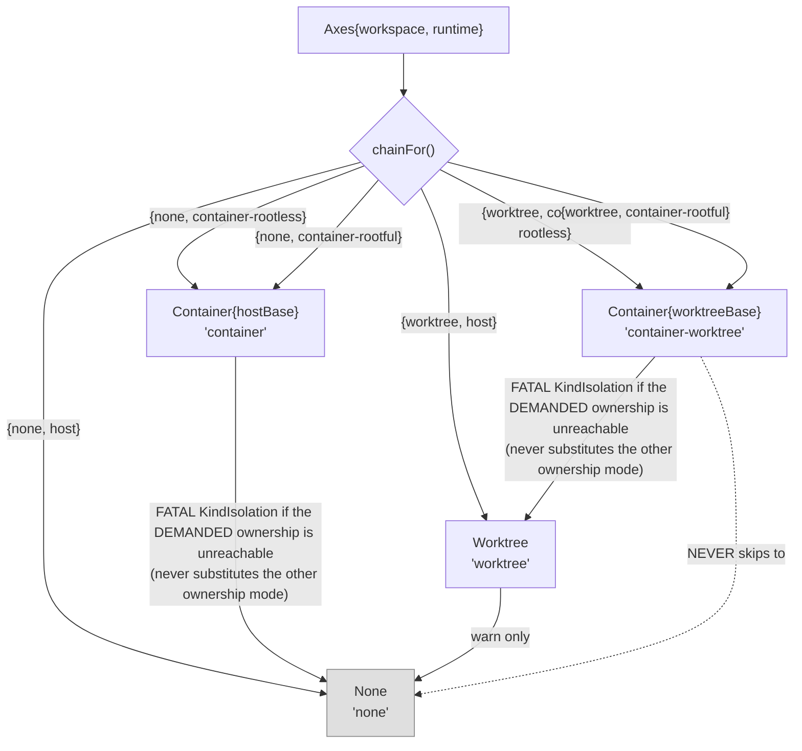

# Isolation — `internal/adapters/isolation`

`internal/adapters/isolation` decides **where an agent's working directory lives** and
**where its engine process executes**, prepares that workspace, and hands back
a transport-free `RunnerHandle`. It
owns an **ordered degrade chain whose floor is always the host**, and the rule that
every drop of an explicitly-requested boundary is *refused* — a
`strictness.FailAlways(KindIsolation, …)` finding that aborts in **both** modes,
never a weaker cell. `--degraded` does not reach these: it means "deliver less",
not "drop the sandbox". It also owns the agent container image lifecycle and the
stored engine token.

It deliberately does **not** import `internal/engines` or `internal/adapters/operations`: it reads engine facts by name through `isolation.Facts`, installed by the composition root.
Backend names cross as bare string keys (documented connascence of name), and
`EngineStarter` and `SetBinaryVersion` exist purely to keep the dependency
direction one-way.

## Two axes, six postures

Isolation is **not** one enum. It is two independent axes:

- **`WorkspaceAxis`** — declared at the orchestration level (`--workspace`, project
  default). `WorkspaceShared = "none"`, `WorkspaceWorktree = "worktree"`.
- **`RuntimeAxis`** — declared as an *agent* trait (`runtime:` on the binding).
  `RuntimeHost = "host"`, `RuntimeContainerRootless = "container-rootless"`,
  `RuntimeContainerRootful = "container-rootful"`. There is deliberately no "any
  container" value (`IsContainerRuntimeAxis` is the "is a container requested at
  all?" predicate): rootless and rootful containers differ in UID mapping, so a
  workload can genuinely require one, and a caller that could not say which one
  used to silently get whichever the daemon offered.

`Axes` combines them, with `WantsWorktree`, `WantsContainer`, `Zero`.

Two workspace values × three runtime values is **six** requestable combinations,
not four. All three runtime values that name a container (`container-rootless`,
`container-rootful`) still realize the SAME two policy identities as before —
ownership decides which `Runtime` (`SelectRuntime`) is allowed to SERVE the
request, not which `Policy` realizes it — so the six combinations resolve to the
same four `Policy` identities in the table below, split by which container
ownership each one demands.


```mermaid
flowchart TD
    A["Axes{workspace, runtime}"] --> B{"chainFor()"}
    B -->|"{worktree, container-rootless}"| C1["Container{worktreeBase}<br/>'container-worktree'"]
    B -->|"{worktree, container-rootful}"| C1
    B -->|"{none, container-rootless}"| C2["Container{hostBase}<br/>'container'"]
    B -->|"{none, container-rootful}"| C2
    B -->|"{worktree, host}"| C3["Worktree<br/>'worktree'"]
    B -->|"{none, host}"| C4["None<br/>'none'"]

    C1 -->|"FATAL KindIsolation if the DEMANDED ownership is unreachable<br/>(never substitutes the other ownership mode)"| C3
    C2 -->|"FATAL KindIsolation if the DEMANDED ownership is unreachable<br/>(never substitutes the other ownership mode)"| C4
    C3 -->|"warn only"| C4
    C1 -.->|"NEVER skips to"| C4

    style C4 fill:#8884,stroke:#888
```

| Axes | Policy | `Name()` | Ownership demanded | Isolates | Does **not** isolate |
|---|---|---|---|---|---|
| `{none, host}` | `None` | `"none"` | — | nothing — the fault-tolerant floor | everything |
| `{worktree, host}` | `Worktree` | `"worktree"` | — | cwd (detached git worktree at `HEAD`) + **one host lever per backend**: the scoped config-home env var its descriptor's `Home` declaration names | engine *global* state where the engine ignores the var; the git common dir; the auth token (it rides the env) |
| `{none, container-rootless}` | `Container{hostBase}` | `"container"` | rootless only | process, fs view, fresh `$HOME`; project mounted at its **identical absolute path** | the project dir (mounted RW) and the whole `.git` common dir (mounted RW) |
| `{none, container-rootful}` | `Container{hostBase}` | `"container"` | rootful only | same as the rootless row | same as the rootless row |
| `{worktree, container-rootless}` | `Container{worktreeBase}` | `"container-worktree"` | rootless only | as above + a per-agent checkout as cwd | the git common dir is still whole-dir RW |
| `{worktree, container-rootful}` | `Container{worktreeBase}` | `"container-worktree"` | rootful only | same as the rootless row | same as the rootless row |

### Degrade rules

`chainFor` builds the ordered chain. **Each step drops exactly one axis**: a
container tier never degrades *into* a worktree that was not requested, and a
requested worktree is never dropped because the container failed.

- Container requested with no runtime reachable **that provides the demanded
  ownership** → `strictness.Fail(KindIsolation, …)`. `SelectRuntime` picks a
  container runtime only when it is launchable AND its probed ownership
  (`ownershipAxis`, off the daemon's actual rootless-ness) IS the demanded one; a
  rootful request never lands on a rootless daemon and vice versa. A mismatch
  and "no runtime at all" both return `Host{}` from `SelectRuntime` and take the
  same fatal path — **an ownership mismatch is never a substitution, only ever a
  fatal `KindIsolation` finding** (the exit-code-3 fatal-findings path). Neither mode
  falls back to the HOST any more, and neither ever substituted the other
  ownership mode: satisfying a rootful request with a rootless container (or the
  reverse) is the identical substitution wearing a flag, and dropping the
  container altogether was the strictly larger one.
- `prepareChain` classifies any **container → non-container** transition as
  fatal (`IsContainerPolicyName`).
- A **worktree → None** transition is `clidiag.Warn` only — deliberate.
- `warnUnknownAxes`: an unknown *workspace* value warns; an unknown *runtime*
  value (including a typo of `container-rootless`/`container-rootful`) is a
  **fatal** `KindIsolation` finding. Empty string = unset = host default, no
  diagnostic.
- `Prepare` **never returns an error** — the chain always terminates in a
  workspace, because `None.PrepareWorkspace` cannot fail.

**Zero-value polarity is correct throughout these axes.** They are strings where
`""` means unset (host default), and a non-empty unknown runtime raises a fatal
finding.

## Container mechanics

### Image build — two stages

**Stage 1 (base)** is chosen by `resolveBase` from `isolation_base`: an image
ref is used verbatim as `FROM <ref>`; otherwise the project devcontainer or the
embedded default. A user's own Containerfile reaches stage 1 only as an image
they built and named there. The embedded default (`defaultBaseStage`) is
`FROM node:22-slim` and bakes `git`, `ripgrep`, `curl`, `ca-certificates`,
`unzip`, `jq`, `strace` plus `TERM=xterm-256color`.

**Stage 2 (agent)**, rendered by `composeAgentContainerfile(engine)` — ONE
engine per image — in order:

1. `ARG BASE_IMAGE` → `FROM ${BASE_IMAGE}`
2. `baseContractLayer` — best-effort apt tool layer
3. `overlayUserLayer` — creates uid/gid 1000 `ctxloom`, installs gosu where apt exists
4. `overlayUserGate` — **fails the build** without `id ctxloom` and without a privilege-drop path (`setpriv`, or `gosu` + `usermod` + `groupmod`)
5. `COPY ctxloom-entrypoint` + `ENTRYPOINT`
6. **the engine's one `RUN` install layer**
7. version/provenance/engine `LABEL`s
8. `COPY ctxloom` + `COPY companions/`
9. `RUN /usr/local/bin/ctxloom version`
10. `companionGate` — drops ABI-incompatible companions with a warning rather than failing

Identity is keyed on the ctxloom VERSION together with the content:
`composedContentHash` is `sha256(base content ‖ NUL ‖ engine)`, tagged
`ctxloom-agent-<engine>:<version key>-<hash>` by `composedImageTagFor`. Both the
engine and the version are in the TAG, not only the hash, so a wrong image is
visible in `docker images` rather than only by recomputing a digest — and images
built by different ctxloom versions COEXIST instead of overwriting one shared
tag. The key comes from `hostImageKeys`: ctxloom's commit (`versionCommitKey`,
not the raw stamp, which embeds a build timestamp) plus the digest of the
companions the image stages (`imageCompanions`: those REGISTERED on the
invoking machine). The companion digest is in the tag, not only the
provenance label, because the staged set follows the invoking HOME's
registration: two environments at one commit stage different images, and
sharing a tag made each rebuild over the other's.

**THE ORDER ABOVE IS LOAD-BEARING.** The version `LABEL`s interpolate
`ARG CTXLOOM_VERSION`, which changes on every build, and docker invalidates
every layer after a changed one — so with the labels ABOVE the engine install,
every ctxloom rebuild re-runs the vendor's installer. That is how a cell came to
die repeatedly on a vendor installer exhausting GitHub's anonymous API quota
before the order was fixed. The engine install goes above
everything that changes per build; the ctxloom binary goes last.
Provenance (`hostProvenanceDigest`) is `versionProvenanceKey`, then a digest of
the staged companions' self-reported versions (`companionVersionKey`), then the
base config's content hash — stamped as `LABEL ctxloom.provenance` and checked
by `imageStale`. It keys on the VERSION rather than a digest of the running
binary's bytes: that digest changed on every build, so every agent image read as
stale and was rebuilt for nothing. A tracked-dirty build still rebuilds, because
`versionProvenanceKey` keeps the build timestamp for a dirty stamp.

The companion half exists because the image bakes the companions too, and
keying on ctxloom's version alone let an image holding an OLD companion read as
fresh until ctxloom's own version happened to move. A companion present on PATH
that cannot answer `<bin> version --format json` raises a `KindConfig` finding
— fatal by default, warn-and-continue under `--degraded` — rather than dropping
out of the key unnoticed.

Build orchestration: `Container.ensureImage` (single-flight per `(runtime, tag)`)
→ `runEnsureImage` → `buildFromSource` → `buildBaseImage` → `buildImage`. **No
implicit pull** — an absent image is either built from a known source or the
policy degrades (`Container.imagePresent`).

Base resolution (`resolveBase`) maps `isolation_base` to ONE base stage;
devcontainer resolution strips JSONC and handles image / build / compose forms. Declared devcontainer **features are warned about, not
honored** (`warnDevcontainerFeatures`).

### Run mechanics

In-container conventions: image `ctxloom-agent:latest`, binary
`/usr/local/bin/ctxloom`, `HOME=/home/ctxloom`.

`Container.PrepareWorkspace` is the whole gate: **gate → host scratch → base
workspace → shared-FS probe → mounts/env**. Failure at any point returns an
error and produces a loud degrade; a panic guard removes the scratch.

**Mounts** (`Mount{Host, Container, ReadOnly}`):

- The project dir where the runtime's mapper routes it (`relocateRoot`) — its identical path on a POSIX host; see [Host path mapping](#host-path-mapping).
- `gitdirMirrorMounts` when `.git` is a pointer file; `gitDirMounts` mirrors the common dir **read-write** at its mapped path, masks its `worktrees/` registry with an empty **read-only** scratch dir and mounts this checkout's own admin dir back into it **read-write** (`gitRegistryMask`), and `gitPointerMounts` shadows the checkout's `.git` pointer and its admin dir's back-pointer with **read-only** mapped copies wherever the mapping renames paths.
- `containerConfigOverlay` — one scratch-backed bind per profile `overlayDirs`, seeded by `seedOverlay`, targeting the mapping of the project path it shadows, with the host mountpoint pre-created so it is never root-owned.
- `sessionStateMounts` — scoped RW mounts: each `paths.MountedMembers` row of the session dir at its own relative path under the container's `~/.ctxloom/sessions/<harp>/`, the session's output dir at `/ctxloom/out` (`CTXLOOM_OUTPUT_DIR` names it), and **this project's** task log `~/.ctxloom/tasks/<project-id>.jsonl` plus its `.lock` sidecar — two single files, never the `~/.ctxloom/tasks` dir, which holds every project on the machine. `safePathSegment` validates the harp, and `paths.HomeTasksLogPath` the project id, before they become host paths.

**Env** (`renderRunSpec`): entries are emitted as `-e <entry>` and are **either**
a bare `NAME` (value read by the runtime from the launcher's own
`os.Environ()`) **or** a literal `KEY=VAL`. The bare form exists so credential
*values* never enter the world-readable argv.

**Uid remap / entrypoint**: the image `ENTRYPOINT` is
`/usr/local/bin/ctxloom-entrypoint`; `identityEnvArgs` passes `-e
PUID=<uid> -e PGID=<gid>` from `runIdentity` and nothing else — the launching
user on a POSIX host, the image's own `ctxloom` user (`imageUserID`) on
Windows, which has no POSIX uid to remap to. **The entrypoint refuses to
run the engine as root, and ctxloom passes no way to override that** — the
`CTXLOOM_ALLOW_ROOT=1` escape hatch, previously sent under
`strictness.Degraded()`, was removed: `--degraded` means "a thinner run", never
"run as root with the project mounted". Rootless podman additionally gets
`--userns=keep-id`.

**Network**: a runner's `--network` (`RunSpec.Network`) has one producer, the
route home (`hostRoute.network`, from `reachRoute`), so where a runner dials and
which network it sits on cannot disagree. It is set only where that route needs
it: rootless podman's translator option that opens a route to the host's
loopback, or — when this process itself runs in a container — the network of
its own container that a sibling can join (`pickSelfNetwork`). No network
isolation is applied or claimed. The runner spec (`Container.buildRunnerSpec`) has no
socket mount and no published port at all; "the absences are the security
contract".

### Host path mapping

The mount SOURCE is the host path as this process sees it (except under
docker-outside-of-docker, below); the runtime translates it (Docker Desktop and podman machine both take a native `C:\...`
source). The TARGET is a name ctxloom chooses in the container, through the
runtime's `pathMapper`, and the mapper varies by **host OS only** — chosen at
compile time by `hostMapper` in the `hostos_{unix,windows}.go` twins, never by
runtime name:

- POSIX host: `identityMapper`. Linux shares the kernel's paths; Docker Desktop
  and podman machine on macOS share the user's paths into their VM at the same
  names.
- Windows host: `driveLetterMapper` — `C:\Users\ben\proj` is
  `/mnt/c/Users/ben/proj` (the WSL and podman-machine convention). The drive
  letter is lowercased, the rest keeps its case, a `\\?\` prefix is stripped,
  and `..` cannot leave the drive. Share and device paths (`\\server\share`,
  `\\wsl.localhost\...`, `\\.\...`) are refused as `errUNCPath`, reported as
  `present.ErrUnreachableRoot` with the remedy to run the Linux build inside the
  WSL distro that holds the project.

Every path that crosses between the controller and a child goes through the
host: out of the controller by its own `Layer` (`Runtime.primary()`,
`Layer.Reverse`), into the child by the child's (`Layer.Map`). The daemon
resolves a bind source in host path space, so every source is a reversal,
never a controller path. A `Crossing{Primary, Child}` composes the two:
`ToChild` names a controller path in the child, `FromChild` names a child path
back in the controller. The child's layer is DERIVED from the mount plan
(`childLayer`), so it cannot drift from what the daemon is asked to bind, and
`mountArgs` renders it.

Every mount is built in `layer.go` and nowhere else —
`TestArch_MountsAreBuiltByThePathSeam` refuses a mount literal outside it. A
HOST-anchored root (the project, a worktree checkout, a git dir) is placed by
the runtime's placement policy (`Runtime.placement()`, `anchor`); children
MAY see a host directory at a path different from the controller's. A path
nested in a root is named through the root's own mount (`childPath`), never
placed on its own, so a policy that moves a root moves everything in it. The
container side of a CONTAINER-anchored path (under the instance home or
`$HOME`) is `path.Join` over a POSIX root (`bind`); `filepath` never builds a
container path. `Prepare` routes the requested environment's roots once, with
no effects, before the workspace chain, so an unroutable project — or one the
controller's layer cannot name on the host — is refused as unreachable rather
than read as an unstartable container. `mountArgs` renders each `--mount` as
one CSV record, because both runtimes parse it with `encoding/csv`.

The controller's own layer is the HOST's when it is no container of the
daemon's, else that container's daemon-reported mounts (`primaryLayer`). Which
container it is in is never guessed: a container ctxloom launches carries its
harp as env and as a `ctxloom.harp` label (`RunSpec.Harp`), and a process in
one is identified by the label matching the harp it carries (`findSelf`); any
other container by its own traces. A process the daemon does not list is a
controller whose own filesystem is the root, so its layer is the identity: a
`ctxloom run` may or may not be in a container, while every container ctxloom
launches carries its harp. Only a daemon that cannot answer (it cannot list
its containers, or several carry one harp) is refused at the container gate
(`settleSelf`), a non-degradable finding.

A Windows host's container reaches the coordinator through the runtime's own
route (`reachRoute`): Docker Desktop's `host.docker.internal`; a podman
machine on WSL (`machineVMIsWSL`) takes the host's primary address, public and
warned, because its `host.containers.internal` names the machine VM.

### Launch path

| Path | Entry | Shape |
|---|---|---|
| Attached `docker run`, transport-free | `Container.StartRunner` → `startDirectRunner` | stderr to a bounded ring; background reap (`reapRunProcess` — the fix for a measured 846-zombie PID leak); teardown `removeContainer` |

### Shared-FS verification

A bind mount does not resolve through every daemon (Docker Desktop,
remote daemons, DinD). Before launch, `mountProbeRoots` derives the real host
roots, `sharedFSProbe` memoizes but **only latches definitive outcomes**
(`definitiveProbe`), and `probeOneRoot` writes a marker inside the real root and
reads it back through a scratch container. `runSharedFSProbe` **errors on an
empty root set** rather than reporting "ok". `sharedFSGateError` distinguishes a
definitive `*sharedFSMismatch` from a transient probe failure.

Scope: the probe proves the daemon sees each root's CONTENT through a native
source — it mounts every root at the fixed `/probe` target, so it needs no
mapper and runs unchanged on Windows. It does not check the mapped TARGET
names; those follow from the mapper. A Windows share path never reaches it:
the mapper refuses it first.

## Credential delivery

How a run authenticates is decided by WHO runs it, never by its binding
(`launch.RunAuth`, over `sessions.Identity.Origin`). Every run ctxloom
spawns -- a delegated child (`OriginAgent`), a one-shot (`OriginOneShot`:
distill, triage, `init`'s auth probe) -- authenticates with `token`. Only the
human's own session (`OriginSession`: depth 0, not a one-shot, whether
interactive or `run --one-shot`) takes the top-level `auth:`
(`config.Config.SessionAuth`): `token` (undeclared) or `login`; `ctxloom init`
writes `login`. An agent binding has no `auth:`: a binding still carrying one
carries an unknown config key, which fails the load unless `--degraded`
(a stale `auth:`, ignored, would silently change which credential the agent's
runs use). The rule is one function so
the coordinator's spawns, one-shots, resumes and the human's launch cannot
disagree: `launch.Resolve` settles the mode onto `launch.CellRequest.Auth`
for every launch.

**Refusals.** An unknown top-level mode is refused at load
(`engine.ErrUnknownAuthMode`). An engine that declares auth must offer the
token (`engine.HomeSpec.Validate`), so only the human's `login` can meet an
engine without it (`engine.ErrAuthModeUnsupported`, remedy `auth: token`).
Whether the credential is available is the engine's own answer
(`Auth.Credentials` returning `ErrNoCredential` with its remedy): for a
spawned run with no token exported, that is the refusal, naming `claude
setup-token` -- the human's login is never a fallback.

**The engine owns the meaning.** Which variables carry a mode and the
precedence between them live behind `engine.Auth` on the engine's
`HomeSpec`. `Credentials` returns an `engine.Credentials`, which names nothing
about where the run executes: `Env` is laid over the engine's environment,
every name in `Unset` is REMOVED from it, and `Stores` are the human's own
credential stores the mode shares in place (`engine.SharedStore`).
`operations.resolveRunAuth` stamps the mode on it (`Credentials.Mode`), which
is what the session home is prepared for. Removal is not an empty value: some
variables read `""` as a real default, and some switches count as set
whatever their value.

For claude (`claudeAuth`) the mode decides, against claude's documented
precedence (https://code.claude.com/docs/en/authentication, "Authentication
precedence": a cloud-provider switch, then `ANTHROPIC_AUTH_TOKEN`, then
`ANTHROPIC_API_KEY`, then `apiKeyHelper`, then `CLAUDE_CODE_OAUTH_TOKEN`, then
a named `ANTHROPIC_PROFILE`, then `/login`). Each mode sets its own
credential and unsets whatever would outrank or replace it -- the API key,
the gateway bearer and every provider switch, in both modes:

- `token` sets `CLAUDE_CODE_OAUTH_TOKEN`, the long-lived token the human
  mints with `claude setup-token` and exports; claude never refreshes it or
  writes it to disk. It also unsets `CLAUDE_SECURESTORAGE_CONFIG_DIR`: `""`
  would be `$HOME/.claude`, the human's own credential.
- `login` shares one read-write store: `CLAUDE_SECURESTORAGE_CONFIG_DIR` with
  exactly the string the launching env's claude resolves its storage from --
  the inherited var when set, else the human's `CLAUDE_CONFIG_DIR` byte for
  byte, else `""` (`$HOME/.claude`). That var moves only claude's credential
  storage (the file, its write lock, both refresh locks) apart from
  `CLAUDE_CONFIG_DIR`, so a session-home run holds the SAME credential and
  lock pair as the human's claude; `TestClaudeSecureStorage_FollowsTheVar`
  (`just test-conformance`) pins that the installed claude honours it on
  Linux. It is host-only: no container is given any store
  (`containerRelocator` refuses one with `engine.ErrHostOnlyStore`, remedy
  `auth: token` or `runtime: host`), and `Prepare` refuses before it builds
  anything. A container never holds the human's refresh token: it could read
  it, and a bind could not keep its refresh in step with the host's.

Why agents carry only the long-lived token: an OAuth refresh token is
single-use and rotating. Native claude sessions stay in step only because
they share one credentials file AND one lock beside the config dir. A copy
has its own lock, went stale, and a refresh from one revoked the rest. A
credential nobody refreshes has no second holder to fall out of step with.

**No credential store.** ctxloom never collects, stores or mints a
credential: Anthropic does not allow a third party to "collect, store, or
intermediate Claude.ai credentials or session tokens"
(https://code.claude.com/docs/en/legal-and-compliance). The human mints a
token with the engine's own flow and exports it where ctxloom is launched;
`engine.Auth.Credentials` takes only the mode and the launching env. `ctxloom
auth status` reports, per engine, whether the token is exported (variable
names, never values) and the engine's remedy when it is not.

**Resolution and delivery.** `operations.Cells.Prepare` resolves the run's
`engine.Credentials` (`resolveRunAuth`) BEFORE the environment exists, with
no input about where it will run, and hands them to the environment
(`isolation.SpecBuilder.Credentials`). A preview resolves the same
credentials with every value redacted (`previewRunAuth`). The HOST sets each
store's var to its value in place, so the human's login session and the human
read the same store; a declared store whose directory is missing refuses
(`stageStores`, wrapping `ErrNoCredential`, remedy naming the directory and
`auth: token`), so a run that would start logged out fails loudly instead.

On the host, `Env` rides the placement's env. In a container it does not:
the container's runner may dial home over a LAN-visible cleartext listener
(`present.Listen.Public`), so `containerPlacement` moves every credential
variable (`secretVars`) out of the env into `launch.Placement.SecretFiles`
(the wire's `Cell.secret_files`): the variable's name and the engine-side
file holding it, never the value. `Container.bind` makes an owner-only secret
dir (`newOwnedScratch`, prefix `secretScratchPrefix`) under
`$XDG_RUNTIME_DIR`, a tmpfs, or under the session's `scratch/` dir where there
is none (`secretParent`), and binds it read-only at `secretsTarget` inside the
shared-filesystem probe; `Container.environment` writes every variable into
the run's one owner-only dotenv secrets file (`materializeSecrets`,
`secretsFile`); the runner reads each into the engine's env alone
(`runner.redeemSecrets`, refusing with `ErrSecretUnreadable`).
`containerWorkspace.Cleanup` removes the dir, and a crashed run's dir is
reaped by the next owned secret scratch under the same parent, its owner's
lock having died with it. `Unset` rides (`launch.Placement.Unset`, the wire's
`Cell.unset_env`) to the runner, which removes those names from its own
environment before it drives the engine (`runner.Deps.Unsetenv`, refusing
with `ErrEngineEnvUnscrubbed` when it cannot). Nothing enters the ctxloom
process's env.

**Where a credential may and may not be.** It lives in the environment
ctxloom was launched in, in the preparing process's and runner's memory, and
in the engine process's environment. For a HOST cell it also rides the
StartRun message, over the loopback-only listener to a same-uid runner. For
a CONTAINER cell it never rides StartRun: it is in the run's secret file,
on tmpfs where the session has `$XDG_RUNTIME_DIR`, for the run's lifetime
(`TestContainerCell_StartRunCarriesTheCredentialByReferenceNeverByValue`,
`TestSecretMount_ARealContainerAuthenticatesFromTheMountedSecret`). It is
never journalled (a run fact records `cred_hash` and MCP server names, never
an env) and never in a container's `run` argv or configuration; an
interactive launch (`runner.RunLaunchSpec`) hands the environment straight to
the engine process it runs on a pty, and writes no launcher script. Under
`engine_home: session` the instance's generated `.claude.json` carries a
Console-key login's `primaryApiKey` ONLY for the human's own `login` session
(`claude.ambientConfigKeys`, marked login-only), until the instance is
removed; every other run's instance has it deleted, so no agent's instance
ever holds it. `TestRun_TheCredentialIsNeverLoggedPersistedOrEchoed` scans a
run's output, the ctxloom home, the project and the run's temp dir for a
sentinel.

**On the host, same-user processes are not a boundary.** A host run's
secrets file holds its coordinator credential (`stageCoordCred`) and lives
for the WHOLE run, not one start: it is made at the first runner start that
needs it and removed only by `hostEnvironment.Cleanup`, because a relaunched
runner and a re-adopted run read it again. Owner-only means readable by
every process running as the same user — the same processes that could read
that credential from an environment variable, or ptrace the runner and read
it from memory. Keeping it out of the environment narrows who is handed it;
it does not keep it from another host-runtime agent. Containers are the
boundary: a process in one sees only its own run's secrets, mounted
read-only, and no other run's file or process.

A container adds no auth question of its own: `engine.ContainerSpec` says how
the image is built, and its run authenticates exactly as a host run does.
Whether an engine may run in a container at all is whether it declares a
container story (`isolation.HasContainerStory` / `ContainerStoryEngines`); an
unmapped or empty backend reaches the default spec, which **fails closed** at
the container gate (`noContainerHint`).

**`engine_home: host`.** On the host it runs claude against the real
`~/.claude` in place, with claude's own lock, and copies nothing; the run's
mode still applies. In a container it means the container's own fresh
`$HOME`; no part of the real `~/.claude` is mounted.

### On a macOS host

Nothing in this design has run on macOS: `just build-cross` compiles it for
darwin/arm64 and no more. Each claim below is sourced or marked.

- **`login`** (the human's own session only). claude keeps its login in the
  macOS Keychain, falling back to `~/.claude/.credentials.json` (mode
  `0600`) when the Keychain refuses the write, and a set `CLAUDE_CONFIG_DIR`
  keys the Keychain entry to that directory
  (https://code.claude.com/docs/en/authentication, "Credential management").
  That `CLAUDE_SECURESTORAGE_CONFIG_DIR` also moves the Keychain item name is
  INFERRED from the claude binary's strings, measured on Linux (claude's
  `SecureStorageEnv` doc); it is UNVERIFIED on macOS, and so is whether a
  session-home run sharing the login this way reaches the human's Keychain
  item. `loginStoreHomeRel` is the per-OS answer to where it lives, `""` on
  macOS, which keeps the host from requiring a directory.
- **`token`.** Read from the launching environment; ctxloom stores nothing
  and never uses the Keychain.

## Engine config homes

An engine's **home** is where it keeps what is not project-specific: config,
global prompts / skills / steering / agents, session state, and credentials.
Every engine names one env var that relocates it.

**Your real engine home (`~/.claude` for claude-code) is the durable truth,
and ctxloom never writes it.** Engines natively keep per-project durable facts
there, path-keyed (claude's per-project keys). That stays the single durable
location.

What an agent run gets instead is a **per-session INSTANCE**,
`~/.ctxloom/sessions/<harp>/home/<engine-leaf>`, created at session start
and disposable. Two content classes live in it: ctxloom-generated content
(context, prompts, skills, config fragments) regenerated at each launch, and
engine-specific scaffolding the engine package writes (claude's
`.claude.json`, carrying the account identity and onboarding answers by name).

No credential is placed in it. The run shares the human's login or
authenticates from its env (see [Credential delivery](#credential-delivery)).

One accepted cost remains, and it is deliberate: trust/onboarding answers given
inside an instance die with it (re-prompted next session unless the engine's own
answer already lives in the real home).

An engine's **cwd-keyed** surfaces are a different thing entirely and are never
relocated: `CLAUDE.md` and `.claude/` live at the project root, where the
engine natively looks.

| Engine | Var | `engine_home: session`, host cells (none / worktree) | `engine_home: session`, container | undeclared / `host` / no binding, host cells | undeclared / `host` / no binding, container |
|---|---|---|---|---|---|
| claude-code | `CLAUDE_CONFIG_DIR` | `~/.ctxloom/sessions/<harp>/home/claude` | the same host directory, bind-mounted at `/ctxloom/home/claude` (the fixed instance root + the declared leaf), which is what the engine is told | **real `~/.claude`** | the container's fresh `$HOME/.claude` |

**Every declared home var is bound.** An engine declares its home vars in
`engine.HomeSpec.Vars`, and shared isolation binds every one of them by one
rule, `engine.BindHome`:

- `Vars[0]` names the session home ITSELF. Its `Subdir` is the home's own leaf
  (one path segment): `launch.SessionHome` appends it on the host and the
  container relocator appends it to the instance root.
- Each further var names a directory BENEATH that home at its `Subdir`, a clean
  relative slash path that may nest (`config` and `.xdg/config` are both
  valid). `PrepareInstanceHome` creates each one owner-only before the engine
  starts. Because each lies inside the home, a container reaches it through the
  home's one mount, joined with `/` whatever the host. No var gets a mount of
  its own.
- `HomeSpec.Validate` refuses a repeated var, a further `Subdir` that is
  absolute, escapes the home or is the home itself, and a `Subdir` that
  overlaps `TranscriptStoreRel` (the one is created as a directory, the other
  is linked).

The bindings ride the Placement into `engine.Session.Home` in declaration
order, and the engine's `Exec` composes each into its env. A host run with a
curated env (`env_host: false`) keeps every declared var's name. The rule lives
in shared code and names no engine and no variable. claude declares one var
(`CLAUDE_CONFIG_DIR`) and is bound exactly as before; the conformance suite
binds a session by the same `BindHome`.

**A shared XDG base is a merged tree.** Relocating an XDG base var
(`XDG_CONFIG_HOME`, `XDG_DATA_HOME`, `XDG_STATE_HOME`, `XDG_CACHE_HOME`) also
moves git's, gh's and every other XDG-aware tool's config for every process
the engine spawns. So a further var that names one may carry
`engine.HomeVar.Merge{Owns}`, the top-level app dirs the engine owns there, and
its directory becomes a MERGED tree that the engine and its tools share:

- each owned name is a directory of the session's own, created owner-only,
  whatever the user keeps under that name;
- on a HOST run, every other top-level entry of the user's own base is linked
  in, by the same platform directory links that join the native history store
  (`platform.DirLinker`). The user's base is resolved per the XDG Base Directory
  spec (`engine.UserXDGBase`): the var's value when it is absolute, else the
  spec default under the home. The entries are snapshotted when the run starts,
  and their contents stay live. A host run is unsandboxed, so this exposes
  nothing it could not already read;
- in a CONTAINER, nothing more is added. No container mount is sourced from a
  user XDG base (the mounts are the project, the session home, native history,
  the scoped `~/.ctxloom` session state, the task log, the locks, the git dirs
  and the secrets scratch). So a container's tree holds the owned dirs alone,
  inside the home's one mount, and an XDG-aware tool in a container sees no
  user config, as in any container run.

The top level of a merged tree belongs to the merge. On every start, a link
there that is not the link to the user's current entry of that name is removed;
it is unlinked, never followed. A container start therefore removes every link
a host run of the same session left, so the container does not even see the
names of the user's entries. The merge skips three things, reporting each: a
name the session already holds for itself, a user base that is missing or
overlaps the tree, and a file entry on a platform whose links join only
directories (a Windows junction). `HomeSpec.Validate` refuses a merge on
`Vars[0]` (the session home itself), on a var that is not an XDG base, an owned
name that is not one segment or is repeated, and any other var inside a merged
tree.

The instance root resolves through one helper, `paths.HarpSessionEngineHomes` — the
session's own `home/` member under `~/.ctxloom/sessions/<harp>/` — and each
engine appends its OWN leaf (its `HomeVar.Subdir`). The leaves are distinct by
construction, so one session root hosts every engine that session runs. The
location is deliberate: under the ctxloom home an instance sits outside every
project tree, where no `.gitignore` has to
keep it out of a commit — see [the `.ctxloom` layout page](../../layout.md).

**Instances are per SESSION, not per project.** Two concurrent sessions in one
checkout get two homes — isolation the in-tree axis did not have while the home
was project-scoped. Two runs *within* one session (a coordinator and its in-tree
delegated child, which inherits the harp on `req.Env`) deliberately share one
instance. A run with no session name gets no instance at all and keeps the
engine's real home; there is no session-less fallback, because a shared one
would be the project-scoped home this model replaced.

### The rule: `engine_home: session`, declared, on every cell

Each agent binding declares its own policy, `agents.<name>.engine_home:
host|session`:

```yaml
agents:
  coder:
    engine_home: session   # a per-session instance under ~/.ctxloom/sessions/<harp>/home/ (also the default)
    # or: host             # the engine's real host home, the unsafe selection
```

**Empty (undeclared) DEFAULTS TO `session`.** Only a binding that names
`engine_home: host` keeps the real engine home, and the plan and the launch
banner name that selection unsafe.

**A declared value WINS on every invocation path that binding resolves
through** — a bare `ctxloom run` under `default_agent`, `run --agent`, a
delegated child, a oneshot fan member, alike. Invocation never matters for a
declared binding; only whether a binding is in play at all does. A run with
**no agent binding whatsoever** (no `--agent`, no `default_agent`) has no
`engine_home` to read in the first place, and always keeps the real host
home — there is no binding through which it could even opt in. Decided in
`operations.ResolveInTreeAgentHome` off the resolved binding's *effective*
`HomeMode` (`agents.ParseHomeMode`), the single place the condition
lives; bound through `operations.BindAgentHome` by every launch path.

**The home is orthogonal to the cell.** Nothing in that decision reads which
workspace or runtime the run chose. The cell decides only how the home is
*presented*: a host-executing cell (none or worktree) tells the engine the host
path itself; a container cell mounts the same host directory at
`/ctxloom/home/<leaf>` — a FIXED, well-known in-container root
(`Container.WithInstanceHome` overrides it) plus the leaf the engine DECLARES
(the first var's `engine.HomeVar.Subdir`, never re-derived from the host path) — and tells the
engine that target (`isolation.ContainerInstanceHome` supplies the root,
`isolation.MountEngineHome` records the mount; no credential file is mounted
with it). A worktree's own env (`isolation.EnvWorkspace`) carries the
scratch dir and git identity it provisioned and never a config-home var — a
second carrier there is how a run's home once came to depend on which
workspace it happened to pick.

A delegated child, a fan-out member, a `run --agent` — these ARE ctxloom's
processes, and pointing one at the human's real engine home hands it their
memory, plugins, personal MCP registrations, global agents and steering, and
lets it write session state and settings edits back into them. That is the
pollution the session home keeps every run out of unless its binding names
`engine_home: host`.

**What `host` costs, stated plainly.** ctxloom never writes the real home, so
any surface an engine reads *only* from its home — hooks, MCP servers, prompts,
skills — is undeliverable to a run that keeps it. claude-code reads those from
cwd-keyed surfaces (`.claude/`, `.mcp.json`), so it pays nothing here; an
engine with no cwd-keyed equivalent gets a degraded run, told so out loud with
the fix (`engine_home: session`) named.

### Absent, with the reason, and one fail-loud

The resolution is either present or **absent with a stated reason**
(`AgentHomeResolution.Absent`) — an empty root with no reason is not a shape
it can take. It is absent when:

1. **the effective `engine_home` is `host`** — the binding's explicit
   selection, recorded but not warned about;
2. **the run carries no session name**, or **the engine declares no
   relocatable home** (`mock`), or **the instance cannot be created** — each
   warned out loud, because a binding that asked for a home and got none
   deserves to learn why.

A user's own `--env` still wins at the launch path's merge: the resolution
fills gaps; it never overrides.

No credential follows the home. When the run's mode has no credential (no
exported `CLAUDE_CODE_OAUTH_TOKEN` for a token run), the engine refuses it
(`ErrNoCredential`) before the home is prepared, naming `claude setup-token`.
Handing the engine a controlled home it cannot authenticate in would trade a
working run for a mysterious 401; falling back to the host's own home would
hand the agent the user's real login, so neither is offered.

## Per-engine container specs

`engineContainerSpecFor(backend)` (`internal/adapters/isolation/enginespec.go`; called
`containerProfileFor` in a since-removed `profile.go` until 0.7.0 — renamed
because "profile" is ctxloom's *context-composition* concept and the collision is
what let two call sites key this table on an agent label instead of an engine).
The key is the REGISTERED BACKEND NAME, resolved **per call** from the backend
the run carries — never fixed at construction time. `composableEngines()`
is the roster of engines an image can be composed for;
`TestArch_EngineIdentityRosters_MembersAreRegisteredBackends` asserts every
name it returns is a registered backend. `isolation_engines` / `--engines` names WHICH per-engine images to build (an
image carries one engine, so there is no set to compose); `container build`
loops over them.

| Backend | Image | Install fragment | Build validate gate | `overlayDirs` | `transcriptStoreRel` |
|---|---|---|---|---|---|
| `claude-code` | `ctxloom-agent:latest` | npm — no official image resolves | `claude --version` + `adapterRunGate` | `.claude`, `.ctxloom/cache` | `.claude/projects` |
| `mock` | `ctxloom-agent:latest` | asserts `cat` only — installs no vendor CLI at all | `cat --version` | `.mock`, `.ctxloom/cache` | `""` (mock keeps no transcripts) |
| **fail-closed default** (an engine with no container declaration) | `ctxloom-agent:latest` | none | none | `.ctxloom/cache` only | `""` (no store is guessed) |

Every row above is the engine's OWN declaration (`engine.Descriptor.Container`),
pushed into `internal/adapters/isolation` at registration; isolation keeps no table.

The default arm is undeclared: an engine with no container declaration has
its containerized run refused at the container gate
(`prepareContainerScratch`). `isolation.HasContainerStory(backend)` /
`ContainerStoryEngines()` read the same declarations so the refusal can happen
*earlier*, at configuration time: `operations.validateContainerStory` (run from
`validateAgentAxes`, i.e. `agent create`/`agent edit`/`SetAgent`) rejects a
binding whose resulting `{engine, runtime: container-*}` pair names an engine
with no mapping, naming the supported set in the error.
The launch-time gate stays as the last line for paths that never went through a
binding.

The build gates verify the engine is **runnable**, not merely installed: every
fragment ends in `<client> --version`.

## The trace probe — read observation

The acceptance harness (`tests/acceptance/isolation_probe_strace.go`) verifies
*what files the engine actually reads* inside a container cell. The shipped
binary has no switch for it: nothing in the environment can relax a
production container's seccomp profile (`TestRunnerSpec_EnvCannotLoosenSandbox`).

- `installProbeTrace` puts a runtime-CLI shim first on the launched ctxloom's PATH. For a runner container's `run` (carrying the `ctxloom.harp` label) the shim adds a ptrace-permitting seccomp profile (`tests/acceptance/testdata/probe-seccomp.json`, the default policy plus the ptrace family), a bind of the trace dir, and an entry script that runs the image's entrypoint with an strace-wrapped command. Every other runtime call is forwarded untouched.
- `ParseStraceReads` → sorted, deduplicated `[]TraceRead`. `TraceRead.Failed()` is `Result != "ok"`. **ENOENT is first-class.** Consumer: `runProbeContainer` (`tests/acceptance/isolation_probe.go`).

`strace` is baked into the default base image; the default seccomp profile
denies it ptrace.

Two further diagnostics: `Diagnose` backs `ctxloom container check` (read-only,
never errors by design), and `ReapOrphanedWorktrees` sweeps orphaned ephemeral
worktrees at startup, leaking rather than destroying anything WIP-bearing.

Superseded agent images are reaped only on request (`ctxloom container prune`,
dry run unless `--yes`). Ownership is proved by the labels a build stamps
(`imageStamp`, via `Runtime.buildArgs`), never by an image's name: every build
also applies a per-build ownership tag (`ownershipTagFor`) that no rebuild
reuses or moves, stamps it as `ctxloom.tag`, and `ownedImage` owns an image
only while one of its refs equals that label. So a build whose primary tag a
rebuild took over stays owned and prunable, while an image built FROM a ctxloom
image inherits the label but not the tag, and stays unowned. The base is handed
to the agent stage (and named as `ctxloom.from`) by its ownership tag, so a kept
image keeps exactly the base it was built on. The keep rules live in
`classifyImages`. It is never automatic, because worktrees at
different commits share one daemon: an automatic sweep in one would remove an
image another is between building and running.

## Key exported surface

| Symbol | File | Meaning |
|---|---|---|
| `Policy` | `isolation.go` | The seam: `Name` / `PrepareWorkspace` / `SpawnClient` / `StartRunner` |
| `Workspace` / `EnvWorkspace` | `isolation.go` | dir + teardown; optional env for what the workspace provisioned (scratch dir, git identity — never a config-home var). `EnvWorkspace` is implemented **only** by `worktreeWorkspace` |
| `ContainerInstanceHome` / `MountEngineHome` | `isolation.go` | the container's half of presenting a controlled engine home: the fixed in-container root, and the mounts (home directory, real credential file over it) that make it true |
| `Axes` / `WorkspaceAxis` / `RuntimeAxis` | `isolation.go` | The isolation request |
| `WorkspaceNames` / `RuntimeNames` | `isolation.go` | Single source for validation, completion, schema |
| `IsContainerRuntimeAxis` | `isolation.go` | "Is a container requested at all?", independent of which ownership |
| `Prepare` | `isolation.go` | Public entry; never returns an error |
| `IsContainerPolicyName` | `isolation.go` | The security predicate: "did we keep the boundary?" |
| `Isolated` | `isolation.go` | `p.Name() != "none"`; gates per-member config writes |
| `StarterForWorkspace` / `FactoryForWorkspace` / `WorkspaceEnv` | `isolation.go` | Binding adapters for `internal/adapters/operations` |
| `EngineStarter` / `RunnerHandle` | `isolation.go` | Launch closure; `{Name, Kill func(), Wait, StderrTail}` |
| `ImageConfig` | `isolation.go` | Alias of `launch.ImageConfig`: the image override, the `isolation_base` choice, and the devcontainer inputs |
| `None` / `Container` / `Worktree` | `none.go` / `container.go` / `worktree.go` | The three policy types (four policy identities, six requestable postures) |
| `PrepareClaudeHome` | `auth.go` | The exported one-way copy-in seam, for per-session instance homes outside a `Policy` |
| `Runtime` / `Docker` / `Podman` / `Host` | `runtime.go` | Pluggable launcher substrate |
| `SelectRuntime` | `runtime.go` | Ownership-demanding selection; `Host{}` when no runtime serves the demanded ownership; never errors |
| `ProbeRuntime` | `runtime.go` | The unconstrained "what's reachable?" question — diagnostics/build only, never a run |
| `InContainer` | `runtime.go` | Self-detection (sentinel files + env + cgroup v1) |
| `RunSpec` / `LaunchSpec` / `Mount` | `runtime.go` | Run description / spawn params / bind mount |
| `SessionState` | `statemounts.go` | Harp + project id threaded into the seam |
| `Diagnosis` / `Diagnose` | `diagnose.go` | `container check` report |
| `BuildAgentImage` / `ImageBuildOptions` / `hostProvenanceDigest` | `imagebuild.go` | `container build` |
| `ReapOrphanedWorktrees` / `WorktreeReapResult` | `worktree_reap.go` | Startup orphan sweep |
| `PlanImagePrune` / `ApplyImagePrune` / `LiveImageRef` | `image_prune.go` | `container prune` and the doctor superseded-images check |

## Invariants

1. **Degrade drops one axis at a time** (`chainFor`).
2. **Every lost container boundary is a refusal** — `strictness.FailAlways(KindIsolation)` in `chainFor`, and a non-degradable container→non-container transition in `prepareChain`. Aborts in both modes.
3. **An ownership mismatch is fatal, never a substitution** — `SelectRuntime` returns `Host{}` (not the other ownership's runtime) when the demanded ownership is unreachable, and the run then refuses rather than landing on the HOST.
4. **The chain always terminates in a workspace**; `Prepare` never errors.
5. **Unknown runtime axis is fail-closed; unknown workspace axis warns** (`warnUnknownAxes`).
6. **Auth env values never enter argv** — `envPassthrough` carries names only, because `/proc/<pid>/cmdline` is world-readable.
7. **The default container spec fails closed** (undeclared: the container gate refuses it).
8. **No implicit pull** — an absent image is built from a known source or the policy degrades.
9. **An unverifiable image *identity* fails loud; an unverifiable *label* reads as stale and triggers a rebuild** — opposite directions, both deliberate (`imageIdentityConfig` errors; `imageLabels` returns nil).
10. **A user-owned (run-as-is) image must satisfy the identity contract** — a ctxloom-governed entrypoint or a non-root user, else `KindIsolation` (`Container.checkRunAsIsIdentity`).
11. **The engine never runs as root in a governed image** — there is no override, in either mode; the build itself fails without a privilege-drop path (`overlayUserGate`).
12. **The build gates that the engine is runnable**, not merely installed.
13. **An agent image is content-keyed** — base content and the ONE engine are both in the tag.
14. **Bind-mount roots are verified, not assumed** (the shared-FS probe); an empty root set is an error, not an "ok".
15. **Commits from an agent never impersonate the human** — `gitIdentity` yields `"ctxloom agent <id>" <sanitized>@agents.ctxloom.local`.
16. **Worktree teardown leaks rather than destroys** — `force=false`, unknown-dirty treated as dirty, and a WIP-bearing orphan is SPARED (`teardownWorktree`, `worktree_reap.go`).
17. **`WorktreeVerdict`'s unhandled/unclassified case funnels to `VerdictSkipped` (never touch)** — the `default:` case in `ReapOrphanedWorktrees`'s tally.
18. **Session state names are path-validated** before becoming host paths (`safePathSegment`).
19. **Every environment shares the host's filesystem** — the host in place, a container by bind mount. `launch.Placement`'s `Paths` are the host and engine views of the SAME files: delivery writes the host side and relies on the engine seeing it there. An environment with no shared filesystem (an ssh host, a pod, a VM that would need a sync) is out of scope by ruling, not an unbuilt case: launch (`isolation.Environment`'s `Start`/`Interactive`), reach (`Listen`) and credentials-as-data would carry over to one, but this file contract would not.

## Divergences from documented or implied behavior

*Stated factually; triage lives in `FINDINGS.md`.*

**Credential and coverage gaps**

- ~~**The default (unprofiled) container profile authenticates with claude credentials**~~ — **RESOLVED.** The default arm used to return `resolveClaudeContainerAuth`, passing `ANTHROPIC_*` and copy-mounting `~/.claude` into *any* unrecognized engine's container (reachable at the time: a generic `acp` backend was registered, and the ACP container transport passed an unrecognized or empty engine name through unchanged). It now fails **closed** (`noContainerHint`) and the launch aborts; `operations.validateContainerStory` refuses such a binding at write time so the abort is not the first the user hears of it.
- ~~**A backend in neither `credentialSeedSpecs` nor a curated-home registry gets a worktree with zero engine-global isolation and no finding at all**~~ — **PARTIALLY RESOLVED.** `Worktree.PrepareWorkspace` now records a `strictness.Fail(KindIsolation)` for any backend that is neither in `credentialSeedSpecs` nor named in `backendsWithNoGlobalState` — closing the gap for every unmapped engine. `backendsWithNoGlobalState` carries exactly one, independently-verified exemption (`mock`, which provably touches no engine-global state), not a silent carve-out; an empty backend (no agent context at all) stays silent by design.
- **The curated-HOME allowlist** that used to symlink `~/.gitconfig`/`~/.ssh` into a worktree's per-agent home **has been removed along with the whole curated-home mechanism** — `Worktree` now relies solely on `credentialSeedSpecs`' scoped env vars (`Worktree.prepareHomeVarDirs`), which is why `.gitconfig`/`.ssh` identity is left on the *shared* worktree checkout instead of being copied or symlinked per agent. Whether that removal fully retired the class of bug the old allowlist was tracking (over-broad `.ssh` exposure) was not re-verified here.
- **The worktree reaper's scope is `~/.ctxloom/sessions/*/work/` only** (`ReapOrphanedWorktrees`); worktrees on the `os.TempDir()` fallback are permanently unreapable, and nothing sweeps the sibling `ctxloom-tmp-*` dirs.
- **`worktreeWorkspace.Cleanup`'s idempotence guard is `dir` alone**, short-circuiting removal of `configHome` / `scratchDir` if a caller ever reaches it with `dir == ""` but either of those still set.

**Green build, nothing delivered**

- ~~**`composeAgentContainerfile(nil)` renders a complete, buildable, gate-passing image with zero engine layers.**~~ CLOSED 2026-08-25 by the one-image-per-engine split: `composableBuildSources` raises a fatal `KindIsolation` finding when the engine has no known install recipe, rather than building a green, empty image.
- **The staleness gate fails open**: `combineProvenance` returns `""` on unresolvable provenance and `imageStale("")` returns `false`, so any present image runs as-is with no diagnostic.
- **A stale image that cannot rebuild because `resolveSelfExe` failed launches with no warning and no finding**, while the parallel "rebuild failed" path raises a fatal `KindIsolation` for the identical outcome. `selfLinuxExe` errors unconditionally off Linux, so this is the **default path on macOS and Windows** dev hosts.
- **`overlayContainerfile` emits its client-validation `RUN` only when `validate != ""`**, and the default profile's `validate` is `""` — so `container build <unprofiled> --overlay-image X` tags an image never checked to contain any engine.
- **`sessionStateMounts` skips the transcript mount silently when `transcriptStoreRel == ""`**; a missing harp or project id degrades behind `clidiag.WarnOnce` — *once per process*, so in a fan-out only the first member's data loss is announced.

**Claims that overstate the boundary**

- **Host runtime is not a security boundary between agents.** Two agents
  launched with `runtime: host` run as the same OS user, and the coordinator
  credential (`CTXLOOM_COORD_CRED`) that `Coordinator.Identify`
  (`agentcoord/coord/coordinator.go:777`) accepts as sole proof of caller
  identity is exec-time environment: `/proc/<pid>/environ` exposes it to any
  other same-uid process for that process's entire lifetime, unsetting it
  after read does not scrub the kernel's snapshot, and where
  `ptrace_scope` permits same-uid ptrace a determined process can lift the
  same bytes out of memory even past that. The isolation boundary is a
  container.
- **`gitDirMounts` mounts the git common dir read-write** (only the `worktrees/` registry is masked). A member can therefore rewrite main's refs/objects/index, hooks and config.
- **`worktreeWorkspace.Env()` advertises `HomeVar` target directories that nothing creates** if `prepareHomeVarDirs` failed; isolation then depends on each engine choosing to `mkdir -p` rather than falling back to its global home.

**Signal quality**

- **REAPED vs SPARED is decided by an `os.Stat` check** in `ClassifyOrphanedWorktrees`, so any stat error reports REAPED — and that number is printed to the user.
- **`SelectRuntime` silently substitutes on an unrecognized preference**: an explicit `podman` preference that is unknown or unavailable falls through to auto-detection with only a comment (`selectRuntimeWhere`), and the function never errors, so no caller can detect it. (This is orthogonal to the fatal ownership-mismatch path above — an *unrecognized runtime name* degrades quietly, a *recognized runtime with the wrong ownership* does not.)
- **`IsContainerPolicyName` matches duplicated string literals** rather than the constants the policies return, so a rename silently downgrades `prepareChain`'s fatal finding to a warn.

## See also

- [Capability matrix](capability-matrix.md) — the per-engine isolation summary table
- [Transport](../agentcoord/transport.md) — how a launch reaches the runner
- [The `Backend` abstraction and registry](backend-abstraction.md)
