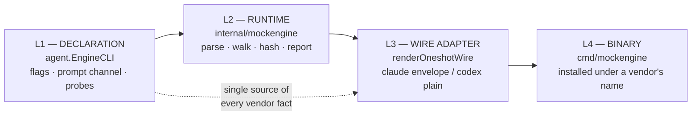

# `mockengine` — `internal/mockengine`

`internal/mockengine` is the **backend-agnostic runtime of a fake vendor CLI**. It
reads the prompt off the channel L1 (`agent.EngineCLI`) declares, walks L1's declared
context-surface probes, hashes what it finds, and emits a machine-readable discovery
report — so a test asserts on **evidence** ("here are the bytes I received, and
where") rather than **existence** ("a turn happened").

It is **not a registered backend** and nothing in production imports it. Do not
confuse it with the registered in-process `"mock"` backend
(`internal/lm/backends/registry.go:443`, `backends.NewMock` / `MockConfig`), which is
a different thing.

## Layering

The layering is real and observed: **L2 restates none of L1's per-vendor knowledge.**
Flags, prompt channel and probe set all come from `agent.EngineCLI`; a fake carrying
its own copy would drift out of step with the driver.

## Why it exists

The mock is installed **under a vendor's name** — via an oneshot config's
`binary_path`, or a `COPY` over the resolved binary in a fixture image — so a real
spawn path is exercised end to end.

**What it proves**: that ctxloom's *context delivery* actually put bytes where the
engine looks. It is the direct instrument against ctxloom's characteristic
silent-no-op bug (exit 0, success message, zero bytes delivered).

**What a mock-only pass does NOT prove**: image runtime health — that the real vendor
binary is installed, authenticates, and runs. Both `doc.go:28-46` and
`container_docker_integration_test.go:8-20` state that residual boundary correctly.
Beyond it, the instrument has blind spots of exactly the shape it exists to detect;
see the divergences below.

## Exported surface

| Symbol | Location | Meaning |
|---|---|---|
| `Resolver` | `discovery.go:17` | Ambient facts a probe root resolves against: `Cwd`, `Home`, `Getenv` |
| `Resolver.getenv` | `discovery.go:26` | Nil-safe env read → `""` |
| `Walk` | `discovery.go:42` | Probes every declared surface in declaration order; **never errors** — absence is a record |
| `ProbeRecord` | `report.go:24` | One observation: declaration echo + resolution (`Root`, `Path`) + evidence (`Present`, `Size`, `SHA256`, `Entries`, `Head`) |
| `EntryRecord` | `report.go:70` | One file inside a directory surface: `Name`, `Size`, `SHA256` |
| `Report` | `report.go:79` | The full answer: `Engine`, `Surface`, `Records`, `PromptSHA256`/`PromptSize`/`PromptHead`, `DiscoveryDigest` |
| `BuildReport` | `report.go:139` | Assembles records + prompt, fills both hashes |
| `Report.Record` / `Report.Marshal` | `report.go:153` / `:172` | First record of a kind (test-only); `json.MarshalIndent` |
| `ExtractReport` | `report.go:177` | Pulls the marker-bracketed JSON out of a stream |
| `ReportBegin` / `ReportEnd` | `report.go` | Bind writer `emitReport` to reader `ExtractReport` **by name** |
| `Outcome` | `sentinel.go:42` | `{ExitCode int, Response string}` |
| `Dispatch` | `sentinel.go:50` | Prompt sentinels + env knobs → `Outcome` |
| `SentinelFail` / `SentinelEcho` | `sentinel.go:17` / `:20` | `CTXLOOM_MOCK_FAIL` (exit 7) / `CTXLOOM_MOCK_ECHO:` |
| `EnvExitCode` / `EnvResponse` / `EnvReportFile` | `sentinel.go:31` / `:33` / `:37` | `CTXLOOM_MOCK_EXIT_CODE`, `CTXLOOM_MOCK_RESPONSE`, `CTXLOOM_MOCK_REPORT_FILE` |
| `Runtime` | `runtime.go:17` | The L2 orchestrator: `CLI`, `Argv`, `Res`, `Getenv`, `Stdin`/`Stdout`/`Stderr`. **No constructor** |
| `Runtime.Run` | `runtime.go:47` | The whole pipeline; emits the report **before** the sentinel can fail the run |
| `Runtime.readPrompt` | `runtime.go:67` | Reads the prompt off L1's declared channel (stdin vs trailing positional) |
| `Runtime.emitReport` | `runtime.go:87` | Marker-bracketed report to stderr + optional file |
| `Runtime.render` | `runtime.go:108` | Routes the outcome to the surface's wire format |
| `renderOneshotWire` | `oneshot.go:38` | **Per-engine oneshot wire dispatch**; an unknown engine is a LOUD error |
| `renderClaudeOneshot` / `claudeJSONEnvelope` | `oneshot_claude.go:71` / `:41` | claude's `-p --output-format json` `{result, modelUsage}` envelope |
| `renderCodexOneshot` | `oneshot_codex.go:25` | codex: plain text, **no envelope** |
| `oneshotWantsJSON` / `oneshotModel` / `tokenEstimate` | `oneshot_claude.go:53` / `:60` / `:96` | `--output-format json` presence; `--model` value; deterministic byte→token stand-in |

## Personality dispatch and wire adapters

**Stage 1 — personality selection** (`cmd/mockengine/main.go:44-76`). The mock
consumes its OWN leading flags first, because ctxloom prepends a config `args:`
block, and stops at the first non-mock token or `--`:

- `--claude` / `--claude-code` → `"claude-code"`
- `--codex` → `"codex"`
- `--personality <name>`, `--surface <name>`
- fallback `MOCKENGINE_PERSONALITY` (`main.go:29`) — the clean channel when a config `env:` block installs the mock and the driver owns the argv

A missing personality is exit 2 (`main.go:77-80`). The name is deliberately
vendor-**neutral** because the binary is installed under a vendor's name
(`main.go:1-15`).

Resolution then runs `backends.EngineCLIsFor(personality)` (`main.go:83`, seam at
`internal/lm/backends/enginecli.go:24-37`) and `agent.EngineCLIFor(clis, surface)`
(`main.go:88`). The vendor argv is parsed against L1's declared grammar with
`cli.ParseArgv(vendorArgs)` — **an undeclared flag is a LOUD error, exit 2**
(`main.go:98-104`).

**Stage 2 — wire dispatch** at render time, on `r.CLI.Engine` inside
`renderOneshotWire` (`oneshot.go:38`). Exactly two adapters exist:

| Engine | Adapter | Shape |
|---|---|---|
| `claude-code` | `renderClaudeOneshot` (`oneshot_claude.go:71`) | Plain text, or the `{result, modelUsage}` JSON envelope when `--output-format json` is present (`oneshotWantsJSON`, `:53` — which names claude's SkipSetup signal). Mirrored by `claudeJSONEnvelope`/`claudeModelToks` (`:41`, `:46`) — the one place a mock-side restatement of a vendor fact is justified, because a process boundary sits between them, and the file argues the case explicitly |
| `codex` | `renderCodexOneshot` (`oneshot_codex.go:25`) | Plain text, **no envelope**. Its *existence* is the assertion (`runtime_test.go:190`) |
| anything else | — | **LOUD error**, explicitly rather than falling through to claude's shape (`oneshot.go:44-45`) |

There is **no opencode / kiro / antigravity / acp adapter**: those backends do not
implement `EngineCLIProvider` — only `internal/claude/enginecli.go:172` and
`internal/codex/enginecli.go:167` do — so `EngineCLIsFor` reports a loud miss.

## Conformance tests riding on it

| Test | Location |
|---|---|
| `TestMockEngineContainer_DiscoversDeliveredSurfaces` | `container_docker_integration_test.go:118` (claude; `--print --output-format json --model`, prompt on stdin) |
| `TestMockEngineContainer_CodexDiscoversDeliveredSurfaces` | `container_docker_integration_test.go:281` |
| `TestRuntime_OneshotJSONEnvelopeUnderSkipSetup` | `runtime_test.go:72` |
| `TestRuntime_OneshotPlainWithoutJSONFlag` | `runtime_test.go:93` |
| `TestRuntime_CodexOneshotIsPlainTextNotEnvelope` | `runtime_test.go:160` |
| `TestRuntime_CodexWireIndependentOfClaudeOutputFormat` | `runtime_test.go:190` |
| `TestRuntime_FailSentinelExitsNonzero` | `runtime_test.go:224` |
| `TestRuntime_PromptHashMatchesReceivedBytes` | `runtime_test.go:238` |
| `TestReport_DigestExcludesAbsolutePaths` | `runtime_test.go:253` |
| `TestRuntime_UndeclaredFlagIsLoud` | `runtime_test.go:272` |
| `TestWalk_AbsentSurfaceIsPresentFalse` | `discovery_test.go:40` |

The container tests build `FROM alpine:latest` with
`COPY mockengine /usr/local/bin/mockengine`
(`container_docker_integration_test.go:74-83`) and run under build tag
`//go:build docker_integration` with the shared `dockergate.RequireRuntime` gate
(`:54-58`); a bare `t.Skip` is banned in docker-gated files by
`_check-docker-skip-gate`.

## Capabilities

Most rows are "not applicable" — recorded so the matrix is complete.

| Capability | Answer |
|---|---|
| Backend id | **none — not a registered backend.** Personality names borrow registry names (`claude-code`, `codex`) |
| Permission handling | **none.** Permission flags are name-validated by `ParseArgv` and otherwise inert. `EnforcesReadOnlyPlan` returns `false` for any unregistered name (`registry.go:148-150`, pinned at `capabilities_test.go:31`); `CollapsePlanIfUnenforced` is not applicable |
| Deny list | **none** — there are no tools; the mock never executes anything |
| Context surface | **its entire purpose.** `Walk` (`discovery.go:42`) walks L1's declared probes and `probeOne` (`:51`) resolves each root by scope — `ScopeCwd` → `Res.Cwd`; `ScopeHome` → `Res.Home`; `ScopeEnvDir` → `res.getenv(p.EnvVar)` with a `filepath.Join(res.Home, p.EnvHomeDefault)` fallback (`:70-76`); `ScopeFlagValue` → `probeFlagValue` (`:89`) with an `inlineJSON` literal-vs-path discriminator (`:115`). `observePath` (`:129`) stats and hashes a file, or hashes a directory via `hashDir` (`:164`, recursive, name-sorted, per-file hash) |
| MCP | **none.** MCP config files are observable only as declared probe surfaces — bytes on disk, never a protocol |
| Command / skill export | **none.** Those directories can appear only as declared probe surfaces |
| One-shot / resume | **Oneshot only** — `surface := agent.CLISurfaceOneshot` is hard-coded (`main.go:39`). No session or resume concept at all; every launch is independent |
| Transcript | **none.** It produces a discovery `Report`, not a transcript. Emitted as marker-bracketed JSON on **stderr**, plus optionally to `CTXLOOM_MOCK_REPORT_FILE` (`runtime.go:87-99`) — robust when stdout/stderr are noisy or when the report must cross a mounted-workspace boundary |
| Model + auth | **none.** No provider, no network, no credentials. `--model`'s value is echoed back only inside claude's fake envelope; token counts are the deterministic `tokenEstimate` stand-in (floor 1) |
| Isolation | Yes, as the *subject* rather than the driver — see the container tests above. **No container-auth concern**, since no credentials exist |
| Status | Test infrastructure, not a shipped engine. Absent from any user-facing engine list |

## Invariants

1. **The mock never restates vendor knowledge** — flags, prompt channel and probe set all come from L1 (`internal/shared/agent/enginecli.go:23-28`).
2. **An undeclared flag is a LOUD error** (`main.go:98-104`), mirroring the driver's own anti-drift test.
3. **An unknown engine at the wire seam is a LOUD error, never a fall-through** (`oneshot.go:44-45`).
4. **Sentinels match on SUBSTRING, never equality** (`sentinel.go:8-13`) — ctxloom prepends composed context, so an equality check would never fire.
5. **The report is emitted BEFORE the sentinel can fail the run** (`runtime.go:47-56`), so evidence survives a failing turn.
6. **`DiscoveryDigest` excludes machine-specific paths** — `Root`/`Path` are omitted from `canonicalRendering` (`report.go:125-135`) so the digest is portable across machines and containers. Pinned by `runtime_test.go:253`.
7. **`ProbeRecord.SHA256` is empty when `Present` is false** (`report.go:54`) — the documented absence convention.
8. **Absence is a first-class record, not an error** — `Walk` never errors, by design.
9. **Env knobs override prompt sentinels** (`sentinel.go:48-49`) — a test that owns the child's env is making a deliberate request.
10. **Deterministic reproducibility** — `tokenEstimate` (`oneshot_claude.go:96`), name-sorted `hashDir` (`discovery.go:164`), stable `canonicalEntries` (`discovery.go:190`).

Depended on but **not** enforced: correct `Runtime` construction (7 exported fields,
no constructor), and `EngineCLI.Validate()` having been run.

## Divergences from documented or implied behavior

These matter more than usual: a blind spot in the instrument is invisible in
everything the instrument certifies.

- **Flag NAMES are validated; values, required flags, and declared mutual exclusions are not.** `ParseArgv` checks only "is this name declared" plus "does a value token follow", so `--sandbox nonsense` and codex's mutually-exclusive bypass+sandbox pair both parse cleanly and run green — argv lines the real binaries reject with exit 2. The declarations state the constraints (`internal/codex/enginecli.go:93`, `:95`; `internal/claude/enginecli.go:115`).
- **A MISSING flag is invisible.** The surface is chosen out-of-band (`main.go:39` hard-codes oneshot; `--surface` has zero callers), so a driver that stopped emitting `--print` while still piping stdin produces an **identical, fully green** report — while hanging the real `claude` on a terminal handshake.
- **`PromptSHA256` is never empty.** A nil prompt hashes to `e3b0c442…` (`report.go:144`), so "no prompt delivered" is indistinguishable from "prompt delivered" in the one field that exists to prove delivery. The neighbouring `ProbeRecord.SHA256` documents the opposite convention. `runtime_test.go:230` asserts `rep.PromptSHA256 != ""` — an assertion that can never fail.
- **`ScopeEnvDir` silently falls back to the real `$HOME`** (`discovery.go:70-76`), so a run where ctxloom never set `CODEX_HOME` reads the developer's own `~/.codex/config.toml` and reports `present:true` for a surface ctxloom never delivered. `Root` would reveal it, but `Root` is deliberately excluded from the digest, and no `Note` records the fallback.
- **The declared environment contract is never verified.** `rg 'SetEnv|StripEnv' internal/mockengine cmd/mockengine` returns **0 hits**, and `Report` has no env section. `SetEnv`/`StripEnv` exist precisely because "a strip that silently stopped happening is otherwise invisible" (`internal/shared/agent/enginecli.go:236-238`). A run where ctxloom stopped setting `CTXLOOM_CONTEXT_FILE` reports identically to one where it did.
- **Every `os.Stat` error flattens to `Present=false`** (`discovery.go:131-134`) — EACCES, ENOTDIR and ELOOP read exactly like "not delivered" — while the sibling read-failure path twelve lines later *does* note the error (`:150`).
- **`hashDir` discards the walk error and emits unreadable files as entries with an empty `SHA256`** (`discovery.go:166`, `:176-181`), so an unreadable file looks like a successfully observed one. `EntryRecord` has no error field.
- **`canonicalRendering` excludes `Note`** (`report.go:125-135`), so "could not be resolved", "resolved and found nothing", and "unknown probe scope" collapse to one digest — the value tests are told to assert cannot distinguish them.
- **`EngineCLI.Validate()` is never called on the mock path** (`rg '\.Validate()'` → 0 hits), though `internal/shared/agent/enginecli.go:273-278` says it exists so a malformed declaration fails at its own test rather than producing a mysteriously wrong parse downstream. `probeFlagValue`'s `flag, _ := cli.LookupFlag` (`:97`) is safe only *because* Validate would have caught it. Relatedly, `discovery.go:78` overwrites the declaration's own `Note` with a bare assignment, unlike all four other note writes which use `joinNote`.
- **A malformed `CTXLOOM_MOCK_EXIT_CODE` is silently ignored** (`sentinel.go:68-72`) — `err != nil` has no branch, so `=one` yields exit 0 with no diagnostic. The fault-injection channel degrades to "success" on a typo.
- **An intentionally EMPTY response cannot be requested** — `if v := getenv(EnvResponse); v != ""` (`sentinel.go:65-67`) makes "set to empty" indistinguishable from unset, and `Dispatch` always seeds `"mock-engine: ok"` (`:55`). The one knob that would let a test prove ctxloom surfaces a zero-byte reply is unreachable, in the codebase whose characteristic bug **is** the zero-byte reply.
- **Two env readers with opposite nil policies**: `Runtime.getenv` falls back to `os.Getenv` (`runtime.go:36-41`) while `Resolver.getenv` returns `""` (`discovery.go:26-31`). A `Runtime` built with a nil `Res.Getenv` probes `$HOME/.codex` while the sentinel knobs read the real process env — from one struct literal, with no error.
- **The interactive surface is unreachable dead weight** while its comment advertises a "deferred" capability; `render`'s `default` arm silently echoes for ANY unknown surface (`runtime.go:112-114`) — the exact fall-through `renderOneshotWire` explicitly refuses.
- **The container test hand-writes the vendor argv** (`container_docker_integration_test.go:136`, `:299`) under the comment "the argv mirrors what claude's buildArgs emits under SkipSetup", so the mock constrains the **declaration**, not the **driver** — the very drift the package doc says a fake must never permit. `rg buildArgs internal/mockengine` → 0 hits.
- **Report-emission failure does not affect the exit code** (`runtime.go:87-99`, `:53`) — the instrument can exit 0 having delivered zero evidence. Both current readers do fail loudly, so this is latent.
- **`ExtractReport`'s doc names a caller that does not exist** (`report.go:174-177`): it claims the container test shares it, but that test reads `report.json` and unmarshals directly (`:159-166`), so the marker channel is never exercised in a container.
- **`head` is documented as a "printable prefix" but does no printability filtering and slices at a fixed byte offset** (`report.go:104-110`), so it can split a UTF-8 rune and carry raw control bytes; `json.Marshal` substitutes U+FFFD, making the corruption silent.
- **Inconsistent nil-writer handling** — `Stdin` is guarded, `Stdout`/`Stderr` are not (`runtime.go:69-71` vs `:90`, `:93`, `:113`), so a partially-constructed `Runtime` panics rather than degrading.
- Also: `Report.Record` is test-only (`report.go:153`); `BuildReport(engine, surface string, …)` discards `agent.CLISurface`'s type (`report.go:139`); `ProbeRecord.Size` is overloaded — bytes, entry count, or inline-JSON byte length depending on `Dir`; `EngineCLI.Binary` is never read, so the mock never checks it was invoked as the binary it impersonates.

## See also

[Capability matrix](capability-matrix.md) · [Backend abstraction](backend-abstraction.md) · [Plugin wire](grpc-wire.md) · [Isolation](isolation.md)
