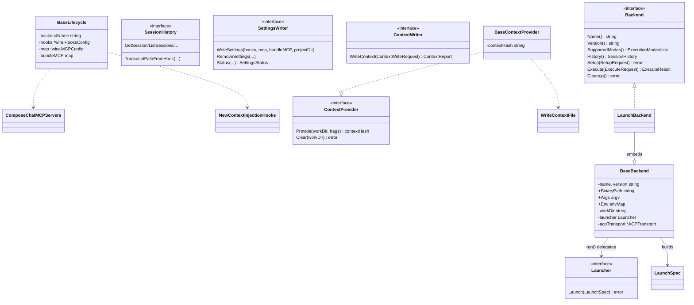

# agent — backend contract and base embeddables

`internal/shared/agent` is the engine-agnostic substrate: it declares what every LLM backend must implement (`Backend`, `ContextProvider`, `SessionHistory`, `SettingsWriter`, `ContextWriter`) and supplies the embeddable state every concrete engine reuses (`BaseBackend`, `BaseLifecycle`, `BaseContextProvider`). It owns the process-launch seam (`Launcher`/`LaunchSpec`), so `os/exec` and pty handling stay outside this package. It sits at the bottom of the import graph — 26 internal packages import it and it imports only `internal/paths`, `internal/selfexec`, `internal/shared/{clidiag,collections,iox,wire}`; nothing here reaches back up into config, bundles, or CLI.

## Core contracts

| Symbol | file:line | Purpose |
|---|---|---|
| `Backend` | `internal/shared/agent/backend.go:65` | The runner-facing contract: identity, supported modes, `History()`, and the Setup/Execute/Cleanup lifecycle. |
| `BackendConfig` | `internal/shared/agent/backend.go:22` | One-method discriminator interface for a decoded per-backend config block. |
| `ContextProvider` | `internal/shared/agent/backend.go:83` | Provide/Clear the assembled context; embedded by `HashedContext`. |
| `SessionHistory` | `internal/shared/agent/backend.go:95` | Transcript reads (`Get*`/`List*`) plus `TranscriptPathFromHook`, a pure path computation with no session state. |
| `SettingsWriter` | `internal/shared/agent/settings.go:14` | Write/remove/report an engine's managed hooks + MCP servers + statusline. Five implementations. |
| `ContextWriter` | `internal/shared/agent/settings.go:36` | Write assembled context to an engine's native on-disk surface. Deliberately a sibling interface, not an extension of `SettingsWriter` — engines without a native context surface simply do not implement it. |
| `Launcher` | `internal/shared/agent/base.go:42` | The process-execution seam; the only thing that turns a `LaunchSpec` into a child process. |

## Request / result value types

| Symbol | file:line | Purpose |
|---|---|---|
| `ExecutionMode` | `internal/shared/agent/backend.go:29` | interactive vs oneshot; values pinned `= 0` / `= 1` to mirror the proto enum. |
| `Fragment` | `internal/shared/agent/backend.go:40` | One piece of injectable context (`Name`, `Version`, `Tags`, `Content`, `Installation`, `IsDistilled`, `DistilledBy`). |
| `ModelInfo` | `internal/shared/agent/backend.go:51` | Provenance for the executed model (name/version/provider); populated by every backend's `Execute`. |
| `SetupRequest` | `internal/shared/agent/backend.go:324` | Everything `Setup` needs: `WorkDir`, `Fragments`, `Env`, `Verbosity`, `Managed`, `CellKind`. |
| `ManagedConfig` | `internal/shared/agent/backend.go:348` | The host-assembled setup payload: `Commands`, `Skills`, `Hooks`, `MCP`, `BundleMCP`, `ManageStatusline`, `DenyTools`. |
| `ExecuteRequest` | `internal/shared/agent/backend.go:366` | Runtime parameters for one execution. |
| `ExecuteResult` | `internal/shared/agent/backend.go:400` | Outcome of one execution. |
| `LaunchSpec` | `internal/shared/agent/base.go:16` | Fully-resolved process launch description handed to a `Launcher`. |
| `WindowSize` | `internal/shared/agent/base.go:26` | Terminal dimensions carried on a `LaunchSpec`. |
| `ContextWriteRequest` | `internal/shared/agent/settings.go:47` | `{ProjectDir, Context}` parameter object for `WriteContext` (a struct for signature stability). |
| `ContextReport` | `internal/shared/agent/settings.go:54` | `{Wrote, Removed []string}` relative paths a `WriteContext` touched. |
| `SettingsStatus` | `internal/shared/agent/settings.go:61` | `{SettingsExists, HooksPresent, StatusLine, MCPPresent}` — which managed artifacts are wired. |

## Base embeddables

| Symbol | file:line | Purpose |
|---|---|---|
| `BaseBackend` | `internal/shared/agent/base.go:46` | Embedded identity + launch state every concrete backend reuses; also carries the `ACPTransport` declaration (parked here only to avoid an import cycle). |
| `NewBaseBackend` | `internal/shared/agent/base.go:83` | The only constructor that guarantees non-nil `Args` and `Env` maps. |
| `BaseBackend.SetLauncher` | `internal/shared/agent/base.go:59` | Injects the launcher. |
| `BaseBackend.SetACPTransport` / `.ACPTransport` | `internal/shared/agent/base.go:71` / `:78` | Write/read half of the ACP transport declaration seam. |
| `BaseBackend.Name` / `.Version` | `internal/shared/agent/base.go:93` / `:98` | Identity getters satisfying `Backend`. |
| `BaseBackend.GetBinaryPath` | `internal/shared/agent/base.go:105` | Satisfies `backends.BinaryPathProvider`. |
| `BaseBackend.SupportedModes` | `internal/shared/agent/base.go:110` | Returns both execution modes. |
| `BaseBackend.WorkDir` / `.SetWorkDir` | `internal/shared/agent/base.go:115` / `:123` | Work-dir accessors; the getter defaults to `"."`. |
| `BaseBackend.BuildEnv` | `internal/shared/agent/base.go:128` | `os.Environ()` + backend env + request env, appended in that order. |
| `BaseBackend.RunInteractive` / `.RunNonInteractive` | `internal/shared/agent/base.go:142` / `:149` | Named entry points that call `run` with/without a pty. |
| `BaseBackend.run` | `internal/shared/agent/base.go:155` | Builds the `LaunchSpec` and calls the launcher; fails loud (exit 1) if no launcher was injected. |
| `BaseLifecycle` | `internal/shared/agent/base_lifecycle.go:12` | Folds a host-assembled `ManagedConfig` into merged hook/MCP state that `Setup` reads back. |
| `NewBaseLifecycle` | `internal/shared/agent/base_lifecycle.go:20` | Constructor; binds the backend name used by `ChatMCPServers`. |
| `BaseLifecycle.MergeManaged` | `internal/shared/agent/base_lifecycle.go:39` | Merges the payload and appends the context-injection hook. |
| `BaseLifecycle.GetHooks` / `.GetMCP` | `internal/shared/agent/base_lifecycle.go:95` / `:100` | Read half of the merge; both return nil before `MergeManaged` runs. |
| `BaseLifecycle.ChatMCPServers` | `internal/shared/agent/base_lifecycle.go:90` | Delegates to `ComposeChatMCPServers`, binding the backend name. |
| `BaseContextProvider` | `internal/shared/agent/base_context.go:10` | Hash-keyed context-file lifecycle for the hook/file engines. |
| `NewBaseContextProvider` | `internal/shared/agent/base_context.go:15` | Zero-value constructor. |
| `BaseContextProvider.Provide` | `internal/shared/agent/base_context.go:20` | Writes the context file and records its hash. |
| `BaseContextProvider.Clear` | `internal/shared/agent/base_context.go:30` | Removes the context file and clears the hash. |
| `BaseContextProvider.GetContextHash` | `internal/shared/agent/base_context.go:40` | Getter satisfying `HashedContext`. |
| `BaseContextProvider.GetContextFilePath` | `internal/shared/agent/base_context.go:45` | Recomputes the relative path from the hash. |

## Cross-cutting value types

| Symbol | file:line | Purpose |
|---|---|---|
| `PermissionMode` | `internal/shared/agent/permissions.go:15` | Generalized launch-time permission posture (default / acceptEdits / plan / bypass). Referenced by 50+ files. |
| `PermissionMode.String` | `internal/shared/agent/permissions.go:36` | Canonical wire spelling. |
| `PermissionMode.AllowsWithoutPrompt` | `internal/shared/agent/permissions.go:53` | True only for `PermissionBypass`. |
| `ParsePermissionMode` | `internal/shared/agent/permissions.go:61` | Lenient string → mode with an `ok` bool distinguishing unset from explicit-default. |
| `PermissionModeNames` | `internal/shared/agent/permissions.go:78` | The four CLI spellings, for flag help/completion. |
| `WireMode` | `internal/shared/agent/permissions.go:86` | `ParsePermissionMode` with `ok` discarded — the deliberate fail-safe-default policy. |
| `ResolveDefault` | `internal/shared/agent/permissions.go:98` | First parseable of the layered sources, else the claude-code bypass stopgap. |
| `PermissionMode.CollapsePlanIfUnenforced` | `internal/shared/agent/permissions.go:116` | Downgrades `plan` → `default` when the engine cannot enforce plan mode. |
| `PermissionMode.SafeHeadless` | `internal/shared/agent/permissions.go:127` | Whether this posture can run with no human present. |
| `ThinkingLevel` | `internal/shared/agent/thinking.go:22` | Normalized four-tier reasoning-budget enum handed to each backend's chat path. |
| `ThinkingLevel.String` | `internal/shared/agent/thinking.go:45` | Canonical spelling (`off`/`low`/`medium`/`high`). |
| `ParseThinkingLevel` | `internal/shared/agent/thinking.go:63` | Lenient string → enum with an `ok` bool. |
| `ThinkingLevelNames` | `internal/shared/agent/thinking.go:81` | The four spellings, for warning text. |
| `ApplyLocalCLIConfig` | `internal/shared/agent/localcli.go:9` | Applies per-backend binary/args/env overrides onto a `BaseBackend`. |
| `GetPromptContent` | `internal/shared/agent/base.go:185` | Nil-safe read of a prompt field; the nil guard is the whole point (7 call sites). |
| `IsManaged` | `internal/shared/agent/predicate.go:13` | Ownership test — is this command line one ctxloom installed, by exec-token identity. |

## Invariants and contracts

- **Setup → Execute → Cleanup.** `Backend` carries connascence of execution order with no type-level enforcement. Nothing prevents `Execute` before `Setup`.
- **`SetLauncher` must precede any run.** `BaseBackend.run` (`base.go:155`) fails loud and exits 1 when no launcher was injected — this is the enforcement point, not a nil check at construction.
- **`NewBaseBackend` is the only safe constructor.** It initializes `Args` and `Env` to non-nil (`base.go:88`). A zero-value `BaseBackend` passed to `ApplyLocalCLIConfig` panics on assignment into a nil `Env` map — real behaviour, not documented.
- **`BaseBackend.WorkDir()` returns `"."` when unset**, so callers never see an empty work dir.
- **`BuildEnv` appends rather than overrides.** Duplicate keys are emitted and correctness relies on `os/exec`'s last-wins semantics.
- **`MergeManaged` must be called before `GetHooks`/`GetMCP`.** Both return nil until then. A nil `ManagedConfig` makes `MergeManaged` return silently.
- **`Provide` must be called before `GetContextHash`/`GetContextFilePath`.** Both return `""` beforehand.
- **`BaseContextProvider` re-derives the context-file path** as `SCMContextSubdir + hash + ".md"` (`base_context.go:32`, `:49`) rather than asking `WriteContextFile` — the naming scheme lives in two places and must be changed in both.
- **`Clear` always returns nil and always clears `contextHash`** even when the removal failed — the `error` return is decorative and the hash needed to retry is discarded. Diverges from the `ContextProvider.Clear(workDir) error` signature's implied contract.
- **`ExecutionMode` values are pinned to the proto enum** (`= 0`, `= 1`); the pin is not documented at the constant site.
- **Only `Fragment.Content` is ever read** anywhere in the system (`base.go:175`, `contextfile.go:92`, `codex/surfaces.go:313`). `Installation` is never populated — the grpc converter omits it entirely.
- **`ThinkingLevel` is NOT monotonic in effort.** The iota order is `Medium = 0`, then `Off`, `Low`, `High`. Ordered comparisons (`level > ThinkingLow`) are meaningless; every consumer switches on the value.
- **`PermissionMode.String()`'s `default:` arm returns `"default"`**, so an out-of-range or corrupted wire value renders as an intentional posture. `PermissionDefault` has no explicit case.
- **Three hand-maintained parallel tables** describe `PermissionMode` (`String` at `:36`, `ParsePermissionMode` at `:61`, `PermissionModeNames` at `:78`) with no compile-time link; likewise `ThinkingLevel` (`:45`, `:63`, `:81`).
- **`SettingsStatus.Wired()`** (`settings.go:69`) is reachable only from tests; production reads the four booleans directly.
- **`SkillExport.Description`** (`skillexport.go:22`) is written by the loader and read by no engine.
