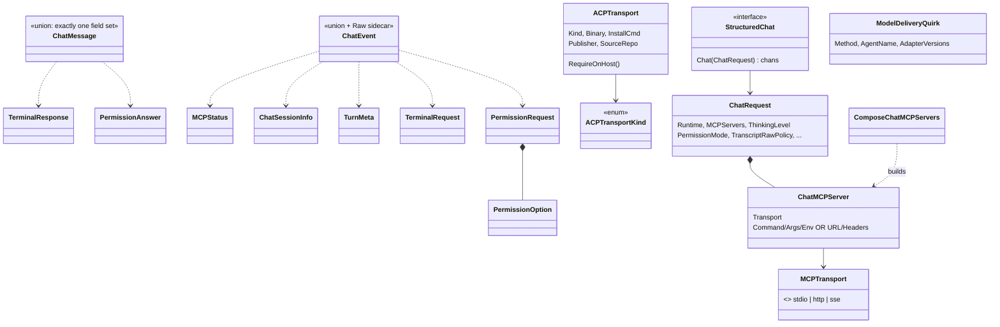

# agent — structured chat contract and IR

`StructuredChat` is the optional multi-turn chat capability a backend may implement, discovered by type assertion rather than declared on `Backend`. This page covers the request/event union types that cross that seam, the per-engine `ACPTransport` declaration that says how structured chat reaches an ACP process, and `ComposeChatMCPServers` — the one place a chat run's MCP server set is assembled. The channel-ownership contract on `StructuredChat.Chat` (who closes what, when it returns) is the load-bearing part of this seam.

## Types

| Symbol | file:line | Purpose |
|---|---|---|
| `StructuredChat` | `internal/shared/agent/chat.go:20` | Optional capability interface for multi-turn structured chat; discovered by type assertion on a `Backend`. |
| `ChatRequest` | `internal/shared/agent/chat.go:37` | Configuration for one chat session (12 fields including `Runtime`, `MCPServers`, `TranscriptRawPolicy`). |
| `ModelDeliveryQuirk` | `internal/shared/agent/chat.go:126` | Version-scoped escape hatch for claude-code-acp 0.16.2's model-delivery defect; populated at `internal/claude/chat.go:84`, executed at `internal/acp/session.go:456`. |
| `ACPTransportKind` | `internal/shared/agent/chat.go:156` | How structured chat reaches an ACP process (native vs adapter). |
| `ACPTransport` | `internal/shared/agent/chat.go:176` | The per-engine declaration: `Kind`, `Binary`, `InstallCmd` plus `Publisher`/`SourceRepo` supply-chain provenance. |
| `MCPTransport` | `internal/shared/agent/chat.go:231` | stdio vs http vs sse. |
| `ChatMCPServer` | `internal/shared/agent/chat.go:252` | One MCP server entry for a chat run. |
| `ChatMessage` | `internal/shared/agent/chat.go:274` | The inbound (host → engine) union. |
| `ChatEvent` | `internal/shared/agent/chat.go:309` | The outbound (engine → host) union, plus a `Raw` sidecar field explicitly outside the union. |
| `PermissionRequest` | `internal/shared/agent/chat.go:351` | An engine's request for a permission decision, correlated by `ID`. |
| `PermissionOption` | `internal/shared/agent/chat.go:377` | One selectable option on a permission request. |
| `PermissionAnswer` | `internal/shared/agent/chat.go:386` | The host's decision, correlated back by `ID`. |
| `TerminalRequest` | `internal/shared/agent/chat.go:421` | An engine's request to run a terminal command. |
| `TerminalResponse` | `internal/shared/agent/chat.go:435` | The result, correlated by `ID`. |
| `TurnMeta` | `internal/shared/agent/chat.go:444` | Per-turn completion metadata. |
| `ChatSessionInfo` | `internal/shared/agent/chat.go:460` | Session identity/resume information emitted by the engine. |
| `MCPStatus` | `internal/shared/agent/chat.go:485` | Per-server MCP connection status reported into the chat stream. |

## Functions

| Symbol | file:line | Purpose |
|---|---|---|
| `ACPTransport.RequireOnHost` | `internal/shared/agent/chat.go:211` | `LookPath` gate for adapter engines; exempt under container runtime. Errors name the engine, the binary, and the exact install command. |
| `ComposeChatMCPServers` | `internal/shared/agent/chat_mcp.go:28` | Merges the ctxloom server + bundle MCP + config MCP + plugin MCP, minus an `existing` set, sorted by name. |
| `ManagedConfig.ChatMCPServers` | `internal/shared/agent/chat_mcp.go:70` | Nil-safe delegate to `ComposeChatMCPServers`; the nil-receiver guard is the point. |

Callers of `ComposeChatMCPServers`: `internal/agentcoord/spawner.go:511` (delegated children), `internal/.../engine_session.go:510` (ACP sessions), and `BaseLifecycle.ChatMCPServers` (`base_lifecycle.go:91`).

## Invariants and contracts

- **`StructuredChat.Chat` owns a precise channel contract** — which side closes which channel and when `Chat` returns. This is documented on the interface and is the only place it is stated.
- **Permissions never ride `ChatEvent.Raw`.** This is a security invariant guaranteed structurally (permissions are a separate typed event), not by filtering `Raw`.
- **`ChatMessage` and `ChatEvent` are "exactly one field set" unions**, enforced by prose. `ChatEvent.Raw` is deliberately outside that union.
- **`ChatMCPServer`'s field sets are mutually exclusive and unvalidated**: `{Command, Args, Env}` for `stdio`, `{URL, Headers}` for `http`/`sse`, discriminated by `Transport`.
- **Request/answer pairs correlate by `ID`** — `PermissionRequest`↔`PermissionAnswer` and `TerminalRequest`↔`TerminalResponse` both use the same discipline.
- **`ComposeChatMCPServers` returns `nil` for "no managed payload"**, and by its own contract that case includes *config load failed* — a failed config load is indistinguishable from "nothing configured" and yields a chat with zero ctxloom MCP tools.
- **`ComposeChatMCPServers` hardcodes `CtxloomCommand()`** (the host self-exec absolute path) at `chat_mcp.go:39` and takes no override parameter. This diverges from `ResolveMCPCommand`'s documented claim that *every* MCP-surface writer resolves through it — the four file-surface backends do (`claude/surfaces.go:301`, `codex/surfaces.go:315`, `kiro/surfaces.go:222`, `antigravity/surfaces.go:216`); the chat path does not.
- **`ChatRequest.TranscriptRawPolicy` is a capture-layer setting**, wired end to end structurally (`lm/grpc/chat.go`, `coord/enginehost.go:298`) but never populated from user config; no backend implementation reads it.
- **`ACPTransport.Publisher`/`SourceRepo` are declaration-only** — a deliberate supply-chain record with no code reader.
- **`ModelDeliveryQuirk` is version-scoped by contract**: `AdapterVersions` bounds the workaround and states its removal condition.
- **Doc rot:** comments at `chat_mcp.go:27` and in `base_lifecycle.go` point at `BaseLifecycle.Flush`, which does not exist anywhere in the repo. The behaviour they describe is `MergeManaged`'s nil-payload early return.
