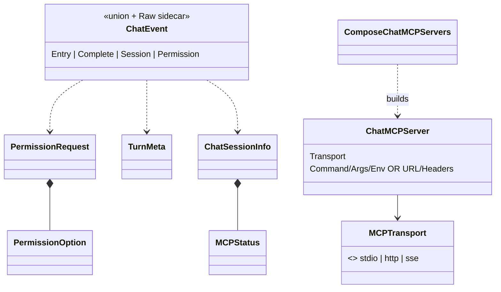

# agent — structured event IR and chat MCP servers

A structured turn is driven per turn through the engine instance's driver (`engine.Instance.Drivers()[0].Turn`): one engine process per turn, its native events relayed as `engine.Event` payloads that decode to `agent.ChatEvent`. There is no mid-turn control channel; a permission request is settled by the launch's permission mode. This page covers the event IR the runner and the transcript consume, and `ComposeChatMCPServers` — the one place a structured run's MCP server set is assembled.

```mermaid
classDiagram
    class ChatEvent {
        <<union + Raw sidecar>>
        Entry | Complete | Session | Permission
    }
    class PermissionRequest
    class PermissionOption
    class TurnMeta
    class ChatSessionInfo
    class MCPStatus
    class ChatMCPServer {
        Transport
        Command/Args/Env  OR  URL/Headers
    }
    class MCPTransport {
        <<enum>> stdio | http | sse
    }

    ChatEvent ..> PermissionRequest
    ChatEvent ..> TurnMeta
    ChatEvent ..> ChatSessionInfo
    ChatSessionInfo *-- MCPStatus
    PermissionRequest *-- PermissionOption
    ChatMCPServer --> MCPTransport
    ComposeChatMCPServers ..> ChatMCPServer : builds
```

## Invariants and contracts

- **`ChatEvent` is an "exactly one field set" union**, enforced by prose (`ChatEvent.Kind` names the port-level kind a driver relays). `ChatEvent.Raw` is deliberately outside that union.
- **Permissions never ride `ChatEvent.Raw`.** A permission request is its own typed arm, which the transcript records as `KindPermission`; nothing answers it.
- **`TurnMeta`'s token and cost fields are session totals** as of the turn, not the turn's own consumption; `StopReason`, `DurationMs` and `Model` are per turn.
- **`ChatMCPServer`'s field sets are mutually exclusive and unvalidated**: `{Command, Args, Env}` for `stdio`, `{URL, Headers}` for `http`/`sse`, discriminated by `Transport`.
- **`ComposeChatMCPServers` maps the same bundle-shipped server set the file-surface writers reconcile** (`Config.ResolveBundleMCPServers`), so the structured path and the settings path cannot diverge; a name already in `existing` wins, and a nil set injects nothing.
- **`ManagedConfig.ChatMCPServers` is nil-safe**: a nil payload injects nothing.
