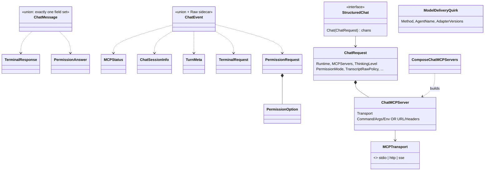

# agent — structured chat contract and IR

`StructuredChat` is the optional multi-turn chat capability a backend may implement, discovered by type assertion rather than declared on `Backend`. This page covers the request/event union types that cross that seam and `ComposeChatMCPServers` — the one place a chat run's MCP server set is assembled. The channel-ownership contract on `StructuredChat.Chat` (who closes what, when it returns) is the load-bearing part of this seam.

```mermaid
classDiagram
    class StructuredChat {
        <<interface>>
        Chat(ChatRequest) chans
    }
    class ChatRequest {
        Runtime, MCPServers, ThinkingLevel
        PermissionMode, TranscriptRawPolicy, ...
    }
    class ChatMessage {
        <<union: exactly one field set>>
    }
    class ChatEvent {
        <<union + Raw sidecar>>
    }
    class PermissionRequest
    class PermissionOption
    class PermissionAnswer
    class TerminalRequest
    class TerminalResponse
    class TurnMeta
    class ChatSessionInfo
    class MCPStatus
    class ChatMCPServer {
        Transport
        Command/Args/Env  OR  URL/Headers
    }
    class MCPTransport {
        <<enum>> stdio | http | sse
    }
    class ModelDeliveryQuirk {
        Method, AgentName, AdapterVersions
    }

    StructuredChat --> ChatRequest
    ChatRequest *-- ChatMCPServer
    ChatMCPServer --> MCPTransport
    ChatEvent ..> PermissionRequest
    ChatEvent ..> TerminalRequest
    ChatEvent ..> TurnMeta
    ChatEvent ..> ChatSessionInfo
    ChatEvent ..> MCPStatus
    ChatMessage ..> PermissionAnswer
    ChatMessage ..> TerminalResponse
    PermissionRequest *-- PermissionOption
    ComposeChatMCPServers ..> ChatMCPServer : builds
```

## Types

| Symbol | file:line | Purpose |
|---|---|---|
| `StructuredChat` | `internal/core/agent/chat.go:20` | Optional capability interface for multi-turn structured chat; discovered by type assertion on a `Backend`. |
| `ChatRequest` | `internal/core/agent/chat.go:37` | Configuration for one chat session (12 fields including `Runtime`, `MCPServers`, `TranscriptRawPolicy`). |
| `ModelDeliveryQuirk` | `internal/core/agent/chat.go:117` | Version-scoped escape hatch for a model-delivery defect. Both its producer and its executor went with the ACP removal, so the type survives with **no reader**. |
| `MCPTransport` | `internal/core/agent/chat.go:231` | stdio vs http vs sse. |
| `ChatMCPServer` | `internal/core/agent/chat.go:252` | One MCP server entry for a chat run. |
| `ChatMessage` | `internal/core/agent/chat.go:274` | The inbound (host → engine) union. |
| `ChatEvent` | `internal/core/agent/chat.go:309` | The outbound (engine → host) union, plus a `Raw` sidecar field explicitly outside the union. |
| `PermissionRequest` | `internal/core/agent/chat.go:351` | An engine's request for a permission decision, correlated by `ID`. |
| `PermissionOption` | `internal/core/agent/chat.go:377` | One selectable option on a permission request. |
| `PermissionAnswer` | `internal/core/agent/chat.go:386` | The host's decision, correlated back by `ID`. |
| `TerminalRequest` | `internal/core/agent/chat.go:421` | An engine's request to run a terminal command. |
| `TerminalResponse` | `internal/core/agent/chat.go:435` | The result, correlated by `ID`. |
| `TurnMeta` | `internal/core/agent/chat.go:444` | Per-turn completion metadata. |
| `ChatSessionInfo` | `internal/core/agent/chat.go:460` | Session identity/resume information emitted by the engine. |
| `MCPStatus` | `internal/core/agent/chat.go:485` | Per-server MCP connection status reported into the chat stream. |

## Functions

| Symbol | file:line | Purpose |
|---|---|---|
| `ComposeChatMCPServers` | `internal/core/agent/chat_mcp.go:28` | Merges the ctxloom server + bundle MCP + config MCP + plugin MCP, minus an `existing` set, sorted by name. |
| `ManagedConfig.ChatMCPServers` | `internal/core/agent/chat_mcp.go:70` | Nil-safe delegate to `ComposeChatMCPServers`; the nil-receiver guard is the point. |

Callers of `ComposeChatMCPServers`: `internal/agentcoord/spawner.go:511` (delegated children) and `BaseLifecycle.ChatMCPServers` (`base_lifecycle.go:91`).

## Invariants and contracts

- **`StructuredChat.Chat` owns a precise channel contract** — which side closes which channel and when `Chat` returns. This is documented on the interface and is the only place it is stated.
- **Permissions never ride `ChatEvent.Raw`.** This is a security invariant guaranteed structurally (permissions are a separate typed event), not by filtering `Raw`.
- **`ChatMessage` and `ChatEvent` are "exactly one field set" unions**, enforced by prose. `ChatEvent.Raw` is deliberately outside that union.
- **`ChatMCPServer`'s field sets are mutually exclusive and unvalidated**: `{Command, Args, Env}` for `stdio`, `{URL, Headers}` for `http`/`sse`, discriminated by `Transport`.
- **Request/answer pairs correlate by `ID`** — `PermissionRequest`↔`PermissionAnswer` and `TerminalRequest`↔`TerminalResponse` both use the same discipline.
- **`ComposeChatMCPServers` returns `nil` for "no managed payload"**, and by its own contract that case includes *config load failed* — a failed config load is indistinguishable from "nothing configured" and yields a chat with zero ctxloom MCP tools.
- **`ComposeChatMCPServers` resolves ctxloom's own entry through `ResolveManagedMCPServers`**, exactly as the file-surface writers do, so the chat path and the settings path cannot name different commands. Both get `CtxloomCommand()` — the bare name, resolved on `PATH` wherever the child actually runs, including inside a container.
- **`ChatRequest.TranscriptRawPolicy` is a capture-layer setting**, wired end to end structurally (`lm/grpc/chat.go`, `coord/enginehost.go:298`) but never populated from user config; no backend implementation reads it.
- **`ModelDeliveryQuirk` is version-scoped by contract**: `AdapterVersions` bounds the workaround and states its removal condition.
- **Doc rot:** comments at `chat_mcp.go:27` and in `base_lifecycle.go` point at `BaseLifecycle.Flush`, which does not exist anywhere in the repo. The behaviour they describe is `MergeManaged`'s nil-payload early return.
