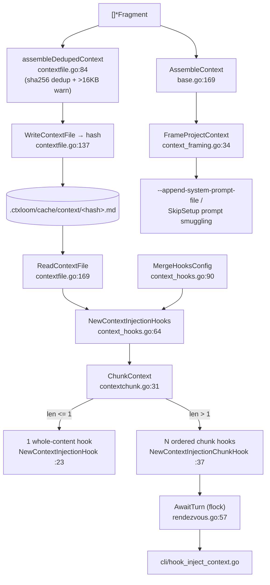

# agent — context assembly, chunking, and injection hooks

How assembled profile context actually reaches the model. Fragments are joined and deduplicated into a hash-named cache file (`.ctxloom/cache/context/<hash>.md`), then either framed into a system prompt or split into size-bounded chunks each delivered by its own SessionStart hook. The chunking exists because engine harnesses truncate large hook output to a ~2KB preview, and the flock rendezvous (`AwaitTurn`) exists because N chunk hooks run as N independent processes that must emit in order.

## Assembly and the context file

| Symbol | file:line | Purpose |
|---|---|---|
| `AssembleContext` | `internal/shared/agent/base.go:169` | Joins non-empty fragment contents. No dedup, no size warning. |
| `assembleDedupedContext` | `internal/shared/agent/contextfile.go:84` | Joins fragments, deduplicates by sha256 of content, warns above 16KB. |
| `WriteContextFile` | `internal/shared/agent/contextfile.go:137` | Writes the deduped context to `.ctxloom/cache/context/<hash>.md` and returns the hash. |
| `ReadContextFile` | `internal/shared/agent/contextfile.go:169` | Reads `<hash>.md` back. |
| `contextFileOptions` | `internal/shared/agent/contextfile.go:39` | Options bag: `{fs afero.Fs, stderr io.Writer}`. |
| `ContextFileOption` | `internal/shared/agent/contextfile.go:45` | Functional-option type; threaded cross-package by `internal/operations/hooks.go`. |
| `WithContextFS` | `internal/shared/agent/contextfile.go:49` | Injects the filesystem. |
| `WithContextStderr` | `internal/shared/agent/contextfile.go:57` | Redirects the warning sink (test-only in practice). |
| `applyContextOptions` | `internal/shared/agent/contextfile.go:64` | Applies options over the `OsFs` / `os.Stderr` defaults. |
| `FrameProjectContext` | `internal/shared/agent/context_framing.go:34` | Wraps assembled context in the ctxloom envelope for system-prompt delivery. |

## Chunking

| Symbol | file:line | Purpose |
|---|---|---|
| `ChunkContext` | `internal/shared/agent/contextchunk.go:31` | Splits context on section boundaries, each chunk under `ContextChunkMaxChars`. |
| `splitOversizedSection` | `internal/shared/agent/contextchunk.go:80` | Line-splits an over-cap section, never mid-line; warns loudly on an over-cap single line. |

## Injection hooks

| Symbol | file:line | Purpose |
|---|---|---|
| `NewContextInjectionHooks` | `internal/shared/agent/context_hooks.go:64` | Reads the context file and decides between one whole-content hook and N ordered chunk hooks. |
| `NewContextInjectionHook` | `internal/shared/agent/context_hooks.go:23` | Builds the single whole-content SessionStart hook. |
| `NewContextInjectionChunkHook` | `internal/shared/agent/context_hooks.go:37` | Builds hook *k* of *N*. |
| `absOrSelf` | `internal/shared/agent/context_hooks.go:49` | Absolutizes a path with fallback to the input — the engine may launch from a different cwd. |
| `shellSingleQuote` | `internal/shared/agent/context_hooks.go:82` | Single-quotes a value for `/bin/sh`; a path-injection security boundary. |
| `MergeHooksConfig` | `internal/shared/agent/context_hooks.go:90` | Appends `src`'s hook lists into `dest`. |
| `HookRoute` | `internal/shared/agent/hook_routes.go:12` | Maps one unified hook slice onto an engine-native event name, with a default matcher. |
| `RouteUnifiedHooks` | `internal/shared/agent/hook_routes.go:25` | Walks routes, applies default matchers, and emits; used by claude, codex, antigravity. |

## Chunk-ordering rendezvous

| Symbol | file:line | Purpose |
|---|---|---|
| `AwaitTurn` | `internal/shared/agent/rendezvous.go:57` | flock-based rendezvous so N chunk hooks in N processes exit in order. |
| `rendezvousDir` | `internal/shared/agent/rendezvous.go:89` | Per-session tempdir path. |
| `sweepStaleRendezvous` | `internal/shared/agent/rendezvous.go:106` | GCs rendezvous dirs older than one hour. |
| `sanitizeSessionID` | `internal/shared/agent/rendezvous.go:131` | Allowlists filename-safe runes; a path-injection guard. |
| `lockPath` | `internal/shared/agent/rendezvous.go:142` | `<dir>/l<n>.lock`. |
| `markerPath` | `internal/shared/agent/rendezvous.go:146` | `<dir>/started_<n>`. |
| `writeMarker` | `internal/shared/agent/rendezvous.go:150` | Publishes the started marker. |
| `waitFreshMarker` | `internal/shared/agent/rendezvous.go:156` | Polls for a recent predecessor marker, deadline-bounded. |
| `waitPredecessorExit` | `internal/shared/agent/rendezvous.go:169` | Polls until the predecessor's lock is free. |

## Invariants and contracts

- **`WriteContextFile` is the only writer of `.ctxloom/cache/context/<hash>.md`.** `BaseContextProvider.GetContextFilePath` independently re-derives that path from the hash rather than asking the writer, so the naming scheme exists in two places.
- **Two assemblers produce "the assembled context" and they diverge.** `assembleDedupedContext` deduplicates by content hash and emits the oversize warning; `AssembleContext` does neither. The doc at `contextfile.go:78-80` states the raw context file must not diverge from `AssembleContext`'s output — it does. The divergent output reaches production at `internal/lm/grpc/server.go:189` (the SkipSetup prompt-smuggling path) and `internal/lm/backends/mock.go:77`.
- **`WriteContextFile` returns `("", nil)` when the assembled content is empty** — a hash of `""` then means "no context" everywhere downstream, so `MergeManaged` skips the injection hook and `CTXLOOM_CONTEXT_FILE` is never set. Nothing distinguishes "no context configured" from "context assembly produced nothing".
- **`ReadContextFile` maps a missing file to `("", nil)`**, so a reaped or never-written cache file is indistinguishable from "no context configured".
- **`NewContextInjectionHooks` swallows the read error** (`content, _ := ReadContextFile(...)` at `context_hooks.go:65`). Any read failure yields `len(chunks) <= 1` and therefore a single whole-content hook — reintroducing exactly the harness truncation that chunking exists to prevent.
- **Write-time and run-time may resolve different files.** `NewContextInjectionHooks` reads with a possibly-relative `workDir`, while the hook command it emits (`context_hooks.go:25`, `:40`) uses `absOrSelf(workDir)`.
- **`ChunkContext` never splits mid-line** and returns `nil` for empty input; `splitOversizedSection` warns loudly rather than truncating when a single line exceeds the cap.
- **`MergeHooksConfig` returns silently when `dest` is nil**, dropping the entire source hook set with no error — the signature gives it no way to report the loss. All five production callers pass a non-nil dest today.
- **`RouteUnifiedHooks`' `emit` callback returns nothing**, so a failed emit is invisible to the walker; a caller with zero hooks writes a hook-less settings file with no warning.
- **`AwaitTurn` degrades to "emit now" on every failure path** — this is the stated design (fault tolerance over ordering) and each degradation is an explicit branch. A failed `writeMarker` makes the successor spin to the full 5s timeout rather than degrade fast.
- **`heldRendezvousLocks`** (`rendezvous.go:34`) is a package-level slice appended without synchronization at `:73`. Safe only because the sole production caller, `internal/cli/hook_inject_context.go:102`, runs once per hook process — one call per process is an unenforced precondition.
- **`shellSingleQuote` and `sanitizeSessionID` are security boundaries**, not cosmetics: hook commands are shell strings and rendezvous dirs are built from a session ID.
