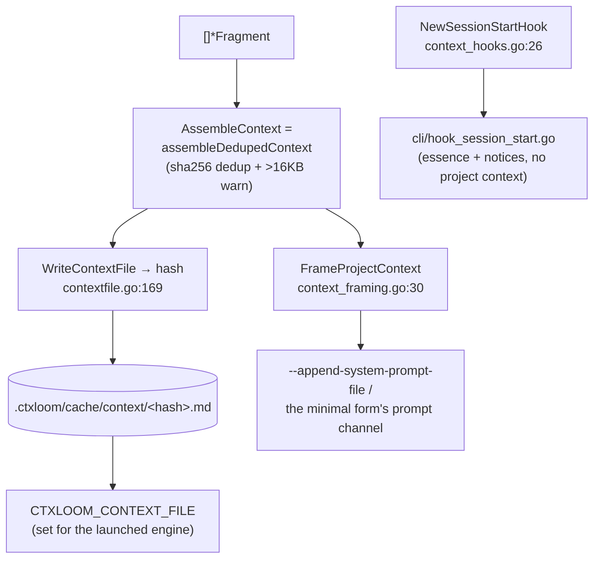

# agent — context assembly and delivery

How assembled profile context actually reaches the model. Fragments are joined and deduplicated into a hash-named cache file (`.ctxloom/cache/context/<hash>.md`) and framed for the engine's context surface. claude takes it once, as the system prompt of a session `ctxloom run` launches (`--append-system-prompt-file`). No hook delivers it: ctxloom's one SessionStart callback, `hook session-start`, carries a resumed session's essence and the session-start notices, never the project's context. A claude started by hand therefore gets no ctxloom context.

```mermaid
flowchart TD
    F["[]*Fragment"] --> ADC["AssembleContext =<br/>assembleDedupedContext<br/>(sha256 dedup + >16KB warn)"]
    ADC --> WCF["WriteContextFile → hash<br/>contextfile.go:169"]
    WCF --> FILE[(".ctxloom/cache/context/&lt;hash&gt;.md")]
    FILE --> ENV["CTXLOOM_CONTEXT_FILE<br/>(set for the launched engine)"]
    ADC --> FPC["FrameProjectContext<br/>context_framing.go:30"]
    FPC --> SP["--append-system-prompt-file /<br/>the minimal form's prompt channel"]
    SSH["NewSessionStartHook<br/>context_hooks.go:26"] --> SS["cli/hook_session_start.go<br/>(essence + notices, no project context)"]
```

## Assembly and the context file

| Symbol | file:line | Purpose |
|---|---|---|
| `AssembleContext` | `internal/core/agent/base.go:174` | The one assembler: `assembleDedupedContext` under its exported name. |
| `assembleDedupedContext` | `internal/core/agent/contextfile.go:103` | Joins fragments, deduplicates by sha256 of content, warns above 16KB. |
| `WriteContextFile` | `internal/core/agent/contextfile.go:169` | Writes the deduped context to `.ctxloom/cache/context/<hash>.md` and returns the hash. |
| `ReadContextFile` | `internal/core/agent/contextfile.go:214` | Reads `<hash>.md` back. No production reader remains; tests use it to inspect the cache. |
| `contextFileOptions` | `internal/core/agent/contextfile.go:44` | Options bag: `{fs afero.Fs, stderr io.Writer}`. |
| `ContextFileOption` | `internal/core/agent/contextfile.go:50` | Functional-option type; threaded cross-package by `internal/adapters/operations/hooks.go`. |
| `WithContextFS` | `internal/core/agent/contextfile.go:54` | Injects the filesystem. |
| `WithContextStderr` | `internal/core/agent/contextfile.go:62` | Redirects the warning sink (test-only in practice). |
| `applyContextOptions` | `internal/core/agent/contextfile.go:69` | Applies options over the `OsFs` / `os.Stderr` defaults. |
| `FrameProjectContext` | `internal/core/agent/context_framing.go:30` | Wraps assembled context in the ctxloom envelope for system-prompt delivery. |

## Hooks

| Symbol | file:line | Purpose |
|---|---|---|
| `NewSessionStartHook` | `internal/core/agent/context_hooks.go:26` | Builds ctxloom's one SessionStart hook, `ctxloom hook session-start`, with no arguments. |
| `MergeHooksConfig` | `internal/core/agent/context_hooks.go:177` | Appends `src`'s hook lists into `dest`, warning when a nil `dest` would drop a non-empty set. |
| `HookRoute` | `internal/core/agent/hook_routes.go:14` | Maps one unified hook slice onto an engine-native event name, with a default matcher. |
| `RouteUnifiedHooks` | `internal/core/agent/hook_routes.go:46` | Walks routes, applies default matchers, and emits; the hook writer of every backend that delivers hooks routes through it. |

## Invariants and contracts

- **The project's context reaches a session once.** claude takes it as the system prompt of a `ctxloom run` launch; at rest (`manage hooks install`) claude gets no context at all, because a `CLAUDE.md` or a hook beside the system prompt would double it (`operations.contextRidesTheLaunch`). An engine with no launch-time context channel reads a native file written at rest.
- **`WriteContextFile` is the only writer of `.ctxloom/cache/context/<hash>.md`.** `BaseContextProvider.GetContextFilePath` independently re-derives that path from the hash rather than asking the writer, so the naming scheme exists in two places.
- **There is exactly ONE assembler.** `agent.AssembleContext` IS `assembleDedupedContext` under the exported name: it deduplicates on `(Name, content)` and emits the oversize warning, and every path that needs "the assembled context" goes through it (U100-F13, resolved by `footless-swimming`).
- **`WriteContextFile` returns `("", nil)` when the assembled content is empty**, so `CTXLOOM_CONTEXT_FILE` is never set. Nothing distinguishes "no context configured" from "context assembly produced nothing".
- **`ReadContextFile` maps a missing file to `("", nil)`**, so a reaped or never-written cache file is indistinguishable from "no context configured".
- **`hook session-start` stays under claude's additionalContext cap.** A resumed essence longer than `claude.AdditionalContextMaxChars` (7,500, under claude's ~10,000) is cut with a pointer to the essence file and to `/recover`, because past the cap the model sees only a short preview.
- **`RouteUnifiedHooks`' `emit` callback returns nothing**, so a failed emit is invisible to the walker; a caller with zero hooks writes a hook-less settings file with no warning.
- **ctxloom's hooks are exec form** (`wire.Hook.Command` is the bare `ctxloom`, `wire.Hook.Args` its argv), so no value is ever parsed by a shell, and none carries a fact about the machine that wrote it.
