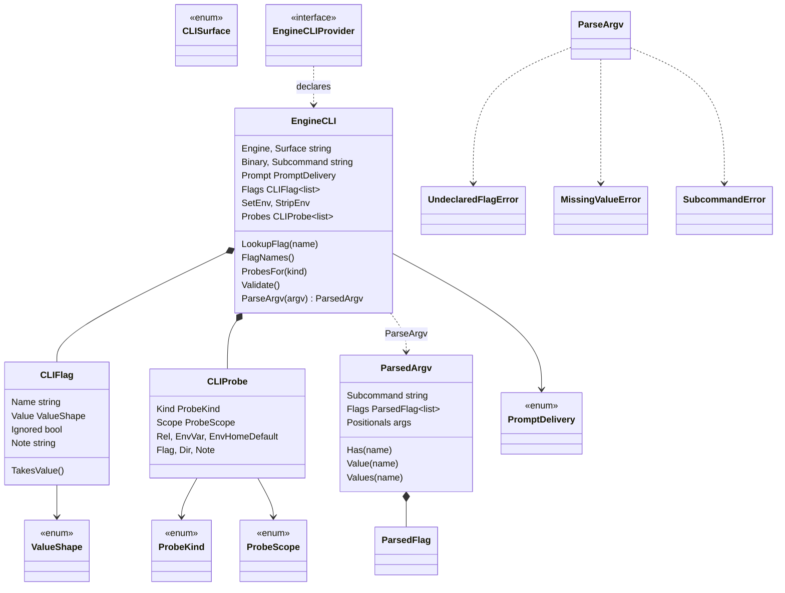

# agent — engine CLI declaration (anti-drift grammar)

`EngineCLI` is a backend's declaration of ONE vendor-CLI process surface: the binary, subcommand, how the prompt is delivered, every flag with its value shape, the env it sets and strips, and the context surfaces (`CLIProbe`) the vendor CLI reads at startup. It is the single grammar that both the real driver and the deterministic fake (`internal/mockengine`, `cmd/mockengine`) parse against — that shared reading is the entire anti-drift mechanism in the launch path. Consumers: `internal/claude`, `internal/codex`, `internal/mockengine`, `cmd/mockengine`, `internal/lm/backends`.

## Types

| Symbol | file:line | Purpose |
|---|---|---|
| `EngineCLI` | `internal/shared/agent/enginecli.go:214` | One declared process surface of a vendor CLI — the single source of truth for driver and fake alike. |
| `CLISurface` | `internal/shared/agent/enginecli.go:55` | Which surface a declaration describes (interactive / oneshot / …). |
| `ValueShape` | `internal/shared/agent/enginecli.go:71` | Whether a flag takes a value and of what shape. |
| `CLIFlag` | `internal/shared/agent/enginecli.go:91` | One declared argv flag: `{Name, Value}` drive parsing; `{Ignored, Note}` are documentation carried at runtime. |
| `PromptDelivery` | `internal/shared/agent/enginecli.go:119` | How the user prompt reaches the CLI (positional / flag / stdin / none). |
| `ProbeKind` | `internal/shared/agent/enginecli.go:136` | Which surface category a probe describes; string-identical to `SurfaceKind`. |
| `ProbeScope` | `internal/shared/agent/enginecli.go:165` | Where the CLI looks: cwd / home / env-dir / flag-value. |
| `CLIProbe` | `internal/shared/agent/enginecli.go:189` | One context surface the vendor CLI reads at startup — a tagged union keyed on `Scope`. |
| `ParsedFlag` | `internal/shared/agent/enginecli.go:315` | One flag occurrence found in argv. |
| `ParsedArgv` | `internal/shared/agent/enginecli.go:321` | Result of reading argv against a grammar: `{Subcommand, Flags, Positionals}`. |
| `UndeclaredFlagError` | `internal/shared/agent/enginecli.go:362` | Typed drift report: a flag appeared that the declaration does not list. |
| `MissingValueError` | `internal/shared/agent/enginecli.go:376` | Typed drift report: a value-taking flag had no value. |
| `SubcommandError` | `internal/shared/agent/enginecli.go:388` | Typed drift report: the subcommand did not match the declaration. |
| `EngineCLIProvider` | `internal/shared/agent/enginecli.go:465` | Capability probe — "this backend declares its CLI surfaces". Asserted at `claude/enginecli.go:207` and `codex/enginecli.go:208`. |

## Functions

| Symbol | file:line | Purpose |
|---|---|---|
| `CLIFlag.TakesValue` | `internal/shared/agent/enginecli.go:110` | `Value != ValueNone`; names the grammar concept used in two parse branches. |
| `ProbeKindOf` | `internal/shared/agent/enginecli.go:162` | Bridges `SurfaceKind` → `ProbeKind` by raw string conversion. |
| `EngineCLI.LookupFlag` | `internal/shared/agent/enginecli.go:245` | Finds a declared flag by name; returns `(zero, false)` when absent. |
| `EngineCLI.FlagNames` | `internal/shared/agent/enginecli.go:254` | Every declared flag name, in declaration order. |
| `EngineCLI.ProbesFor` | `internal/shared/agent/enginecli.go:263` | Probes of one kind, in declaration order. |
| `EngineCLI.Validate` | `internal/shared/agent/enginecli.go:278` | Rejects a self-inconsistent declaration; errors name engine, surface, and probe kind. |
| `ParsedArgv.Has` | `internal/shared/agent/enginecli.go:332` | Did the flag occur at all. |
| `ParsedArgv.Value` | `internal/shared/agent/enginecli.go:339` | First value plus a present bool (the present/empty distinction is the point). |
| `ParsedArgv.Values` | `internal/shared/agent/enginecli.go:349` | Every occurrence's value. |
| `EngineCLI.ParseArgv` | `internal/shared/agent/enginecli.go:414` | Reads argv against the grammar; no lenient mode, three typed errors. |
| `EngineCLIFor` | `internal/shared/agent/enginecli.go:470` | Picks one surface out of a `[]EngineCLI`; returns `(zero, false)`. |

## Invariants and contracts

- **The declaration is the contract.** `EngineCLI` is read from both sides: the driver builds argv from it and `internal/mockengine` parses argv against it. Any drift between the two shows up as a typed error, not a silent divergence.
- **`ParseArgv` treats any token starting with `-` as a flag.** A positional beginning with `-` (e.g. a user prompt `--fix this`) fails an otherwise-valid `PromptPositional` surface with `UndeclaredFlagError`, unless a `--` separator precedes it (`ParseArgv` honours `--` at `:435`). Claude's interactive surface and both codex surfaces are `PromptPositional`.
- **`CLIProbe` is a tagged union keyed on `Scope`**, and the type cannot express it: `ScopeCwd`/`ScopeHome` use `Rel`; `ScopeEnvDir` uses `EnvVar` + `EnvHomeDefault` + `Rel`; `ScopeFlagValue` uses `Flag` and must leave `Rel` empty. `Validate` exists solely to check what the type cannot.
- **`Validate` is never called in production.** It has eight call sites, all in tests — it is a declaration guard, not a runtime gate.
- **`ProbeKind` and `SurfaceKind` are coupled by meaning, not by type.** `ProbeKindOf` is a raw string conversion and only `enginecli_test.go:26` keeps the two vocabularies in step.
- **Fields read only outside this package:** `Binary`, `Prompt`, `SetEnv`, `StripEnv` on `EngineCLI` and everything but `Kind` on `CLIProbe` are inert here and consumed by `internal/mockengine/discovery.go`.
- **`CLIFlag.Ignored` is read only by backend anti-drift tests**; `CLIFlag.Note` has no reader at all and is pure runtime-carried documentation.
- **Typed errors are actionable by design** — `UndeclaredFlagError.Error()` names the flag *and* prints the whole argv. `internal/claude`, `internal/codex`, and `internal/mockengine` all `errors.As` against these three types.
- **`EngineCLI.FlagNames` and `ParsedArgv.Values` have zero call sites** anywhere including tests; `ParsedArgv.Has` and `ProbeKindOf` are test-only.
- **`PromptNone` is declared but never referenced.**
