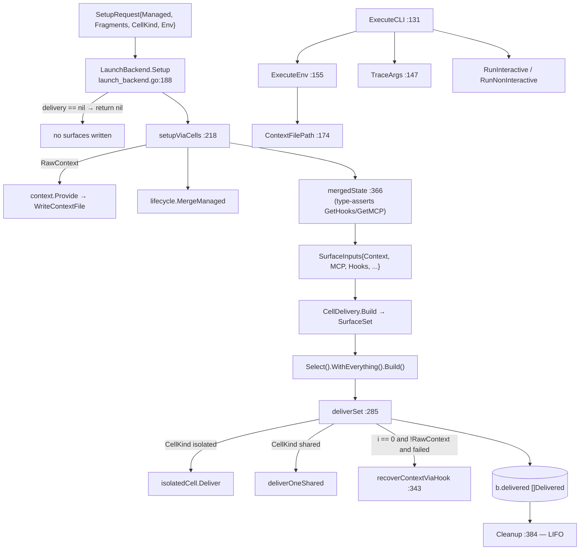

# agent — LaunchBackend setup/execute/cleanup

`LaunchBackend` is the shared core every local-CLI engine embeds (`internal/claude`, `codex`, `antigravity`, `kiro`, `opencode`, `acp`). It owns two things that happen to live on one struct: the **generic Setup/Cleanup** that turns a host-assembled `ManagedConfig` into written surfaces and reversible cleanup handles, and the **exec half** that assembles the child environment and routes an interactive or oneshot launch. Capabilities are injected once via `InitLaunch` and probed at use.

## Types

| Symbol | file:line | Purpose |
|---|---|---|
| `LaunchBackend` | `internal/shared/agent/launch_backend.go:61` | Embeds `BaseBackend`; holds `lifecycle`, `commands`, `context`, `history`, `delivery`, `extraEnv`, `delivered`. |
| `ManagedLifecycle` | `internal/shared/agent/launch_backend.go:34` | The lifecycle capability `LaunchBackend` is wired with — declares `MergeManaged`. |
| `HashedContext` | `internal/shared/agent/launch_backend.go:42` | `ContextProvider` plus `GetContextHash`/`GetContextFilePath`. |
| `ContentCommands` | `internal/shared/agent/launch_backend.go:51` | Legacy `RegisterFromContent` capability. |

## Functions

| Symbol | file:line | Purpose |
|---|---|---|
| `LaunchBackend.InitLaunch` | `internal/shared/agent/launch_backend.go:90` | Wires lifecycle, commands, context, history, and delivery in one call. No validation performed. |
| `LaunchBackend.SetExecuteEnv` | `internal/shared/agent/launch_backend.go:102` | Registers an extra env contributor (codex only). |
| `LaunchBackend.History` | `internal/shared/agent/launch_backend.go:107` | Returns the injected `SessionHistory`, satisfying `Backend`. |
| `LaunchBackend.ManagedChatMCPServers` | `internal/shared/agent/launch_backend.go:114` | Capability-probes the lifecycle for `ChatMCPServers()`. |
| `LaunchBackend.ExecuteCLI` | `internal/shared/agent/launch_backend.go:131` | Dry-run stop, argv trace, env assembly, then interactive vs oneshot routing; propagates the runner error with its exit code. |
| `LaunchBackend.TraceArgs` | `internal/shared/agent/launch_backend.go:147` | Verbosity-16 argv trace. |
| `LaunchBackend.ExecuteEnv` | `internal/shared/agent/launch_backend.go:155` | Three-layer env merge with documented precedence. |
| `LaunchBackend.ContextFilePath` | `internal/shared/agent/launch_backend.go:174` | Nil-guarded `GetContextFilePath`; sets `CTXLOOM_CONTEXT_FILE`. |
| `LaunchBackend.Setup` | `internal/shared/agent/launch_backend.go:188` | Sets the work dir and routes to `setupViaCells`. |
| `LaunchBackend.setupViaCells` | `internal/shared/agent/launch_backend.go:218` | RawContext pre-step → `MergeManaged` → build the `SurfaceSet` → select → deliver. |
| `LaunchBackend.deliverSet` | `internal/shared/agent/launch_backend.go:285` | Delivers every resolved surface through the chosen cell and records the cleanup handles. |
| `LaunchBackend.recoverContextViaHook` | `internal/shared/agent/launch_backend.go:343` | Fallback: re-provide the cache file and append an injection hook when context delivery failed. |
| `LaunchBackend.mergedState` | `internal/shared/agent/launch_backend.go:366` | Capability-probes the lifecycle for hooks + MCP, returning `(hooks, mcp, ok)`. |
| `LaunchBackend.Cleanup` | `internal/shared/agent/launch_backend.go:384` | LIFO teardown of every recorded handle. |
| `AwaitTurn` | `internal/shared/agent/rendezvous.go:57` | flock rendezvous so N chunk-injection hooks emit in order (see the context-delivery page). |

## Invariants and contracts

- **`InitLaunch` must run before `Setup`.** It performs no validation: a nil `lifecycle` passes and panics later inside `setupViaCells` at `:241`.
- **`Setup` returns `nil` — full success — when `b.delivery` is nil.** A backend that forgot `InitLaunch`'s delivery argument launches with zero surfaces written and exit 0. Every real backend passes a `CellDelivery` (acp passes an empty-set one), so a nil delivery is a misconfiguration, not a mode.
- **`setupViaCells` discards `mergedState`'s `ok`** (`hooks, mcp, _ := b.mergedState()` at `:245`). A lifecycle whose type assertions fail delivers the settings and MCP surfaces with `nil` hooks and `nil` MCP — a written settings file containing none of ctxloom's hooks, exit 0.
- **`ManagedLifecycle` declares one method but four are required.** `setupViaCells` and `ManagedChatMCPServers` immediately type-assert past it for `GetHooks`, `GetMCP`, and `ChatMCPServers` (`:114-118`, `:366-377`). The capability is a runtime assertion, not a compile-time contract.
- **`req.Managed == nil` makes `setupViaCells` return `nil`** without writing anything.
- **`deliverSet` identifies the context surface by index**, not by kind: `if i == 0 && !b.delivery.RawContext { … recoverContextViaHook }` (`:301`). This couples `launch_backend.go` to `cells.go`'s `surfaceOrder` by position; for a backend with no context surface, `surfaces[0]` is MCP and the context-recovery fallback would fire on an MCP failure.
- **`recoverContextViaHook` returns a `bool`, not an `error`.** The reason a recovery failed — `Provide`'s error, or a `mergedState` miss — is discarded, and its warning goes directly to `os.Stderr` rather than the run's stderr.
- **`Cleanup` is LIFO and attempts every handle, but keeps only the first error**; every subsequent teardown failure is discarded rather than joined.
- **`ContentCommands` and the `commands` field are dead.** `b.commands` is written by `InitLaunch` (`:92`) and read nowhere; six backends implement `RegisterFromContent` and the only call is in `claude/capabilities_test.go:32`. The commands surface now rides `ManagedCommandsDelivery`.
- **The context is assembled twice per Setup for `RawContext` backends** (codex/antigravity/kiro): once via `context.Provide` → `WriteContextFile` at `:224`, and again at `:249` for `SurfaceInputs.Context`. Both paths emit the >16KB warning to `os.Stderr`.
- **`LaunchBackend` is two types on one struct.** Exec half: `{BaseBackend, extraEnv}` ← `ExecuteCLI`/`TraceArgs`/`ExecuteEnv`. Setup half: `{lifecycle, delivery, delivered}` ← `Setup`/`setupViaCells`/`deliverSet`/`recoverContextViaHook`/`mergedState`/`Cleanup`. Only `context` is shared, and the exec half uses it for a path string while the setup half uses it to write files; `history` and `commands` belong to neither.
- **`ApplyLocalCLIConfig`** (`internal/shared/agent/localcli.go:9`) applies per-backend binary/args/env overrides and is called by all six backends; it assigns into `b.Env` without a nil check, so it is safe only because every production path constructs through `NewBaseBackend`.
