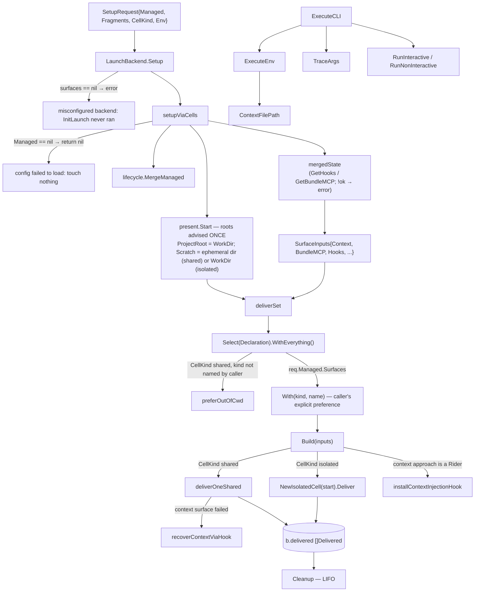

# agent — LaunchBackend setup/execute/cleanup

`LaunchBackend` is the shared core a local-CLI engine embeds. It owns two
things that happen to live on one struct: the **generic Setup/Cleanup** that
turns a host-assembled `ManagedConfig` into delivered surfaces and reversible
cleanup handles, and the **exec half** that assembles the child environment
and routes an interactive or oneshot launch. Capabilities — including the
engine's `Declaration` of the approaches it delivers at launch — are injected
once via `InitLaunch` and probed at use.

Authority: `internal/shared/agent/launch_backend.go`; the selection and cell
machinery it drives is described in [surface delivery](agent-surface-delivery.md).

```mermaid
flowchart TD
  SR["SetupRequest{Managed, Fragments, CellKind, Env}"] --> SETUP["LaunchBackend.Setup"]
  SETUP -->|"surfaces == nil → error"| MISCONF["misconfigured backend: InitLaunch never ran"]
  SETUP --> SVC["setupViaCells"]
  SVC -->|"Managed == nil → return nil"| DEGRADED["config failed to load: touch nothing"]
  SVC --> MM["lifecycle.MergeManaged"]
  SVC --> MS["mergedState<br/>(GetHooks / GetBundleMCP; !ok → error)"]
  MS --> INPUTS["SurfaceInputs{Context, BundleMCP, Hooks, ...}"]
  SVC --> START["present.Start — roots advised ONCE<br/>ProjectRoot = WorkDir; Scratch = ephemeral dir (shared) or WorkDir (isolated)"]
  INPUTS --> DS["deliverSet"]
  START --> DS
  DS --> SEL["Select(Declaration).WithEverything()"]
  SEL -->|"CellKind shared, kind not named by caller"| PREF["preferOutOfCwd"]
  SEL -->|"req.Managed.Surfaces"| WITH["With(kind, name) — caller's explicit preference"]
  WITH --> BUILD["Build(inputs)"]
  BUILD -->|"CellKind isolated"| CELL["NewIsolatedCell(start).Deliver"]
  BUILD -->|"CellKind shared"| SHARED["deliverOneShared"]
  SHARED -->|"context surface failed"| REC["recoverContextViaHook"]
  BUILD -->|"context approach is a Rider"| HOOK["installContextInjectionHook"]
  CELL --> HANDLES[("b.delivered []Delivered")]
  SHARED --> HANDLES
  HANDLES --> CLEAN["Cleanup — LIFO"]

  EXEC["ExecuteCLI"] --> ENV["ExecuteEnv"]
  ENV --> CFP["ContextFilePath"]
  EXEC --> TRACE["TraceArgs"]
  EXEC --> RUN["RunInteractive / RunNonInteractive"]
```

## Types

| Symbol | Purpose |
|---|---|
| `LaunchBackend` | Embeds `BaseBackend`; holds the injected `lifecycle`, `context`, `history`, the engine's `surfaces Declaration`, the `resolved` selection of the current run, an optional `extraEnv` contributor, and the `delivered` handles. |
| `ManagedLifecycle` | The lifecycle capability `LaunchBackend` is wired with — declares `MergeManaged`. `BaseLifecycle` implements it. |
| `HashedContext` | `ContextProvider` plus the hash and on-disk path of the context it last provided; the hash seeds the injection hook, the path is handed to the child via the context-file env var. |

## Functions

| Symbol | Purpose |
|---|---|
| `LaunchBackend.InitLaunch` | Wires lifecycle, context provider, history and the engine's `Declaration` in one call. No validation performed. |
| `LaunchBackend.Resolved` | The selection `Setup` built and delivered for the current run, or nil before `Setup`. An engine reads it to learn what its own approaches recorded (claude's out-of-cwd file paths for argv) — never to deliver again. |
| `LaunchBackend.SetExecuteEnv` | Registers an extra per-backend child-env contributor on top of the shared `ExecuteEnv`. |
| `LaunchBackend.History` | Returns the injected `SessionHistory`, satisfying `Backend`. |
| `LaunchBackend.ManagedChatMCPServers` | Capability-probes the lifecycle for `ChatMCPServers()`. |
| `LaunchBackend.ExecuteCLI` | Dry-run stop, argv trace, env assembly, then interactive vs oneshot routing; propagates the runner error with its exit code. |
| `LaunchBackend.TraceArgs` | Verbosity-gated argv trace. |
| `LaunchBackend.ExecuteEnv` | Three-layer env merge with documented precedence. |
| `LaunchBackend.ContextFilePath` | Nil-guarded `GetContextFilePath`; sets the context-file env var. |
| `LaunchBackend.Setup` | Sets the work dir, refuses a nil `Declaration`, routes to `setupViaCells`. |
| `LaunchBackend.setupViaCells` | `MergeManaged` → read the merged state → assemble the surface context → advise the run's roots ONCE → `deliverSet`. |
| `LaunchBackend.deliverSet` | Selects from the `Declaration`, applies the shared-launch preference and the caller's explicit per-kind names, builds, delivers through the cell named by `req.CellKind`, installs the injection hook for a `Rider` context approach, and records every non-nil handle. |
| `SurfaceSelection.preferOutOfCwd` | The shared-cell default derivation: with no explicit preference for a kind, prefer the declared approach that implements `OutOfCwd`; if several do and none is the default, error — the declaration must say which it prefers. Decided from the CAPABILITY, never from a name. |
| `LaunchBackend.installContextInjectionHook` | Materializes the raw context cache file and appends the SessionStart injection hook onto the merged hooks the not-yet-delivered settings surface then writes. Both the failure fallback and a deliberately selected `ApproachHook` context route through here. |
| `LaunchBackend.recoverContextViaHook` | Failure fallback on a shared launch: when the context surface's delivery fails, install the injection hook rather than launch a context-less session. |
| `LaunchBackend.mergedState` | Capability-probes the lifecycle for the merged hooks + bundle MCP, returning `(hooks, mcp, ok)`. |
| `LaunchBackend.Cleanup` | LIFO teardown of every recorded handle. |
| `AwaitTurn` (`rendezvous.go`) | flock rendezvous so N chunk-injection hooks emit in order (see the context-delivery page). |

## Invariants and contracts

- **`InitLaunch` must run before `Setup`, and `Setup` checks the one thing it
  can.** A nil `Declaration` is a misconfigured backend, never a legitimate
  "nothing to do", so `Setup` errors rather than reporting success while
  setting up nothing. A protocol-only engine that materializes no files passes
  an EMPTY declaration, which is a different fact and flows through.
- **`req.Managed == nil` means the config failed to load and the run degraded
  through**: `setupViaCells` returns without touching any surface — deliver
  nothing, retract nothing. An EMPTY payload deliberately does NOT stop there:
  it flows on to the writers, which reconcile to it and retract what ctxloom
  installed last round. This is why it is a nil check and not a `len()` check.
- **`mergedState`'s `ok` is checked, and `!ok` is an error.** Falling through
  would deliver a settings file containing none of the configured hooks or
  servers with exit 0 — a misconfigured backend, not a legitimate "nothing
  configured" (that is an EMPTY payload, which flows past and reconciles).
- **Roots are resolved and advised ONCE per Setup**, before any surface runs,
  as a `present.Start`: the project root is the working dir; Scratch is the
  session's private ephemeral dir for a shared cell (out of the shared cwd)
  and the working dir itself for an isolated cell (its private dir is its own
  scratch). `present.OnHost`, not a containerize advice: Setup runs where the
  engine runs — inside the container, for a container cell — so writer and
  engine share one filesystem namespace and the identity advice is truthful.
- **The shared-launch preference is derived, scoped, and overridable.**
  `preferOutOfCwd` runs only for `CellKindShared` (an isolated cell's
  well-known write is already race-free, so there is nothing to prefer) and
  only for kinds the caller did NOT name in `req.Managed.Surfaces`. An
  explicit preference is HONOURED, not silently converted back to the scratch
  form. The binding's preference is applied here rather than in the engine's
  declaration because a launch has the argv sink a flag-announced approach
  needs and an at-rest `DeliverUnder` does not.
- **Context recovery is matched by KIND, not by index.** A backend with no
  distinct context surface has some other kind first in the resolved
  selection, and the fallback must not fire on that kind's failure.
- **Hook-carried context is installed on EVERY cell**, after the selection
  resolves and against the same merged hooks the settings surface writes.
  Installing it on the shared arm only would leave a worktree or container
  launch pinned to the hook approach with the hook written nowhere and a
  context-less session reported as success.
- **A `Rider` context approach is a documented no-op WRITE.** `HookCarriedContext`
  itself writes nothing; the launch installs the hook it rides on. Selecting
  it without the settings surface is refused at `Build`.
- **A nil `Delivered` holds no cleanup handle and is not recorded.**
- **`recoverContextViaHook` returns a `bool`, not an `error`.** The cause is
  warned through the shared `Warn` and then discarded; the caller learns only
  whether the hook was installed.
- **`Cleanup` is LIFO, attempts every handle, and joins every failure**
  (`errors.Join`), so one bad handle does not hide the others.
- **`LaunchBackend` is two types on one struct.** Exec half: `{BaseBackend,
  extraEnv}` ← `ExecuteCLI`/`TraceArgs`/`ExecuteEnv`. Setup half:
  `{lifecycle, surfaces, resolved, delivered}` ← `Setup`/`setupViaCells`/
  `deliverSet`/`recoverContextViaHook`/`mergedState`/`Cleanup`. Only `context`
  is shared, and the exec half uses it for a path string while the setup half
  uses it to write the cache file; `history` belongs to neither.
- **`ApplyLocalCLIConfig`** (`localcli.go`) applies the local-CLI overrides
  every engine's typed config carries — binary path, args, env. Empty values
  leave the backend's defaults in place; env entries merge into, never
  replace, the backend's env map.
