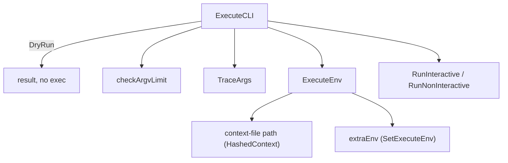

# agent — LaunchBackend (the exec half)

`LaunchBackend` is the shared core a local-CLI engine embeds: the EXEC half
of a launch — child environment assembly, the argv trace, and interactive
vs oneshot routing. Delivery is not this type's: the runner delivers the
launch's package through the static writer (`fsstatic`) before `Execute`
runs, as described in [surface delivery](agent-surface-delivery.md).

Authority: `internal/core/agent/launch_backend.go`.

```mermaid
flowchart TD
  EXEC["ExecuteCLI"] -->|"DryRun"| STOP["result, no exec"]
  EXEC --> LIMIT["checkArgvLimit"]
  EXEC --> TRACE["TraceArgs"]
  EXEC --> ENV["ExecuteEnv"]
  ENV --> CFP["context-file path (HashedContext)"]
  ENV --> EXTRA["extraEnv (SetExecuteEnv)"]
  EXEC --> RUN["RunInteractive / RunNonInteractive"]
```

## Types

| Symbol | Purpose |
|---|---|
| `LaunchBackend` | Embeds `BaseBackend`; holds the injected `context` provider, an optional `extraEnv` contributor, and the `engineHomeVar` naming the env var that relocates the engine's config home. |
| `HashedContext` | `ContextProvider` plus the on-disk path of the context it last provided, handed to the child via the context-file env var. |

## Functions

| Symbol | Purpose |
|---|---|
| `LaunchBackend.InitLaunch` | Wires the context provider. Called once from the concrete constructor. |
| `LaunchBackend.SetExecuteEnv` | Registers an extra per-backend child-env contributor on top of the shared `ExecuteEnv`. |
| `LaunchBackend.SetEngineHomeVar` | Names the env var that relocates the engine's config home (claude's `CLAUDE_CONFIG_DIR`); empty for an engine that declares none. |
| `LaunchBackend.ExecuteCLI` | Dry-run stop, argv-limit refusal, argv trace, env assembly, then interactive vs oneshot routing; propagates the runner error with its exit code. |
| `LaunchBackend.TraceArgs` | Verbosity-gated argv trace. |
| `LaunchBackend.ExecuteEnv` | The request env, the SCM context-file path when context was provided, then the per-backend contributor; later entries win on a key clash. |
| `LaunchBackend.Cleanup` | A no-op: the runner owns what it delivered (its static writer's ownership record). |

## Invariants and contracts

- **The argv limit is checked before exec**, so a failure names the payload
  rather than arriving as os/exec's generic "argument list too long"
  (`argvlimit.go`).
- **`ApplyLocalCLIConfig`** (`localcli.go`) applies the local-CLI overrides
  every engine's typed config carries — binary path, args, env. Empty values
  leave the backend's defaults in place; env entries merge into, never
  replace, the backend's env map.
