# agent — managed-file writers and reconcilers

Every byte ctxloom puts into a user's engine config directory goes through one of the reconcilers on this page. They share one discipline: ctxloom owns a *marked* or *manifest-tracked* subset of a file or tree, and each write removes exactly the previous ctxloom-owned set before laying down the new one, so uninstall is always possible and foreign content survives. `AtomicWriteFile` is the single low-level write primitive; `CtxloomCommand`/`ResolveMCPCommand` are the single policy point for what binary path lands in a generated config.

```mermaid
flowchart TD
  subgraph prim["primitives — settings_io.go"]
    AWF["AtomicWriteFile(fs, path, data, desc)"]
    GFS["GetFS(fs) — nil → OsFs"]
    WRN["Warn(fmt, ...) → clidiag"]
    CC["CtxloomCommand() = selfexec.Path()"]
    RMC["ResolveMCPCommand(override)"]
    HASH["ComputeHookHash / ComputeMCPServerHash"]
    OPTS["SettingsOptions / WithSettingsFS / WithStatusLineDisabled"]
  end
  subgraph marker["marker-section files — managedcontext.go"]
    WMC["WriteManagedContext"]
    SMS["StripManagedSection"]
    DMC["DeliverManagedContext"]
  end
  subgraph tree["manifest-tracked trees — packagefiles.go"]
    WMPF["WriteManagedPackageFiles[T]"]
    PED["pruneEmptyDirs"]
    PF["PackageFile{Path, Data, Mode}"]
  end
  subgraph cmds["command / skill rendering"]
    CE["CommandExport"]
    WMCF["WriteManagedCommandFiles"]
    SCRP["SafeCommandRelPath"]
    TMP["TransformMustacheToPositional"]
    EYS["EscapeYAMLString"]
    RCSF["RenderCommandAsSkillFile"]
    JS["JSONScalar"]
    SKE["SkillExport"]
    NSSC["NewSkillShapedCommandsAndSkills"]
  end
  subgraph mcp["MCP registries"]
    MFC["MCPFileConfig (mcpfile.go)"]
    LEDGER[("<Path>.ledger — managed names")]
    MB["InstallMCPServerJSON / Uninstall / Installed"]
    REG["MCPRegistrar (interface)"]
  end
  CJ["CanonicalJSON (marshal.go)"]
  SYM["symlink.go — WarnOnCtxloomPathSkew"]

  WMC --> SMS
  WMC --> AWF
  DMC --> WMC
  WMCF --> WMPF
  WMPF --> SCRP
  WMPF --> PED
  NSSC --> RCSF
  RCSF --> JS
  MFC --> CJ --> AWF
  MFC --> LEDGER
  MB --> CJ
  REG --> MB
  CC --> RMC --> MFC
```

## Write primitives — `settings_io.go`

| Symbol | file:line | Purpose |
|---|---|---|
| `AtomicWriteFile` | `internal/shared/agent/settings_io.go:135` | Mode-preserving backup + temp-write + rename, with a direct-write fallback. 13 production callers. |
| `GetFS` | `internal/shared/agent/settings_io.go:89` | nil → `afero.NewOsFs()`; the single defaulting point (16 production sites). |
| `Warn` | `internal/shared/agent/settings_io.go:100` | `clidiag.Warn("ctxloom", …)`; binds the program name once so 17 call sites cannot drift. |
| `CtxloomCommand` | `internal/shared/agent/settings_io.go:43` | Returns `selfexec.Path()` — the absolute path of the running ctxloom binary. 26 production call sites. |
| `ResolveMCPCommand` | `internal/shared/agent/settings_io.go:59` | Override-or-default; the container-override policy chokepoint. 12 production call sites. |
| `ComputeHookHash` | `internal/shared/agent/settings_io.go:105` | sha256 of six hook fields, first 8 bytes hex. Used at `internal/claude/claude.go:615`. |
| `ComputeMCPServerHash` | `internal/shared/agent/settings_io.go:120` | sha256 of command + args, first 8 bytes hex. Used at `internal/claude/claude.go:724,735`. |
| `SettingsOptions` | `internal/shared/agent/settings_io.go:67` | `{FS afero.Fs, StatusLineDisabled bool}`. |
| `SettingsOption` | `internal/shared/agent/settings_io.go:73` | Functional-option type. |
| `WithSettingsFS` | `internal/shared/agent/settings_io.go:77` | Injects the filesystem. |
| `WithStatusLineDisabled` | `internal/shared/agent/settings_io.go:84` | Sets the claude-only statusline policy flag. |
| `CanonicalJSON` | `internal/shared/agent/marshal.go:16` | Marshal → generic → sorted, indented, newline-terminated. The double round-trip *is* the key-sorting mechanism. 8 production callers. |

## Marker-section files — `managedcontext.go`

| Symbol | file:line | Purpose |
|---|---|---|
| `WriteManagedContext` | `internal/shared/agent/managedcontext.go:37` | Merges content into the managed-marker section of a human-editable file (CLAUDE.md, AGENTS.md, …). |
| `StripManagedSection` | `internal/shared/agent/managedcontext.go:80` | Removes the managed marker section, returning the surrounding user content. |
| `ifNonEmptySuffix` | `internal/shared/agent/managedcontext.go:99` | Two-line helper appending a suffix when a string is non-empty. |
| `DeliverManagedContext` | `internal/shared/agent/managedcontext.go:120` | Writes the managed section and returns a strip-on-cleanup handle. Used by claude, opencode, antigravity, codex, kiro. |

## Manifest-tracked trees — `packagefiles.go`

| Symbol | file:line | Purpose |
|---|---|---|
| `PackageFile` | `internal/shared/agent/packagefiles.go:24` | One rendered file in a package: `{Path, Data, Mode}`. Shared vocabulary across all seven engine `skillfiles.go`. |
| `WriteManagedPackageFiles[T]` | `internal/shared/agent/packagefiles.go:64` | Manifest-scoped tree writer: remove the tracked set, re-render, rewrite the manifest. 8 production callers. |
| `pruneEmptyDirs` | `internal/shared/agent/packagefiles.go:196` | Best-effort bottom-up empty-directory cleanup; all errors ignored by design. |

## Command and skill rendering

| Symbol | file:line | Purpose |
|---|---|---|
| `CommandExport` | `internal/shared/agent/commandfiles.go:19` | Agent-agnostic slash-command export spec (7 fields). |
| `CommandFileOption` / `commandFileOptions` | `internal/shared/agent/commandfiles.go:30` / `:32` | Option family carrying `{fs, homeCommandsDir}`. |
| `WithCommandFS` | `internal/shared/agent/commandfiles.go:38` | Injects the filesystem. |
| `WithHomeCommandsDir` | `internal/shared/agent/commandfiles.go:49` | Declares the home commands dir for dedup. |
| `ResolveHomeCommandsDir` | `internal/shared/agent/commandfiles.go:59` | Bridges the home dir from one option family into the other (`WithDedupHomeDir`). |
| `ResolveCommandFS` | `internal/shared/agent/commandfiles.go:97` | Applies options, defaulting to `OsFs`. 11 production callers. |
| `ManagedWriteOption` / `managedWriteOptions` | `internal/shared/agent/commandfiles.go:106` / `:108` | The second option family, consumed by `WriteManagedPackageFiles`. |
| `WithManifestTrailingNewline` | `internal/shared/agent/commandfiles.go:117` | Preserves each engine's on-disk manifest bytes. |
| `WithDedupHomeDir` | `internal/shared/agent/commandfiles.go:127` | Skips writing a project command already present in the home dir. |
| `SafeCommandRelPath` | `internal/shared/agent/commandfiles.go:75` | Validates a bundle-supplied name as a path confined to a directory. A security boundary — bundle content is remote. |
| `WriteManagedCommandFiles` | `internal/shared/agent/commandfiles.go:155` | Adapts a command export ("a command is a one-file package") onto `WriteManagedPackageFiles`. 7 production callers. |
| `TransformMustacheToPositional` | `internal/shared/agent/commandfiles.go:177` | Rewrites `{{var}}` → `$N` by first-occurrence order. |
| `isYAMLTypeAmbiguous` | `internal/shared/agent/commandfiles.go:202` | Detects YAML 1.1 bool/null/number scalars. |
| `EscapeYAMLString` | `internal/shared/agent/commandfiles.go:217` | Quotes and escapes for YAML frontmatter (claude, codex, opencode). |
| `SkillExport` | `internal/shared/agent/skillexport.go:11` | Agent-agnostic Agent Skill package export spec — the `SurfaceSkills` sibling of `CommandExport`. |
| `JSONScalar` | `internal/shared/agent/skillcommandshape.go:23` | `json.Marshal` of a string for YAML frontmatter (kiro, antigravity). |
| `RenderCommandAsSkillFile` | `internal/shared/agent/skillcommandshape.go:37` | Renders a `CommandExport` as `<name>/SKILL.md` with YAML frontmatter. |
| `FilterCommandsClaimedBySkills` | `internal/shared/agent/skillcommandshape.go:68` | Drops commands whose name an enabled skill already claims, warning per drop. |
| `NewSkillShapedCommandsAndSkills` | `internal/shared/agent/skillcommandshape.go:105` | The single assembly point that keeps kiro and antigravity from drifting: filter, then build the commands/skills delivery pair. |

## MCP registries

| Symbol | file:line | Purpose |
|---|---|---|
| `MCPFileConfig` | `internal/shared/agent/mcpfile.go:26` | Shared reconciler for the `{"mcpServers": {...}}` JSON registry shape. Value receiver throughout, so it is safely copyable. |
| `MCPFileServer` | `internal/shared/agent/mcpfile.go:54` | The stdio server JSON shape ctxloom writes. |
| `mcpFile` | `internal/shared/agent/mcpfile.go:62` | The loaded registry: modelled `Servers` plus raw passthrough of every other top-level field. |
| `MCPFileConfig.WriteServers` | `internal/shared/agent/mcpfile.go:72` | Drop previously-managed names, re-add the current set, rewrite the ledger. |
| `MCPFileConfig.RemoveServers` | `internal/shared/agent/mcpfile.go:111` | Drop managed names and clear the ledger. |
| `MCPFileConfig.ManagedPresent` | `internal/shared/agent/mcpfile.go:127` | Is any managed server present. |
| `MCPFileConfig.dropManaged` | `internal/shared/agent/mcpfile.go:149` | Deletes the well-known name plus every ledger-recorded name. |
| `MCPFileConfig.setServer` | `internal/shared/agent/mcpfile.go:157` | Marshals one entry into the raw map. |
| `MCPFileConfig.load` | `internal/shared/agent/mcpfile.go:170` | Reads the registry. |
| `MCPFileConfig.save` | `internal/shared/agent/mcpfile.go:205` | Canonical atomic rewrite. |
| `MCPFileConfig.readLedger` | `internal/shared/agent/mcpfile.go:244` | Ledger names, one per line. |
| `MCPFileConfig.writeLedger` | `internal/shared/agent/mcpfile.go:262` | Sorted atomic ledger write; removes the ledger when empty. |
| `InstallMCPServerJSON` | `internal/shared/agent/mcp_bytes.go:22` | Merges one server into `mcpServers`, preserving foreign top-level keys. |
| `UninstallMCPServerJSON` | `internal/shared/agent/mcp_bytes.go:53` | Removes one server; absent is a no-op by contract. |
| `MCPServerInstalledJSON` | `internal/shared/agent/mcp_bytes.go:66` | Is the server present in the given bytes. |
| `mcpJSONDoc` | `internal/shared/agent/mcp_bytes.go:79` | Decodes with `UseNumber`; empty input yields a fresh document. |
| `mcpJSONRender` | `internal/shared/agent/mcp_bytes.go:95` | Indented encode. |
| `MCPRegistrar` | `internal/shared/agent/mcp_registrar.go:14` | The facet an external tool (`taskloom manage`) uses to register a server without learning per-agent paths: `{Name, Present, ConfigPath, Install, Uninstall, Installed}`. |

## Binary-path skew warning — `symlink.go`

| Symbol | file:line | Purpose |
|---|---|---|
| `GetExecutablePath` | `internal/shared/agent/symlink.go:25` | `os.Executable` + `EvalSymlinks`, memoized in a package global. |
| `SetExecutablePathForTesting` | `internal/shared/agent/symlink.go:46` | Assigns the memoized path. |
| `WarnOnCtxloomPathSkew` | `internal/shared/agent/symlink.go:62` | Warns when the `ctxloom` on PATH differs from the running binary. Called from `internal/mcp/mcp_server.go`'s `ctxServer.startup`. |
| `ctxloomPathSkewed` | `internal/shared/agent/symlink.go:90` | The predicate, extracted so it can be tested without a filesystem. |

## Invariants and contracts

- **`AtomicWriteFile` is the single low-level write path** for settings/config surfaces. It backs the original up to `<path>.ctxloom.bak`, writes `<path>.ctxloom.tmp`, then renames.
- **The temp path is a fixed suffix** (`path + ".ctxloom.tmp"`, `settings_io.go:146`) with no PID or random component, so two ctxloom processes writing the same settings file race. With concurrent `agent_run` children this is a live configuration.
- **The rename fallback fires on ANY rename error, not only cross-device.** The doc claims a cross-device fallback; the code does not test for `EXDEV`, discards the error entirely, and silently abandons atomicity. On the fallback-failure path the temp file is leaked.
- **The backup is best-effort and silent.** Both the read of the original and the write of `.ctxloom.bak` have their errors discarded, and execution falls through to the overwrite regardless — so the only recovery path can silently not exist.
- **`AtomicWriteFile` has no empty-payload guard.** `len(data) == 0` backs up a populated settings file and replaces it with a zero-byte one, returning success.
- **`CtxloomCommand` is the binary-path policy for materialized surfaces**, and `ResolveMCPCommand` is documented as the resolver *every* MCP-surface writer must use. The four file-surface backends do; `ComposeChatMCPServers` (`chat_mcp.go:39`) hardcodes `CtxloomCommand()` and takes no override — a real divergence from that claim.
- **`WriteManagedContext` preserves user content but relocates it.** `StripManagedSection` returns `before + after` and the managed section is re-appended at the end, so user content that was *below* the end marker is hoisted above the managed section on every rewrite. The doc's "preserved byte-for-byte" holds for bytes, not for position.
- **`WriteManagedContext` with empty content deletes the file.** That is the intended uninstall semantics and the terminus of the empty-context chain.
- **`WriteManagedPackageFiles` removes the previously-tracked set BEFORE rendering.** Every per-item failure warns and continues, and the function returns `nil` when nothing was written — so a total render failure wipes the prior delivery and reports success. The manifest is the only record of what ctxloom owns in that tree.
- **`SafeCommandRelPath` must gate every bundle-supplied name** before it becomes a path (four call sites in `packagefiles.go`). Bundle content is remote content.
- **The MCP ledger (`<Path>.ledger`) is the record of managed names**, written sorted and atomically, and removed when empty. `dropManaged` deletes the well-known name plus everything the ledger lists — that is how a renamed managed server gets cleaned up.
- **`readLedger` maps any read error to `nil`**, so a permissions or I/O failure silently defeats the ledger and orphans managed stdio servers — the exact failure the ledger exists to prevent.
- **A registry that fails to parse is replaced, not preserved.** `load` warns and returns an empty structure; the following `save` atomically rewrites the file from it, destroying every user-authored server and every foreign top-level field. The `Warn` sink is documented as "never fails the write".
- **`setServer` warns and returns on a marshal failure while the caller has already recorded the name** in `managed` and the ledger — the ledger can claim ownership of a server that was never written.
- **`save` writes `{}` rather than removing the file** when nothing remains and the file already exists; when nothing remains and no file exists it correctly does nothing ("uninstall never creates files").
- **`InstallMCPServerJSON` preserves foreign keys**, but a non-object `mcpServers` value is silently replaced with a fresh empty map.
- **`MCPRegistrar` has two facets with different natures**: `{Name, Present, ConfigPath}` vary per agent; `{Install, Uninstall, Installed}` are delegated verbatim to this package's own free functions by all three implementors (`claude/mcp_registrar.go:49,54,59`, `antigravity/…:50,55,60`, `kiro/…:57,62,67`).
- **Two YAML frontmatter quoters coexist in this package with different correctness.** `JSONScalar` (`skillcommandshape.go:23`) always quotes and escapes control characters via `json.Marshal`; `EscapeYAMLString` (`commandfiles.go:217`) quotes conditionally and escapes only `\` and `"`, so an embedded newline is emitted literally inside a double-quoted scalar. `JSONScalar` serves kiro/antigravity; `EscapeYAMLString` serves claude and opencode.
- **`RenderCommandAsSkillFile` always returns a nil error** — the signature exists only to match `render func(CommandExport) (string, []byte, error)` at `commandfiles.go:155`. Empty `Content` produces a syntactically valid `SKILL.md` with frontmatter and a blank body.
- **`NewSkillShapedCommandsAndSkills` is the single assembly point** for kiro and antigravity's command/skill pair; going around it is how those two engines drift apart.
- **`cachedExecPath`** (`symlink.go:11`) is an unsynchronized package global, and production code calls the testing mutator: `internal/operations/hooks.go:65` invokes `agent.SetExecutablePathForTesting(req.ExecPath)`, driven by the public `ApplyHooksRequest.ExecPath` field.
- **`symlink.go` exists only for surfaces materialized before the `CtxloomCommand` self-exec fix** — those still carry the bare name `ctxloom` until the next apply re-materializes them.
- **Seven identical closure→`Delivered` adapters exist across the repo**; `agent.DeliveredFunc` (`managedcontext.go:108`) is the canonical one.
