# agent — managed-file writers and reconcilers

Every byte ctxloom puts into a user's engine config directory goes through one of the reconcilers on this page. They share one discipline: ctxloom owns a *marked* or *manifest-tracked* subset of a file or tree, and each write removes exactly the previous ctxloom-owned set before laying down the new one, so uninstall is always possible and foreign content survives. `AtomicWriteFile` is the single low-level write primitive; `CtxloomCommand`/`ResolveMCPCommand` are the single policy point for what binary path lands in a generated config.

References below are by **symbol** (`Type.Method` or bare function name), not `file:line` — a line number drifts on any edit above it and silently points at the wrong thing; a symbol fails loud when it goes stale (`grep` finds nothing) instead of misleading.

```mermaid
flowchart TD
  subgraph prim["primitives — settings_io.go, rmw_lock.go"]
    AWF["AtomicWriteFile(fs, path, data, desc)"]
    WFL["WithFileLock(fs, target, fn)"]
    GFS["GetFS(fs) — nil → OsFs"]
    WRN["Warn(fmt, ...) → clidiag"]
    CC["CtxloomCommand() = selfexec.Path()"]
    RMC["ResolveMCPCommand(override)"]
    HASH["ComputeHookHash / ComputeMCPServerHash / ComputeCommandDigest"]
    RC["RefuseCorrupt(fs, path, data, ...)"]
  end
  subgraph marker["marker-section files — managedcontext.go"]
    WMC["WriteManagedContext"]
    SMS["StripManagedSection"]
    DMC["DeliverManagedContext"]
  end
  subgraph tree["manifest-tracked trees — packagefiles.go"]
    WMPF["WriteManagedPackageFiles[T]"]
    PED["pruneEmptyDirs"]
    PF["PackageFile{Path, Data, Mode}"]
  end
  subgraph cmds["command / skill rendering"]
    CE["CommandExport"]
    WMCF["WriteManagedCommandFiles"]
    SCRP["SafeCommandRelPath"]
    TMP["TransformMustacheToPositional"]
    EYS["EscapeYAMLString"]
    RCSF["RenderCommandAsSkillFile"]
    JS["JSONScalar"]
    SKE["SkillExport"]
    NSSC["NewSkillShapedCommandsAndSkills"]
  end
  subgraph mcp["MCP registries"]
    MFC["MCPFileConfig (mcpfile.go)"]
    LEDGER[(".ctxloom-managed — internal/shared/ledger")]
    MB["InstallMCPServerJSON / Uninstall / Installed"]
    REG["MCPRegistrar (interface)"]
  end
  CJ["CanonicalJSON (marshal.go)"]
  SYM["symlink.go — WarnOnCtxloomPathSkew"]

  WMC --> WFL
  WFL --> AWF
  DMC --> WMC
  WMCF --> WMPF
  WMPF --> SCRP
  WMPF --> PED
  NSSC --> RCSF
  RCSF --> JS
  MFC --> WFL
  MFC --> CJ --> AWF
  MFC --> LEDGER
  MB --> CJ
  REG --> MB
  CC --> RMC --> MFC
```

## R6: exclusively-owned files inside a foreign engine's directory (ruled 2026-08-14)

Some files live inside a *foreign* engine's config directory (`~/.claude`-shaped, `$CODEX_HOME`, `.kiro/`, `opencode.json`'s directory) but ctxloom is the **sole** author of the whole file — claude's per-instance `.claude.json`, kiro's `.kiro/agents/<n>.json` and steering file, opencode's context file. Three call sites answered "does exclusive ownership excuse the lock and the ledger" three different ways before this ruling: one relied on the *caller's* project filelock rather than its own (`claude.claudeInstanceConfig.WriteInstanceConfig`), the four locked `SettingsWriter` entry points said "not sufficient" for the very same opencode file a fifth entry point left unlocked, and kiro's whole-file writers said "sufficient" outright.

**The rule, no per-site judgment:** a file ctxloom exclusively owns inside a foreign engine's directory is locked and ledgered like a shared file.

- `claude.claudeInstanceConfig.WriteInstanceConfig` now takes its own `agent.WithFileLock` around the whole load-modify-write cycle, keyed to the generated file itself — not the caller's `isolation.lockInstanceHome`, which locks a *different* path in a *different* lock namespace (`filelock.ProjectPathFor` on the instance-home directory vs. `filelock.HomePathFor` on the generated file) and silently no-ops for the harpless worktree fallback.
- `codex.MCPRegistrar.Install` now refuses a present-but-wrong-TOML-type `mcp_servers` value instead of silently replacing it, matching its JSON twin `InstallMCPServerJSON`.
- codex's `config.toml` `[mcp_servers]` table gained a `ledger.SurfaceMCP` sidecar record (`codex.removeLedgeredMCPServers`, written by `codex.CodexHookWriter.writeSettingsIn`/`.removeSettingsIn`), closing a real orphan hole: ownership there used to be purely structural (the well-known `ctxloom` name plus "command resolves to ctxloom"), so a bundle- or unified-config server renamed in ctxloom's own config left its old TOML entry behind forever, because its command need not be ctxloom's at all.
- `claude.appendFlagDelivery.DeliverContext` now writes its framed `<hash>.sysprompt.md` cache file through `AtomicWriteFile` instead of a raw `afero.WriteFile`.

**The ratchet:** `tests/arch/lock_discipline_test.go` (`TestArch_LockDiscipline_EngineRMWIsLocked`) and `tests/arch/ledger_discipline_test.go` (`TestArch_LedgerDiscipline_ManagedWritersRecordOwnership`) are write-discipline-shaped gates — a name-based heuristic over every function in the four `SettingsWriter` packages plus this package, with a reasoned, symbol-keyed allowlist and an `AllowlistIsLive` staleness twin each. They are heuristics, not proofs (see their own doc comments for exactly what they can and cannot see), and each currently carries baseline entries for two more REAL gaps this batch did not fix: `codex.codexInstanceConfig.WriteInstanceConfig` has the identical seed-once TOCTOU shape the claude fix above closes, and opencode's `writeOpencodeConfig` (the live chat/interactive overlay) still tracks its managed keys only via a transient snapshot/restore closure, not a persisted record.

## Write primitives — `settings_io.go`, `rmw_lock.go`

| Symbol | Purpose |
|---|---|
| `AtomicWriteFile` | Routes through `iox.WriteFileAtomicFs`: a **unique** temp name in the destination directory (`afero.TempFile`, so two concurrent writers never clobber each other's in-flight bytes), fsync, chmod to an exact mode, then rename. **No backup is taken** — see "What changed" below for why. Refuses a zero-byte write over an existing file unless the caller opts in with `AllowEmptyWrite()`. |
| `WithFileLock` | The `SettingsWriter`/R6 family's one lock idiom: `fn` runs as the WHOLE read-modify-write cycle under a lock at `filelock.HomePathFor(target)` (a real OS home-rooted lock directory, not a sidecar beside `target`). Skipped when `fs` is not OS-backed (a test double has no other process to exclude). Fail-closed on acquisition failure. |
| `GetFS` | nil → `afero.NewOsFs()`; the single defaulting point every writer in this package and its engine callers uses. |
| `Warn` | `clidiag.Warn("ctxloom", …)`; binds the program name once. |
| `CtxloomCommand` | Returns `selfexec.Path()` — the absolute path of the running ctxloom binary, so a materialized surface can never diverge between a staged and an installed binary. |
| `ResolveMCPCommand` | Override-or-default; the container-override policy chokepoint (`isolation.Container.MCPCommandOverride`). |
| `ComputeHookHash` / `ComputeMCPServerHash` / `ComputeCommandDigest` | sha256-derived short identifiers used as ownership markers (hooks, MCP server entries, the statusline command) — the `SCM` field claude carries on each managed entry, and the digests the ledger records for the same purpose elsewhere. |
| `SettingsOptions` | `{FS afero.Fs}` — filesystem seam only. Per-engine policy (which surfaces are managed) rides the surfaces × cells seam elsewhere, not this struct. |
| `RefuseCorrupt` | The one refusal shape for "part of this user-owned file will not parse": backs the original bytes up to `<path>.corrupt-<unix>` and returns an error so the caller aborts *before* touching the file. Every backend that round-trips a user-editable settings/hooks/MCP file routes partial-parse failures here. |
| `CanonicalJSON` (`marshal.go`) | Marshal → generic decode with `UseNumber` (numeric precision preserved) → sorted, indented, newline-terminated re-encode. The double round-trip *is* the key-sorting mechanism. |

## Marker-section files — `managedcontext.go`

| Symbol | Purpose |
|---|---|
| `WriteManagedContext` | Merges content into the managed-marker section of a human-editable file (CLAUDE.md, AGENTS.md, …), preserving surrounding user content **in position** — a section that sat *below* the end marker used to be hoisted above it on every rewrite; it is now reinserted at the same offset the old section occupied. The whole read-splice-write(-or-remove) cycle runs inside its own `WithFileLock`. |
| `StripManagedSection` | Removes the managed marker section, returning the surrounding user content. |
| `DeliverManagedContext` | Writes the managed section and returns a strip-on-cleanup handle. Used by claude, opencode, and codex. |

## Manifest-tracked trees — `packagefiles.go`

| Symbol | Purpose |
|---|---|
| `PackageFile` | One rendered file in a package: `{Path, Data, Mode}`. Shared vocabulary across every engine's command/skill writer. |
| `WriteManagedPackageFiles[T]` | Manifest-scoped tree writer: remove the previously-tracked set, render-to-a-temp-sibling-then-swap each file into place, rewrite the `ledger.Surface`-scoped manifest. Carries an empty-render guard (refuses to touch an existing surface when every enabled item rendered zero files). **Not itself wrapped in `WithFileLock`** — a known, deferred gap (it writes into directories shared with the user and with concurrently-firing hooks/applies); its render-to-temp-then-swap shape is also invisible to `lock_discipline_test.go`'s write-signal heuristic, which recognizes `AtomicWriteFile`/`save*` but not this function's own `afero.WriteFile`-into-temp-dir + `fs.Rename` swap. |
| `pruneEmptyDirs` | Best-effort bottom-up empty-directory cleanup; all errors ignored by design. |

## Command and skill rendering

| Symbol | Purpose |
|---|---|
| `CommandExport` | Agent-agnostic slash-command export spec. |
| `SafeCommandRelPath` | Validates a bundle-supplied name as a path confined to a directory — a security boundary, since bundle content is remote. |
| `WriteManagedCommandFiles` | Adapts a command export ("a command is a one-file package") onto `WriteManagedPackageFiles`. |
| `TransformMustacheToPositional` | Rewrites `{{var}}` → `$N` by first-occurrence order. |
| `EscapeYAMLString` | Quotes and escapes for YAML frontmatter (claude, opencode). |
| `SkillExport` | Agent-agnostic Agent Skill package export spec — the `SurfaceSkills` sibling of `CommandExport`. |
| `JSONScalar` (`skillcommandshape.go`) | `json.Marshal` of a string for YAML frontmatter (kiro). |
| `RenderCommandAsSkillFile` | Renders a `CommandExport` as `<name>/SKILL.md` with YAML frontmatter. |
| `FilterCommandsClaimedBySkills` | Drops commands whose name an enabled skill already claims, warning per drop. |
| `NewSkillShapedCommandsAndSkills` | The single assembly point that keeps the SKILL.md-shaped engines from drifting: filter, then build the commands/skills delivery pair. |

**Two YAML frontmatter quoters coexist with different correctness.** `JSONScalar` always quotes and escapes control characters via `json.Marshal`; `EscapeYAMLString` quotes conditionally and escapes only `\` and `"`, so an embedded newline is emitted literally inside a double-quoted scalar. `JSONScalar` serves the SKILL.md-shaped engines; `EscapeYAMLString` serves claude and opencode's command frontmatter.

## MCP registries

| Symbol | Purpose |
|---|---|
| `MCPFileConfig` | Shared reconciler for the `{"mcpServers": {...}}` JSON registry shape (claude's `.mcp.json`/`.claude.json`, kiro's `.kiro/settings/mcp.json`). Value receiver throughout, so it is safely copyable. Its own `WriteServers`/`RemoveServers` wrap the whole read-modify-write-and-ledger cycle in `WithFileLock`. |
| `MCPFileConfig.WriteServers` | Drop previously-managed names (read from the ledger, plus the well-known `ctxloom` name for pre-ledger files), re-add the current set, rewrite the ledger. A hand-authored name the ledger never claimed is left alone (warned, not overwritten) rather than clobbered — a single collision does not block the rest of the reconcile. |
| `MCPFileConfig.RemoveServers` | Drop managed names and clear the ledger. |
| `MCPFileConfig.load` | Reads the registry. A **fully unparseable** top-level document is refused (`RefuseCorrupt`'s posture: "I could not read it" is not "it was empty") — the writer that used to warn and silently replace an unparseable registry with one containing only ctxloom's own servers destroyed every user-authored entry on a success path. A `mcpServers` sub-object that fails to parse *within* an otherwise-valid document still warns and degrades to empty for that one field, not a full refusal. |
| `MCPFileConfig.save` | Canonical atomic rewrite via `CanonicalJSON` + `AtomicWriteFile`; re-emits every preserved field as its **original bytes**, not a decoded-and-reencoded value, so a large integer is not rounded through `float64`. |
| `MCPFileConfig.ledger` / `.readLedger` / `.writeLedger` | Wraps `internal/shared/ledger.Ledger`, scoped to `ledger.SurfaceMCP`. This package used to keep its own private `<Path>.ledger` read/write pair, duplicated per engine; `internal/shared/ledger` is now the one shared implementation (see that package's doc for the co-location invariant that made a single marker filename, with surface-typed entries, the right shape). A read error from the ledger is **propagated**, not flattened to "nothing managed" — a writer that mistook an unreadable ledger for an empty one would orphan every entry it wrote last time. |
| `InstallMCPServerJSON` | Merges one server into `mcpServers`, preserving foreign top-level keys. A **present-but-wrong-type** `mcpServers` value (a string, an array) is **refused**, not silently replaced with a fresh empty map — the failure mode that used to destroy whatever the user had under that key. |
| `UninstallMCPServerJSON` | Removes one server; absent is a no-op by contract. |
| `MCPRegistrar` | The facet an external tool (`taskloom manage`) uses to register a server without learning per-agent paths: `{Name, Present, ConfigPath, Install, Uninstall, Installed}`. `claude`, `kiro`, and codex's TOML-shaped `codex.MCPRegistrar` all implement it; codex's `Install` and the shared JSON `InstallMCPServerJSON` now agree on the wrong-type refusal (they used to be asymmetric — the JSON path refused, the TOML path silently replaced). |

## internal/shared/ledger — the sidecar ownership record

**Marker filename:** `.ctxloom-managed` (constant `ledger.Name`) — **one filename for every engine and every surface**, not the per-engine `<Path>.ledger` variants that predated it. Lines are `<name>\t<surface>`; `Surface` is a deliberately open string type (`ledger.SurfaceMCP`, `SurfaceCommands`, `SurfaceSkills`, `SurfaceHooks`, `SurfaceContext`, `SurfacePermissions`, `SurfaceStatusLine`, and any caller-defined value), so two co-located surfaces (kiro's commands and skills share one directory) never delete each other's entries, and a plugin can claim its own surface with no registration step.

`ledger.Ledger.Read` returns `(nil, nil)` for a missing marker (the legitimate "nothing managed yet" case) but propagates any other read error — never flattens it to empty. `ledger.Ledger.Write` rewrites the marker atomically (`iox.WriteFileAtomicFs`), in a stable sorted order (so an unchanged managed set produces byte-identical output), and removes the marker file only when **every** surface is empty.

Consumers: `MCPFileConfig` (`SurfaceMCP`), `WriteManagedPackageFiles` (`SurfaceCommands`/`SurfaceSkills`), `claude.ClaudeCodeHookWriter.writeSettingsFile` (`SurfaceHooks`/`SurfacePermissions`/`SurfaceStatusLine`), `opencode.OpencodeWriter` (`SurfaceMCP`), and `codex.CodexHookWriter.writeSettingsIn`/`.removeSettingsIn` (`SurfaceMCP`, added under R6 above — closing the renamed-server-orphan hole a purely structural `[mcp_servers]` ownership model left).

## Binary-path skew warning — `symlink.go`

| Symbol | Purpose |
|---|---|
| `GetExecutablePath` | `os.Executable` + `EvalSymlinks`, memoized in a package global. |
| `WarnOnCtxloomPathSkew` | Warns when the `ctxloom` on `PATH` differs from the running binary — a surface materialized before the `CtxloomCommand` self-exec-absolute fix still carries the bare name `ctxloom` until the next apply re-materializes it, and this is what catches that. Called from the MCP server's startup path. |

## Invariants and contracts

- **`AtomicWriteFile` is the single low-level write path** for settings/config surfaces, and it takes **no backup**. This is a deliberate change, not an omission: the old `<path>.ctxloom.bak` copy existed because a writer that could not tell its own content from the user's had to rewrite the file wholesale and keep a copy in case it was wrong. Every writer reaching `AtomicWriteFile` now knows what it owns — through the sidecar ledger or through in-file managed markers — so it edits its own content and leaves the rest untouched, and there is nothing to recover from. See `internal/shared/ledger`'s package doc for the fuller history (five independently-drifted per-engine ownership records, consolidated into one).
- **The temp file name is unique per write** (`afero.TempFile` with a `.`+base+`.*.tmp` pattern), not a fixed suffix — two concurrent writers of the same settings file can never clobber each other's in-flight temp file the way a fixed name could.
- **A rename failure is returned, never papered over**, and there is no cross-device fallback: the temp file lives in the destination directory by construction, so cross-device rename cannot occur, and every internal failure branch best-effort removes the orphaned temp file before returning the error.
- **`AtomicWriteFile` refuses a zero-byte write over an existing file** unless the caller opts in via `AllowEmptyWrite()` (codex's `RemoveSettings`/`save`, whose TOML encoder renders an emptied managed set as literally zero bytes — the one legitimate exception).
- **`CtxloomCommand` is the binary-path policy for materialized surfaces**, and `ResolveMCPCommand` is the resolver every MCP-surface writer uses, with the container-override seam substituting an in-container path when the surface will be read from inside an isolated cell.
- **`WriteManagedContext` preserves user content in position**, not merely byte-for-byte: content that sat below the end marker used to be hoisted above the re-appended managed section on every rewrite; it is now reinserted at the same offset the old section occupied.
- **`WriteManagedContext` with empty content deletes the file** — the intended uninstall semantics and the terminus of the empty-context chain.
- **`WriteManagedPackageFiles` removes the previously-tracked set BEFORE rendering.** Every per-item failure warns and continues, and the function returns `nil` when nothing was written — so a total render failure wipes the prior delivery and reports success. The manifest is the only record of what ctxloom owns in that tree, and (see R6 above) this function is not itself under `WithFileLock` — a known, deferred gap, not a fixed one.
- **`SafeCommandRelPath` must gate every bundle-supplied name** before it becomes a path. Bundle content is remote content.
- **The sidecar ledger (`internal/shared/ledger`, marker `.ctxloom-managed`) is the record of managed names** for every surface that uses it — not a per-engine `<Path>.ledger` file. Written sorted and atomically, removed only when every co-located surface is empty.
- **A ledger read error is propagated, not flattened.** `ledger.Ledger.Read` and `MCPFileConfig.readLedger` both return a real error rather than degrading to "nothing managed" — the failure mode the old per-engine implementations had, which orphaned every managed entry a permissions or I/O failure hit.
- **A registry that fails to parse at the top level is refused, not replaced.** `MCPFileConfig.load` returns an error (backed by the same `RefuseCorrupt` posture used elsewhere) rather than warning and returning an empty structure for the caller to write straight back over the user's file. A nested `mcpServers` sub-object that fails to parse within an otherwise-valid document is the one remaining warn-and-degrade case, scoped to that field.
- **`InstallMCPServerJSON` and `codex.MCPRegistrar.Install` both refuse a present-but-wrong-type `mcpServers`/`mcp_servers` value** — they used to be asymmetric (the JSON path refused, the TOML path silently replaced); R6 closed the gap.
- **`MCPRegistrar` has two facets with different natures**: `{Name, Present, ConfigPath}` vary per agent; `{Install, Uninstall, Installed}` are delegated verbatim to this package's shared JSON functions by the JSON-shaped implementors, while codex's TOML-shaped registrar reimplements the same contract against a different document model.
- **`RenderCommandAsSkillFile` always returns a nil error** — the signature exists only to match the `render func(CommandExport) (string, []byte, error)` shape `WriteManagedCommandFiles` expects.
- **`NewSkillShapedCommandsAndSkills` is the single assembly point** for the SKILL.md-shaped engines' command/skill pair; going around it is how those engines drift apart.
- **`WarnOnCtxloomPathSkew` exists only for surfaces materialized before the `CtxloomCommand` self-exec fix** — those still carry the bare name `ctxloom` until the next apply re-materializes them.
