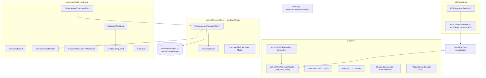

# agent — managed-file writers and reconcilers

The engine-config files ctxloom SHARES with the user (settings, `.mcp.json`) are written by the static delivery, one `safefs.Batch` per delivery under the claims record — see [`../core/delivery.md`](../core/delivery.md). This page covers the rest: the manifest-tracked command and skill trees, files ctxloom exclusively owns inside a foreign engine's directory, and the primitives they share. Each writer owns a *manifest-tracked* subset of a tree (or the whole file) and each write removes exactly the previous ctxloom-owned set before laying down the new one, so uninstall is always possible and foreign content survives. `CtxloomCommand` is the single policy point for what command lands in a generated config.

References below are by **symbol** (`Type.Method` or bare function name), not `file:line` — a line number drifts on any edit above it and silently points at the wrong thing; a symbol fails loud when it goes stale (`grep` finds nothing) instead of misleading.

```mermaid
flowchart TD
  subgraph prim["primitives"]
    AWF["safefs.WriteFileKeepMode(fs, path, data, desc)"]
    WFL["sessions.WithFileLock(fs, target, fn)"]
    GFS["GetFS(fs) — nil → OsFs"]
    WRN["Warn(fmt, ...) → clidiag"]
    CC["CtxloomCommand() = CtxloomBinary"]
    RC["RefuseCorrupt(fs, path, data, ...)"]
  end
  subgraph tree["manifest-tracked trees — packagefiles.go"]
    WMPF["WriteManagedPackageFiles[T]"]
    PED["pruneEmptyDirs"]
    PF["PackageFile{Path, Data, Mode}"]
  end
  subgraph cmds["command / skill rendering"]
    CE["CommandExport"]
    WMCF["WriteManagedCommandFiles"]
    SCRP["SafeCommandRelPath"]
    TMP["TransformMustacheToPositional"]
    EYS["EscapeYAMLString"]
    YDQ["yamlDoubleQuoted"]
    SKE["SkillExport"]
  end
  subgraph mcp["MCP registries"]
    MB["MCPServerJSONEntry / MCPServerInstalledJSON"]
    REG["MCPRegistrar (interface)"]
  end
  LEDGER[(".ctxloom-managed — internal/shared/ledger")]
  CJ["CanonicalJSON (marshal.go)"]
  SYM["symlink.go — WarnOnCtxloomPathSkew"]

  WFL --> AWF
  WMCF --> WMPF
  WMPF --> SCRP
  WMPF --> PED
  EYS --> YDQ
  CJ --> AWF
  WMPF --> LEDGER
  MB --> CJ
  REG --> MB
```

## R6: exclusively-owned files inside a foreign engine's directory (ruled 2026-08-14)

Some files live inside a *foreign* engine's config directory (`~/.claude`-shaped) but ctxloom is the **sole** author of the whole file — claude's per-instance `.claude.json`. Left to per-site judgment, "does exclusive ownership excuse the lock and the ledger" gets answered differently at every site — one writer relying on the *caller's* project lock rather than its own, another locked, a third skipping both outright — and the inconsistency is invisible until two of them race.

**The rule, no per-site judgment:** a file ctxloom exclusively owns inside a foreign engine's directory is locked and ledgered like a shared file.

- `claude.claudeInstanceConfig.WriteInstanceConfig` takes its own `sessions.WithFileLock` around the whole load-modify-write cycle, keyed to the generated file itself — not the caller's `isolation.lockInstanceHome`, which locks a *different* path (`paths.HomePathFor` on the instance-home directory vs. on the generated file) and serializes only `isolation.PrepareInstanceHome`.
- `claude.appendFlagDelivery.DeliverContext` now writes its framed `<hash>.sysprompt.md` cache file through `safefs.WriteFileKeepMode`, never a raw `afero.WriteFile`.

**The ratchet:** archlint's `LockDisciplineAnalyzer` and `LedgerDisciplineAnalyzer` (run by `just lint-arch`) are write-discipline-shaped rules — a name-based heuristic over every function in `internal/engines/claude` and this package (`lockDisciplineScopes`), with a reasoned, symbol-keyed allowlist in `archrules` whose stale entries the analyzer reports. They are heuristics, not proofs (see their own doc comments for exactly what they can and cannot see), and each carries a reasoned baseline for the gaps it knows about.

## Write primitives

| Symbol | Purpose |
|---|---|
| `safefs.WriteFileKeepMode` (in `internal/shared/safefs`) | The engine-file writers' write: `safefs.WriteFile`'s **unique** temp name in the destination directory (so two concurrent writers never clobber each other's in-flight bytes), fsync and rename, keeping an existing file's mode. **No backup is taken** (see the invariants below). Refuses a zero-byte write over an existing file unless the caller passes `safefs.AllowEmpty()`. |
| `sessions.WithFileLock` | The engine-file writers' one lock idiom (the static writer's batch included): `fn` runs as the WHOLE read-modify-write cycle under a lock at `paths.HomePathFor(target)` (a real OS home-rooted lock directory, not a sidecar beside `target`). Skipped when `fs` is not OS-backed (a test double has no other process to exclude). Fail-closed on acquisition failure. |
| `GetFS` | nil → `afero.NewOsFs()`; the single defaulting point every writer in this package and its engine callers uses. |
| `Warn` | `clidiag.Warn("ctxloom", …)`; binds the program name once. |
| `CtxloomCommand` | Returns `CtxloomBinary` — the bare executable name, so a materialized surface resolves against `PATH` at fire time and carries no fact about the machine that wrote it. |
| `SettingsOptions` | `{FS, ProjectClaims}` — the filesystem seam, and the ownership record's account of what the project writer claims (what a status read reports as installed). |
| `RefuseCorrupt` | The one refusal shape for "part of this user-owned file will not parse": backs the original bytes up to `<path>.corrupt-<unix>` and returns an error so the caller aborts *before* touching the file. Every backend that round-trips a user-editable settings/hooks/MCP file routes partial-parse failures here. |
| `CanonicalJSON` (`marshal.go`) | Marshal → generic decode with `UseNumber` (numeric precision preserved) → sorted, indented, newline-terminated re-encode. The double round-trip *is* the key-sorting mechanism. |

## Manifest-tracked trees — `packagefiles.go`

| Symbol | Purpose |
|---|---|
| `PackageFile` | One rendered file in a package: `{Path, Data, Mode}`. Shared vocabulary across every engine's command/skill writer. |
| `WriteManagedPackageFiles[T]` | Manifest-scoped tree writer: remove the previously-tracked set, render-to-a-temp-sibling-then-swap each file into place, rewrite the `ledger.Surface`-scoped manifest. Carries an empty-render guard (refuses to touch an existing surface when every enabled item rendered zero files). **Not itself wrapped in `WithFileLock`** — a known, deferred gap (it writes into directories shared with the user and with concurrently-firing hooks/applies); its render-to-temp-then-swap shape is also invisible to `LockDisciplineAnalyzer`'s write-signal heuristic, which recognizes `AtomicWriteFile`/`save*` but not this function's own `afero.WriteFile`-into-temp-dir + `fs.Rename` swap. |
| `pruneEmptyDirs` | Best-effort bottom-up empty-directory cleanup; all errors ignored by design. |

## Command and skill rendering

| Symbol | Purpose |
|---|---|
| `CommandExport` | Agent-agnostic slash-command export spec. |
| `SafeCommandRelPath` | Validates a bundle-supplied name as a path confined to a directory — a security boundary, since bundle content is remote. |
| `WriteManagedCommandFiles` | Adapts a command export ("a command is a one-file package") onto `WriteManagedPackageFiles`. |
| `TransformMustacheToPositional` | Rewrites `{{var}}` → `$N` by first-occurrence order. |
| `EscapeYAMLString` | Quotes and escapes for YAML frontmatter (command files). |
| `SkillExport` | Agent-agnostic Agent Skill package export spec — the `SurfaceSkills` sibling of `CommandExport`. |
| `yamlDoubleQuoted` (`commandfiles.go`) | `json.Marshal` of a string as a YAML double-quoted scalar — the package's one escaping algorithm. |

**One escaping algorithm, one quoting policy.** `yamlDoubleQuoted` always quotes and escapes control characters via `json.Marshal`. `EscapeYAMLString` (command frontmatter) decides WHETHER to quote and then delegates the escaping itself to `yamlDoubleQuoted`, rather than keeping hand-written rules that escaped neither `\n` nor `\r`.

## MCP registries

| Symbol | Purpose |
|---|---|
| `MCPServerJSONEntry` | Renders one `wire.MCPServer` as the generic map an `mcpServers` table holds, through the shared entry shape and a JSON round trip so `omitempty` is honoured. The one entry renderer every writer of that table shares. |
| `MCPServerInstalledJSON` | Read side: reports whether a named server is present. The write side is `confpatch` — a registrar patches the named member in place and records what it wrote; the whole-document `Install`/`Uninstall` helpers this package used to carry are gone with it. |

## internal/shared/ledger — the sidecar ownership record

**Marker filename:** `.ctxloom-managed` (constant `ledger.Name`) — **one filename for every engine and every surface**, not the per-engine `<Path>.ledger` variants that predated it. Lines are `<name>\t<surface>`; `Surface` is a deliberately open string type (the constants ctxloom writes, and any caller-defined value), so two co-located surfaces sharing one directory never delete each other's entries, and a plugin can claim its own surface with no registration step.

`ledger.Ledger.Read` returns `(nil, nil)` for a missing marker (the legitimate "nothing managed yet" case) but propagates any other read error — never flattens it to empty. `ledger.Ledger.Write` rewrites the marker atomically (`safefs.WriteFile`), in a stable sorted order (so an unchanged managed set produces byte-identical output), and removes the marker file only when **every** surface is empty.

Consumers: `WriteManagedPackageFiles` (`SurfaceCommands`/`SurfaceSkills`).

## Binary-path skew warning — `symlink.go`

| Symbol | Purpose |
|---|---|
| `GetExecutablePath` | `os.Executable` + `EvalSymlinks`, memoized in a package global. |
| `WarnOnCtxloomPathSkew` | Warns when the `ctxloom` on `PATH` differs from the running binary. Every materialized surface names the bare `ctxloom` (`CtxloomCommand`), so this is the only signal that a surface will fire a different build than the one running. Called from the MCP server's startup path. |

## Invariants and contracts

- **No write path takes a backup.** A `<path>.ctxloom.bak` copy is only needed by a writer that cannot tell its own content from the user's and rewrites the file wholesale; every writer here knows what it owns (the sidecar ledger, the claims record, or sole authorship) and edits only that.
- **The temp file name is unique per write** (`afero.TempFile` with a `.`+base+`.*.tmp` pattern), not a fixed suffix — two concurrent writers of the same settings file can never clobber each other's in-flight temp file the way a fixed name could.
- **A rename failure is returned, never papered over**, and there is no cross-device fallback: the temp file lives in the destination directory by construction, so cross-device rename cannot occur, and every internal failure branch best-effort removes the orphaned temp file before returning the error.
- **`safefs.WriteFile` and `safefs.WriteFileKeepMode` refuse a zero-byte write over an existing file** unless the caller passes `safefs.AllowEmpty()` — for a writer whose correct output can be literally zero bytes.
- **`CtxloomCommand` is the command policy for materialized surfaces**, and every writer — hooks, statusline, MCP registry — resolves through it. It returns the BARE name: several materialized surfaces (`.claude/settings.json`, `.mcp.json`) are tracked files shared across machines, and one is read from inside a container where a host path names nothing. The accepted cost is that a surface can fire a different build than the one that wrote it; `WarnOnCtxloomPathSkew` is the only thing that reports it.
- **`WriteManagedPackageFiles` removes the previously-tracked set BEFORE rendering.** Every per-item failure warns and continues, and the function returns `nil` when nothing was written — so a total render failure wipes the prior delivery and reports success. The manifest is the only record of what ctxloom owns in that tree, and (see R6 above) this function is not itself under `WithFileLock` — a known, deferred gap, not a fixed one.
- **`SafeCommandRelPath` must gate every bundle-supplied name** before it becomes a path. Bundle content is remote content.
- **The sidecar ledger (`internal/shared/ledger`, marker `.ctxloom-managed`) is the record of managed names** for every surface that uses it — not a per-engine `<Path>.ledger` file. Written sorted and atomically, removed only when every co-located surface is empty.
- **A ledger read error is propagated, not flattened.** `ledger.Ledger.Read` returns a real error rather than degrading to "nothing managed" — a writer that mistakes an unreadable ledger for an empty one concludes it manages nothing and orphans every entry it wrote last time. A missing marker is the one legitimate empty case, and it alone returns `(nil, nil)`.
- **A user-owned settings or registry file that fails to parse is refused, not replaced — at every level of the document.** `claude.ClaudeCodeHookWriter.loadSettings` routes a failed top-level decode through `corruptSettings` to `RefuseCorrupt`, and so does every nested block it splits out (`hooks`, and `parseStatusLine`/`parsePermissions` for `statusLine`/`permissions`/`permissions.deny`). "I could not read it" is not "it was empty": each of those paths once warned and continued, and the delete-then-re-emit-from-the-typed-field shape behind the warning meant the user's own hooks, statusline and allow/ask rules were dropped from the file on a success path. A warning is not a guard — the routing exists so no future field can be added with a warn-and-continue branch. A present-but-wrong-type `mcpServers` value takes the same route: the registrar's error path probes the document and refuses through `RefuseCorrupt` rather than writing members into a scalar.
- **The registrar contract lives with its consumer.** `taskloom/engine.Engine` is the MCP-registration facet an external tool uses without learning per-agent paths or formats; it is defined there rather than here because a registrar writes through `confpatch`, and `confpatch` depends on this package. `claude.MCPRegistrar` implements it over the same `applyMCPServers` patch ctxloom's own hook writer uses, so the two never disagree about how the table is written.
- **`WarnOnCtxloomPathSkew` is the guard on bare-name resolution** — every materialized surface carries the bare name `ctxloom`, so a stale build earlier on `PATH` serves them silently unless this warns.
