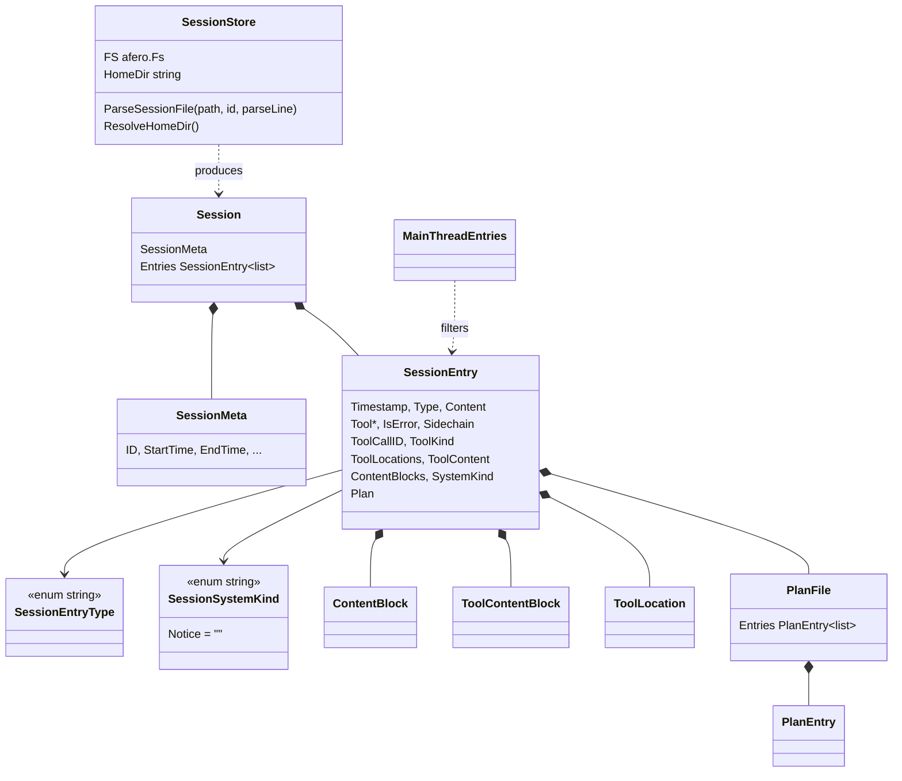

# agent — session transcript IR

The normalized conversation representation every engine's transcript is mapped *into* and every consumer (memory compaction, resume, the transcript importers, the ACP mapping layer) reads *out of*. `SessionEntry` is the hub type: one struct per conversation turn, a discriminated union flattened into fields whose liveness depends on `Type` and `SystemKind`. Each of these DTOs has a proto mirror in `internal/lm/grpc` and a JSON mirror in `internal/transcript/record.go` — three declarations of one shape, the standing cost of a hub IR.

## Types

| Symbol | file:line | Purpose |
|---|---|---|
| `Session` | `internal/shared/agent/backend.go:119` | One engine session: metadata plus its ordered entries. |
| `SessionMeta` | `internal/shared/agent/backend.go:127` | Session identity and time bounds, listable without loading entries. |
| `SessionEntry` | `internal/shared/agent/backend.go:153` | One normalized conversation turn (16 fields; core set plus the additive IR2 set). |
| `SessionSystemKind` | `internal/shared/agent/backend.go:228` | String enum classifying a system entry; `SystemKindNotice` is deliberately `""`. |
| `SessionEntryType` | `internal/shared/agent/backend.go:308` | String enum: user / assistant / tool-use / system etc. |
| `PlanFile` | `internal/shared/agent/backend.go:147` | A captured plan document attached to an entry. |
| `PlanEntry` | `internal/shared/agent/backend.go:249` | One line/item of a plan. |
| `ToolLocation` | `internal/shared/agent/backend.go:258` | File/range a tool call touched. |
| `ContentBlock` | `internal/shared/agent/backend.go:270` | One structured content block within an entry. |
| `ToolContentBlock` | `internal/shared/agent/backend.go:283` | One structured block of a tool result. |
| `SessionStore` | `internal/shared/agent/sessionstore.go:25` | Test-injection seam (`afero.Fs` + home override) that also hosts the shared JSONL parse loop. |

## Functions

| Symbol | file:line | Purpose |
|---|---|---|
| `MainThreadEntries` | `internal/shared/agent/backend.go:297` | Filters out sidechain entries; used by memory compaction and resume. |
| `NewSessionStore` | `internal/shared/agent/sessionstore.go:35` | Returns `SessionStore{FS: afero.NewOsFs()}`. |
| `(*SessionStore) ResolveHomeDir` | `internal/shared/agent/sessionstore.go:40` | `HomeDir` override, else `os.UserHomeDir`. The only reason `internal/antigravity` embeds the store. |
| `(*SessionStore) ParseSessionFile` | `internal/shared/agent/sessionstore.go:105` | Opens a JSONL transcript, runs an unbounded `bufio.Reader` loop calling `parseLine` per line, and derives `StartTime`/`EndTime` from the first and last entry. |
| `SortSessionsMostRecentFirst` | `internal/shared/agent/sessionstore.go:53` | Sorts `[]SessionMeta` descending by `StartTime`. |
| `MostRecentSession` | `internal/shared/agent/sessionstore.go:62` | Takes `sessions[0]` and loads it via the supplied getter. |
| `GetCurrentSessionViaListSessions` | `internal/shared/agent/sessionstore.go:78` | `list(workDir)` then `MostRecentSession`. |
| `GetCurrentSessionViaGetSession` | `internal/shared/agent/sessionstore.go:89` | Adapts a `(workDir, id)` loader onto the above; the only externally-reached entry of the three. |

## Invariants and contracts

- **`SessionEntry` is a union in struct clothing.** Which fields are live depends on `Type` and `SystemKind` — for `EntryTypeToolUse` the `Plan`/`ContentBlocks` fields are meaningless and vice versa. The discipline is enforced by prose only.
- **`SystemKindNotice` must stay `""`** so pre-existing records decode unchanged.
- **`ParseSessionFile` assumes `parseLine` emits entries in chronological order.** It derives `StartTime` from `Entries[0]` and `EndTime` from `Entries[len-1]` with nothing enforcing that ordering. The one caller, `internal/transcript/history.go:180-192`, ignores those fields and recomputes its own min/max — treat the store-set values as unreliable.
- **`ParseSessionFile` degrades to partial by design.** A transcript in which every line fails `parseLine` returns `(&Session{Entries: []}, nil)`; "empty file" and "20k unparseable lines" are indistinguishable to callers. No line counts are returned.
- **`MostRecentSession` blindly takes `sessions[0]`.** The "already sorted most recent first" precondition is a comment: `SortSessionsMostRecentFirst` has zero call sites anywhere in the repo, and each engine sorts for itself (e.g. `internal/opencode/capabilities.go:155`).
- **`MostRecentSession` returns an unwrapped `fmt.Errorf("no sessions found")`** with no sentinel, so "this project has no history" cannot be distinguished from a real failure.
- **`SessionStore` has two disjoint field partitions**: `{FS} → ParseSessionFile` and `{HomeDir} → ResolveHomeDir`. No caller uses both; the `ParseSessionFile` caller constructs a throwaway store purely to reach the method.
- **Two defaulting mechanisms for the OS filesystem coexist**: `NewSessionStore` sets `FS: afero.NewOsFs()` and `ParseSessionFile` calls `GetFS(s.FS)` (`settings_io.go:89`) which does the same, so a zero-value `SessionStore{}` behaves identically.
- **Every DTO here has three declarations** — this package, the proto in `internal/lm/grpc`, and the JSON record in `internal/transcript/record.go`. Adding a field means editing all three plus the converters.
