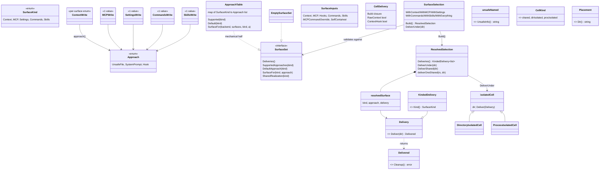

# agent — surface selection and delivery (cells)

The mechanism that decides *which* of a backend's context/MCP/settings/commands/skills surfaces get written and *how* their bytes reach the model. `SurfaceKind` names the category, `Approach` names the mechanism (unsafe-file / system-prompt / hook), `SurfaceSet` is a backend's declaration of what it supports, and `SurfaceSelection` is the opt-in builder that validates a caller's (kind, approach) choices and resolves them to `Delivery` values. Delivery then happens either into a private *isolated cell* (a per-run directory, making every well-known write race-free) or, when a backend must write into the shared cwd, through `deliverOneShared`.

## Selection vocabulary

| Symbol | file:line | Purpose |
|---|---|---|
| `Approach` | `internal/shared/agent/approach.go:25` | The shared dispatch key naming HOW a surface's bytes reach the model: `UnsafeFile` / `SystemPrompt` / `Hook`. |
| `Approach.String` | `internal/shared/agent/approach.go:48` | Diagnostic label, used in `Build`/`SurfaceFor` error text. |
| `ContextWrite` | `internal/shared/agent/approach.go:63` | Caller-facing per-surface enum for the context surface (3 values). |
| `MCPWrite` | `internal/shared/agent/approach.go:96` | Single-valued per-surface enum for MCP. |
| `SettingsWrite` | `internal/shared/agent/approach.go:110` | Single-valued per-surface enum for settings. |
| `CommandsWrite` | `internal/shared/agent/approach.go:124` | Single-valued per-surface enum for commands. |
| `SkillsWrite` | `internal/shared/agent/approach.go:141` | Single-valued per-surface enum for skills. |
| `ApproachTable` | `internal/shared/agent/approach.go:162` | `map[SurfaceKind][]Approach` — the data half of per-backend dispatch, with shared method bodies so only the table differs per engine. |
| `ApproachTable.Supported` | `internal/shared/agent/approach.go:166` | Approaches declared for a kind. |
| `ApproachTable.Default` | `internal/shared/agent/approach.go:171` | First entry of the slice, or `false`. |
| `ApproachTable.SurfaceFor` | `internal/shared/agent/approach.go:184` | Validates the approach then resolves kind → surface; errors name backend, kind, and approach. |
| `SurfaceKind` | `internal/shared/agent/cells.go:45` | The cross-backend surface category; explicitly not a dispatch key. |
| `SurfaceKind.String` | `internal/shared/agent/cells.go:73` | Stable label; `default:` correctly yields `"unknown"`. |

## Delivery seam

| Symbol | file:line | Purpose |
|---|---|---|
| `Delivery` | `internal/shared/agent/cells.go:30` | The one-method write contract: `Deliver(dir) (Delivered, error)`. |
| `KindedDelivery` | `internal/shared/agent/cells.go:93` | `Delivery` plus `Kind()`, so the surface kind rides the value instead of a downcast. |
| `unsafeNamed` | `internal/shared/agent/cells.go:560` | Optional self-describe (`UnsafeInfo()`), discovered by type assertion for the shared-cwd warning. |
| `Delivered` | `internal/shared/agent/delivery.go:21` | The universal cleanup handle returned by every `Deliver`. |
| `ContextDelivery` | `internal/shared/agent/delivery.go:31` | Per-surface facet: deliver context. Implemented only by `internal/claude`. |
| `MCPDelivery` | `internal/shared/agent/delivery.go:40` | Per-surface facet: deliver MCP. Implemented only by `internal/claude`. |
| `CommandsDelivery` | `internal/shared/agent/delivery.go:50` | Per-surface facet: deliver commands. Implemented only by `internal/claude`. |
| `SettingsDelivery` | `internal/shared/agent/delivery.go:60` | Per-surface facet: deliver settings. Implemented only by `internal/claude`. |
| `Placement` | `internal/shared/agent/delivery.go:71` | "Where does a file-writing strategy write" — one method, `Dir()`. |
| `ephemeralPlacement` | `internal/shared/agent/delivery.go:81` | Harp-scoped ephemeral dir, falling back to `os.TempDir()`. |
| `ephemeralPlacement.Dir` | `internal/shared/agent/delivery.go:87` | Resolves the dir; the `HarpEphemeralDir` error is deliberately swallowed into the fallback. |
| `cwdPlacement` | `internal/shared/agent/delivery.go:100` | Fixed-directory placement. Referenced only from `delivery_test.go:25`; `internal/claude` declares its own `dirPlacement` (`claude/surfaces.go:36`) instead. |
| `DeliveredFunc` | `internal/shared/agent/managedcontext.go:108` | The canonical closure → `Delivered` adapter. |
| `deliveredFunc` | `internal/shared/agent/managed_commands.go:57` | A byte-identical unexported twin of `DeliveredFunc`, 14 lines away in the same package. |
| `ComposedDelivery` | `internal/shared/agent/managedcontext.go:178` | Composes N deliveries sharing one `SurfaceKind` into one `KindedDelivery` (codex's two context routes). |
| `DeliverAll` | `internal/shared/agent/managedcontext.go:144` | Runs N deliveries, folding their handles into one. |
| `ManagedCommandsDelivery` | `internal/shared/agent/managed_commands.go:22` | Shared `Delivery` for engines whose slash-command exports are managed files (codex/antigravity/kiro/opencode). |
| `NewManagedCommandsDelivery` | `internal/shared/agent/managed_commands.go:33` | Constructor taking `{name, commands, write}`. |
| `ManagedSkillPackagesDelivery` | `internal/shared/agent/managed_skill_packages.go:19` | The skills-surface twin of the above; declared in its own header as a clone, differing only in element type and `Kind()`. |
| `NewManagedSkillPackagesDelivery` | `internal/shared/agent/managed_skill_packages.go:30` | Constructor. |

## Surface sets and cells

| Symbol | file:line | Purpose |
|---|---|---|
| `SurfaceSet` | `internal/shared/agent/cells.go:107` | A backend's delivery surfaces plus the four approach-dispatch methods. |
| `SurfaceInputs` | `internal/shared/agent/cells.go:147` | The per-run superset of everything any backend's surfaces write (11 fields, all consumed by at least one backend). |
| `CellDelivery` | `internal/shared/agent/cells.go:188` | A backend's cell-delivery configuration: a `Build` closure plus `RawContext` and `ContextHook` booleans. |
| `BuildWellKnown` | `internal/shared/agent/cells.go:220` | Generic adapter turning `func(SurfaceInputs, Fs) S` into `func(SurfaceInputs, string) SurfaceSet`; used by kiro and antigravity. |
| `EmptySurfaceSet` | `internal/shared/agent/cells.go:229` | Null object so acp/opencode/mock share the one cell-based `Setup` path. |
| `CellKind` | `internal/shared/agent/cells.go:255` | Plugin-side mirror of the grpc cell enum: shared / directory-isolated / process-isolated. |
| `CellKind.String` | `internal/shared/agent/cells.go:267` | Diagnostic label. |
| `isolatedCell` | `internal/shared/agent/cells.go:282` | A private directory that makes any well-known write race-free. |
| `isolatedCell.Deliver` | `internal/shared/agent/cells.go:289` | Forwards to the surface with the private dir — this call *is* the safety statement. |
| `DirectoryIsolatedCell` | `internal/shared/agent/cells.go:296` | Named `isolatedCell` subtype; adds no fields and no methods. |
| `ProcessIsolatedCell` | `internal/shared/agent/cells.go:304` | Named `isolatedCell` subtype; adds no fields and no methods. |
| `NewDirectoryIsolatedCell` | `internal/shared/agent/cells.go:310` | Constructor. |
| `NewProcessIsolatedCell` | `internal/shared/agent/cells.go:588` | Constructor with an identical body. |

## Builder and resolution

| Symbol | file:line | Purpose |
|---|---|---|
| `Select` | `internal/shared/agent/cells.go:335` | Begins an empty selection; establishes the non-nil map invariant. |
| `SurfaceSelection` | `internal/shared/agent/cells.go:329` | Opt-in builder — the caller names each kind at a named approach. |
| `SurfaceSelection.WithContext` | `internal/shared/agent/cells.go:340` | Opts the context surface in at a `ContextWrite` approach. |
| `SurfaceSelection.WithMCP` | `internal/shared/agent/cells.go:346` | Opts the MCP surface in. |
| `SurfaceSelection.WithSettings` | `internal/shared/agent/cells.go:354` | Opts the settings surface in. |
| `SurfaceSelection.WithCommands` | `internal/shared/agent/cells.go:361` | Opts the commands surface in. |
| `SurfaceSelection.WithSkills` | `internal/shared/agent/cells.go:368` | Opts the skills surface in. Reached in production only via `WithEverything`. |
| `SurfaceSelection.WithEverything` | `internal/shared/agent/cells.go:378` | Opts every present kind in at its default approach; an absent kind is skipped, not an error. |
| `SurfaceSelection.Build` | `internal/shared/agent/cells.go:395` | Validates and resolves every selected (kind, approach) into a `ResolvedSelection`. |
| `SurfaceSelection.DeliverUnder` | `internal/shared/agent/cells.go:444` | Build + delegate — the at-rest convenience terminal. |
| `resolvedSurface` | `internal/shared/agent/cells.go:454` | One built entry: `{kind, approach, delivery}`. |
| `kindedResolvedDelivery` | `internal/shared/agent/cells.go:463` | Adapts `(kind, Delivery)` → `KindedDelivery` so the kind rides the selection. |
| `ResolvedSelection` | `internal/shared/agent/cells.go:478` | The built deliverable. |
| `ResolvedSelection.Deliveries` | `internal/shared/agent/cells.go:488` | Projects surfaces to `[]KindedDelivery`, dropping nils. |
| `ResolvedSelection.DeliverUnder` | `internal/shared/agent/cells.go:514` | Delivers every surface into an isolated cell, collecting failures; `SystemPrompt` at rest is a loud, explicit error. |
| `ResolvedSelection.DeliverShared` | `internal/shared/agent/cells.go:541` | Shared-cwd counterpart to `DeliverUnder`. |
| `ResolvedSelection.deliverOneShared` | `internal/shared/agent/cells.go:660` | Prefers a backend's `SharedRealization` for the resolved (kind, approach) pair, else warns loudly and does the well-known write. |
| `containsApproach` | `internal/shared/agent/cells.go:430` | Slice membership helper. |

## Invariants and contracts

- **`surfaceOrder` is `{Context, MCP, Settings, Commands, Skills}`** (`cells.go:318`). `Build` iterates in that order and **skips** any kind whose `SupportedApproaches` is empty, so `surfaces[0]` is only the context surface for backends that have one.
- **In an `ApproachTable`, the FIRST entry of the slice is the default.** Connascence of position that every backend's table literal must honour (e.g. `claude/surfaces.go:350-356`).
- **Chaining order on `SurfaceSelection` does not matter** — `surfaceOrder` normalizes it. The one real ordering rule is checked and errors loudly: selecting context at the `Hook` approach requires the settings surface in the same `Build` (`cells.go:399-403`).
- **`deliverOneShared` keys `SharedRealization` on the (kind, approach) PAIR** (`cells.go:678`, fixed 2026-08-11 — U100-F05). claude's context surface realizes ONLY at `ApproachSystemPrompt`; a caller naming `ContextWriteUnsafeFile` on a shared cell gets EXACTLY that — the native CLAUDE.md write, loudly warned (the honor-with-warning fork DECIDED for that finding) — never the scratch it did not ask for. `SharedRealization`'s own default (no explicit caller preference) still lands on the scratch: `launch_backend.go`'s `deliverSet` derives it for a `CellKindShared` launch only, preferring the first `SupportedApproaches` entry that has a realization over the table's at-rest default, so a no-preference claude launch is unchanged from before this fix. mcp/settings have exactly one approach each and it is the one that realizes, so their `--mcp-config`/`--settings` launch flags are untouched by the re-key.
- **`ResolvedSelection.DeliverShared` has no production callers.** Production delivers per surface via `deliverOneShared` (`launch_backend.go:299`), which supports a context-failure fallback `DeliverShared` cannot express; the 11 `DeliverShared` call sites are all in `_test.go`.
- **`EmptySurfaceSet.SurfaceFor` errors on every (kind, approach) pair** (`cells.go:289`), matching the `SurfaceSet` contract ("errors on an unsupported combination the builder did not pre-validate," `cells.go:162`) rather than contradicting it. Reached only by a direct caller — `Build` short-circuits when `len(supported) == 0` (acp's protocol-only path), so a real selection never sees the refusal.
- **`Approach.String()`'s `default:` arm renders any out-of-range value as `"unsafe-file"`** and **`CellKind.String()`'s as `"shared"`** — in both cases the least-isolated option. `SurfaceKind.String` is the correct model (`default: "unknown"`).
- **`CellKind`'s values must match `pb.CellKind`'s decode.** Asserted by `internal/.../operations/cellkind_test.go:28`; it is decoded from the wire at `backend.go:338`/`:390`, so an out-of-range value is reachable.
- **`CellDelivery.ContextHook` requires `RawContext`** (the hook reads the cache file) and nothing validates the pair. `{ContextHook: true, RawContext: false}` compiles and installs a hook keyed to a file that was never written.
- **`DirectoryIsolatedCell` and `ProcessIsolatedCell` are behaviourally identical** — same embedded `isolatedCell{dir}`, no added fields or methods, identical constructor bodies. The consumer branches between them through an anonymous single-method interface (`launch_backend.go:313-320`), so the choice has no observable effect on delivery.
- **`unsafeNamed` is optional and discovered dynamically** by type assertion at `cells.go:579`; every implementer documents the link back.
- **Only `internal/claude` implements the four `DeliverX` facets** in `delivery.go`; every other backend goes through `Delivery`/`KindedDelivery` in `cells.go`. Two parallel mechanisms for the same job coexist.
- **A nil delivery is skipped and not reported as delivered** by `DeliverUnder`/`deliverOneShared` — the report reflects what was actually written.
- **`DeliverAll` stops at the first error with no rollback** of prior sub-deliveries, leaving a partial multi-route delivery on disk with no handle to reverse it.
