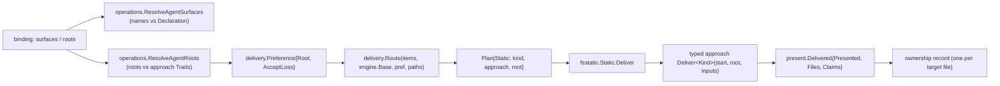

# agent — surface names and delivery

How a run's surfaces reach an engine, and what a binding may say about it.
Two halves, kept apart:

- **The name table** (`internal/core/agent`): per surface kind, the approach
  NAMES a binding may select (`agent edit --surface`) and which one is the
  default. A static table read by `--help`, shell completion and binding
  validation. Nothing is built from it.
- **The delivery** (`internal/core/engine`, `internal/core/delivery`,
  `internal/adapters/fsstatic`): the engine's typed approach for each kind
  (`engine.Definition`) delivers beneath the root the plan selected, and the
  ONE static writer (`fsstatic.Static`) commits what each approach declares
  and records its ownership.

Authority: `internal/core/agent/declaration.go` (the table),
`presentations.go` (one kind's names), `approach.go` (the shared name),
`cells.go` (`SurfaceKind`, `SessionHomeRooted`);
`internal/core/delivery/delivery.go` (`Route`, `Preference`, `Plan`);
`internal/adapters/fsstatic/fsstatic.go` (the writer).

```mermaid
flowchart LR
  B["binding: surfaces / roots"] --> RS["operations.ResolveAgentSurfaces<br/>(names vs Declaration)"]
  B --> RR["operations.ResolveAgentRoots<br/>(roots vs approach Traits)"]
  RR --> PREF["delivery.Preference{Root, AcceptLoss}"]
  PREF --> ROUTE["delivery.Route(items, engine.Base, pref, paths)"]
  ROUTE --> PLAN["Plan{Static: kind, approach, root}"]
  PLAN --> FS["fsstatic.Static.Deliver"]
  FS --> TA["typed approach Deliver&lt;Kind&gt;(start, root, inputs)"]
  TA --> DEC["present.Delivered{Presented, Files, Claims}"]
  DEC --> REC["ownership record (one per target file)"]
```

## The name table

`Declaration` is `map[SurfaceKind]Presentations`; `Presentations` is one
kind's sorted, unique names plus its default. `Presents(default, others...)`
takes the default as a required argument, so a kind without one cannot be
declared. `Names` is sorted on purpose — order carries no meaning, the
default is a named field — and returns the caller's own copy.

A kind absent from an engine's table is absent or folded for that engine
(hooks ride the settings file and are not selectable on their own).
Selecting it is refused at binding time like any other undeclared name.

The set of names is OPEN: an engine declares whatever it supports, in its own
package (claude's `ApproachSystemPrompt`, `ApproachMCPConfig`; the mock's
`MockSessionFile`). Exactly one name is a shared constant —
`ApproachUnsafeFile`, the native well-known file — because every engine
declares it and a binding's value must mean one thing whichever engine it
names. Why not a shared enum: a vocabulary defined by its consumers is the
first engine's shape with every later engine mapped onto it.

The table is read through `agent.Hosted.Declaration()`. It is a static
literal in each engine (`claude.Declaration`, `mock.Declaration`); tests hold
it to the typed Definition (`claude.TestDeclaration_NamesEveryKindTheDefinitionDelivers`,
`engines.TestApproachDispatch_DeclaredKindsAreDelivered`), so the table names
no kind the engine does not deliver.

**History.** The table once carried a constructor per name (`Construct`,
building a delivery "form" from per-run `SurfaceInputs`), the launch path
built writers from it by name, and `DeclarationOf` derived the table from
each typed approach's `Forms`. Once delivery moved onto the typed approaches
and the static writer, nothing in production built from it; the owner ruled
(2026-10-07) to retire it to a table of names.

## Resolution: name in, refusal out, no fallback

`operations.ResolveAgentSurfaces` checks a binding's `surfaces:` against the
engine's table. A name the engine does not declare is an ERROR naming the
names it does — never a downgrade to the default, which would teach the
caller its request had worked. The agent write path refuses it; the launch
path warns and drops a hand-edited value it finds later.

`operations.ResolveAgentRoots` checks a binding's `roots:` against the typed
approach's `Traits().Roots`: the kind must be one the engine carries and the
root one its approach offers.

## Delivery

`delivery.Route` turns the package's items into a plan: each static kind's
approach, under the root the preference selects or the approach's FIRST
offered root (every shipped engine offers the session home first, ruled
2026-09-21). A kind the engine does not carry is refused unless the
preference accepts its loss.

`fsstatic.Static.Deliver` runs each planned item's typed approach
(`DeliverContext`, `DeliverMCP`, `DeliverSettings`, `DeliverHooks`,
`DeliverCommands`, `DeliverSkills`) over the advised `present.Start`. The
approach DECLARES what it owns — whole files (`Files`) or values claimed into
a shared file (`Claims`) — and what it presents (`Presented`: the path and
the flag or env that announces it). The writer refuses a declaration that
disagrees with what the approach did, releases the writer's earlier claims,
and commits once per file.

An approach rooted under the session home refuses a run that advises none
(`agent.SessionHomeRooted`, `ErrUnrootedSessionHome`) rather than falling
back to the project's well-known file or the user's real home.

## Invariants

- **The table names only what the engine delivers.** Every kind with names is
  a kind the Definition carries; tests hold the two together.
- **No fallback on resolution.** An undeclared name is refused where it
  entered; nothing substitutes the default.
- **What is presented is where the bytes are.** A delivery's `Presented` path
  is a file it declares, a file it claims into, or the directory its declared
  files land in (`claude.TestDelivered_PresentsWhereTheApproachWrites`); an
  engine reads its launch flags off `Presented`, so a moved file moves its
  flag.
- **Payload, not exit code.** The integration matrix
  (`tests/integration/delivery_approach_matrix_test.go`) delivers every
  (engine, kind, offered root) through the static writer and asserts a
  sentinel lands in the promised file beneath that root and the other root
  stays empty.
