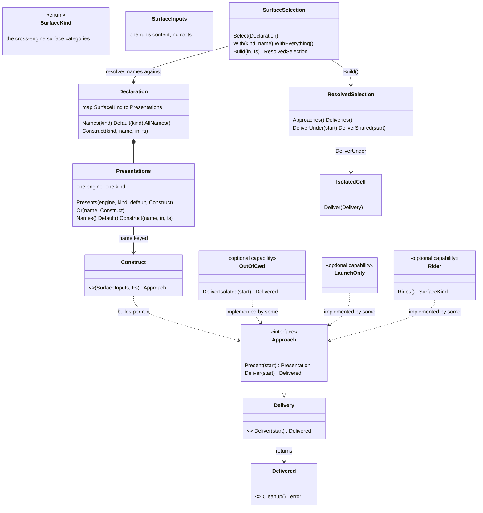

# agent — surface selection and delivery (cells)

The mechanism that decides *which* of an engine's surfaces get written and
*how* their bytes reach the model. `SurfaceKind` names the category (context,
MCP, settings, commands, skills); an `Approach` is ONE way one surface's bytes
reach the engine; an engine's `Declaration` is the static statement of every
approach it can construct per kind and which one it falls back to; and
`SurfaceSelection` is the opt-in builder that resolves a caller's named
(kind, approach) choices against that declaration and constructs them.
Delivery then happens either into a private *isolated cell* (a per-run
directory, making every well-known write race-free) or, when an engine must
write into the shared cwd, through the approach's own out-of-cwd form where it
has one and a loudly-warned well-known write where it does not.

Authority: `internal/core/agent/declaration.go` (the open set and the
capabilities), `approach.go` (the well-known names), `presentations.go` (a
declaration's per-kind half), `cells.go` (the seam, the cells, the builder).

```mermaid
classDiagram
    class SurfaceKind {
        <<enum>>
        the cross-engine surface categories
    }
    class Approach {
        <<interface>>
        Present(start) Presentation
        Deliver(start) Delivered
    }
    class OutOfCwd {
        <<optional capability>>
        DeliverIsolated(start) Delivered
    }
    class LaunchOnly { <<optional capability>> }
    class Rider {
        <<optional capability>>
        Rides() SurfaceKind
    }
    class Construct { <<func>> (SurfaceInputs, Fs) Approach }
    class Presentations {
        one engine, one kind
        Presents(engine, kind, default, Construct)
        Or(name, Construct)
        Names() Default() Construct(name, in, fs)
    }
    class Declaration {
        map SurfaceKind to Presentations
        Names(kind) Default(kind) AllNames()
        Construct(kind, name, in, fs)
    }
    class SurfaceInputs { one run's content, no roots }
    class SurfaceSelection {
        Select(Declaration)
        With(kind, name) WithEverything()
        Build(in, fs) ResolvedSelection
    }
    class ResolvedSelection {
        Approaches() Deliveries()
        DeliverUnder(start) DeliverShared(start)
    }
    class Delivery { <<interface>> Deliver(start) Delivered }
    class Delivered { <<interface>> Cleanup() error }
    class IsolatedCell { Deliver(Delivery) }

    Declaration *-- Presentations
    Presentations --> Construct : name keyed
    Construct ..> Approach : builds per run
    Approach ..|> Delivery
    OutOfCwd ..> Approach : implemented by some
    LaunchOnly ..> Approach : implemented by some
    Rider ..> Approach : implemented by some
    SurfaceSelection --> Declaration : resolves names against
    SurfaceSelection --> ResolvedSelection : Build()
    ResolvedSelection --> IsolatedCell : DeliverUnder
    Delivery ..> Delivered : returns
```

## The open set

`Approach` is an interface, and the set of approaches is OPEN: an engine
supplies one value per delivery mechanism it actually supports, in its own
package, and says nothing about the ones it cannot. Shared code never
enumerates approaches and never names an engine-specific one.

Why not a shared enum: a shared vocabulary defined by its consumers is not a
vocabulary — it is the first engine's shape with every later engine mapped
onto it, and adding one that did not fit meant editing the enum, its ordering
list and its parser. The file doc on `declaration.go` records this as the
reason the set is open, and the shape follows the open-sets ruling that
already governs roots: keyed by name; the well-known members stay well-known
as NAMED CONSTANTS; and a name the declaration cannot construct FAILS LOUD.

Exactly two names are shared constants, and only because SHARED code has to
ask for them by name (`approach.go`):

- `ApproachUnsafeFile` — the engine's native, well-known file. The at-rest
  callers (materialize, apply, remove, currency) ask every engine for this.
  "unsafe" names itself loudly because choosing it IS the race
  acknowledgment: a well-known write into a shared live cwd cannot be locked
  against a concurrent session; into an isolated cell it is always safe.
- `ApproachHook` — context carried by a SessionStart injection hook reading a
  content-addressed cache file. apply and the launch fallback ask for it.

An approach only one engine has is named by that engine in its own package
(claude's `ApproachSystemPrompt`); naming it in shared code would be the enum
growing back.

### Three phases, kept apart

| Phase | When | What it may read |
|---|---|---|
| REGISTRATION | package init | Nothing run-specific. A name maps straight to a `Construct`, so "supported" and "constructible" are ONE fact — a name is known if and only if a constructor is registered under it (`Presentations`). |
| CONSTRUCTION | per run | THAT run's content (`SurfaceInputs`). No roots: the built `Approach` receives them at `Present`/`Deliver` time through the advised `present.Start`. One registration builds for a host run, a worktree run and a container run and lands in different places. |
| ENUMERATION | `--help`, completion, config validation | Registration ONLY. `Declaration.Names`/`Default`/`AllNames` are pure; nothing they read may require a built approach or a root. |

`Presentations.Names` is sorted, not in declaration order, on purpose: order
carries no meaning. The default is a NAMED key into the constructors
(`Presents` takes it as the required first delivery), never a positional
convention, so a `Presentations` without a default does not exist and a
default that nobody can ask for by name is unwritable.

### Optional capabilities replace branching on identity

Shared code never asks "is this approach X". It asks what the approach can do,
by type assertion against three small interfaces in `declaration.go`:

| Capability | Meaning | Who consumes it |
|---|---|---|
| `OutOfCwd` | The approach ALSO has a race-safe FORM: the same surface written beneath the advised Scratch root and announced to the engine by a launch flag, via `DeliverIsolated`. It is a second form of one approach, not a separate approach — that is what keeps a well-known-file approach pinned on a shared launch converted, and the same approach on an isolated cell landing as the well-known file. | `ResolvedSelection.deliverOneShared` runs it in place of `Deliver`, without the race warning; `LaunchBackend`'s shared-launch preference (`preferOutOfCwd`) prefers a declared approach that has one. |
| `Rider` | The approach writes no bytes of its own and rides another kind's write (hook-carried context rides the settings surface). | `SurfaceSelection.Build` refuses a selection naming a Rider without its ridden kind — a rider delivered alone would report success having carried nothing. Its own delivery is a no-op that holds no cleanup handle. |
| `LaunchOnly` | The bytes reach the engine only through a launch: the out-of-cwd form is announced on argv, and an at-rest delivery has no argv sink to hand that flag to. | `ResolvedSelection.DeliverUnder` refuses it, naming the surface; selecting it at rest is a caller error, not a launch. |

Omitting a capability is the safe direction in every case: an approach
without `OutOfCwd` is warned and not preferred, never silently treated as
race-free.

## Resolution: name in, approach out, no fallback

`Select(decl)` begins a selection over an engine's `Declaration`. `With(kind,
name)` opts one kind in at a named approach; `WithEverything` opts every
DECLARED kind in at its default — a kind absent from the declaration is
skipped, never an error, because absence means "this engine has no such
surface or folds it into another". `Build(in, fs)` validates every (kind,
name) against the declaration and constructs it.

There is deliberately no fallback anywhere on this path. `Declaration.Construct`
returns false for a name the engine does not declare and the CALLER names the
failure: `Build` errors, a config loader raises its finding. A name that
resolved to the default behind the caller's back would deliver a different
presentation than the one asked for — the silent substitution the open set
exists to refuse. This is also why a config-authored composition (an agent
binding naming a delivery as a bare string) is checked at RESOLVE time rather
than build time: no compiler sees it, so the name is looked up where it
entered and refused there (`presentations.go`'s file doc contrasts this with
the program-authored `present` chain, where an illegal composition is
unwritable).

## Cells own race-safety

A cell, not a parallel type hierarchy, decides whether a well-known write is
safe.

- **Isolated cell** (`IsolatedCell`, built from the advised `present.Start` by
  `NewIsolatedCell`): a private per-run directory makes ANY well-known write
  race-free by construction. `ResolvedSelection.DeliverUnder` delivers every
  resolved surface through it; the resolved approach is irrelevant to safety
  there.
- **Shared cwd** (`ResolvedSelection.DeliverShared`, per surface
  `deliverOneShared`): runs the approach's `OutOfCwd` form when it has one;
  otherwise performs the well-known write and warns loudly, using the
  surface's own `UnsafeInfo` (the optional `unsafeNamed` self-description) for
  the warning text. The caller's `ApproachUnsafeFile` choice IS that warning's
  acknowledgment.

Every path a `present.Start` enters a `Delivery` through checks `rooted` first:
an unresolved project root is refused once with `ErrUnrootedDelivery`, because
a `""` root joined into a well-known path yields a bare relative path that
looks well-formed and lands wherever the process happens to be.

## The write seam

`Delivery.Deliver(start present.Start)` is the one-method write contract every
approach satisfies. It receives what the pre-advice produced — the same
`present.Start` every presenter composes from, with every root resolved for
THIS run — never a bare directory string. The presenter DECIDES where bytes
go; `Deliver` ACTS. A surface therefore cannot compute a location of its own
from a string it was handed, and a run whose roots differ from the last one
reaches the writer through the same value that reached its presenter.

`Delivered` is the cleanup handle every `Deliver` returns; nil means nothing
was written and there is nothing to reverse. `KindedDelivery` carries the
`SurfaceKind` on the value so a cell never downcasts to learn what it wrote.

Generic approaches — implemented once in `approaches_generic.go`, registered
by any engine that can use them, imposed on none — exist only where more than
one engine already shares the mechanism: `NativeContextFile` (the native
managed-section context file, a `Construct` factory because the writer and
path are static facts about the engine while the content is a per-run fact)
and `HookCarriedContext` (the shared `Rider`). The managed commands and skill
package deliveries are likewise shared writers an engine's approach wraps.

## Invariants and contracts

- **A name is known iff a `Construct` is registered under it.** Support is not
  recorded anywhere; it is the presence of the thing that does the work. The
  vocabulary `Names` reports is derived from the constructors, so it cannot
  drift from what the engine can build.
- **Every `Presentations` has a default, and it is constructible.** Both hold
  by construction: `Presents` takes the default as its required first
  delivery, and `Or` copies rather than mutating so a declaration shared as a
  value cannot gain deliveries through an alias after registration.
- **No fallback on resolution.** `Declaration.Construct` / `Presentations.Construct`
  return false for an undeclared name; the caller errors. Nothing substitutes
  the default.
- **Preference between approaches is the CALLER's and the CELL's, never a list
  order.** `profile materialize` names the native file because its output must
  outlive ctxloom; a shared-cwd launch prefers whichever declared approach has
  an `OutOfCwd` form; an isolated cell takes the default. `preferOutOfCwd`
  errors when an engine declares more than one out-of-cwd approach for a kind
  and none of them is its default — a declaration that rich must say which it
  prefers.
- **A `Rider` needs its ridden kind in the same `Build`.** Checked at `Build`,
  errors loudly, names both kinds.
- **A `LaunchOnly` approach is refused at rest.** `DeliverUnder` errors,
  naming the surface. It is not a silent skip.
- **Isolation converts; nothing else does.** The same approach lands as the
  well-known file in an isolated cell and as its `OutOfCwd` form on a shared
  launch. An explicit per-kind preference from the caller is HONOURED on a
  shared launch, not converted back to the scratch form.
- **A nil `Delivered` is skipped and not reported as delivered.** The report
  reflects what was actually written.
- **`Present` is load-bearing for argv.** An engine that announces an
  out-of-cwd file on a launch flag reads the flag NAME from the approach's own
  `Present(...)`, not from a constant beside it, so changing a declared flag
  changes the argv with it (claude's `flagArgs`).
