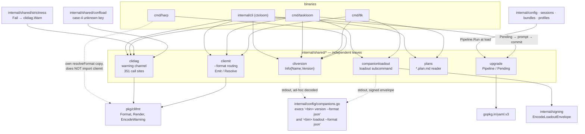

# CLI-side shared helpers — `clidiag`, `cliemit`, `cliversion`, `companionloadout`, `plans`, `upgrade`

Six independent leaf packages under `internal/shared/` that the three CLI binaries (`ctxloom` via `internal/cli`, `cmd/taskloom`, `cmd/ltk` — plus `cmd/harp`, which opts out) share so a cross-binary convention is declared once instead of per binary. They own, respectively: the process-wide stderr **warning channel** (`clidiag`), the `--format` **success-output routing** (`cliemit`), the `version --format json` **wire shape** (`cliversion`), the companion `loadout` **subcommand and envelope** (`companionloadout`), the `*.plan.md` **reader** (`plans`), and the in-memory YAML **schema-upgrade primitive** (`upgrade`).

They do not depend on each other. The only shared substrate is `pkg/clifmt` (three of them) and `cobra` (two of them); `upgrade` and `plans` touch neither.

## `internal/shared/clidiag` — the warning channel

The family's process-wide stderr **warning** channel. It owns the two wire shapes a non-fatal diagnostic can take (`"<prog>: warning: <msg>"` and a `clifmt.WarningEnvelope` JSON-Lines object), the global switch between them, the global redirect of the default destination, and a global per-message dedup set. Highest fan-in package in the module: 123 files across 29 internal packages, 351 call sites (`Warn` ×325, `WarnOnce` ×12, `Fwarn` ×14). Its only dependency is `pkg/clifmt`. Every path funnels into `fwarn`, the single place the wire-shape branch lives.

| Symbol | file:line | Purpose |
|---|---|---|
| `Line` | `internal/shared/clidiag/clidiag.go:25` | Builds the human line without writing it; used as `FwarnOnce`'s dedup key. Splices `prog` into the format string. |
| `structured` (`atomic.Bool`) | `internal/shared/clidiag/clidiag.go:41` | Which wire shape all warnings take. |
| `SetStructured` | `internal/shared/clidiag/clidiag.go:45` | Flips the process into JSON-envelope mode. |
| `Fwarn` | `internal/shared/clidiag/clidiag.go:56` | Formats args, delegates to `fwarn` against an explicit writer. |
| `fwarn` | `internal/shared/clidiag/clidiag.go:63` | The only branch point: `clifmt.EncodeWarning` when structured, `Fprintf("%s: warning: %s\n")` otherwise. Both write errors are discarded. |
| `sink` (`atomic.Pointer[io.Writer]`) | `internal/shared/clidiag/clidiag.go:80` | Process-wide default destination; `nil` means `os.Stderr`. |
| `SetSink` | `internal/shared/clidiag/clidiag.go:88` | Swaps the default writer and returns a `restore` closure that unconditionally `Store`s the captured previous value. |
| `warnSink` | `internal/shared/clidiag/clidiag.go:99` | Resolves the current sink, defaulting to `os.Stderr` — the one place the nil⇒stderr invariant lives. |
| `Warn` | `internal/shared/clidiag/clidiag.go:108` | `Fwarn(warnSink(), ...)`. The module's single most-called internal function. |
| `onceSeen` / `onceMu` | `internal/shared/clidiag/clidiag.go:114-117` | The print-dedup set. No reset, no cap, no eviction. |
| `FwarnOnce` | `internal/shared/clidiag/clidiag.go:125` | Formats, computes `Line(...)` as key, dedups under `onceMu`, delegates to `fwarn`. |
| `WarnOnce` | `internal/shared/clidiag/clidiag.go:140` | `FwarnOnce(warnSink(), ...)`. |
| `Warner` | `internal/shared/clidiag/clidiag.go:148` | `string` newtype binding a program name. |
| `(Warner) Warn` | `internal/shared/clidiag/clidiag.go:152` | `Warn(string(p), ...)`. Satisfies no interface in the repo. |

## `internal/shared/cliemit` — `--format` routing for success output

Decides, for one cobra command invocation, whether the user gets the bespoke human text or a `clifmt`-rendered structured encoding, and routes the call. Design intent: a command builds its result once and hands both a structured value and a text closure to `Emit`, so `--format` is a presentation choice and never a branch in business logic. Two functions, zero types, no package state.

| Symbol | file:line | Purpose |
|---|---|---|
| `Emit` | `internal/shared/cliemit/cliemit.go:25` | Resolves the format; if it is `text` **and** `text != nil`, runs the closure; otherwise `clifmt.Render(cmd.OutOrStdout(), data, format)`. A nil closure is the "reflective text render" affordance. |
| `Resolve` | `internal/shared/cliemit/cliemit.go:42` | Three-way precedence: a `Changed` `--json` flag ⇒ `FormatJSON`; else raw `--format`, with `""` ⇒ `FormatText` and anything else through `clifmt.ParseFormat`. The `GetString` error is discarded. |

Fan-out: 12 direct production `Emit` sites (`cmd/taskloom` ×10, `cmd/ltk/version.go`, `internal/cli/format.go:44`), and that last one fans out to 143 `emit(` calls inside `internal/cli`. `Resolve` has 4 direct production callers. `cmd/harp/root.go:113` keeps its own `resolveFormat` and does not import this package.

## `internal/shared/cliversion` — the `version --format json` wire shape

Owns the `{name, version}` JSON shape every family binary emits from `<binary> version --format json`, so the shape is declared once. This is the **producer** half of a cross-process contract whose consumer is `internal/config/companions.go:40`, which execs the probe at boot to decide whether a companion (taskloom, ltk, harp) is present and version-compatible.

| Symbol | file:line | Purpose |
|---|---|---|
| `Info` | `internal/shared/cliversion/cliversion.go:15` | `{Name string \`json:"name"\`; Version string \`json:"version"\`}` — the wire shape. Constructed by `cmd/harp/version.go:30`, `cmd/ltk/version.go:20`, `cmd/taskloom/version.go:24`, `internal/cli/version.go:16`. |
| `Render` | `internal/shared/cliversion/cliversion.go:23` | String-switch renderer: `""`/`"text"` writes `info.Version` + newline; `"json"` writes indented JSON; anything else returns an "unknown format" error listing the supported set. |

All four production version commands render through `clifmt.Render` or `cliemit.Emit`, not through `Render`.

## `internal/shared/companionloadout` — the companion `loadout` subcommand

The **emitter half** of the companion-loadout wire protocol: the single shared `loadout` cobra subcommand every in-repo companion binary registers, so ctxloom can exec `<bin> loadout --format json` and receive that companion's self-described bundle inside a signed JSON envelope (signature-envelope spec §4.3). It holds **dispatch only** — loadout *content* stays per-binary because `go:embed` can only embed files in the embedding package's own directory, so each companion embeds its own `loadout.yaml`/`loadout.yaml.sig` and passes the bytes in. Declares no types. Imported by exactly `cmd/ltk` and `cmd/taskloom`; its only internal dependency is `internal/signing`.

| Symbol | file:line | Purpose |
|---|---|---|
| `NewCommand` | `internal/shared/companionloadout/cli.go:35` | Builds the `loadout` cobra command: `Use: "loadout"`, help text interpolating `binName`, a `--format` string flag defaulting to `"yaml"`, and a `RunE` delegating to `Emit`. Registration is the caller's. |
| `RunE` closure | `internal/shared/companionloadout/cli.go:49` | `Emit(cmd.OutOrStdout(), format, bundleYAML, sig)` — routes through cobra's writer, not `os.Stdout`. |
| `ReadEmbeddedSig` | `internal/shared/companionloadout/cli.go:65` | `fs.ReadFile("loadout.yaml.sig")`, returning `nil` on any error. Exists because companions embed via the wildcard `//go:embed loadout.yaml*`; a literal `.sig` directive would hard-fail the build when no signature is committed. |
| `Emit` | `internal/shared/companionloadout/cli.go:76` | The pure core. `"yaml"` writes `bundleYAML` **verbatim, no trailing newline**; `"json"` calls `signing.EncodeLoadoutEnvelope(bundleYAML, sig, "")` then writes the envelope plus a newline; anything else errors naming the bad value and the valid set. Exported so companion tests can bypass cobra. |

## `internal/shared/plans` — the `*.plan.md` reader

Locates, enumerates, and reads the `*.plan.md` session-plan documents under `~/.ctxloom/sessions/<harp>/`, extracting a display title and the `sessions:` stamp list from each file's YAML frontmatter. It is the **read half** of a read/write pair whose write half is `internal/memory.StampPlanFile` (`internal/memory/stamp.go:27`, driven by the `stamp-plan` hook at `internal/cli/hook_stamp_plan.go:47`). Consumers: `cmd/taskloom` (`plan list`/`plan show` — the only users of `ListHome`/`Show`) and `internal/cli` (`plan watch`, which uses only `HomeSessionsDir`). The `Plan` JSON DTO is the wire contract for the out-of-repo ctxloom VS Code Plan view.

| Symbol | file:line | Purpose |
|---|---|---|
| `sessionsDirName`, `planExt` | `internal/shared/plans/plans.go:18-20` | `"sessions"` and `".plan.md"` — local re-declarations of `paths.SessionsDir` (`internal/paths/paths.go:97`) and `paths.PlanFileExt` (`:108`). |
| `Plan` | `internal/shared/plans/plans.go:24` | The DTO. All five fields are written by `List` and by nothing else. |
| `Plan.Path` | `internal/shared/plans/plans.go:26` | Absolute path; the exact value `plan show` accepts. Reaches JSON output but not the text table. |
| `Plan.Name` | `internal/shared/plans/plans.go:28` | Basename minus `.plan.md`; secondary sort key. |
| `Plan.Title` | `internal/shared/plans/plans.go:30` | Frontmatter `title`, falling back to `Name`. |
| `Plan.Session` | `internal/shared/plans/plans.go:32` | Owning harp = the directory name; primary sort key. |
| `Plan.Sessions` | `internal/shared/plans/plans.go:35` | The frontmatter stamp list. No in-repo reader; the VS Code Plan view is the only possible consumer. |
| `HomeSessionsDir` | `internal/shared/plans/plans.go:40` | `filepath.Join(os.UserHomeDir(), ".ctxloom", "sessions")`. Line-for-line duplicate of `paths.HomeSessionsDir` (`internal/paths/paths.go:162`). |
| `ListHome` | `internal/shared/plans/plans.go:49` | `HomeSessionsDir` then `List`. |
| `List` | `internal/shared/plans/plans.go:60` | Walks `<root>/<harp>/*.plan.md` **one level deep**, parses each file's frontmatter, sorts by `(Session, Name)`. A missing root yields `([]Plan{}, nil)`. |
| `Show` | `internal/shared/plans/plans.go:115` | Validates the `.plan.md` suffix, checks the absolute path is lexically inside `~/.ctxloom/sessions`, then `os.ReadFile`s it. Every rejection returns a distinct error naming the path. |
| `ParseFrontmatter` | `internal/shared/plans/plans.go:145` | Hand-rolled scanner over a leading `---` block, extracting the `title` scalar and a **block-style** `sessions:` sequence. Returns `("", nil)` for anything it cannot parse. |
| `unquote` | `internal/shared/plans/plans.go:178` | Strips one matching pair of surrounding `"` or `'`. Applied to the title at `:169`, **not** to sequence items at `:159`. |

## `internal/shared/upgrade` — the in-memory YAML schema-upgrade primitive

Parses a YAML file once, runs an ordered chain of in-place `yaml.Node` mutators over the root mapping, re-encodes only if some stage reported a change, and returns the new bytes plus the names of the stages that fired — **without ever writing to disk**. Four packages build a `Pipeline` and call `Run` on raw file bytes at load time (`internal/config` with five schema generations, `internal/sessions`, `internal/bundles`, `internal/profiles`); `internal/cli` and `internal/operations` consume only the `Pending` DTO to drive the "rewrite it? [y/N]" prompt. Leaf package, zero internal dependencies. Roughly half its API is a general `yaml.Node` DOM helper set that has nothing upgrade-specific about it (94 of the 105 cross-package references).

| Symbol | file:line | Purpose |
|---|---|---|
| `Upgrader` | `internal/shared/upgrade/upgrade.go:27` | The one-schema-step contract: `Name() string` for the log/prompt, `Apply(root *yaml.Node) (changed bool)` for the mutation. No error channel. No consumer names the type outside this file. |
| `Pipeline` | `internal/shared/upgrade/upgrade.go:38` | An ordered `[]Upgrader` that is itself an `Upgrader`. |
| `Pipeline.Name` | `internal/shared/upgrade/upgrade.go:41` | Returns the constant `"upgrade pipeline"`; reachable only when a pipeline is nested in a pipeline. |
| `Pipeline.Apply` | `internal/shared/upgrade/upgrade.go:46` | Runs every stage against the same root and ORs the `changed` bools; reachable only when nested. |
| `Pipeline.Run` | `internal/shared/upgrade/upgrade.go:61` | The byte driver: unmarshal → gate on a mapping root → run stages collecting names → re-encode if any fired. Returns `(out []byte, applied []string)` and no error. |
| `Pending` | `internal/shared/upgrade/upgrade.go:94` | `{Path string; Data []byte; Applied []string}` — records that a load upgraded an older document in memory. `Data` is documented and treated as "ready to persist verbatim". |
| `Version` | `internal/shared/upgrade/upgrade.go:103` | Reads a top-level int schema version; a missing key, a non-scalar node, or an unparseable value all yield `0`. |
| `SetVersion` | `internal/shared/upgrade/upgrade.go:117` | Builds a scalar with `Tag = "!!int"` and `MapSet`s it. The tag override is essential: without it the version round-trips as a quoted string and `Version` returns 0 next load. |
| `MapValue` | `internal/shared/upgrade/upgrade.go:124` | Pairwise `i, i+1` scan of a mapping node's `Content` for a key; returns the value node or nil. 48 production references. |
| `MapSet` | `internal/shared/upgrade/upgrade.go:134` | Replaces the key's value in place, or appends the key/value pair. Returns nothing. |
| `MapDelete` | `internal/shared/upgrade/upgrade.go:145` | Removes the **first** key/value pair matching the key. Returns nothing; a duplicate key survives. |
| `EnsureMap` | `internal/shared/upgrade/upgrade.go:156` | Returns `parent[key]` if it is a mapping; otherwise **replaces** whatever is there with a fresh empty map. |
| `ScalarNode` | `internal/shared/upgrade/upgrade.go:166` | `&yaml.Node{Kind: ScalarNode, Tag: "!!str", Value: val}` — keeps the `Kind`+`Tag` pairing in one place. |

## Invariants and contracts

### clidiag

- `SetStructured` and `SetSink` must be called **before any warning is emitted** — both binaries do it from the root command (`internal/cli/root.go:118`, `cmd/taskloom/root.go:47`). Nothing enforces the ordering.
- `warnSink()` is the sole reader of `sink` and the sole place `nil ⇒ os.Stderr` is decided; never read `sink` directly.
- `SetSink`'s `restore` closure does an unconditional `Store(prev)`, so it is correct **only under strict LIFO nesting**. Overlapping redirects restore the wrong sink. Five of six call sites use `defer restore()`.
- `SetSink` guarantees "never a nil writer" only for an **untyped** `nil`; a typed nil (`var f *os.File; SetSink(f)`) takes the non-nil branch and installs a writer that panics on the next warning.
- The dedup key is the fully-rendered line and **does not include the destination writer**. A message already emitted to a previous sink is permanently suppressed on every later sink — including a per-session diagnostics file installed by `internal/cli/run_terminal_ui.go:182`, which the user is explicitly pointed at.
- `onceSeen` has no reset and no cap. Several `WarnOnce` sites embed a varying `%v` error inside reconnect loops (`internal/agentcoord/coord/home.go:232,265,354`; `runnerlink.go:227`), so entries multiply in exactly the long-lived processes the package doc names.
- Write errors are discarded on both paths, deliberately: warnings never block. The named out-of-band observer is `iox.ErrWriter`.
- `prog` is a per-binary constant passed positionally at every site: 327 of 351 call sites pass the literal `"ctxloom"`, 4 `"taskloom"`, 3 `"ctxloom hook inject-context"`.
- Layering rule: `clidiag` is the family-wide convention (hence the `prog` parameter); ctxloom-specific concepts such as findings belong **above** it in `internal/shared/strictness`, never inside it.

### cliemit

- `Resolve` may only be called **after** cobra has merged parents' persistent flags into `cmd.Flags()` — i.e. from inside `RunE`/`PersistentPreRunE`. Called earlier it silently returns `FormatText`.
- Precedence is fixed: a `Changed` `--json` shorthand beats an explicit `--format`, which beats the `""` ⇒ `FormatText` default.
- A missing or wrongly-typed `--format` flag resolves to `FormatText`, identical to a deliberate `--format text` — the `GetString` error is discarded, so "this command was never wired for `--format`" is indistinguishable from "the user asked for text".
- `--format` is registered as a **persistent** flag on each binary's root (`internal/cli/format.go:63`, `cmd/taskloom/format.go:11`, `cmd/ltk/main.go:53`), so every command in the tree *accepts* it; *honouring* it requires that command's `RunE` to voluntarily call `emit()`. Nothing binds acceptance to honouring — 36 entries in `internal/cli/format_coverage_test.go` self-declare "not wired to emit() yet" out of 154.
- `Emit` is not a backstop: with a non-nil text closure it delegates entirely and cannot detect a closure that writes nothing.
- With a nil closure over an **empty scalar slice**, the text path writes zero bytes while the same value under `--format json` writes `[]`.
- Only the **success** half of `--format` lives here. The error half is `clifmt.RenderError`, called from exactly one place, `internal/cli/root.go:187`; `cmd/taskloom` and `cmd/ltk` render errors as plain text whatever `--format` says.
- `Emit(cmd, data, text)` cannot express "the payload shape depends on the format", so six call sites hand-roll the format branch (`cmd/taskloom/commands.go:190-195,226-231`, `cmd/taskloom/lint.go:63-71`).
- Four format vocabularies coexist for one user-facing flag: `clifmt.Format`; the `formatText`/`formatJSON` string constants for streaming commands (`internal/cli/format.go:20-23`); the `--json` bool shorthand (registered by 5 `cmd/taskloom` commands only); and `cmd/harp`'s private `resolveFormat` (`cmd/harp/root.go:113`), which has no `""`⇒text fallback and no `--json` handling.

### cliversion

- `Info`'s two JSON keys are a **cross-process contract**: the producer is any family binary's `version` command, the consumer is `internal/config/companions.go`. Renaming or adding a field breaks companion detection, and the failure surfaces as "companion not detected", not as an error.
- The consumer does **not** import `Info`; `companionVersion` (`internal/config/companions.go:152-166`) hand-decodes the probe output, so the two sides agree only on the literal string `"version"`. The consumer does reject an empty `version` field (`:166`).
- `Render`'s `text` branch prints a bare newline for an unstamped `Version` and returns nil; the `json` branch emits `{"name":"","version":""}`, which the boot probe rejects.
- `Render` duplicates the format vocabulary (`""`, `"text"`, `"json"`) as a bare string switch rather than using `clifmt.Format`.

### companionloadout

- The wire contract is three bare string literals duplicated across a process boundary with no shared constant: emitter `Use: "loadout"` (`cli.go:38`) and flag `"format"` (`cli.go:53`); consumer `exec.CommandContext(ctx, path, "loadout", "--format", "json")` (`internal/config/companions.go:260`). Renaming any of them passes the whole test suite.
- The `"yaml"` branch writes `bundleYAML` **byte-verbatim with no trailing newline** — those exact bytes are what the detached signature covers (signature-envelope spec §3.0). Adding a newline "for consistency" invalidates every committed signature. The `"json"` branch's trailing `Fprintln` is safe because the envelope, not the raw bytes, is the payload there.
- `Emit` must write through the `io.Writer` it is given (`cmd.OutOrStdout()` from the `RunE`), never `os.Stdout`; that seam is what the package's own tests use.
- A signature is optional by design: `ReadEmbeddedSig` returns `nil` when no `.sig` is embedded, and `signing.EncodeLoadoutEnvelope` gates on `len(armoredSig) > 0`. It cannot distinguish "no `.sig` committed" from "`.sig` committed but zero bytes", and both produce an unsigned envelope with no error. The guard against accidental unsigned builds lives in each companion's tests (`require.NotEmpty`), not here.
- `Emit` accepts a nil or empty `bundleYAML` and succeeds: the `yaml` branch writes 0 bytes; the `json` branch writes a syntactically perfect 54-byte envelope that `signing.DecodeLoadoutEnvelope` and `bundles.ParseBundle` both accept as a valid **empty** bundle, and `ProbeCompanionLoadouts` then seeds it. Verified end to end for nil, `[]byte{}`, comment-only, `---`, and `null` inputs. There is no non-empty gate at any of the four stages.
- `NewCommand` is called once per process at registration (`cmd/ltk/main.go:55`, `cmd/taskloom/main.go:14`) and the returned command is never invoked concurrently, so the `format` cell the `RunE` closes over is not a data race.
- Companions must embed with the wildcard form `//go:embed loadout.yaml*` for `ReadEmbeddedSig` to work; the wildcard also matches `loadout.yaml` itself, so each companion binary embeds its YAML twice.

### plans

- Read/write pairing: this package **reads** the frontmatter that `internal/memory.StampPlanFile` **writes**. Neither side is tested against the other; both are tested against string literals.
- `ParseFrontmatter` understands only a **block** sequence (`- item`) under `sessions:`. `StampPlanFile` round-trips through `yaml.Node` and preserves flow style, so a hand-written `sessions: [alpha, beta]` is stamped correctly on disk and then read back as having **no sessions at all**.
- `unquote` is applied to the title but not to sequence items, so a quoted stamp entry (`- "alpha"`) is returned with its quote characters embedded — a value that can never match a real harp.
- `ParseFrontmatter` does **not** require a closing `---`: an unterminated block is scanned to EOF, so `title:`-shaped lines anywhere in the body can become the title. The writer takes the opposite position and refuses to touch an unterminated block (`internal/memory/stamp.go:69-71`).
- `List` descends **exactly one level** (`<root>/<harp>/*.plan.md`) and skips directories, while the paired watcher `ctxloom plan watch` (`internal/cli/plan_watch.go:57`) is explicitly recursive. Nested plans fire the watcher and are absent from the list it triggers.
- `List` never returns a partial-failure signal: a per-harp `os.ReadDir` error drops that harp's whole plan set, and a per-file `os.ReadFile` error still emits the entry with `Title` silently falling back to the filename and `Sessions` nil. A missing root deliberately yields an empty list, and `cmd/taskloom/plan.go:56` prints a loud `(no plans)` for it — so an unreadable tree and an empty tree render identically.
- Sort order is `(Session, Name)`, stable across calls; `Session` is always derived from an `os.ReadDir` entry name, never from user input, so no traversal is reachable through `List`.
- `Show` is the only user-input path. Containment is **lexical only** — `filepath.Abs` + prefix check, with no `EvalSymlinks` and no regular-file check — so a symlink named `*.plan.md` inside the sessions tree reads its target.
- Path vocabulary is duplicated: `sessionsDirName`, `planExt`, and `HomeSessionsDir` all re-declare symbols `internal/paths` already owns, and this file imports the *other* `paths` package (`internal/shared/tasks/paths`) for `AppDirName`. Both `paths` packages are verified leaves, so consolidating cannot create an import cycle.
- Three independent enumerators of the same `*.plan.md` files now exist with three different recursion depths and three different error postures: `plans.List`, `internal/lm/grpc.ReadPlanFiles` (`internal/lm/grpc/plans.go:49`), and `plan_watch`'s filter.

### upgrade

- Stages run **oldest-first** and stage *N* is allowed to depend on stage *N-1* having already fired; the config pipeline genuinely relies on this. Order is the contract, and `Pipeline` is an ordered slice for that reason.
- `Upgrader.Apply` must be **idempotent**: given a document already at or past its target form it must leave the node untouched and return `false`. Nothing verifies this. `Run` trusts the bool absolutely — it is the sole input to the "did anything happen" decision and to every caller's persist/prompt decision. A stage that mutates and returns `false` has its migration silently discarded (the mutated node is a local); a stage that returns `true` without mutating causes a re-prompt every load.
- `Apply` has **no error channel**, so a stage that cannot safely migrate a document must either skip or clobber. `internal/config` works around this with a package-global mutex-guarded `migrationWarnings []string` side channel (`internal/config/config_migrate.go:25-26`, drained at `config.go:1471`).
- `Run` never writes to disk. Persisting is the caller's, gated on user consent via `Pending` — that separation is the package's central design rule.
- `Run` returns the caller's bytes **verbatim** with `applied == nil` on: unparseable YAML (deliberate — callers re-parse and report), a non-mapping root, no stage firing, **and** an encode failure. The last case reports "already current" after the pipeline demonstrably fired.
- `_ = enc.Close()` is swallowed and `buf.Bytes()` is returned as authoritative regardless. The writer is a `bytes.Buffer`, so this is currently unreachable.
- `Run` decodes into a single `yaml.Node`, so **only the first YAML document survives**: `"a: 1\n---\nb: 2\n---\nc: 3\n"` with any firing stage re-encodes to `"a: 1\nversion: 6\n"` with a non-empty `applied`.
- Comments (head, line, and foot) **do** survive the unmarshal→mutate→encode round trip, as `Pending.Data`'s doc claims. YAML anchors do not survive cleanly: a merge key re-encodes with an injected explicit `!!merge` tag, and `MapValue` does not see through `<<:`.
- `Pending` carries no invariant and its writers enforce none: `internal/config/config_save.go:60` writes `p.Data` with `iox.WriteFileAtomicFs` after checking only `p == nil` — no length check, no re-parse, no comparison against the file being replaced. `internal/sessions/index.go:203-215` uses the safer pattern (re-stage from fresh bytes under lock).
- The mapping helpers all rely on the pairwise `i, i+1 < len(Content)` walk and silently tolerate an odd-length (corrupt) mapping; such a node re-encodes to `"{}\n"` with a nil error from both `Encode` and `Close`. `MapDelete` acts on the first match only, so duplicate keys survive. `EnsureMap` discards a non-mapping value at the key and returns a fresh empty map, with no way to report what it replaced.
- `Version` returns `0` for a missing key (correct — `0` is the pre-versioning generation) **and** for an unparseable value such as `version: banana`; all five production gates are `>=` comparisons, so `0` replays every migration.
- No production pipeline nests another: all four literals (`internal/config/upgrade.go:10-16`, `internal/bundles/upgrade.go:14-16`, `internal/sessions/index_upgrade.go:15-17`, `internal/profiles/upgrade.go:31-35`) are flat, and `internal/config/config.go:1461` deliberately flattens with `append(upgrade.Pipeline{}, configUpgrades...)`.

## Real vs documented

- `clidiag.Line`'s doc attributes the dedup key to `Warn`/`Fwarn`; the functions that actually dedup are `WarnOnce`/`FwarnOnce`. `Line` also splices `prog` into the format string while `fwarn` passes it as a `%s` argument, so the two renderers of "the same" line differ on a `prog` containing `%`.
- `clidiag.SetSink`'s doc guarantees it "never installs a nil writer"; the guard catches only an untyped `nil`.
- `cliemit.Resolve`'s doc treats a missing `--format` flag as benign ("e.g. a unit test that never registered it"); in production it is the mechanism that makes an unwired `--format` invisible rather than merely unhonoured.
- `cliversion`'s package doc calls `Info` "the single source of truth rather than being re-declared per binary"; the reader of the contract (`internal/config/companions.go`) does not import it and re-implements the decode by hand.
- `companionloadout.NewCommand`'s doc says "no release signing pipeline exists yet, so every in-repo companion passes nil today"; `just sign-loadouts` exists (`justfile:134-160`), both companions commit a 318-byte `loadout.yaml.sig`, and both ship signed. `nil` is the path for a *third-party* companion, not for the in-repo ones.
- `companionloadout.Emit` hardcodes the envelope's `signer` argument to `""`, so `LoadoutEnvelope.Signer` — documented as "a hint for error messages" — is never populated by any production caller and never read; the real binary emits no `signer` key at all.
- `plans.Show`'s doc promises "a crafted path can't read arbitrary files"; the check is lexical containment only and `os.ReadFile` follows symlinks.
- `upgrade.Pipeline`'s doc advertises that pipelines compose and nest; nothing in production nests one, so `Pipeline.Name` and `Pipeline.Apply` are reachable only from tests.
