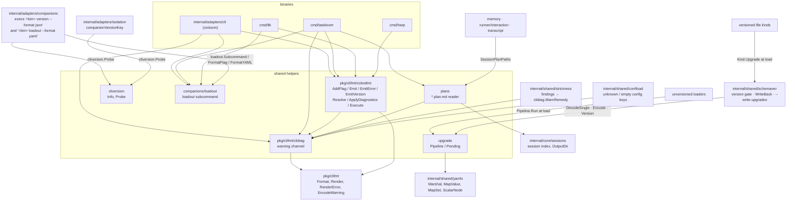

# CLI-side shared helpers — `clidiag`, `cobrafmt`, `cliversion`, companion `loadout`, `plans`, `upgrade`

Packages that the family's CLI binaries share so a cross-binary convention is declared once instead of per binary. They own, respectively: the process-wide stderr **warning channel** (`pkg/clifmt/clidiag`), the `--format` **flag, output routing and process tail** (`pkg/clifmt/cobrafmt`), the **probe** of the `version --format json` wire shape (`cliversion`), the companion `loadout` **subcommand and envelope** (`internal/adapters/companions/loadout`), the `*.plan.md` **reader** (`plans`), and the in-memory YAML **schema-upgrade primitive** (`upgrade`). `clidiag` and `cobrafmt` are part of the clifmt library and import nothing of ctxloom; [`companions/clifmt.md`](../companions/clifmt.md) is their full reference.

They are not a closed set of leaves: `plans` warns through `clidiag` and reads the session index, and `upgrade` leans on `yamlx` for its node helpers. Import edges are enforced by the architecture rules (`internal/shared/archrules`), not by this page; the diagram shows roles, and `git grep` on an import path gives the current importers.

```mermaid
flowchart TD
  subgraph binaries["binaries"]
    CLI["internal/adapters/cli (ctxloom)"]
    TL["cmd/taskloom"]
    LTK["cmd/ltk"]
    HARP["cmd/harp"]
  end

  subgraph helpers["shared helpers"]
    CD["pkg/clifmt/clidiag<br/>warning channel"]
    CE["pkg/clifmt/cobrafmt<br/>AddFlag / Emit / EmitError / EmitVersion<br/>Resolve / ApplyDiagnostics / Execute"]
    CV["cliversion<br/>Info, Probe"]
    CL["companions/loadout<br/>loadout subcommand"]
    PL["plans<br/>*.plan.md reader"]
    UP["upgrade<br/>Pipeline / Pending"]
  end

  CFMT["pkg/clifmt<br/>Format, Render, RenderError, EncodeWarning"]
  YAMLX["internal/shared/yamlx<br/>Marshal, MapValue, MapSet, ScalarNode"]
  SESS["internal/core/sessions<br/>session index, OutputDir"]

  CLI & TL --> CD
  CLI & TL & LTK & HARP --> CE
  CLI & TL & LTK --> CL
  TL --> PL

  CD --> CFMT
  CE --> CFMT
  CE --> CD
  PL --> CD
  PL --> SESS
  UP --> YAMLX

  STR["internal/shared/strictness<br/>findings → clidiag.WarnRemedy"] --> CD
  CONF["internal/shared/confload<br/>unknown / empty config keys"] --> CD

  LOAD["unversioned loaders"] -->|"Pipeline.Run at load"| UP
  SV["internal/shared/schemaver<br/>version gate · WriteBack · --write-upgrades"] -->|"DecodeSingle · Encode · Version"| UP
  KINDS["versioned file kinds"] -->|"Kind.Upgrade at load"| SV
  PROBE["internal/adapters/companions<br/>execs '&lt;bin&gt; version --format json'<br/>and '&lt;bin&gt; loadout --format yaml'"]
  PROBE -->|"cliversion.Probe"| CV
  PROBE -->|"loadout.Subcommand / FormatFlag / FormatYAML"| CL
  ISO["internal/adapters/isolation<br/>companionVersionKey"] -->|"cliversion.Probe"| CV
  READERS["memory · runner/interaction · transcript"] -->|"SessionPlanPaths"| PL
```

## `pkg/clifmt/clidiag` — the warning channel

The family's process-wide stderr **warning** channel. It owns the two wire shapes a non-fatal diagnostic can take (`"<prog>: warning: <msg>"` and a `clifmt.WarningEnvelope` JSON-Lines object), the global switch between them, the global redirect of the default destination, and a global per-message dedup set. Its only dependency is `pkg/clifmt`. Every path funnels into `fwarn`, the single place the wire-shape branch lives.

| Symbol | Purpose |
|---|---|
| `Line` | Builds the human line without writing it; the dedup key for the `*Once` helpers. `prog` is an argument, never spliced into the format string. |
| `structured` (`atomic.Bool`) | Which wire shape all warnings take. |
| `SetStructured` | Flips the process into JSON-envelope mode. |
| `Fwarn` | Formats args, delegates to `fwarn` against an explicit writer. |
| `fwarn` | The only branch point: `clifmt.EncodeWarning` when structured, `Fprintf("%s: warning: %s\n")` otherwise. Both write errors are discarded. |
| `sinkStack` / `sinkMu` | Every un-restored redirect; the top is the active sink, empty means `os.Stderr`. `sinkMu` guards the stack and every sink write. |
| `SetSink` | Pushes a redirect; its idempotent `restore` removes exactly that entry wherever it sits. |
| `warnToSink` | Resolves the active sink (`activeSink`) and writes to it under one `sinkMu` hold. Every sink-targeting helper funnels here. |
| `onceSeen` / `onceMu` | The print-dedup set; `ResetWarnOnce` clears it for tests. No cap, no eviction. |
| `FwarnOnce` | Computes `Line(...)` as key and dedups under `onceMu` (`warnOnce`, shared with the sink-targeting `*Once` helpers), then delegates to `fwarn`. |

## `pkg/clifmt/cobrafmt` — `--format` flag, routing and process tail

clifmt's cobra adapter. A command builds its result once and hands it to `Emit`, so `--format` is a presentation choice and never a branch in business logic. harp, ltk and taskloom register `--format` with `AddFlag`, switch diagnostics with `ApplyDiagnostics` and end with `Execute`; ctxloom so far uses `Resolve`, `Explicit`, `Emit` and `EmitError` only (see [`companions/clifmt.md`](../companions/clifmt.md) §5).

| Symbol | Purpose |
|---|---|
| `AddFlag` | The persistent `--format`: empty default, `clifmt.FormatUsage()` as usage, completion from `clifmt.SupportedFormats`. |
| `Emit` | Renders through the tree's `Printer` in the resolved format; a bespoke human view is a `clifmt.WithWriter(clifmt.FormatText, …)` option. With no options every format is clifmt's own. |
| `Resolve` | Precedence: a `Changed` `--json` ⇒ JSON; no `--format` flag registered ⇒ text; a `--format` of the wrong type ⇒ error; otherwise `clifmt.ResolveFormat` with whether stdout is a terminal (`isInteractiveTerminal`). |
| `Explicit` | Whether the caller actually asked for a format (`--json` or `--format` changed), as opposed to one `Resolve` derived from stdout. |
| `EmitError` | The failure half: renders an error through `clifmt.RenderError` to an explicit writer. Only an **explicit** format restructures the error stream; a derived one, or one that will not parse, keeps text. |
| `EmitVersion` | The shared body of a `version` command: emits `VersionInfo` (`{name, version}`), with the bare version string as text. |
| `ApplyDiagnostics` | `clidiag.SetStructured` on for an explicit or derived json/yaml/toml, off otherwise. |
| `Execute` | Runs the tree and returns the exit status (`clifmt.ExitCodeOf`), reporting `<prog>: <msg>` plus the fix line, or an envelope under an explicit structured format; nothing for a `clifmt.ExitStatus`. |

## `internal/shared/cliversion` — the `version --format json` probe

Owns the reading half of the `{name, version}` contract every family binary emits from `<binary> version --format json` (the producer shape is `cobrafmt.VersionInfo`): the decoded shape (`Info`) and the single probe (`Probe`). Readers are boot-time companion discovery (`companions.Prober.ProbeCompanions`) and the agent image's version key (`isolation.companionVersionKey`); both go through `Probe`, so they cannot disagree about what a companion's version is.

| Symbol | Purpose |
|---|---|
| `Info` | `{Name string \`json:"name"\`; Version string \`json:"version"\`}` — the shape the probe decodes. |
| `Output` | The exec seam: runs `<bin> version --format json` bounded by `ProbeTimeout` and `ProbeWaitDelay`. A var so tests can stand in for it (`SetOutputForTesting`). |
| `Parse` | Decodes probe output into `Info`; a missing or empty `version` is an error, not an empty version. |
| `Probe` | `Output` then `Parse` — the whole probe, and the only one. |

## `internal/adapters/companions/loadout` — the companion `loadout` subcommand

The **emitter half** of the companion-loadout wire protocol: the shared `loadout` cobra subcommand that ctxloom and its in-repo companions register, so ctxloom can exec `<bin> loadout --format yaml` and receive that binary's self-described loadout document verbatim (the contract is stated in `docs/companion-loadout-standard.md`). It holds **dispatch only** — loadout *content* stays per-binary because `go:embed` can only embed files in the embedding package's own directory, so each binary embeds its own `loadout.yaml` and passes the bytes in.

| Symbol | Purpose |
|---|---|
| `Subcommand`, `FormatFlag`, `FormatYAML` | The probe's argv vocabulary, exported so the consumer (`companions.loadoutArgs`) builds its argv from the same constants and a one-sided rename is a compile error. |
| `NewCommand` | Builds the `loadout` command over bytes already in hand. Delegates to `NewDeferredCommand`. |
| `NewDeferredCommand` | Same command, with the bytes supplied at run time — ctxloom's shape, where the CLI package owns the command tree but the embedded bytes live in the composition root. `--format` defaults to `yaml`. |
| `resolveFormat` | Honours a host root's `--json` shorthand, but an explicit local `--format` wins — the reverse of `cobrafmt.Resolve`, because this command's vocabulary is a subset. |
| `Emit` | The pure core, exported so companion tests can bypass cobra. Refuses an empty loadout; `"yaml"` writes the loadout verbatim; anything else errors naming the valid set. |

## `internal/shared/plans` — the `*.plan.md` reader

Locates, enumerates, and reads `*.plan.md` session-plan documents in each session's recorded output dir (`sessions.Entry.OutputDir`, from the session index), extracting a display title and the `sessions:` stamp list from each file's YAML frontmatter. It is the **read half** of a read/write pair whose write half is `memory.StampPlanFile`, driven by the `stamp-plan` hook. `cmd/taskloom`'s `plan list`/`plan show` use the listing and `Show`; the session-artifact readers (memory, runner interaction, transcript) use `SessionPlanPaths`.

| Symbol | Purpose |
|---|---|
| `Plan` | The JSON DTO: `Path`, `Name`, `Title`, `Session`, `Sessions`, and `ProjectDir`, which only the scoped listings fill in. |
| `ListHome` | Opens the session index and lists every recorded session's plans via `ListSessions`. |
| `ListSessions` | Walks each entry's output dir for `*.plan.md` (recursively, naming a plan by its path below the dir), parses frontmatter, sorts by `(Session, Name)`. An unreadable directory or plan is an error, never a shorter list; an entry that vanished mid-walk is skipped. |
| `ListHomeScoped` / `AttributeAll` | Project attribution through `LoadProjectIndex`: the scoped form returns matched and unattributed plans separately so a caller cannot silently drop the unattributed set; `AttributeAll` fills `ProjectDir` without filtering. |
| `SessionPlanPaths` | One harp's plan paths — the top level of its output dir only, sorted. Faults (unresolvable output dir, unreadable dir) are returned alongside, not swallowed; a missing dir or unknown session is silent. |
| `Show` | Requires the `.plan.md` suffix, resolves every symlink (`resolveContainedPlanPath`), requires the real path to sit inside some recorded session's output dir (`ErrPlanOutsideOutputDirs`) and to be a regular file, then reads it. |
| `ParseFrontmatter` | Extracts `title` and `sessions:` by handing the fenced block to yaml.v3. Both `---` fences are required (`frontmatterBlock`); a repeated key resolves last-wins with a warning (`resolveDuplicateKeys`); a malformed field is dropped without discarding the other. |

## `internal/shared/upgrade` — the in-memory YAML schema-upgrade primitive

Parses a YAML file once, runs an ordered chain of in-place `yaml.Node` mutators over the root mapping, re-encodes only if some stage reported a change, and returns the new bytes plus the names of the stages that fired — **without ever writing to disk**. A loader that is not yet versioned builds a `Pipeline` and calls `Run` on raw file bytes at load time; a versioned file kind goes through `schemaver` instead, which drives the same parse, steps and encode behind its version gate. `Pending` carries a result to a caller that prompts before persisting. The generic mapping-node helpers live in `internal/shared/yamlx`, not here.

| Symbol | Purpose |
|---|---|
| `Upgrader` | The one-schema-step contract: `Name() string` for the log/prompt, `Apply(root *yaml.Node) (changed bool)` for the mutation. No error channel. |
| `Pipeline` | An ordered `[]Upgrader`. It is not itself an `Upgrader`; pipelines do not nest. |
| `Pipeline.Run` | The byte driver: parse exactly one document (`DecodeSingle`) → require a mapping root → refuse a document with a duplicate key (`HasDuplicateKey`) → run stages collecting names → re-encode (`Encode`) if any fired. Returns `(out []byte, applied []string, err error)`; the only error is `ErrEncode`, a changed document that cannot be serialized again. |
| `DecodeSingle` | Parses a stream that must hold exactly one document: `io.EOF` for an empty or comment-only stream, `ErrMultiDocument` for a second document, the yaml error for malformed input. |
| `Encode` | Serializes a document node the way every upgrade writes one back: `yamlx.Marshal` (two-space indent), the one encoder every ordinary save uses too, so a file upgraded by `--write-upgrades` and the same file saved normally are the same bytes. A lint rule (`.golangci.yml`, forbidigo) forbids `yaml.Marshal` and `yaml.NewEncoder` outside `yamlx`. |
| `HasDuplicateKey` | Reports a mapping anywhere in the tree that repeats a key — which a `yaml.Node` decode accepts but every struct decode refuses. |
| `Pending` | `{Path string; Data []byte; Applied []string}` — records that a load upgraded an older document in memory; `Data` is "ready to persist verbatim". |
| `Version` | Reads a top-level int schema version as `(version int, ok bool)`: a missing key is `(0, true)`, the pre-versioning generation; a present but non-integer value is `(0, false)`. |
| `SetVersion` | Builds a scalar with `Tag = "!!int"` and sets it via `yamlx.MapSet`. The tag override is essential: without it the version round-trips as a quoted string and `Version` stops reading it as an integer. |

## `internal/shared/schemaver` — persisted-format versioning

The one implementation of a file kind's format generation: an integer under `schema_version`, independent of any binary's release version and of any version a file's author declares. A kind is migrated **in memory** on every load; the file on disk changes only under `--write-upgrades`.

| Symbol | Purpose |
|---|---|
| `Key` | `schema_version`, the top-level key every versioned kind declares. |
| `Step` | `{To() int; Name() string; Apply(*yaml.Node)}` — migrates a document from generation `To()-1` to `To()`. Instances live under `internal/migrations` (its package doc). |
| `Define(name, current, steps...)` | The only way to make a `Kind`. Panics unless `current >= 1` and the steps are contiguous and end at `current`. |
| `Kind.Current` / `Kind.Oldest` | `Current` is DECLARED; `Oldest` is `current - len(steps)`. Retiring the oldest step raises `Oldest` and leaves `Current`. |
| `Kind.Upgrade` | Raw bytes → `Result`: version read, refusal, steps from the declared generation, stamp. A current document comes back as the input slice. |
| `Result` | `{Data, From, To, Applied}`; empty `Applied` means nothing to write back. |
| `VersionError` | `{Kind, Found, Current, Oldest, Err}`, `Err` being or wrapping `ErrNewer`, `ErrTooOld` or `ErrUnreadable`. |
| `Kind.Stamp` | Sets `Key` to `Current` on a root mapping — in place, or as the first key. For writers. |
| `WriteBack` | Atomically replaces the file with `Result.Data`, keeping its mode; with `KeepBackup` it first copies the file to `path+BackupSuffix`. |
| `Backup` | `KeepBackup` / `NoBackup` — the caller's per-kind choice of whether `WriteBack` keeps the old bytes. |
| `BindWriteUpgrades` / `WriteUpgrades` | Register `--write-upgrades` on a binary's root persistent flags, and read the process-wide switch it sets. |

The load-site recipe is: `Kind.Upgrade` → decode `Result.Data` → if `len(Result.Applied) > 0 && WriteUpgrades()`, `WriteBack` to the path the caller resolved and say so. `rules.Load` and `cmd/ltk`'s `loadConfig` are the reference wiring.

## Invariants and contracts

### clidiag

- `SetStructured` must be called **before any warning is emitted**, or the earlier warnings take the text shape whatever `--format` says. harp, ltk and taskloom set it through `cobrafmt.ApplyDiagnostics` in their root's `PersistentPreRun`, ctxloom directly in its `rootPersistentPreRun`; nothing enforces the ordering. `SetSink`, by contrast, is a mid-run redirect (`redirectDiagnosticsForTUI`, `divertRunnerDiagnostics`) bracketed by its `restore`.
- Resolving the sink and writing to it happen under one `sinkMu` hold (`warnToSink`), so concurrent warnings never race or interleave whatever writer is installed, and once `restore` returns no write to that writer is in flight. Consequence: nothing reached from inside that hold — the writer, `clifmt` — may warn through `clidiag`, or it deadlocks. Lock order is `onceMu` then `sinkMu`.
- `restore` is safe for overlapping redirects unwound in any order: it removes only its own entry.
- The dedup key is the fully-rendered line and **does not include the destination writer**. A message already emitted to a previous sink is permanently suppressed on every later sink — including the per-session diagnostics file `redirectDiagnosticsForTUI` installs, which the user is explicitly pointed at.
- `onceSeen` has no cap (only the test seam `ResetWarnOnce` clears it). A `*Once` message that embeds a varying value — an error's text, a timestamp — dedups nothing and adds an entry every time it fires, so a call inside a loop in a long-lived process grows the set without bound.
- Write errors are discarded on both paths, deliberately: warnings never block. The named out-of-band observer is `errwriter.Writer`.
- `prog` is passed positionally at every call site. Most pass their binary's literal name; a shared package that runs under more than one binary derives it from the running executable instead (`plans.diagProg`), so a warning never names a program the user did not run.
- Layering rule: `clidiag` is the family-wide convention (hence the `prog` parameter); ctxloom-specific concepts such as findings belong **above** it in `internal/shared/strictness`, never inside it.

### cobrafmt

- `Resolve` may only be called **after** cobra has merged parents' persistent flags into `cmd.Flags()` — i.e. from inside `RunE`/`PersistentPreRunE`, or from `Execute`'s error tail against the root that owns the flag. Called earlier against a subcommand it sees no `--format` and answers text.
- An **absent** `--format` flag reads as text (the affordance that lets a command run without a root); a `--format` registered with the **wrong type** is a wiring bug and is returned as an error.
- The unset default depends on stdout: text at a terminal, JSON otherwise. That default is not a request — callers that must distinguish ask `Explicit`. `EmitError` and ctxloom's `checkFormatWasHonored` both do, so a piped invocation neither gets a JSON error envelope nor fails for a command that has not been wired to `emit()`.
- Accepting `--format` and honouring it are separate: the persistent flag makes every command accept it, and only a command that routes through `emit()` (or `streamFormat`) honours it. On ctxloom, `checkFormatWasHonored` (the root's `PersistentPostRunE`) turns an explicit, unhonoured `--format` into an error, and `formatDebtAllowlist` is the ledger of commands not yet wired. The other binaries have no such backstop.
- `Emit` is not a backstop either: with a `WithWriter` text view it delegates entirely and cannot detect a view that writes nothing.
- `--json` is honoured as a shorthand for `--format json` and beats an explicit `--format` in `Resolve`. The companion `loadout` command deliberately inverts that (`loadout.resolveFormat`).
- `Execute` never calls `os.Exit`: taskloom and ltk flush their `logboot` sink between it and the exit.
- The four binaries' `--format` help, completion, derived default, human error line and structured envelope are pinned against each other by `internal/testsupport/formatparity.Check`, which each of harp, ltk and taskloom runs on its own root.

### cliversion

- `Info`'s two JSON keys are a **cross-process contract**: the producer is each family binary's `version` command (`cobrafmt.VersionInfo`, which lives in the library and so cannot import this ctxloom package), the consumer is `Probe`. They are two types with one wire shape; the version tests of ctxloom, ltk and taskloom decode each binary's real output into `cliversion.Info`, which is what catches a one-sided rename.
- `Parse` rejects output with no `version` field, because callers key on the value and `""` is indistinguishable from "not probed".
- `Output` bounds the exec with `ProbeTimeout` and `ProbeWaitDelay`, so a wedged companion — or one whose grandchild holds stdout open — degrades to an error rather than stalling the caller.

### companion loadout

- The probe's argv is `Subcommand`, `FormatFlag`, `FormatYAML`, shared by emitter and consumer as constants; renaming one side alone does not compile.
- The host root's `--json` reaches `Emit` as the format `"json"`, which it refuses: a flag the command accepts and ignores would be worse than one it rejects (`loadout.resolveFormat`).
- `Emit` must write through the `io.Writer` it is given (`cmd.OutOrStdout()` from the `RunE`), never `os.Stdout`; that seam is what the package's own tests use.
- `Emit` refuses an empty loadout rather than emitting a well-formed document that contributes nothing.

### plans

- Read/write pairing: this package **reads** the frontmatter that `memory.StampPlanFile` **writes**, and both parse it with yaml.v3, so comments, quoting and block scalars mean the same thing to both halves.
- `ParseFrontmatter` requires both fences. An unterminated block is not frontmatter, matching the writer, which refuses to touch one.
- A repeated frontmatter key is resolved last-wins and warned about, rather than letting yaml.v3 reject the whole mapping and drop the keys that were not in dispute. The warning names the plan's path when `ListSessions` knows it, and goes to stderr because `taskloom plan list` prints a machine-readable listing on stdout.
- The listing and the per-session reader disagree on depth: `ListSessions` walks an output dir recursively, while `SessionPlanPaths` reads only its top level on the grounds that subdirectories hold segment essences rather than plans.
- `Show` is the only user-input path. Containment is checked on the **resolved** path, and the target must be a regular file, so a symlink or FIFO named `*.plan.md` cannot be used to read elsewhere or hang the reader.
- Sort order is `(Session, Name)`, stable across calls.

### upgrade

- Stages run **oldest-first** and stage *N* may depend on stage *N-1* having already fired. Order is the contract, and `Pipeline` is an ordered slice for that reason.
- A `Pipeline` stage's `Upgrader.Apply` must be **idempotent**: given a document already at or past its target form it must leave the node untouched and return `false`. Nothing verifies this. `Run` trusts the bool absolutely — it is the sole input to the "did anything happen" decision and to every caller's persist/prompt decision. A stage that mutates and returns `false` has its migration silently discarded; a stage that returns `true` without mutating causes a re-prompt every load.
- `Apply` has **no error channel**: a stage that cannot migrate a document safely can only skip it or overwrite it.
- `Run` never writes to disk. Persisting is the caller's, gated on user consent via `Pending` — that separation is the package's central design rule.
- `Run` returns the caller's bytes **verbatim** with `applied == nil` on: unparseable YAML (deliberate — callers re-parse and report), a stream with more than one document, a non-mapping root, a duplicate key anywhere in the tree, and no stage firing. An encode or close failure after a stage fired is `ErrEncode` and no bytes: the original bytes would read as already current, and the caller would parse the legacy form as migrated. Refusing multi-document streams and duplicate keys is what stops a re-encode from silently deleting later documents or keeping whichever duplicate the `yamlx` helpers reached first.
- Callers must gate on `Version`'s `ok`: treating an unreadable version as generation 0 would replay every migration over a probably-corrupt file and stamp the current version on it.

### schemaver

- The version is read from the **raw bytes**, before the caller's strict decode or schema validation, so a newer file is refused as newer rather than for carrying keys this binary does not know.
- A document with no `Key` — an empty or comment-only one included — is generation 0, which is below every kind's `Oldest` unless a step migrates from 0: it is refused, never guessed at. A present but non-integer version and more than one document (even when it is a later one that fails to parse) are `ErrUnreadable` — never generation 0, which would replay every step over a probably-corrupt file.
- `Current` is declared rather than derived from the steps: retiring a step must not lower it, or every file already stamped current would be refused as newer.
- A document that is not a well-formed YAML mapping — a syntax error, a non-mapping root, a duplicate key — passes through `Upgrade` untouched with `Applied` empty, as `Pipeline.Run` does: it has no generation to judge, and refusing it as `ErrUnreadable` would report a file that does not parse as a version fault. The kind's own decode, which every caller runs next, reports it as the parse failure it is.
- A step runs because the declared generation says it must, so unlike a `Pipeline` stage it need not be idempotent, and a step that edits nothing still advances the version.
- **Every shape change to a persisted format bumps `schema_version` with a step** — a rename, a removal, or a change of meaning, not only additions that need migrating. An older binary does not know a renamed key: unbumped, it reads the file as missing that key and silently falls back to the default instead of refusing a file newer than it understands. The bump is what turns that misread into `ErrNewer`. A step that edits nothing is still the right step for a meaning change.
- The backup is chosen **per kind**: a file nothing else versions (a config) keeps `KeepBackup`, the only way back; version-controlled project content (a bundle tree, the lockfile) takes `NoBackup`, because git already holds the prior bytes, and a `.bak` left in a bundle tree is a file a later signing would cover and ship.
- `BindWriteUpgrades` **resets** the switch: a command tree is bound once per invocation, so a tree built after one that set it starts off. The switch is atomic because load sites may run on goroutines the flag parse never sees.
