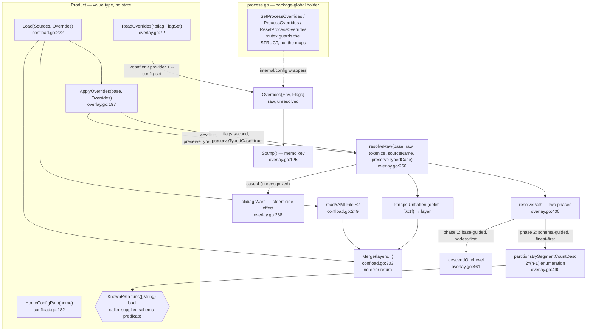

# `internal/shared/confload` — layered config loading and override expansion

`confload` closes the config precedence chain — **home file < project file < env vars < `--config-set` flags** — for any ctxloom-family binary without knowing any product's schema. A `Product` names one binary's conventions (env prefix, an optional `KnownPath` schema predicate); `Sources` names the two file paths stage-1 bootstrap already resolved; `Overrides` carries the once-captured raw env/CLI pairs, deliberately unresolved. The package owns two contracts nobody else may re-implement: the koanf **merge semantics** (presence beats truthiness, maps deep-merge, everything else replaces) and the **override path resolution** that turns `CTXLOOM_CONFIG_AGENTS_MYCODER_RUNTIME` into `["agents","mycoder","runtime"]`.

Consumers: `cmd/taskloom` uses `Product.Load` end-to-end; `internal/config` drives its own per-layer upgrade+validation pipeline and calls `Merge` + `ApplyOverrides` directly for identical override semantics; `internal/testsupport` and `internal/shared/tasks/taskstest` use the `process.go` holder for test isolation.

## Structure

## Inventory — types

| Type | file:line | Purpose |
|---|---|---|
| `Product` | `internal/shared/confload/confload.go:172` | One binary's config conventions: `Name`, `DirName`, `FileName`, `EnvPrefix`, `KnownPath`. Constructed fresh per load, never stored. |
| `Product.Name` | `internal/shared/confload/confload.go:173` | Diagnostics only — the `prog` passed to `clidiag.Warn` at `overlay.go:288`. |
| `Product.DirName` / `.FileName` | `internal/shared/confload/confload.go:174-175` | Read only by `HomeConfigPath`. No production reader (see divergences). |
| `Product.EnvPrefix` | `internal/shared/confload/confload.go:176` | Env namespace for `ReadOverrides` and `envSourceName`. Must contain a `_CONFIG_` segment (see invariants). |
| `Product.KnownPath` | `internal/shared/confload/confload.go:177` | Caller-supplied schema oracle `func(path []string) bool`; sole input to phase 2 of `resolvePath`. |
| `Sources` | `internal/shared/confload/confload.go:191` | `{HomePath, ProjectPath string}` — the two file paths stage-1 bootstrap resolved. Read only by `Load`. |
| `Overrides` | `internal/shared/confload/confload.go:203` | `{Env, Flags map[string]any}` — once-captured raw override pairs. `Env` keys are `_`-joined (prefix already stripped); `Flags` keys are `.`-joined dotted paths. |
| `splitMask` | `internal/shared/confload/overlay.go:496` | Function-local `{mask, popcount int}` tuple so `sort.SliceStable` can order partition bitmasks by set-bit count. |
| `delim` (const `"\x1f"`) | `internal/shared/confload/confload.go:146` | koanf path delimiter — ASCII unit separator, chosen because a real config key can contain `.` but never `\x1f`. |
| `ConfigSetFlagName` (const `"config-set"`) | `internal/shared/confload/overlay.go:28` | The flag name `ReadOverrides` scrapes; each binary must register it as a `StringArray`. |

## Inventory — functions

| Function | file:line | Purpose |
|---|---|---|
| `Product.HomeConfigPath` | `internal/shared/confload/confload.go:182` | `filepath.Join(home, DirName, FileName)`. |
| `Product.Load` | `internal/shared/confload/confload.go:222` | The whole chain: read both YAML layers, drop nil ones, `Merge`, then `ApplyOverrides`. Propagates both read errors. |
| `readYAMLFile` | `internal/shared/confload/confload.go:249` | `os.ReadFile` + `yaml.Unmarshal` into `map[string]any`. `path == ""` and `os.IsNotExist` both return `(nil, nil)`; parse errors and non-map roots are wrapped with the path and returned. |
| `Merge` | `internal/shared/confload/confload.go:303` | Loads each non-empty layer into one koanf instance in ascending precedence and unmarshals back to a plain map. No error return. |
| `Product.ReadOverrides` | `internal/shared/confload/overlay.go:72` | Scans env via koanf's env provider (stripping `EnvPrefix`) and parses `--config-set k=v` entries into a flat map. Malformed `--config-set` entries are collected and joined into one error. |
| `Overrides.Stamp` | `internal/shared/confload/overlay.go:125` | `"env:"+stampFlat(Env)+"|cli:"+stampFlat(Flags)` — the memo-invalidation key `internal/config` keys its config cache on. |
| `stampFlat` | `internal/shared/confload/overlay.go:130` | Sorted `k=v;` rendering of a flat map; the sort is what makes `Stamp` deterministic. |
| `Product.ApplyOverrides` | `internal/shared/confload/overlay.go:197` | Resolves env then flags against `base`, `Merge`s each resolved layer in turn, joins per-key errors. Partial application with a non-fatal joined error is the designed policy. |
| `Product.envSourceName` | `internal/shared/confload/overlay.go:222` | `EnvPrefix + suffix` — display name for env diagnostics. |
| `flagSourceName` | `internal/shared/confload/overlay.go:228` | `"--config-set " + path` — display name for flag diagnostics. |
| `envTokens` | `internal/shared/confload/overlay.go:234` | `strings.Split(suffix, "_")` — the env tokenizer. |
| `setTokens` | `internal/shared/confload/overlay.go:248` | `strings.Split(path, ".")` — the `--config-set` tokenizer. |
| `Product.resolveRaw` | `internal/shared/confload/overlay.go:266` | Sorted walk over raw keys → tokenize → `resolvePath` → collect into a flat `\x1f`-joined map → `kmaps.Unflatten` into a layer. Collects and joins per-key errors; emits the case-4 warning. |
| `coerceEnvValue` | `internal/shared/confload/overlay.go:312` | Type detection on a raw override string, in order: bool → int → comma-list (recursing per element) → string. |
| `Product.resolvePath` | `internal/shared/confload/overlay.go:400` | The resolution engine: phase 1 base-guided widest-first descent, phase 2 schema-guided finest-first partition search, else case-4 fallback with `warn = true`. |
| `descendOneLevel` | `internal/shared/confload/overlay.go:461` | One level of case-insensitive widest-prefix key match; reports every colliding key as `ambiguous`. |
| `partitionsBySegmentCountDesc` | `internal/shared/confload/overlay.go:490` | Enumerates all `2^(n-1)` contiguous partitions of the remaining tokens, ordered by descending group count (finest first). |
| `quoteAll` | `internal/shared/confload/overlay.go:523` | `%q`-quotes each string for the ambiguity error message. |
| `SetProcessOverrides` | `internal/shared/confload/process.go:31` | Mutex-guarded assignment to the process-wide `Overrides` holder. |
| `ProcessOverrides` | `internal/shared/confload/process.go:39` | Mutex-guarded read of the process-wide holder. |
| `ResetProcessOverrides` | `internal/shared/confload/process.go:50` | `SetProcessOverrides(Overrides{})` — the test-isolation seam. |

## Invariants and contracts

**Precedence and ordering**

- Precedence is fixed and ascending: `home file < project file < env vars < --config-set flags`. `Merge(layers...)` takes layers in ascending precedence; `layers[0]` is weakest, `layers[len-1]` strongest.
- `Load` encodes precedence by the *order of two field reads* on `Sources` (`HomePath` then `ProjectPath`), not by anything in the type. Adding a third layer is a silent precedence change unless `Load` is edited.
- `ApplyOverrides` applies **env first, flags second** (`overlay.go:205` then `:211`), so `--config-set` always beats an env var naming the same key.
- `resolveRaw` walks raw keys in **sorted order** so two overrides that resolve to the same path settle deterministically.

**Merge semantics (koanf default, deliberately never overridden with `WithMergeFunc`)**

- Presence, not truthiness, decides: a key present in a higher layer wins **regardless of value**, including its zero value (`feature: false` in the project beats `feature: true` from home).
- A key present only in a lower layer is inherited unchanged.
- When both layers hold a `map[string]any` at a key, the maps deep-merge recursively.
- Any other type — **including slices** — is replaced wholesale by the higher layer. Lists never concatenate; a project that wants "home's list plus one" restates the whole list.
- `Merge` never mutates its inputs; every returned map, nested ones included, is independent of the caller's originals.
- `Merge` reads results back with `Unmarshal`, never koanf's `Raw()`/`All()`, because `Raw()` can round-trip an int into another type.
- `Merge` has **no error channel**: a layer whose koanf load fails is skipped and the merge continues; an unmarshal failure returns `map[string]any{}`. A caller cannot learn that a layer was dropped.

**Pairing rules (connascence enforced only by call order)**

- `resolveRaw`'s four co-varying arguments must stay paired: `{Env, envTokens, envSourceName, preserveTypedCase=false}` and `{Flags, setTokens, flagSourceName, preserveTypedCase=true}`. Swapping them compiles and silently mis-resolves.
- `Overrides.Env` keys are `_`-joined with `EnvPrefix` already stripped; `Overrides.Flags` keys are `.`-joined dotted paths. Nothing in the type enforces this — only which tokenizer `ApplyOverrides` passes.

**Override path resolution (`resolvePath`)**

- Phase 1 (base-guided): at each level try the **widest** remaining-token prefix first, joined with `_` and compared case-insensitively against that level's real keys. A unique match descends and **adopts base's own casing**. Two or more keys folding to the same candidate is an immediate error naming the source and every colliding key.
- Phase 2 (schema-guided): partition the remaining tokens **finest first** (one token per segment before any joining) and test against `KnownPath`. Finest-first is required for correctness: a wildcard (`additionalProperties`) schema level accepts any segment, so widest-first would greedily read `agents.MyCoder_runtime` as one dynamic label instead of `agents.mycoder.runtime`.
- `preserveTypedCase` (flags only) tries each partition's original-case candidate before the lower-cased one. A fixed schema property validates only in its canonical lower_snake_case spelling, so this never mis-cases a real field; it only preserves user-chosen dynamic labels. Env sets it false — env-var case is a shell artifact carrying no intent.
- Case 4 (nothing recognized): fall back to one segment per token in original case, return `warn = true`. The unknown-key outcome is a `warn bool` discharged as a direct `clidiag.Warn` write to stderr from inside the library; the ambiguity outcome is an `error` return. The two "could not resolve this the way you meant" outcomes therefore have opposite polarity, and the caller can suppress neither the warning nor its destination.
- Phase 2's enumeration is `2^(n-1)` in the token count, pre-allocated in one `make`, with `n` derived from a user-supplied env var name; there is no upper bound on `n`.
- A **scalar sitting at an intermediate level** (e.g. base has `runtime: container-rootless`, override names `..._RUNTIME_FOO`) is indistinguishable from an absent key: the type assertion in `descendOneLevel` discards its `ok`, descent stops, case 4 fires, and `Merge`'s replace-wholesale rule turns the scalar into a map.

**Value coercion (`coerceEnvValue`)**

- Detection order is bool → int → comma-list → string, and `strconv.ParseBool` accepts `"0"`/`"1"`, so a `0`/`1` integer override coerces to a **bool** before the int branch is reached. There is no escape hatch for a literal `"true"` string, and any comma-containing value is split into a list.

**Absent vs empty**

- `readYAMLFile` returns `(nil, nil)` for all four of: unconfigured path, missing file, zero-byte file, comment-only file. Malformed YAML, a non-map top-level node, and permission errors are all loud, wrapped with the path.
- `Product.Load(Sources{}, Overrides{})` returns `(map[string]any{}, nil)` — a bootstrap bug that mis-resolves both paths is indistinguishable from a project with no config files.
- `resolveRaw` over an empty `raw` map returns an empty layer, which `Merge` treats as a no-op.

**Must-call-before / lifecycle**

- Stage 1 (path resolution, per product) must run before stage 2 (this package): `Sources` is an input, never computed here.
- `ReadOverrides` must be called after cobra/pflag parsing, once per process; `internal/config` stores the result via `SetProcessOverrides` (`internal/config/config.go:474`) and reads it back via `ProcessOverrides` (`:481`).
- `EnvPrefix` **must** contain a `_CONFIG_` segment (e.g. `CTXLOOM_CONFIG_`). A bare family prefix would pull bootstrap vars such as `CTXLOOM_ROOT` — which selects *which config file is read* — into the config chain it determines. Nothing validates this.
- `ProcessOverrides()` returns a struct copy that **shares its map headers** with the process-wide value. The mutex guards the struct header only; treat the returned maps as read-only.
- `ResetProcessOverrides` is the test-isolation seam; test packages call it in setup/teardown (`internal/shared/tasks/taskstest/taskstest.go:54-55`).

## Real vs documented

- `Product.KnownPath`'s doc says "Nil is treated as 'no schema knowledge available'"; in production the nil branch is **unreachable** — both products pass a method value bound to a possibly-nil pointer, which is never a nil func, so the full partition search always runs and merely returns false for every candidate.
- `Product.HomeConfigPath` (and with it `DirName`/`FileName`) is documented as the home-path convention but has **no production reader**: `internal/taskloom/config` defines and calls its own `HomeConfigPath()`, and `internal/config` calls neither.
- `Merge`'s comment says the unmarshal failure is "guarded rather than ignored"; the real behaviour is to return `map[string]any{}`, discarding every layer that did load.
- `ReadOverrides`' comment asserts a non-nil `GetStringArray` error "means fs has no `--config-set` flag registered at all"; `pflag` also returns that error on a **type mismatch** (e.g. registering `--config-set` as `StringSlice`), in which case every CLI override is dropped.
