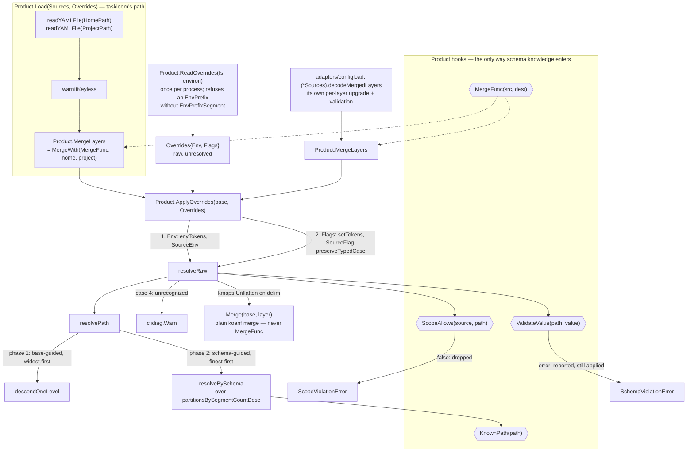

# `internal/shared/confload` — layered config loading and override expansion

`confload` is the config-chain library shared by the ctxloom family of binaries. It closes the precedence chain `home file < project file < env vars < --config-set flags` on top of koanf, `yaml.v3` and `pflag`, and it owns two contracts nobody else may re-implement: the merge semantics (presence beats truthiness, maps deep-merge, everything else replaces) and the override path resolution that turns `CTXLOOM_CONFIG_AGENTS_MYCODER_RUNTIME` into `["agents","mycoder","runtime"]`.

It is domain-free but not pure. No product's schema lives here: schema knowledge arrives only through the `Product` hooks (`KnownPath`, `ValidateValue`, `ScopeAllows`, `MergeFunc`). But `Product.Load` reads files, and its warnings go out through the `clidiag` global rather than back to the caller. That is why it is not a toolbox member the core ring may import. The core-ring row of `archrules.LayeringRules` enforces it.

For ctxloom, config flows confload (the generic chain) → `internal/adapters/configload` (ctxloom's product: its hooks, layer policy and decoding) → `*config.Config` (`internal/core/config`) → core. Only the decoded value reaches core.

Consumers:

- `internal/adapters/configload` builds ctxloom's `Product` in `(*Sources).product`, with every hook set. It skips `Load` because it runs its own per-layer upgrade and validation first. `(*Sources).decodeMergedLayers` calls `Product.MergeLayers` and then `Product.ApplyOverrides` directly.
- `internal/taskloom/config` is the only caller of `Product.Load`. Its `product` sets `KnownPath` and `ValidateValue` but not `ScopeAllows` or `MergeFunc`.
- `internal/adapters/cli` and `cmd/taskloom` register `ConfigSetFlagName` as a persistent `StringArray` flag.

## Structure

```mermaid
flowchart TD
  subgraph HOOKS["Product hooks — the only way schema knowledge enters"]
    KP{{"KnownPath(path)"}}
    SA{{"ScopeAllows(source, path)"}}
    VV{{"ValidateValue(path, value)"}}
    MF{{"MergeFunc(src, dest)"}}
  end

  RO["Product.ReadOverrides(fs, environ)<br/>once per process; refuses an EnvPrefix<br/>without EnvPrefixSegment"] --> OV["Overrides{Env, Flags}<br/>raw, unresolved"]

  subgraph LOAD["Product.Load(Sources, Overrides) — taskloom's path"]
    RY["readYAMLFile(HomePath)<br/>readYAMLFile(ProjectPath)"] --> WK["warnIfKeyless"]
    WK --> ML["Product.MergeLayers<br/>= MergeWith(MergeFunc, home, project)"]
  end
  ML --> AO
  OV --> AO

  CL["adapters/configload: (*Sources).decodeMergedLayers<br/>its own per-layer upgrade + validation"] --> ML2["Product.MergeLayers"] --> AO
  MF -.-> ML
  MF -.-> ML2

  AO["Product.ApplyOverrides(base, Overrides)"] -->|"1. Env: envTokens, SourceEnv"| RR["resolveRaw"]
  AO -->|"2. Flags: setTokens, SourceFlag,<br/>preserveTypedCase"| RR
  RR --> RP["resolvePath"]
  RP -->|"phase 1: base-guided, widest-first"| D1["descendOneLevel"]
  RP -->|"phase 2: schema-guided, finest-first"| RS["resolveBySchema<br/>over partitionsBySegmentCountDesc"]
  RS --> KP
  RR --> SA
  SA -->|"false: dropped"| SVE["ScopeViolationError"]
  RR -->|"case 4: unrecognized"| W["clidiag.Warn"]
  RR --> VV
  VV -->|"error: reported, still applied"| SCE["SchemaViolationError"]
  RR -->|"kmaps.Unflatten on delim"| M["Merge(base, layer)<br/>plain koanf merge — never MergeFunc"]
```

## Inventory: types and constants

| Symbol | Purpose |
|---|---|
| `Product` | One binary's config conventions and schema hooks: `Name`, `DirName`, `FileName`, `EnvPrefix`, `KnownPath`, `ValidateValue`, `ScopeAllows`, `MergeFunc`. A value type the caller builds; confload holds no state. |
| `Product.Name` | Diagnostics only: the `prog` passed to `clidiag.Warn`. |
| `Product.EnvPrefix` | Env namespace `ReadOverrides` scans and `envSourceName` rebuilds for display. Must contain `EnvPrefixSegment`. |
| `Product.KnownPath` | Schema oracle `func(path []string) bool`. The only input to phase 2 of `resolvePath`. Nil means there is no schema knowledge, so every unmatched override lands in case 4. |
| `Product.ValidateValue` | Checks one resolved override value against the schema at its path. A refusal is reported as `SchemaViolationError`, and the value is still applied. |
| `Product.ScopeAllows` | Decides whether an override from a given `OverrideSource` may set a resolved path. A refusal drops the override and reports `ScopeViolationError`. Nil allows everything. |
| `Product.MergeFunc` | Replaces koanf's default merge for file layers only, through `MergeLayers`. Override resolution never uses it. |
| `MergeFunc` | koanf's `WithMergeFunc` shape: `func(src, dest map[string]any) error`. |
| `Sources` | `{HomePath, ProjectPath}`: the files stage-1 bootstrap resolved. Empty means the layer contributes nothing. Only `Load` reads it. |
| `Overrides` | `{Env, Flags map[string]any}`: raw override pairs captured once. `Env` keys are `_`-joined with `EnvPrefix` stripped. `Flags` keys are `.`-joined dotted paths. The zero value means "no overrides". |
| `OverrideSource` (`SourceEnv`, `SourceFlag`) | Which channel an override came from. The distinction is reach: env is inherited by child processes, while a flag stays in the one invocation. |
| `ScopeViolationError` | Typed error for an override `ScopeAllows` refused. |
| `SchemaViolationError` | Typed error for an override value `ValidateValue` refused. It unwraps to the validator's error. |
| `ConfigSetFlagName` | `"config-set"`: the only flag `ReadOverrides` reads. Each binary registers it as a `StringArray`. |
| `EnvPrefixSegment` | `"_CONFIG_"`: the segment every `EnvPrefix` must contain. `ReadOverrides` enforces it. |
| `delim` | `"\x1f"`: the koanf path delimiter. A real config key can contain `.` (an LLM label like `gpt-4.1`) but never a control character. |
| `maxPartitionTokens` | The token count above which phase 2 is skipped and resolution falls straight to case 4. |

## Inventory: functions

| Symbol | Purpose |
|---|---|
| `Product.ReadOverrides(fs, environ)` | Scans `environ` with koanf's env provider (prefix stripped, values run through `coerceEnvValue`), then reads `--config-set k=v` entries from `fs`. Malformed entries, and a registered flag whose values cannot be read, are joined into the returned error. |
| `Product.Load(src, o)` | The whole chain: `readYAMLFile` for each source, `warnIfKeyless`, `MergeLayers`, then `ApplyOverrides`. Returns the fully layered raw map. It does not validate or decode. |
| `Product.MergeLayers(layers...)` | `MergeWith(p.MergeFunc, layers...)`, used for file layers. |
| `Product.ApplyOverrides(base, o)` | Resolves env, then flags, against `base`, merging each resolved layer with plain `Merge`. Per-override faults are joined into a non-fatal error alongside a usable result. |
| `Merge(layers...)` / `MergeWith(fn, layers...)` | Deep-merge in ascending precedence through one koanf instance, read back with `Unmarshal`. Load and unmarshal failures are returned, never swallowed. |
| `readYAMLFile` | `os.ReadFile` + `yaml.Unmarshal`, returning `(values, present, err)`. |
| `Product.warnIfKeyless` | Warns when a file is present but defines no keys. |
| `Product.resolveRaw` | Walks the raw keys in sorted order: tokenize, `resolvePath`, `ScopeAllows`, the case-4 warning, `ValidateValue`, then collect into a flat `delim`-joined map and `kmaps.Unflatten` it. |
| `Product.resolvePath` | The resolution engine: phase 1 base-guided descent, then phase 2 `resolveBySchema`, and otherwise case 4 with `warn = true`. |
| `descendOneLevel` | Matches one level case-insensitively, widest prefix first. Reports every colliding key as ambiguous. |
| `Product.resolveBySchema` | Phase 2: tries each partition against `KnownPath`, with the original-case candidate first when `preserveTypedCase` is set. |
| `partitionsBySegmentCountDesc` | Every contiguous partition of the tokens, finest first. Returns nil for an empty input or one longer than `maxPartitionTokens`. |
| `coerceEnvValue` | Detects a raw string's type, in order: int, bool, comma-list (each element recursed), string. |
| `envTokens` / `setTokens` | Tokenizers: split on `_` for env, `.` for `--config-set`. |
| `Product.envSourceName` / `flagSourceName` / `quoteAll` | Build the display strings used in diagnostics. |

## Invariants and contracts

### Precedence and ordering

- Precedence is fixed and ascending: `home file < project file < env vars < --config-set flags`. `Merge`/`MergeWith` take layers weakest first.
- `Load` encodes the file order by the order it reads `Sources.HomePath` and `Sources.ProjectPath`. Nothing in the type carries it.
- `ApplyOverrides` resolves and merges env first, then flags. Flags therefore resolve against a base that already includes env, and a `--config-set` always beats an env var naming the same key.
- `resolveRaw` walks keys in sorted order, so two overrides that resolve to the same path settle deterministically.

### Merge semantics

- Presence, not truthiness, decides. A key present in a higher layer wins regardless of its value, including a zero value.
- A key present only in a lower layer is inherited unchanged.
- Two `map[string]any` values at the same key deep-merge. Any other type, slices included, is replaced wholesale by the higher layer. Lists never concatenate.
- A `Product.MergeFunc` may special-case paths (ctxloom's `agentBindingMergeFunc` makes an `agents.<name>` binding atomic across file layers), but it applies only through `MergeLayers`. `ApplyOverrides` always uses plain `Merge`: an override is a one-field patch, and routing it through an atomic-replace merge would wipe the binding's other fields.
- Merging never mutates its inputs. Results are read back with `Unmarshal`, never koanf's `Raw()`, because `Raw()` can round-trip an int into another type.

### Hooks: where each runs and what a refusal does

- `KnownPath` runs only in phase 2 of `resolvePath`. With a nil `KnownPath`, phase 2 is skipped.
- `ScopeAllows` runs on the resolved path, after `resolvePath` and before anything is written. A false answer drops that override and joins a `ScopeViolationError`. Other overrides still apply.
- `ValidateValue` runs after the scope check, so a value that has already been dropped is never validated. A refusal joins a `SchemaViolationError`, and the value is still applied. If it were dropped, the key would resolve to the lower layer's value, which for a security-relevant key can be more privileged than what was typed. Consumers own fail-closed handling of a value they cannot honour.
- Both violation errors are typed, so a caller classifies them with `errors.As`. `internal/adapters/configload` does this in `decodeMergedLayers`.

### Override path resolution (`resolvePath`)

- Case 1, phase 1 (base-guided): at each level, `descendOneLevel` tries the widest remaining-token prefix first, joined with `_` and compared case-insensitively. A unique match descends and adopts base's own casing.
- Case 2: two or more keys fold to the same candidate. Resolution stops with an error naming the source and every colliding key.
- Case 3, phase 2 (schema-guided): the remaining tokens are partitioned finest first and tested against `KnownPath`. Finest first is required because a wildcard (`additionalProperties`) level accepts any segment. Widest first would read `agents.MyCoder_runtime` as one agent label instead of `agents.mycoder.runtime`.
- `preserveTypedCase`, set for flags only, tries each partition's original-case candidate before the lower-cased one. A fixed schema property validates only in its canonical lower_snake_case spelling, so this preserves user-chosen dynamic labels without ever mis-casing a real field. Env sets it false because an env var name's case carries no intent.
- Case 4 (nothing recognized): the path falls back to one segment per token in original case, and `resolveRaw` emits a `clidiag.Warn` and applies the value anyway.
- The four outcomes are reported through different channels. An ambiguity and a scope refusal are `error` values the caller receives. The unknown-key outcome is a direct `clidiag.Warn` the caller neither receives nor can suppress.
- Phase 2's enumeration grows as `2^(n-1)` in a user-supplied token count. `maxPartitionTokens` bounds it: longer names skip phase 2 and land in case 4.
- A scalar at an intermediate level (base has `runtime: container-rootless`, and the override names `..._RUNTIME_FOO`) stops phase 1 exactly as an absent key would, because `descendOneLevel` discards the map type assertion's `ok`. If phase 2 does not claim the path, case 4 fires, and the replace-wholesale merge rule turns the scalar into a map.

### Value coercion (`coerceEnvValue`)

- Detection order is int → bool → comma-list → string. Int comes first so that `0`/`1` stay integers, since `strconv.ParseBool` would accept them. Alphabetic spellings still read as bools.
- There is no escape hatch. A literal string `"true"` or `"42"` cannot be expressed, and any value containing a comma becomes a list.

### Absent vs empty

- `readYAMLFile` returns `present = false` with no error for an empty path or a missing file. A file that is present but keyless (zero bytes, whitespace, comments only, `---`, `null`) returns `present = true` with a nil map, and `Load` warns about it through `warnIfKeyless`. Malformed YAML, a non-map top-level node, and read errors such as permission failures are returned, wrapped with the path.
- `Product.Load(Sources{}, Overrides{})` returns an empty map and no error. A bootstrap bug that mis-resolves both paths looks exactly like a project with no config files.

### Lifecycle

- Stage 1 (path resolution, per product) runs before this package. `Sources` is an input, never computed here.
- `ReadOverrides` is called once per process, after flag parsing, with the environment the composition root captured. Resolution happens later, on every load, against that load's own base. A worktree's config can case its keys differently from the ambient project's, so a resolved snapshot would be wrong for every load after the first.
- An `EnvPrefix` without `EnvPrefixSegment` makes `ReadOverrides` return an error and an empty `Overrides`. The `--config-set` flags are discarded along with the env overrides. A bare family prefix would sweep bootstrap variables such as `CTXLOOM_ROOT`, which selects the config file being read, into the chain.
- A registered `--config-set` whose values cannot be read as a `StringArray` (for example, registered with the wrong type) is a reported error, not a silent no-op. A `FlagSet` without the flag, or a nil one, contributes nothing and is not an error.
- Env overrides cross process boundaries (each binary honours its own `EnvPrefix`). A `--config-set` flag is scoped to the invocation that declared it.

## Real vs documented

- `Product.DirName` and `Product.FileName` are documented as the convention "each product resolves its own home-directory path from", but nothing reads them. confload does not, and both products build their paths from their own constants (`config.AppDirName`/`config.ConfigFileName`, and taskloom's `DirName`/`FileName` through `homeConfigPath`).
- The package doc names ltk as a family binary that uses the pattern. `cmd/ltk` does not import confload.
- The `Product` doc says `Name` is the prog "for any warning EnvOverlay/FlagOverlay emit". Neither function exists. The warnings come from `resolveRaw` and `warnIfKeyless`.
- `resolvePath`'s doc says a flag name is split on `.` and `-`. `setTokens` splits on `.` only.
