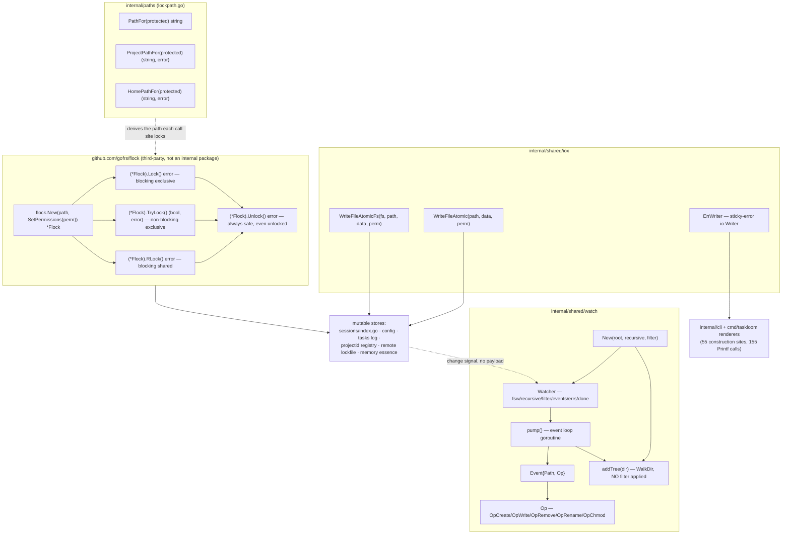

# Filesystem and I/O primitives

Two leaf packages own how ctxloom touches the filesystem: `internal/shared/iox` replaces a file's contents without any reader ever seeing a torn state and latches write errors on a formatted output stream; `internal/shared/watch` turns fsnotify into a filtered, optionally-recursive change-signal channel. Neither has any internal import.

Advisory file locking is no longer a package of its own. `internal/shared/filelock` (a hand-rolled `flock(2)`/`LockFileEx` wrapper) was DELETED (factual-oven, part of the marshy-capture umbrella, 2026-08): the tree had carried two lock implementations — this one, at ~150 call sites, and `github.com/gofrs/flock`, already a direct dependency and already used in production by `internal/shared/agent/rendezvous.go` — and the fix was to end the split by standardizing on the library, not to keep growing the hand-rolled one. Every former `filelock.Lock`/`TryLock`/`LockShared` call site now constructs a `*flock.Flock` directly (`flock.New(path, flock.SetPermissions(0o644))`, then `.Lock()`/`.TryLock()`/`.RLock()`/`.Unlock()`), following `rendezvous.go`'s idiom — see that file for the reference shape. What `filelock` also owned — `PathFor`, `ProjectPathFor` and `HomePathFor`, the protected-path→lock-name derivation — was PATH POLICY, not locking, and moved to `internal/paths` (`internal/paths/lockpath.go`), which already owned the home/project tiering those functions depend on.

The contract they jointly own: **a mutable store is written atomically under an advisory lock named `<protected-path>.lock`, and observers learn it changed from a `watch.Watcher` that carries no data.**



## `internal/shared/iox`

Two unrelated primitives in one package: crash-safe atomic replace, and a sticky-error output writer. 183 LOC, 11 internal importers.

| Symbol | file:line | Purpose |
|---|---|---|
| `WriteFileAtomic(path string, data []byte, perm os.FileMode) error` | `internal/shared/iox/atomicwrite.go:16` | Unique dot-prefixed temp in `filepath.Dir(path)` → write → `Sync` → `Close` (checked) → `Chmod(perm)` → `Rename` over `path`; removes the temp on every failure path |
| `WriteFileAtomicFs(fs afero.Fs, path string, data []byte, perm os.FileMode) error` | `internal/shared/iox/atomicwrite_fs.go:15` | Same algorithm over an `afero.Fs`; the seam `internal/config` needs to inject `MemMapFs` in tests. Independently written — no shared code with the `os` variant |
| `ErrWriter` | `internal/shared/iox/errwriter.go:22` | Wraps an `io.Writer`; latches the first write error, short-circuits every later write. Fields `w io.Writer`, `err error`, both unexported |
| `NewErrWriter(w io.Writer) *ErrWriter` | `internal/shared/iox/errwriter.go:28` | Required constructor (both fields unexported). Does not reject a nil `w` — `NewErrWriter(nil)` panics on first write, not at construction |
| `(*ErrWriter).Printf(format string, args ...any)` | `internal/shared/iox/errwriter.go:34` | Guarded `fmt.Fprintf`, latching. 155 call sites |
| `(*ErrWriter).Println(args ...any)` | `internal/shared/iox/errwriter.go:43` | Guarded `fmt.Fprintln`, latching. 64 call sites |
| `(*ErrWriter).Print(args ...any)` | `internal/shared/iox/errwriter.go:52` | Guarded `fmt.Fprint`, latching |
| `(*ErrWriter).WriteRaw(p []byte)` | `internal/shared/iox/errwriter.go:62` | Guarded raw write returning nothing — the errcheck-silencing spelling. Duplicates `Write`'s body rather than delegating |
| `(*ErrWriter).Write(p []byte) (int, error)` | `internal/shared/iox/errwriter.go:73` | `io.Writer` implementation; returns `(0, e.err)` once latched. Reached through interface dispatch (`clidiag.Fwarn`, `compactEntry`) — gopls under-reports its references |
| `(*ErrWriter).Err() error` | `internal/shared/iox/errwriter.go:83` | The terminal step of the pattern. 68 call sites |

Principal `WriteFileAtomic` consumers: `internal/sessions/index.go:214,763`, `internal/memory/stamp.go:50,99`, `internal/memory/compactor.go:1001,1021,1032`, `internal/shared/tasks/projectid/registry.go:99`, `internal/shared/tasks/projectid/marker.go:51`, `cmd/taskloom/manage.go:200`, `cmd/ltk/manage.go:228`. `WriteFileAtomicFs` consumers: `internal/config/config_save.go:60,131`, `internal/ltk/state/state.go:116`, `internal/remote/lockfile.go:124`, `internal/opencode/settings.go:682`, `internal/shared/agent/mcpfile.go:270`.

## Advisory locking (`github.com/gofrs/flock` + `internal/paths`)

No longer an internal package (see the deletion note above). Every lock call site is now:

```go
lockPath, err := paths.HomePathFor(target)  // or PathFor / ProjectPathFor
...
if err := os.MkdirAll(filepath.Dir(lockPath), 0o755); err != nil { ... }
fl := flock.New(lockPath, flock.SetPermissions(0o644))
stop := lockwait.Watch(lockPath)
err = fl.Lock()  // or fl.TryLock() / fl.RLock()
stop()
if err != nil { ... }
defer func() { _ = fl.Unlock() }()
```

`internal/shared/agent/rendezvous.go` is the reference idiom (it predates and motivated the migration). `internal/shared/lockwait` (`Watch(label) (stop func())`) is a small, lock-agnostic package that carries forward the deleted `filelock` package's "still waiting" stderr notice on a slow blocking acquisition — it holds no lock itself, purely a watchdog goroutine, used at every `Lock`/`RLock` call site.

`os.MkdirAll` before `flock.New` is now each call site's own responsibility: unlike the deleted `filelock.Lock`'s internal `ensureDir`, `flock.New` does not create the lock's parent directory — a real behavioral difference call sites had to account for, not just a rename.

`PathFor(protected) string`, `ProjectPathFor(protected) (string, error)` and `HomePathFor(protected) (string, error)` (`internal/paths/lockpath.go`) are the protected-path→lock-name derivation the deleted package used to own — PATH POLICY, not locking, which is why they live in `internal/paths` rather than beside the lock calls. `PathFor` sits beside the protected file (home-rooted stores); `ProjectPathFor` maps into a project `.ctxloom/state/locks/`; `HomePathFor` maps into `~/.ctxloom/locks/` for a FOREIGN file (an engine's own settings.json/config.toml) more than one ctxloom-family binary may read-modify-write. See their doc comments for the full reasoning, including the deliberately-accepted flattening collisions.

Call sites, by protected store: `internal/sessions/index.go` (index, `lock()`); `internal/config/config_manager.go` (`Update`); `internal/shared/tasks/log.go` (`lock()` exclusive, event-log mutation; `lockShared()` for the three read paths); `internal/shared/tasks/projectid/registry.go` (`mutate`); `internal/shared/admission/store.go` (`lockedRMW`); `internal/shared/agent/rmw_lock.go` (`WithFileLock`, the `SettingsWriter`/R6 family's shared lock idiom); `internal/lm/isolation/ambient.go` (`lockInstanceHome`, warn-and-proceed rather than fail-closed); `internal/operations/vendorreader.go` (`TryLock` ownership probe); `internal/transcript/recorder.go` (`RLock` ownership, held for the recorder's lifetime).

## `internal/shared/watch`

An fsnotify wrapper: watch a root, optionally recursively including directories created later, filter events by path, normalize the op bitmask, deliver on a channel. 157 LOC, two consumers.

| Symbol | file:line | Purpose |
|---|---|---|
| `Op` (string) | `internal/shared/watch/watch.go:21` | Normalized filesystem verb |
| `OpCreate`, `OpWrite`, `OpRemove`, `OpRename`, `OpChmod` | `internal/shared/watch/watch.go:23-29` | The five verb constants |
| `Event{Path string; Op Op}` | `internal/shared/watch/watch.go:32` | One change to a watched path |
| `Watcher` | `internal/shared/watch/watch.go:38` | Fields `fsw *fsnotify.Watcher`, `recursive bool`, `filter func(string) bool`, `events chan Event`, `errs chan error` (buffered 1, `:64`), `done chan struct{}` |
| `New(root string, recursive bool, filter func(string) bool) (*Watcher, error)` | `internal/shared/watch/watch.go:51` | `os.MkdirAll(root, 0o755)` (`:52`) → create fsnotify watcher → add root or whole tree → start `pump` goroutine (`:76`). Closes the fsnotify handle on error before returning (`:69`, `:73`) |
| `(*Watcher).Events() <-chan Event` | `internal/shared/watch/watch.go:81` | Receive-only view of `events` |
| `(*Watcher).Errors() <-chan error` | `internal/shared/watch/watch.go:84` | Receive-only view of `errs` |
| `(*Watcher).Close() error` | `internal/shared/watch/watch.go:87` | `close(w.done)` then `w.fsw.Close()`. Ordering matters: signal `pump` before tearing down the handle it reads |
| `(*Watcher).addTree(dir string) error` | `internal/shared/watch/watch.go:94` | `filepath.WalkDir`, `fsw.Add` for every directory. Walk errors return `nil` (`:96-98`) so an unreadable subtree is skipped |
| `(*Watcher).pump()` | `internal/shared/watch/watch.go:108` | Event loop: on `done` return; on a Create that stats as a directory, `addTree` (`:118-122`); apply the filter (`:123`); forward (`:127`); non-blocking error offer (`:135-138`) |
| `normalize(op fsnotify.Op) Op` | `internal/shared/watch/watch.go:144` | Bitmask → single verb; `default:` returns `OpChmod` (`:154-155`) |

| Consumer | Site | Mode | Filter |
|---|---|---|---|
| `taskloom watch` | `cmd/taskloom/watch.go:55` | non-recursive, on `filepath.Dir(logPath)` | `p == logPath` |
| `ctxloom plan watch` | `internal/cli/plan_watch.go:57` | recursive, on `~/.ctxloom/sessions` | `strings.HasSuffix(p, ".plan.md")` |

Both debounce at 100ms and emit a content-free `{"event":"changed","kind":…}` line on which the frontend re-queries.

## Invariants and contracts

**Atomic write (`iox`)**

- Ordering is the contract: temp file → `Sync` → `Close` (error checked, catching deferred write errors) → `Chmod` → `Rename`. A reader never observes a torn file.
- The temp name is *unique* (`os.CreateTemp` / `afero.TempFile` with a `*` pattern) and dot-prefixed, in the target's own directory. Uniqueness is what prevents concurrent writers clobbering each other's temp; a fixed temp name reintroduces that hazard.
- Both functions **succeed writing zero bytes** when `data` is nil or empty, atomically replacing an existing file with a 0-byte one. That is the deliberate contract (mirroring `os.WriteFile`); the fail-loud duty sits entirely with the caller.
- `perm` is applied by `Chmod`, which **ignores umask** — unlike `os.WriteFile`/`afero.WriteFile`, which mask it. A caller migrating from `os.WriteFile` under a restrictive umask gets a wider mode than before.
- Real vs documented: `atomicwrite_fs.go:13` claims "the new content survives a crash"; neither function fsyncs the parent directory after `Rename`, so only the temp's *contents* are durable — the rename is not. `atomicwrite.go:12-14` states the narrower, accurate claim.
- All errors are returned bare, unwrapped, and without the target path — a `CreateTemp` failure names the *temp* file, not the file the caller asked to write.

**Sticky-error writer (`ErrWriter`)**

- First error wins and sticks; every later write is a no-op. `Err()` is checked once, at the end.
- `Err() == nil` means either "all writes succeeded" or "nothing was ever written" — the two are indistinguishable.
- Not goroutine-safe (`err` is unsynchronised). One instance per goroutine.
- `Write` honours the `io.Writer` contract: non-nil error whenever `n < len(p)`. `WriteRaw` is the same operation with the return values dropped.

**Locking (`gofrs/flock` + `internal/paths`)**

- `flock(2)` on Unix (via `golang.org/x/sys/unix`), a comparable mandatory-lock API on Windows — `*flock.Flock` handles the platform split internally; ctxloom code is platform-agnostic.
- **Non-reentrant.** A goroutine holding the lock must not call anything that re-acquires the same `*flock.Flock`.
- `Lock`/`RLock` are **blocking with no timeout**; `TryLock` is the non-blocking variant, returning `(false, nil)` on contention rather than an error. `flock.Flock` also offers `TryLockContext`/`TryRLockContext` (poll-with-context) that no call site in this codebase currently uses.
- `flock.Flock.Unlock()` is always safe to call — on an unlocked `*flock.Flock`, and safe to call twice — so the old "on error, unlock is nil" hazard (a custom closure that could be nil) is gone: every call site holds a concrete, always-non-nil `*flock.Flock` value, not a closure the package's own bookkeeping could get wrong.
- `flock.New` does NOT create the lock file's parent directory (unlike the deleted `filelock.Lock`'s internal `ensureDir`) — every call site does its own `os.MkdirAll` first.
- **The `<protected-path> + ".lock"` / flattened-name naming convention is `internal/paths`' invariant now** (`PathFor`/`ProjectPathFor`/`HomePathFor`, `internal/paths/lockpath.go`), not re-derived at each call site — see those functions' own docs for the collision stance and the home/project boundary.
- Lock files are never removed; they accumulate one per protected store. Harmless — the OS releases the lock on fd close, including process death.

**Watching (`watch`)**

- `New` **creates the root if it is missing** (`os.MkdirAll`, `watch.go:52`), documented at `:49-50` as deliberate so the watch can attach before the first write. Consequence: a typo'd or wrongly-resolved root produces a healthy watcher on a directory the process just invented, streaming zero events forever at exit 0.
- `filter == nil` means all events pass (guarded at `:123`).
- **`addTree` never consults `filter`** — the filter applies to *events* only. Recursive mode therefore costs one inotify watch per directory in the tree, including build and worktree churn, and `pump` adds a watch for each newly created directory too.
- `Close` is **not idempotent** — a second call panics on `close` of a closed channel. There is no `sync.Once`. Both consumers call it exactly once, via `defer`.
- `Close`'s ordering is required: `close(w.done)` before `w.fsw.Close()`.
- `errs` is buffered at 1 and the send is non-blocking with an empty `default:` — errors after the first buffered one are discarded, and if a consumer never selects on `Errors()`, all of them are. When `fsw.Errors` closes, `pump` returns without closing `errs`, so a consumer selecting on `Errors()` waits forever.
- Recursive adoption is inherently racy: files written into a new directory between its `mkdir` and the `fsw.Add` produce no event, and there is no rescan.
- `normalize`'s `default` arm returns `OpChmod`, so an unrecognised or zero op is reported as a confident "chmod".
- Real vs documented: the package doc justifies `Op`'s five-verb vocabulary as being "for the wire", but neither consumer reads `Event.Op` — both discard the whole event (`internal/cli/plan_watch.go:88`, `cmd/taskloom/watch.go:79`) and emit a fixed `{"event":"changed"}` line.
- Depth contract mismatch worth knowing when reading `plan watch`: the watcher is recursive at any depth while `internal/shared/plans.List` (`plans.go:60-80`) enumerates exactly `<root>/<harp>/*.plan.md` and skips second-level subdirectories, so nested plan files fire events that the list they trigger cannot show.
