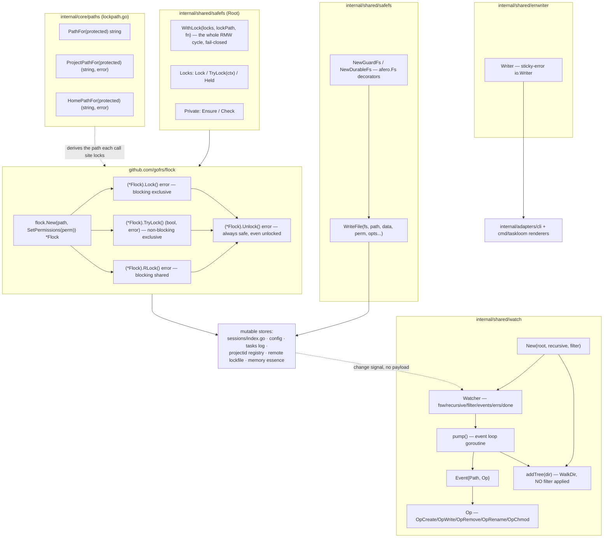

# Filesystem and I/O primitives

Three leaf packages own how ctxloom touches the filesystem: `internal/shared/safefs` is the write library over `afero` — the empty-write guard and durability as `afero.Fs` decorators, and the atomic writer that composes them; `internal/shared/errwriter` latches write errors on a formatted output stream; `internal/shared/watch` turns fsnotify into a filtered, optionally-recursive change-signal channel.

`safefs.Root` pairs the filesystem with what acts on the same files: `Private` (owner-only directories) and `Locks` (advisory locks). `safefs.New()` is the controller's own — real files, the platform's protection, kernel locks over `github.com/gofrs/flock` — built once by each process's composition root and threaded down; `safefs.NewMem(fs)` is a test's, with mode bits and in-process locks that really serialize. `safefs.WithLock(locks, lockPath, fn)` is the one read-modify-write transaction (lock path refusals, the lock-wait notice, fail-closed acquisition). Call sites that need a shared lock or a lock held across a process's life still hold a `*flock.Flock` directly. The protected-path→lock-name derivation (`PathFor`, `ProjectPathFor`, `HomePathFor`) is PATH POLICY, not locking, and lives in `internal/core/paths` (`lockpath.go`) beside the home/project tiering it depends on.

The contract they jointly own: **a mutable store is written atomically under an advisory lock named `<protected-path>.lock`, and observers learn it changed from a `watch.Watcher` that carries no data.**

```mermaid
flowchart TD
  subgraph sf["internal/shared/safefs"]
    WFA["WriteFile(fs, path, data, perm, opts...)"]
    WFAF["NewGuardFs / NewDurableFs — afero.Fs decorators"]
    WFAF --> WFA
  end
  subgraph ew["internal/shared/errwriter"]
    EW["Writer — sticky-error io.Writer"]
  end

  subgraph rt["internal/shared/safefs (Root)"]
    WL["WithLock(locks, lockPath, fn) — the whole RMW cycle, fail-closed"]
    LK["Locks: Lock / TryLock(ctx) / Held"]
    PV["Private: Ensure / Check"]
  end
  rt --> fl
  subgraph fl["github.com/gofrs/flock"]
    FN["flock.New(path, SetPermissions(perm)) *Flock"]
    FL["(*Flock).Lock() error — blocking exclusive"]
    FT["(*Flock).TryLock() (bool, error) — non-blocking exclusive"]
    FR["(*Flock).RLock() error — blocking shared"]
    FU["(*Flock).Unlock() error — always safe, even unlocked"]
    FN --> FL & FT & FR
    FL & FT & FR --> FU
  end
  subgraph pp["internal/core/paths (lockpath.go)"]
    PF["PathFor(protected) string"]
    PPF["ProjectPathFor(protected) (string, error)"]
    HPF["HomePathFor(protected) (string, error)"]
  end
  pp -.->|"derives the path each call site locks"| fl

  subgraph wt["internal/shared/watch"]
    NEW["New(root, recursive, filter)"]
    W["Watcher — fsw/recursive/filter/events/errs/done"]
    EV["Event{Path, Op}"]
    OP["Op — OpCreate/OpWrite/OpRemove/OpRename/OpChmod"]
    AT["addTree(dir) — WalkDir, NO filter applied"]
    PUMP["pump() — event loop goroutine"]
    NEW --> W
    W --> PUMP --> EV --> OP
    NEW --> AT
    PUMP --> AT
  end

  stores["mutable stores:<br/>sessions/index.go · config · tasks log ·<br/>projectid registry · remote lockfile · memory essence"]
  fl --> stores
  WFA --> stores
  stores -.->|"change signal, no payload"| W
  EW --> cli["internal/adapters/cli + cmd/taskloom renderers"]
```

## `internal/shared/safefs` and `internal/shared/errwriter`

Every production write goes through an `afero.Fs`; safefs is what sits on it. The package doc and each symbol's doc are the reference — this section only says how the pieces fit.

- `NewGuardFs` refuses zero bytes over an existing file (`ErrEmptyOverwrite`), on a rename and on a truncating open that is closed unwritten.
- `NewDurableFs` syncs the parent directory after a rename or a create, through the fs.
- `WriteFile` / `NewAtomicFile` write a unique temp file and rename it over the target through those decorators; `AllowEmpty()` and `Durable()` choose which apply.
- `WriteFileInPlace` and `OpenFIFOWriter` are the OS-only primitives, for a destination a rename cannot replace.
- `Root.Private.Ensure` creates a directory owner-only (a mode on unix, a protected owner-only DACL on Windows) and restricts an existing one only when `Check` finds it exposed, since a Windows restriction propagates to every child. Each process establishes the named private home roots with it at startup (`paths.EnsureHomeRoots`); below them, writers only create directories `safefs.PrivateDirMode`.
- `errwriter.Writer` is the errors-are-values writer the CLI renderers use.

The write-discipline gate (`archlint.WriteDisciplineAnalyzer`) refuses a raw `os` or `afero` write anywhere else.

## Advisory locking (`safefs.Locks` + `internal/core/paths`)

`safefs.WithLock(locks, lockPath, fn)` is the blocking read-modify-write transaction over a Root's `Locks`. `Locks.Lock` creates the lock's directory, opens the lock file — following a symlink, so a lock file may be linked anywhere — and refuses whatever it resolves to unless that is a regular file (`ErrNotRegularFile`: a FIFO or device is no lock), checked before the acquire and again on the locked handle, and takes the lock under the `lockwait.Watch` "still waiting" notice; `WithLock` runs `fn` as the WHOLE cycle. An acquisition failure fails closed and `fn` never runs, and nothing skips the lock: an in-memory Root's locks serialize too. `Locks.TryLock(ctx, path)` makes one attempt, then waits until `ctx` ends (`ErrLockHeld`), and never creates the lock's directory — a directory removed under a claimant is `fs.ErrNotExist`. `Lock.Current` reports the locked file is still the one at its path, which is how a claimant detects a removal made under the lock. `Locks.Held` probes without creating anything.

`sessions.WithFileLock(locks, target, fn)` is the wrapper for a FOREIGN file (an engine's own settings.json, a project's `.mcp.json`): it resolves the lock path with `paths.HomePathFor(target)` and takes it through the caller's Root's `Locks`, never skipping it. The managed-files writers (`agent.WriteManagedPackageFiles`, `ledger.Ledger.Write`) are handed only an `afero.Fs`, so they still choose their lock from it through `internal/shared/filelock` — the OS filesystem's locks, or none.

`PathFor(protected) string`, `ProjectPathFor(protected) (string, error)` and `HomePathFor(protected) (string, error)` (`internal/core/paths/lockpath.go`) are the protected-path→lock-name derivation — PATH POLICY, not locking, which is why they live in `internal/core/paths` rather than beside the lock calls. `PathFor` sits beside the protected file (home-rooted stores); `ProjectPathFor` maps into a project `.ctxloom/state/locks/`; `HomePathFor` maps into `~/.ctxloom/locks/` for a FOREIGN file more than one ctxloom-family binary may read-modify-write. See their doc comments for the full reasoning, including the deliberately-accepted flattening collisions.

To find the call sites, search for `safefs.WithLock`, `.Locks.`, `filelock.`, `sessions.WithFileLock` and `flock.New`.

## `internal/shared/watch`

An fsnotify wrapper: watch a root, optionally recursively including directories created later, filter events by path, normalize the op bitmask, deliver on a channel. 157 LOC, two consumers.

| Symbol | file:line | Purpose |
|---|---|---|
| `Op` (string) | `internal/shared/watch/watch.go:21` | Normalized filesystem verb |
| `OpCreate`, `OpWrite`, `OpRemove`, `OpRename`, `OpChmod` | `internal/shared/watch/watch.go:23-29` | The five verb constants |
| `Event{Path string; Op Op}` | `internal/shared/watch/watch.go:32` | One change to a watched path |
| `Watcher` | `internal/shared/watch/watch.go:38` | Fields `fsw *fsnotify.Watcher`, `recursive bool`, `filter func(string) bool`, `events chan Event`, `errs chan error` (buffered 1, `:64`), `done chan struct{}` |
| `New(root string, recursive bool, filter func(string) bool) (*Watcher, error)` | `internal/shared/watch/watch.go:51` | `os.Stat(root)` — a missing root or a non-directory is an error; `New` creates nothing → create fsnotify watcher → add root or whole tree → start `pump` goroutine (`:76`). Closes the fsnotify handle on error before returning (`:69`, `:73`) |
| `(*Watcher).Events() <-chan Event` | `internal/shared/watch/watch.go:81` | Receive-only view of `events` |
| `(*Watcher).Errors() <-chan error` | `internal/shared/watch/watch.go:84` | Receive-only view of `errs` |
| `(*Watcher).Close() error` | `internal/shared/watch/watch.go:87` | `close(w.done)` then `w.fsw.Close()`. Ordering matters: signal `pump` before tearing down the handle it reads |
| `(*Watcher).addTree(dir string) error` | `internal/shared/watch/watch.go:94` | `filepath.WalkDir`, `fsw.Add` for every directory. Walk errors return `nil` (`:96-98`) so an unreadable subtree is skipped |
| `(*Watcher).pump()` | `internal/shared/watch/watch.go:108` | Event loop: on `done` return; on a Create that stats as a directory, `addTree` (`:118-122`); apply the filter (`:123`); forward (`:127`); non-blocking error offer (`:135-138`) |
| `normalize(op fsnotify.Op) Op` | `internal/shared/watch/watch.go:144` | Bitmask → single verb; `default:` returns `OpChmod` (`:154-155`) |

| Consumer | Site | Mode | Filter |
|---|---|---|---|
| `taskloom watch` | `cmd/taskloom/watch.go:55` | non-recursive, on `filepath.Dir(logPath)` | `p == logPath` |
| `ctxloom plan watch` | `internal/adapters/cli/plan_watch.go:57` | recursive, on `~/.ctxloom/sessions` | `strings.HasSuffix(p, ".plan.md")` |

Both debounce at 100ms and emit a content-free `{"event":"changed","kind":…}` line on which the frontend re-queries.

## Invariants and contracts

**Atomic write (`safefs.WriteFile`)**

- Ordering is the contract: temp file → `Sync` → `Close` → `Chmod` → `Rename`. A reader never observes a torn file.
- The temp name is unique and dot-prefixed, in the target's own directory, so concurrent writers never clobber each other's temp.
- Zero bytes over an existing file are refused with `ErrEmptyOverwrite` unless `AllowEmpty()` is passed; zero bytes to a new path proceed.
- `perm` is applied by `Chmod`, which ignores umask — unlike `os.WriteFile`/`afero.WriteFile`.
- Without `Durable()` the rename is atomically visible but its directory entry is not synced.

**Sticky-error writer (`errwriter.Writer`)**

- First error wins and sticks; every later write is a no-op. `Err()` is checked once, at the end.
- `Err() == nil` means either "all writes succeeded" or "nothing was ever written" — the two are indistinguishable.
- Not goroutine-safe. One instance per goroutine.

**Locking (`safefs.Locks` + `gofrs/flock` + `internal/core/paths`)**

- `flock(2)` on Unix (via `golang.org/x/sys/unix`), a comparable mandatory-lock API on Windows — `*flock.Flock` handles the platform split internally; ctxloom code is platform-agnostic.
- **Non-reentrant.** A goroutine holding the lock must not call anything that re-acquires the same `*flock.Flock`.
- `Lock`/`RLock` are **blocking with no timeout**; `TryLock` is the non-blocking variant, returning `(false, nil)` on contention rather than an error. `flock.Flock` also offers `TryLockContext`/`TryRLockContext` (poll-with-context) that no call site in this codebase currently uses.
- `flock.Flock.Unlock()` is always safe to call — on an unlocked `*flock.Flock`, and safe to call twice — so the old "on error, unlock is nil" hazard (a custom closure that could be nil) is gone: every call site holds a concrete, always-non-nil `*flock.Flock` value, not a closure the package's own bookkeeping could get wrong.
- `flock.New` does NOT create the lock file's parent directory: `Locks.Lock` creates it (`TryLock` deliberately does not), and a call site holding a `*flock.Flock` directly does its own `os.MkdirAll` first.
- **The `<protected-path> + ".lock"` / flattened-name naming convention is `internal/core/paths`' invariant now** (`PathFor`/`ProjectPathFor`/`HomePathFor`, `internal/core/paths/lockpath.go`), not re-derived at each call site — see those functions' own docs for the collision stance and the home/project boundary.
- Lock files are never removed; they accumulate one per protected store. Harmless — the OS releases the lock on fd close, including process death.

**Watching (`watch`)**

- `New` **refuses a root that does not exist** rather than creating it: a watcher on a directory the process just invented, from a typo'd or wrongly-resolved root, would stream zero events forever at exit 0. A caller that needs the directory creates it at its own call site.
- `filter == nil` means all events pass (guarded at `:123`).
- **`addTree` never consults `filter`** — the filter applies to *events* only. Recursive mode therefore costs one inotify watch per directory in the tree, including build and worktree churn, and `pump` adds a watch for each newly created directory too.
- `Close` is **not idempotent** — a second call panics on `close` of a closed channel. There is no `sync.Once`. Both consumers call it exactly once, via `defer`.
- `Close`'s ordering is required: `close(w.done)` before `w.fsw.Close()`.
- `errs` is buffered at 1 and the send is non-blocking with an empty `default:` — errors after the first buffered one are discarded, and if a consumer never selects on `Errors()`, all of them are. When `fsw.Errors` closes, `pump` returns without closing `errs`, so a consumer selecting on `Errors()` waits forever.
- Recursive adoption is inherently racy: files written into a new directory between its `mkdir` and the `fsw.Add` produce no event, and there is no rescan.
- `normalize`'s `default` arm returns `OpChmod`, so an unrecognised or zero op is reported as a confident "chmod".
- Real vs documented: the package doc justifies `Op`'s five-verb vocabulary as being "for the wire", but neither consumer reads `Event.Op` — both discard the whole event (`internal/adapters/cli/plan_watch.go:88`, `cmd/taskloom/watch.go:79`) and emit a fixed `{"event":"changed"}` line.
- Depth contract mismatch worth knowing when reading `plan watch`: the watcher is recursive at any depth while `internal/shared/plans.List` (`plans.go:60-80`) enumerates exactly `<root>/<harp>/*.plan.md` and skips second-level subdirectories, so nested plan files fire events that the list they trigger cannot show.
