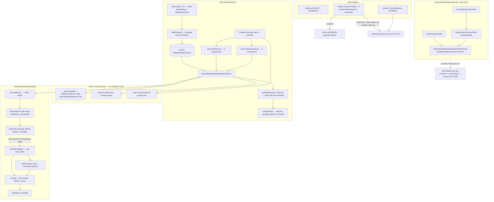

# Identity and primitives

Six leaf packages supply the values ctxloom builds identity and bookkeeping from. `internal/shared/harp` mints the pronounceable `swift-amber-falcon` identifiers that name every session, task, and project. `internal/shared/harpmarker` formats the `<ctxloom name="…" kind="harp" />` element a session writes into its own backend transcript, and recovers it back out. `internal/shared/gitutil` answers repo-root and remote-URL questions in-process via go-git. `internal/shared/collections`, `internal/shared/textutil`, and `internal/shared/tokens` are the small shared value helpers: a generic `Set`, UTF-8-safe byte truncation, and the one owned token-count heuristic.

The contract they jointly own: **an identifier is generated in exactly one place, becomes a filesystem path segment and a primary key, and can be recovered from a transcript; text and token budgets are computed by one shared rule so independent surfaces agree.**

## `internal/shared/harp`

Generates pronounceable identifiers from embedded word lists. Shaped as a future extraction (`// API mirrors the Rust crate so a future extraction to github.com/benjaminabbitt/harp-go is mechanical`). Consumers: `cmd/harp`, `internal/sessions`, `internal/shared/tasks`, `internal/shared/tasks/projectid`.

| Symbol | file:line | Purpose |
|---|---|---|
| `DefaultGroup = "default"` | `internal/shared/harp/harp.go:21` | Word-list group used when `Options.Group` is empty or unknown |
| `//go:embed *.txt` | `internal/shared/harp/harp.go:26` | Four files: `{default,long}.{adjectives,nouns}.txt` |
| `wordGroup{adjectives, nouns []string}` | `internal/shared/harp/harp.go:30` | One named group's two lists |
| `typeAdjectives`, `typeNouns` | `internal/shared/harp/harp.go:36-37` | The two filename type tokens |
| `groups` | `internal/shared/harp/harp.go:42` | Package-level registry, `= loadGroups()` |
| `loadGroups() map[string]wordGroup` | `internal/shared/harp/harp.go:46` | Reads every embedded file, builds the registry, prunes incomplete groups. Panics at `:49` |
| `parseWordGroupEntry(...)` | `internal/shared/harp/harp.go:68` | Splits `"<group>.<type>.txt"`; `ok=false` for non-matching names (`:70-76`); panics on `ReadFile` failure (`:79`) |
| `assignWordGroup(...)` | `internal/shared/harp/harp.go:86` | Stores words into the adjective or noun slot; the only interpreter of the two type strings |
| `pruneIncompleteGroups(...)` | `internal/shared/harp/harp.go:99` | Deletes any group missing either list — the guard that makes `pickWord` safe |
| `Groups() []string` | `internal/shared/harp/harp.go:108` | Usable group names, **unsorted** (map iteration order). Sole production caller `cmd/harp/root.go:76` |
| `parseList(...)` | `internal/shared/harp/harp.go:116` | Splits file contents into non-empty lines |
| `Options{Components int; MaxElementLength int; Separator string; Group string}` | `internal/shared/harp/harp.go:129` | Generation parameters |
| `(Options).normalize()` | `internal/shared/harp/harp.go:146` | Clamps `Components` to 2..16 (`:147-152`), defaults `Separator` to `-`, falls back to `DefaultGroup` for an empty or unknown group (`:156-158`) |
| `rngRead` | `internal/shared/harp/harp.go:164` | Entropy seam, `= rand.Read` |
| `GenerateName() string` | `internal/shared/harp/harp.go:167` | `GenerateNameWithOptions(Options{})` — 3 components. Callers: `internal/sessions/index.go:777,782`, `internal/shared/tasks/projectid/registry.go:280` |
| `GenerateShortName() string` | `internal/shared/harp/harp.go:174` | `Options{Components: 2}`. Caller: `internal/shared/tasks/task.go:154` |
| `UniqueFrom(used map[string]struct{}, gen func() string) string` | `internal/shared/harp/harp.go:185` | First `gen()` not in `used`, up to 100 tries; then **one unchecked `gen()`** (`:192`). Callers: `internal/shared/tasks/projectid/registry.go:280`, `internal/shared/tasks/task.go:154` |
| `GenerateNameWithOptions(o Options) string` | `internal/shared/harp/harp.go:197` | Normalizes, picks N-1 adjectives + 1 noun, joins. Caller: `cmd/harp/root.go:102` |
| `pickWord(words []string, maxLen int) string` | `internal/shared/harp/harp.go:211` | Uniform random word, retrying up to 1000× until `maxLen` is satisfied; then `words[0]` (`:218`) |
| `randIndex(n int) int` | `internal/shared/harp/harp.go:224` | Uniform `[0,n)` by rejection sampling (no modulo bias); `0` for `n <= 0` (`:225-227`); panics on `rngRead` failure (`:233`) |

Identity-space sizes: `default` group is 443 adjectives × 1102 nouns, so `GenerateShortName` draws from **488,186** names and `GenerateName` from ~2.16 × 10⁸. The `long` group is 1269 × 4396.

## `internal/shared/harpmarker`

Formats and recovers a self-closing `<ctxloom name="…" kind="harp" />` element written into a session's own backend transcript, so a later reader can answer "which harp owns this transcript?" from the transcript alone. Positioned as the identity channel of last resort: the package doc (`marker.go:9-12`) names the session index, the PID registry, the binding, and hook bookkeeping as having proven unreliable.

| Symbol | file:line | Purpose |
|---|---|---|
| `markerRe` | `internal/shared/harpmarker/marker.go:29` | `` `<ctxloom\b[^>]*\bkind="harp"[^>]*?/?>` `` |
| `nameRe` | `internal/shared/harpmarker/marker.go:32` | `` `\bname="([^"]+)"` `` |
| `Format(harp string) string` | `internal/shared/harpmarker/marker.go` | `""` when `harp == ""` **or** when the name contains `"` or `>` (the characters that would make the element name a different harp, or no harp); else `` `<ctxloom name="` + harp + `" kind="harp" />` ``. Whatever it returns round-trips through `Find`. Sole production caller `emitHarpMarker`, `internal/cli/session_bind.go` |
| `Find(s string) string` | `internal/shared/harpmarker/marker.go:45` | `FindAllString` over the input (`:46`), returns the `name` of the first matched element **that has one** (`:47`). No production caller |
| `Scan(line []byte) string` | `internal/shared/harpmarker/marker.go:60` | `Find` on the raw bytes first (`:61`); on a miss, `json.Unmarshal` (error → `""`, `:65-67`) and delegate to `findInValue` (`:68`). No production caller |
| `findInValue(v any) string` | `internal/shared/harpmarker/marker.go` | Recursive descent: string leaf → `Find`, then re-decode if it parses as JSON and recurse; `map[string]any` → recurse over values **in sorted key order**; `[]any` → recurse over elements in order |

The write path is installed as the SessionStart hook for every ctxloom session (`emitHarpMarker`, `internal/cli/session_bind.go`). The read half (`Scan`/`Find`/`findInValue`) has no production caller: ADR 0017 names `ClaudeSessionHistory.harpFromTranscript` and `previousSessionByListing` as its consumers, and both were removed at `6683bc4c` with the four per-engine transcript scrapers. Its fate is the open decision recorded as U112-F01.

## `internal/shared/gitutil`

Read-only, in-process answers to two questions about the git repository enclosing a path, via go-git v5.19.1 rather than shelling out. Declares no types. `internal/cli/hook_inject_context.go:85` passes `FindRoot` as a `func(string) (string, error)` value, making that signature a de-facto interface with one implementation and one stub (`hook_inject_context.go:338`).

| Symbol | file:line | Purpose |
|---|---|---|
| `GetOriginURL(startPath string) (string, error)` | `internal/shared/gitutil/gitutil.go:15` | `return GetRemoteURL(startPath, "origin")`. Sole production caller `internal/operations/bundles.go:856`, which discards the error |
| `GetRemoteURL(startPath, remoteName string) (string, error)` | `internal/shared/gitutil/gitutil.go:21` | Abs-path; `os.Stat` (error **ignored**, `:26`); demote a file path to its dir; `PlainOpenWithOptions{DetectDotGit: true}` (`:30-32`); `repo.Remote(name).Config().URLs[0]` (`:45`). Wraps four failure modes. No production caller outside `GetOriginURL` |
| `FindRoot(startPath string) (string, error)` | `internal/shared/gitutil/gitutil.go:51` | Abs-path; `os.Stat` (error **returned** as `stat path: %w`, `:58-61`); demote a file path to its dir; open with the same options (`:66-68`); return `repo.Worktree().Filesystem.Root()`. Callers: `internal/projectroot/projectroot.go:82,102`, `internal/taskloom/workdir/workdir.go:118`, `internal/cli/hook_inject_context.go:85` |

## `internal/shared/collections`

A generic `Set[T]` over `map[T]struct{}` plus a map-key sorter, used as readability sugar by `internal/bundles`, `internal/config`, `internal/lm/backends`, `internal/operations`, `internal/remote`, and `internal/shared/agent`. The dominant use is the "seen"/"visited" idiom in recursive resolvers (`internal/config/config_resolve.go`, `internal/operations/sync.go`, `internal/bundles/loader.go`).

| Symbol | file:line | Purpose |
|---|---|---|
| `Set[T comparable]` | `internal/shared/collections/set.go:32` | Declared map type (not a struct) — the type *is* the storage |
| `NewSet[T]() Set[T]` | `internal/shared/collections/set.go:35` | `make(Set[T])`. 24 production call sites |
| `NewSetFrom[T](elements ...T) Set[T]` | `internal/shared/collections/set.go:40` | Length-hinted variadic seeding. 3 call sites |
| `(Set[T]).Add(v T)` | `internal/shared/collections/set.go:49` | `s[v] = struct{}{}`. 14 production call sites |
| `(Set[T]).AddAll(values ...T)` | `internal/shared/collections/set.go:54` | Loops `Add`. 3 call sites, all in `internal/bundles/bundles.go:710,712,715` |
| `(Set[T]).Has(v T) bool` | `internal/shared/collections/set.go:61` | Membership. Passed as a *method value* at `internal/bundles/loader_content.go:485` (`slices.ContainsFunc(info.Tags, tagSet.Has)`). 20+ call sites |
| `(Set[T]).Items() []T` | `internal/shared/collections/set.go:68` | Pre-sized slice; **order not guaranteed**. 6 call sites, incl. `internal/config/config_resolve.go:270,271,272` |
| `(Set[T]).Clone() Set[T]` | `internal/shared/collections/set.go:77` | Pre-sized copy. 1 production call site: `internal/config/config_resolve.go:337` (`visited.Clone()` per DAG branch) |
| `SortedKeys[K ~string, V](m map[K]V) []K` | `internal/shared/collections/sorted_keys.go:9` | Collects keys, `sort.Slice` by `<`. 3 call sites: `internal/config/accessors.go:363`, `internal/config/config_bundles.go:301`, `internal/operations/vendorreader_backfill.go:60` |

Go 1.25 equivalents, for reference when reading call sites: `NewSet` = `make(map[T]struct{})`, `Items` = `slices.Collect(maps.Keys(s))`, `Clone` = `maps.Clone(s)`, `SortedKeys` = `slices.Sorted(maps.Keys(m))`.

## `internal/shared/textutil`

One function. Twelve production call sites across `internal/cli` (6), `internal/memory` (5), `internal/compression` (1).

| Symbol | file:line | Purpose |
|---|---|---|
| `TruncateBytes(s string, maxBytes int) string` | `internal/shared/textutil/textutil.go:10` | `""` when `maxBytes <= 0` (`:11-13`); `s` unchanged when already within the cap; else `s[:maxBytes]` with trailing bytes stripped while `utf8.DecodeLastRuneInString` reports `(RuneError, size <= 1)` (`:22-29`) |

Three distinct concepts share the one function:

| Use | Sites |
|---|---|
| Ellipsize for a display column — the caller appends `"..."` itself | `internal/compression/json.go:221`, `internal/memory/compactor.go:679`, `internal/cli/search.go:315,320`, `internal/cli/remote_discover.go:83,88`, `internal/cli/bundle_distill.go:299`, `internal/cli/bundle_list.go:267`, `internal/cli/memory.go:302` |
| Hard byte cap | `internal/memory/compactor.go:943` |
| Rune-boundary **offset** — `len(TruncateBytes(s, n))` used as an `int`, string discarded | `internal/memory/compactor.go:774,793` |

## `internal/shared/tokens`

One constant and one function; the package exists for *ownership*, not arithmetic (`tokens.go:1-4`: "deliberately the one place that knows the heuristic … a real tokenizer can replace the heuristic here without touching call sites").

| Symbol | file:line | Purpose |
|---|---|---|
| `CharsPerToken = 4` | `internal/shared/tokens/tokens.go:9` | The ratio. Referenced at `internal/memory/compactor.go:35` (re-aliased as an exported `internal/memory` constant), used at `compactor.go:741,742` |
| `Estimate(text string) int` | `internal/shared/tokens/tokens.go:12` | `len(text) / CharsPerToken`. Callers: `internal/cli/run.go:699,804`, `internal/memory/compactor.go:1128` (via the local `estimateTokens` wrapper at `compactor.go:1127-1129`, itself called from `:222,251,261`) |

Two use classes with very different stakes: **reporting** (`cli/run.go:699,804`, `compactor.go:222,251,261` — a wrong number is cosmetic) and **control** (`compactor.go:741-742` converts a token budget into the byte offsets `chunkText` actually slices at, `compactor.go:778`).

## Invariants and contracts

**Harp generation**

- `groups` is built by a **package-level variable initializer**, so `loadGroups` runs before `main()` in every family binary (`ctxloom`, `taskloom`, `ltk`, `harp`), and its two panics (`harp.go:49`, `:79`) are uncatchable startup crashes. Both are asserting an impossible state (the FS is compile-time embedded), not handling an error.
- A badly-*named* embedded file is skipped silently; an unreadable one panics.
- **`pruneIncompleteGroups` is the guard that makes generation total**: any group missing either list is deleted before generation can see it, so `GenerateNameWithOptions` cannot return an empty string for any registered group.
- `Options.normalize()` **must run before any field is read** or `groups[o.Group]` yields a zero `wordGroup` and `pickWord` indexes a nil slice. Today `GenerateNameWithOptions:198` is the only reader and normalizes on its first line.
- Invalid options are **silently clamped, not rejected** — documented at `harp.go:196`. `harp -c 1` yields three words; `harp --group lng` silently draws from `default` and the output looks plausible.
- `randIndex` panics on CSPRNG failure — correct, and deliberately different from the load-time panics: silently degrading randomness would be worse. It returns `0` for `n <= 0`, which papers over a caller bug (unreachable today).
- `pickWord` falls back to `words[0]` after 1000 rejected draws, so an unsatisfiable `MaxElementLength` makes **every generated name a constant** with no signal (the shortest word in either default list is 3 characters, so `--max-len 2` returns the literal `aged-aged-able`).
- Real vs documented: `UniqueFrom` is documented as best-effort and its doc instructs callers who cannot tolerate a residual collision to check the result against `used`; **neither of its two callers performs that check**, so a duplicate id can be returned and stored. The short-name space is 488,186, and `used` covers only one store, so independent branches share no guard.
- **There is no harp validator anywhere in the repo** (`rg 'ValidateHarp|IsValidHarp|harpPattern|harpRe|validHarp'` → 0 hits), yet harps are used unvalidated as filesystem path segments by `internal/paths/paths.go:182` (`HarpDir`) and its four derived paths (`HarpEssencePath:192`, `HarpEphemeralDir:202`, `HarpPersistDir:212`, `HarpTranscriptStoreDir:223`). `sessions.Manager.Rename` (`internal/sessions/index.go:625`) validates only non-emptiness and uniqueness.
- `Groups()` returns map-iteration order, so `harp`'s group listing differs between invocations.
- `internal/sessions/index.go:772-783` (`generateUniqueHarp`) reimplements `UniqueFrom` line-for-line, including the unchecked fallback; its comment's "5.6M names" figure understates the 3-component space by ~39×.

**Harp marker**

- `Format` is the **single authoritative spelling** of a wire format that crosses a process boundary and a storage layer: a Go hook writes it, a backend nests and escapes it into a transcript, and a different Go process is meant to recover it.
- `Format` returns `""` for a name it cannot represent, and the sole caller REPORTS every such case: `emitHarpMarker` (`internal/cli/session_bind.go`) warns on the diagnostic channel for an empty return, a marshal failure and a write failure alike, naming `CTXLOOM_SESSION_HARP`'s value. stdout stays the hook's contract channel and never carries a diagnostic.
- `Format` **refuses** a name containing `"` or `>` rather than emitting a corrupt element. A `"` would truncate `nameRe`'s match (silently naming a different harp, and admitting attribute injection); a `>` would stop `markerRe` matching at all. `harp.Validate` is permissive enough to admit both, so the guard lives here.
- `Find` returns the name of the first marker **that has one** — a `kind="harp"` element without `name=` is skipped, not treated as a match. `""` means "not present" and is indistinguishable from "present but malformed".
- `Scan` checks the **raw bytes before** any structural interpretation (`:61`) and `findInValue` descends into every map value and slice element with no field-name filter, so the search covers user-authored message content as well as the hook envelope.
- `findInValue` walks `map[string]any` in **sorted key order**, so two markers under different object keys resolve to the same harp on every scan of the same bytes. Which key wins is arbitrary and not a contract; stability is.
- The nested re-decode has **no depth bound**; it terminates only because each JSON-decode round strips a quoting layer and the string strictly shrinks.
- `kind="harp"` is the only discriminator, and the package doc now says so. `<ctxloom\b` matches the `<ctxloom` prefix of `<ctxloom-context …>` (`-` is a word boundary) and `/?` makes the closing slash optional, so neither the element name nor the self-closing shape separates the marker from the content wrapper.

**Git access**

- `gitutil` is **read-only and environment-blind**: it constructs no `exec.Cmd` and consults no git environment variable — not `GIT_DIR`, `GIT_WORK_TREE`, `GIT_CEILING_DIRECTORIES`, or `GIT_COMMON_DIR`. `internal/git` (`exec.go:437`, `cmd.Env = os.Environ()`) is the other git layer and does honour all of them, so under a hook invocation (where git sets `GIT_DIR`) the two answer different questions. Nothing documents the boundary.
- `FindRoot`'s invariant: walk up from an arbitrary path — which may be a file, may be relative, may be inside a linked worktree or submodule — and return the absolute worktree root or a typed error, never a plausible-looking wrong directory. It handles `.git`-as-a-file, demotes a file argument to its directory, and rejects a bare repo.
- All three functions return a **non-nil error rather than an empty string** on every failure path — there is no `return "", nil`.
- The two functions handle the identical "is `startPath` a file or a directory?" precondition with **opposite error policies**: `FindRoot` returns `stat path: %w`, `GetRemoteURL` drops the stat error, so a nonexistent path yields a different (and for the remote path misleading) message from each.
- `PlainOpenOptions` sets `DetectDotGit: true` but leaves `EnableDotGitCommonDir` false. In a **linked git worktree** — this project's standard agent workflow — go-git then treats `<main>/.git/worktrees/<name>/` as the whole repository, and that directory contains no `config`, so `GetRemoteURL`/`GetOriginURL` fail with `remote "origin" not configured`. `FindRoot` is unaffected, because go-git returns the containing directory as the worktree filesystem regardless.
- `GetRemoteURL` returns `urls[0]`, the **fetch** URL. Git treats multiple `url =` entries as fetch-from-first / push-to-all, and the one consumer uses the answer to decide where to *push*.

**Collections**

- Real vs documented: `set.go:31` says "The zero value is not usable". In fact the **read methods (`Has`, `Items`, `Clone`) are nil-safe and the write methods (`Add`, `AddAll`) panic** on a nil receiver. `internal/operations/items.go:223` already depends on the nil-safe read: `var failed collections.Set[string]` is assigned only inside `switch req.Kind` arms and read unconditionally at `items.go:346`.
- `Items()` returns map-iteration order and disclaims ordering. Three of its call sites feed `internal/config` resolved-profile fields (`config_resolve.go:270,271,272` → `ExcludeFragments`, `ExcludeMCP`, `DenyTools`), while the sibling `sortedCompanionRefs` (`config_bundles.go:295-301`) exists precisely because that package promises a stable result across runs.
- `Items()` and `Clone()` return **empty non-nil** values for empty or nil input; neither can fail.
- The package holds two unrelated concerns — `sorted_keys.go` shares no type, state, or caller pattern with `set.go`, and `SortedKeys` is never called on a `Set`.

**Text truncation**

- The invariant: **cutting to a byte budget never produces invalid UTF-8, and never destroys a legitimately-encoded U+FFFD.** The second half is the subtle one — `utf8.DecodeLastRuneInString` returns `RuneError` both for an incomplete sequence (`size == 1`) and for a correctly-encoded U+FFFD (`size == 3`), so the `size <= 1` qualifier at `:24` is what distinguishes the cut's own debris from real input. Testing only `r == utf8.RuneError` silently eats replacement characters.
- Why it matters: a mid-rune split makes a chunk invalid UTF-8, which fails proto3 string marshaling and silently turns the chunk into a failure marker — documented content loss at `internal/memory/compactor.go:770-772`.
- `maxBytes <= 0` returns `""` **silently**, and every ellipsize caller immediately concatenates its suffix — so a zero budget renders as a bare `"..."` with the content gone. The one call site whose budget is configuration rather than a literal (`internal/compression/json.go:221`, `c.MaxValueLength`) is protected only by `NewJSONCompressor` supplying `30`; `&JSONCompressor{}` compiles and zeroes it.
- The result **exceeds** the requested cap at every ellipsize site, because the caller appends the suffix afterward. Each has pre-compensated by subtracting 3 from its real column width (17, 15, 32, 16, 57, 67 for widths 20, 18, 35, 19, 60, 70), and nothing enforces that relationship.
- The cap is a **byte** budget, not a display-width budget: 15 bytes of CJK is 5 characters occupying 10 terminal columns, versus 15 columns for ASCII.
- For input that is not valid UTF-8 the strip loop can consume the entire prefix and return `""` — a legitimate cut can only ever leave `utf8.UTFMax - 1 == 3` bytes of debris, and the loop has no such floor.

**Token estimation**

- The invariant is **agreement**, not arithmetic: the dry-run assembly preview and the distillation chunker must use the same ratio, or ctxloom reports one budget and chunks to another.
- Real vs documented: `len()` counts **bytes**, but the constant is named `CharsPerToken` and its doc says "characters". `compactor.go:741` computes `targetTokens * CharsPerToken` and `chunkText` slices by byte offset, so for multi-byte text the chunk overshoots its token budget — the direction that overfills a model window, not the safe one.
- Real vs documented: the promise that "a real tokenizer can replace the heuristic here without touching call sites" holds for `Estimate`'s three call sites but **not for `CharsPerToken`**, which is consumed as a bare arithmetic multiplier to answer the inverse question ("how many bytes is N tokens?"). A real tokenizer has no such ratio.
- `internal/memory/compactor.go:33-35` re-exports the constant as its own exported `CharsPerToken`, and both uses inside `compactor.go` read the alias rather than the original — so "one place knows the heuristic" has a second spelling in front of it. The same re-alias habit applies to `stderrtail.DefaultBytes` at three sites.
- Integer division makes `Estimate` return `0` for any text of 1-3 bytes. No current caller gates on the result; all three assign it to a report field.
