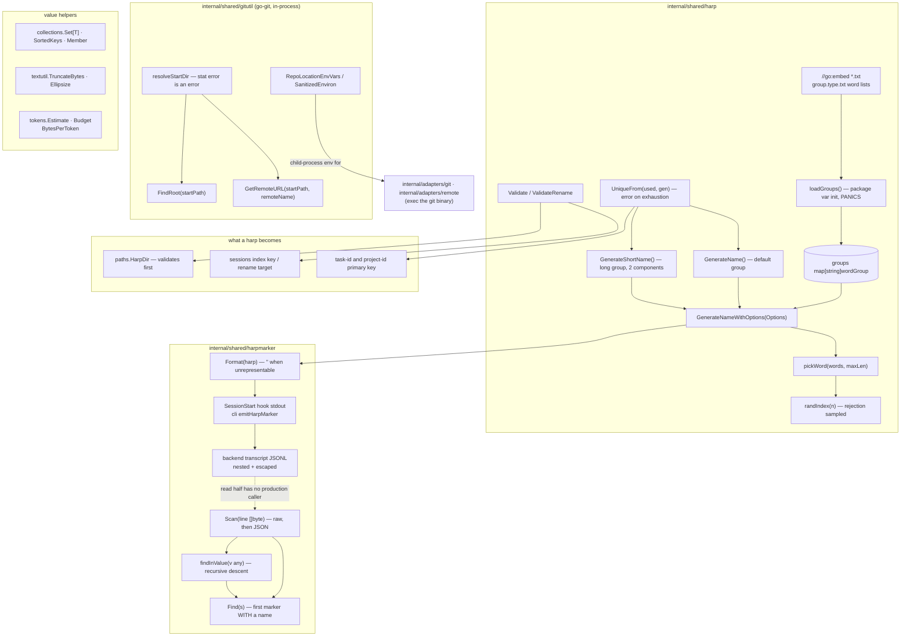

# Identity and primitives

Leaf packages that supply the values ctxloom builds identity and bookkeeping from. `internal/shared/harp` mints and validates the pronounceable `swift-amber-falcon` identifiers that name every session, task, and project. `internal/shared/harpmarker` formats the `<ctxloom name="…" kind="harp" />` element a session writes into its own backend transcript, and recovers it back out. `internal/shared/gitutil` answers repo-root and remote-URL questions in-process via go-git. `internal/shared/collections`, `internal/shared/textutil`, and `internal/shared/tokens` are the small shared value helpers: a generic `Set` and key/membership helpers, UTF-8-safe byte truncation, and the one owned token-count heuristic.

The contract they jointly own: **an identifier is generated in exactly one place, is validated before it becomes a filesystem path segment or a primary key, and can be recovered from a transcript; text and token budgets are computed by one shared rule so independent surfaces agree.**

Each package's consumers are found by searching for its import path; this page does not list them.

```mermaid
flowchart TD
  subgraph harp["internal/shared/harp"]
    EMB["//go:embed *.txt<br/>group.type.txt word lists"]
    LG["loadGroups() — package var init, PANICS"]
    GRP[("groups map[string]wordGroup")]
    GNWO["GenerateNameWithOptions(Options)"]
    GN["GenerateName() — default group"]
    GSN["GenerateShortName() — long group, 2 components"]
    UF["UniqueFrom(used, gen) — error on exhaustion"]
    PW["pickWord(words, maxLen)"]
    RI["randIndex(n) — rejection sampled"]
    VAL["Validate / ValidateRename"]
    EMB --> LG --> GRP --> GNWO
    GN --> GNWO
    GSN --> GNWO
    GNWO --> PW --> RI
    UF --> GN & GSN
  end

  subgraph out["what a harp becomes"]
    PATH["paths.HarpDir — validates first"]
    IDX["sessions index key / rename target"]
    TASK["task-id and project-id primary key"]
  end
  VAL --> PATH & IDX
  UF --> TASK

  subgraph hm["internal/shared/harpmarker"]
    FMT["Format(harp) — '' when unrepresentable"]
    FIND["Find(s) — first marker WITH a name"]
    SCAN["Scan(line []byte) — raw, then JSON"]
    FIV["findInValue(v any) — recursive descent"]
    FMT --> WIRE["SessionStart hook stdout<br/>cli emitHarpMarker"]
    WIRE --> TR["backend transcript JSONL<br/>nested + escaped"]
    TR -.->|"read half has no production caller"| SCAN
    SCAN --> FIND
    SCAN --> FIV --> FIND
  end
  GNWO --> FMT

  subgraph gu["internal/shared/gitutil (go-git, in-process)"]
    RSD["resolveStartDir — stat error is an error"]
    FR["FindRoot(startPath)"]
    GRU["GetRemoteURL(startPath, remoteName)"]
    ENV["RepoLocationEnvVars / SanitizedEnviron"]
    RSD --> FR & GRU
  end
  ENV -->|"child-process env for"| OTHER["internal/adapters/git · internal/adapters/remote<br/>(exec the git binary)"]

  subgraph vals["value helpers"]
    SET["collections.Set[T] · SortedKeys · Member"]
    TB["textutil.TruncateBytes · Ellipsize"]
    TOK["tokens.Estimate · Budget<br/>BytesPerToken"]
  end
```

## `internal/shared/harp`

Generates pronounceable identifiers from embedded word lists, and validates the names that become identifiers. Shaped as a future extraction: the package doc says the API mirrors the Rust crate so a move to `github.com/benjaminabbitt/harp-go` is mechanical.

| Symbol | Purpose |
|---|---|
| `DefaultGroup` | Word-list group used when `Options.Group` is empty or unknown |
| `MinComponents`, `MaxComponents` | The bounds `normalize` enforces; a caller advertising the range (CLI help) reads them rather than restating them |
| `wordFS` (`//go:embed *.txt`) | The embedded `<group>.<type>.txt` word lists |
| `wordGroup`, `typeAdjectives`, `typeNouns` | One group's two lists, and the two filename type tokens |
| `groups` / `loadGroups` | Package-level registry built at init. Panics if the embedded FS cannot be read |
| `parseWordGroupEntry` / `assignWordGroup` / `pruneIncompleteGroups` / `parseList` | Parse the filenames and contents; drop any group missing either list |
| `Groups()` | Usable group names, **sorted** — the result is rendered into CLI usage text, so map order would change it between runs |
| `Options` / `(Options).normalize` | Generation parameters; `normalize` defaults or clamps every field and falls back to `DefaultGroup` for an unknown group |
| `rngRead` | Entropy seam, `= rand.Read` |
| `GenerateName()` | Default options: adjectives + noun from `DefaultGroup` |
| `GenerateShortName()` | Two components drawn from the `long` group, for per-project task ids; its doc records why the wider group was chosen |
| `UniqueFrom(used, gen) (string, error)` | First `gen()` not in `used`, with a bounded number of tries; on exhaustion it returns an error and an empty id, never an unchecked name. The shared allocator behind the session index, the project-id registry and task ids |
| `GenerateNameWithOptions(Options)` | Normalizes, picks N-1 adjectives + 1 noun, joins |
| `pickWord(words, maxLen)` | Uniform pick from the words within `maxLen`; an unsatisfiable cap draws from the full list rather than collapsing to a constant |
| `randIndex(n)` | Uniform `[0,n)` by rejection sampling (no modulo bias) |
| `Validate(name)` | Whether `name` can be one path component: non-empty, not `.`/`..`, no `/`, `\` or `:`, no control character, no edge whitespace. Deliberately permissive on charset |
| `ValidateRename(name)` / `MaxNameLen` / `ErrNameTooLong` | `Validate` plus a length bound for names a human chooses; the bound comes from the MCP instructions' character budget, and is not part of `Validate` so an older, longer name still resolves |

### Invariants

- `groups` is built by a **package-level variable initializer**, so `loadGroups` runs before `main()` in every binary that imports the package, and its panics are uncatchable startup crashes. They assert an impossible state (the FS is compile-time embedded), not a runtime error.
- A badly-*named* embedded file is skipped silently; an unreadable one panics.
- **`pruneIncompleteGroups` makes generation total**: any group missing either list is deleted before generation can see it. `randIndex` panics on `n < 1` rather than returning an index into an empty list, so a missing list fails at its cause.
- `normalize` **must run before any field is read**, or `groups[o.Group]` yields a zero `wordGroup`. `GenerateNameWithOptions` normalizes on its first line.
- Invalid options are **clamped, not rejected**, inside the package. A CLI that wants to refuse bad input checks it itself (`cmd/harp` refuses an unknown `--group`).
- `randIndex` panics on CSPRNG failure, deliberately: silently degrading randomness would be worse than crashing.
- **Validation sits where a name becomes a path.** `paths.HarpDir` calls `Validate` before joining, so no harp-derived path can be built from a name that escapes the sessions root, whichever caller supplied it.

## `internal/shared/harpmarker`

Formats and recovers a self-closing `<ctxloom name="…" kind="harp" />` element written into a session's own backend transcript, so a later reader can answer "which harp owns this transcript?" from the transcript alone. The package doc positions it as the identity channel of last resort, independent of the session index, the PID registry, the binding and hook bookkeeping.

| Symbol | Purpose |
|---|---|
| `markerRe` / `nameRe` | Match a `<ctxloom … kind="harp" …>` element, and pull its `name` attribute |
| `unrepresentable` | The characters (`"` and `>`) a name cannot carry through the attribute syntax |
| `Format(harp)` | `""` for an empty name or one containing an `unrepresentable` character; else the element. Whatever it returns reads back through `Find` as the harp it was given |
| `Find(s)` | The `name` of the first matched element **that has one** |
| `Scan(line)` | `Find` on the raw bytes first; on a miss, decode the line as JSON and search it with `findInValue` |
| `findInValue(v)` | Recursive descent: string leaf → `Find`, then re-decode if it is itself JSON; objects in **sorted key order**; arrays in order |

The write path is the SessionStart hook (`emitHarpMarker` in `internal/adapters/cli`), which reports every case where `Format` returns `""` on the diagnostic channel; stdout stays the hook's contract channel. `Scan` and `Find` have no production caller.

### Invariants

- `Format` is the **single authoritative spelling** of a wire format that crosses a process boundary and a storage layer.
- `Format` **refuses** a name it cannot represent rather than emitting a corrupt element: a `"` would end the attribute early and name a different harp; a `>` would end the element before `kind="harp"`. `harp.Validate` admits both characters, so the guard lives here.
- `Find` returns `""` both for "not present" and for "present but nameless".
- `Scan` checks the raw bytes before any structural interpretation, and `findInValue` descends into every value with no field-name filter, so user-authored message content is searched as well as the hook envelope.
- Sorted key order makes two markers under different keys resolve to the same harp on every scan of the same bytes. Which key wins is arbitrary; stability is the contract.
- The nested re-decode has **no depth bound**; it terminates because each decode strips a quoting layer and the string strictly shrinks.
- `kind="harp"` is the only discriminator: `<ctxloom\b` also matches the prefix of `<ctxloom-context …>`, and the closing slash is optional.

## `internal/shared/gitutil`

Read-only, in-process answers about the git repository enclosing a path, via go-git rather than the git binary. The package doc states the boundary with `internal/adapters/git`, which executes git: use that layer to do things or to get git's own answer, and this one for small, hot, read-only questions on the startup path. The two do not resolve "the repository" by the same rules.

| Symbol | Purpose |
|---|---|
| `RepoLocationEnvVars` / `SanitizedEnviron()` | The environment variables that override which repository git operates on, and `os.Environ()` with them removed. The one list, used by `internal/adapters/git` and `internal/adapters/remote` for every git child process, so `cmd.Dir` alone selects the repository |
| `resolveStartDir(startPath)` | Absolute directory to open from; a file resolves to its parent. A path that cannot be stat'd is an **error**, because go-git's upward discovery would otherwise answer from an ancestor repository |
| `GetRemoteURL(startPath, remoteName)` | The remote's **fetch** URL (the first configured URL) |
| `FindRoot(startPath)` | The worktree root of the enclosing repository |
| `IsNoRepository(err)` | Distinguishes "not inside a repository" from every other `FindRoot` failure |
| `ShortSHA` / `AbbrevSHA` / `DefaultShortSHALen` | SHA abbreviation that never slices past the end of a malformed hash |

### Invariants

- No write operations here: a mutation go-git and git disagree about is not reviewable.
- Both openers set `DetectDotGit` **and** `EnableDotGitCommonDir`. Without the second, go-git treats a linked worktree's private admin directory as the whole repository and finds no remote config there.
- Every failure path returns a non-nil error; there is no `return "", nil`.
- `GetRemoteURL` deliberately returns the fetch URL: a remote's identity is where it is read from.

## `internal/shared/collections`

| Symbol | Purpose |
|---|---|
| `Set[T]` | A declared `map[T]struct{}`; the type is the storage. Its doc states the nil-map semantics: reads (`Has`, `Items`, `Clone`, `len`) work on the zero value, writes panic |
| `NewSet` / `NewSetFrom` | Construct a writable set |
| `Add` / `AddAll` / `Has` / `Clone` | The usual operations |
| `Items()` | Elements as a slice; **order not guaranteed** |
| `SortedKeys(m)` | A map's keys in sorted order, for any order-sensitive consumer |
| `Member(members, name)` | Resolve a string against a closed vocabulary's members — the one membership test under a vocabulary's `Parse` |

## `internal/shared/textutil`

The package holds one invariant: shortening a string to a **byte** budget without splitting a UTF-8 rune.

| Symbol | Purpose |
|---|---|
| `TruncateBytes(s, maxBytes)` | `""` for `maxBytes <= 0`; `s` unchanged when within the cap; else the prefix, backed off to a rune boundary |
| `Ellipsize(s, maxBytes)` | Cut and append `"..."`, with the suffix reserved **from** the budget, so `len(result) <= maxBytes` |

### Invariants

- **A cut never produces invalid UTF-8 from valid input, and never destroys a legitimately-encoded U+FFFD.** `utf8.DecodeLastRuneInString` returns `RuneError` both for an incomplete sequence (size 1) and for a real U+FFFD (size 3); only the size-1 case is debris.
- The back-off is bounded at `utf8.UTFMax - 1` bytes, the most a split rune can leave. Input that was already invalid is passed through, not walked away to `""`.
- Callers must not hand-roll `TruncateBytes(s, w-3) + "..."`: that overflows the column by the suffix length. Use `Ellipsize`.
- The budget is bytes, not runes and not display width: 15 bytes of CJK is 5 characters occupying 10 terminal columns.

## `internal/shared/tokens`

The package exists for *ownership*, not arithmetic: its doc makes it the one place that knows the heuristic, so a real tokenizer can replace it without touching call sites.

| Symbol | Purpose |
|---|---|
| `BytesPerToken` | The ratio, named for **bytes** because `len()` counts bytes |
| `Estimate(text)` | Token estimate, rounded **up**, so only empty text estimates at zero |
| `Budget(tokens)` | The inverse: the byte size that would estimate at `tokens` |

### Invariants

- The invariant is **agreement**: every surface that reports or budgets tokens goes through this package, so a reported budget and an enforced one cannot diverge.
- `Budget` exists so the substitution point covers both directions; a caller multiplying the ratio itself would be a second copy of the heuristic that no real tokenizer could satisfy.
- Rounding up is the safe direction for a budget: the estimate can never under-report.
