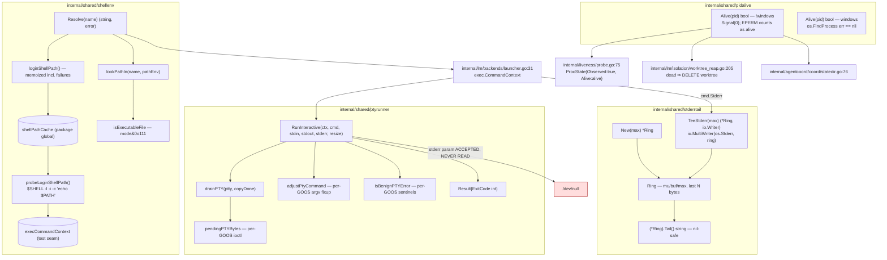

# Process execution and observation

Four leaf packages own how ctxloom starts, watches, and post-mortems a child process. `internal/shared/ptyrunner` runs one child attached to a pseudo-terminal while the *frontend* owns the real terminal. `internal/shared/shellenv` resolves a bare binary name against the user's login-shell `PATH` when the inherited one is too narrow. `internal/shared/stderrtail` keeps a bounded, streamed tail of a child's stderr so a process that dies can still say why. `internal/shared/pidalive` answers "is a process alive at this pid?".

The contract they jointly own: **an engine binary is found even under a GUI-launched `PATH`, spawned onto a pty it believes is a real terminal, its dying words are captured before its container is destroyed, and its liveness can be probed afterward by pid alone.**

## `internal/shared/ptyrunner`

One child on a pty, with the caller supplying stdin, the output writer, and a resize channel. Sole production caller: `internal/lm/backends/launcher.go:36` (`RunLaunchSpec`, interactive branch).

| Symbol | file:line | Purpose |
|---|---|---|
| `Result{ExitCode int}` | `internal/shared/ptyrunner/ptyrunner.go:91` | The child's exit code. Session output is deliberately *not* captured here — an interactive TUI redraws for hours |
| `initialResizeWait = 300ms` | `internal/shared/ptyrunner/ptyrunner.go:32` | Bounded pre-`Start` wait for the first resize |
| `ptyDrainGrace = 2s` | `internal/shared/ptyrunner/ptyrunner.go:47` | Deadline for `drainPTY` |
| `ptyDrainPollInterval = 2ms` | `internal/shared/ptyrunner/ptyrunner.go:53` | `drainPTY` poll cadence |
| `drainPTY(ptty, copyDone)` | `internal/shared/ptyrunner/ptyrunner.go:69` | Polls `pendingPTYBytes` until the copier finishes (`:73`), the pty reports 0 buffered bytes (`:77`), or the grace expires (`:80`). Returns nothing |
| `RunInteractive(ctx, cmd *exec.Cmd, stdin io.Reader, stdout, stderr io.Writer, resize <-chan agent.WindowSize) (*Result, error)` | `internal/shared/ptyrunner/ptyrunner.go:104` | The whole lifecycle: `pty.New` → `ptty.CommandContext(cmd.Path, cmd.Args[1:]...)` (`:113`) → `adjustPtyCommand` (`:118`) → await first resize (`:124-137`) → `Start` → resize pump (`:156`) → stdin copier (`:165`) → `io.Copy(dst, ptty)` (`:221`) → `Wait` → `drainPTY` (`:233`) → `ptty.Close()` (`:234`) → exit classification (`:239-251`) |
| `pendingPTYBytes(ptty) (int, bool)` (linux) | `internal/shared/ptyrunner/prepare_ioctl_linux.go:20` | `TIOCINQ` on the pty master fd; `(0,false)` if not a `pty.UnixPty` or the ioctl fails |
| `pendingPTYBytes(ptty) (int, bool)` (darwin) | `internal/shared/ptyrunner/prepare_ioctl_darwin.go:28` | Same via a locally-declared `FIONREAD` (`0x4004667f`) |
| `pendingPTYBytes(ptty) (int, bool)` (windows) | `internal/shared/ptyrunner/prepare_windows.go:59` | Unconditional `return 0, false` |
| `isBenignPTYError(err) bool` (!windows) | `internal/shared/ptyrunner/prepare_other.go:19` | `errors.Is(err, fs.ErrClosed) \|\| errors.Is(err, syscall.EIO)` |
| `isBenignPTYError(err) bool` (windows) | `internal/shared/ptyrunner/prepare_windows.go:21` | `errors.Is(err, fs.ErrClosed)` only |
| `adjustPtyCommand(c *pty.Cmd, cmd *exec.Cmd)` (!windows) | `internal/shared/ptyrunner/prepare_other.go:24` | No-op (build-tag seam) |
| `adjustPtyCommand(c *pty.Cmd, cmd *exec.Cmd)` (windows) | `internal/shared/ptyrunner/prepare_windows.go:35` | For `.cmd`/`.bat`, rewrites to `cmd.exe` with a double-quoted `/c` line via `windows.ComposeCommandLine`; silently no-ops for other extensions |

## `internal/shared/pidalive`

One function, two build-tagged implementations, no types and no state. Exists as a dependency-free leaf specifically to break an import cycle: `internal/lm/isolation` cannot import `agentcoord/coord` (which depends on isolation transitively via `lm/backends`).

| Symbol | file:line | Purpose |
|---|---|---|
| `Alive(pid int) bool` (!windows) | `internal/shared/pidalive/pidalive_unix.go:19` | `os.FindProcess` → `p.Signal(syscall.Signal(0))`; true iff `err == nil \|\| err == syscall.EPERM` (`:25`) |
| `Alive(pid int) bool` (windows) | `internal/shared/pidalive/pidalive_windows.go:11` | `_, err := os.FindProcess(pid); return err == nil`. The `*os.Process` (and its `OpenProcess` HANDLE) is discarded |

| Consumer | Site | Cost of a false "dead" | Cost of a false "alive" |
|---|---|---|---|
| `internal/liveness` watchdog | `internal/liveness/probe.go:75` | a live child is declared `StateDied` | a reaped child is never noticed |
| `internal/lm/isolation` reaper | `internal/lm/isolation/worktree_reap.go:205` | a live agent's worktree is deleted | an orphaned worktree lingers |
| `internal/agentcoord/coord` state lock | `internal/agentcoord/coord/statedir.go:76` | two coordinators share a state dir | a coordinator is locked out of its state |

Four one-line wrappers re-export it under local names: `coord.PidAlive` (`internal/agentcoord/coord/pidalive_unix.go:9` + `_windows` twin) and `isolation.pidAlive` (`internal/lm/isolation/pidalive_unix.go:12` + twin). The build tags on those four files are ceremony — the platform split already happened inside `pidalive`.

## `internal/shared/stderrtail`

A bounded, mutex-guarded tail of a child's stderr, filled by the child's own stderr pump as bytes arrive. Created 2026-07-24 after a containerized-agent incident where the ACP adapter's dying words went to a `--rm` container's stdout and were unrecoverable.

| Symbol | file:line | Purpose |
|---|---|---|
| `DefaultBytes = 8192` | `internal/shared/stderrtail/stderrtail.go:39` | The standard tail budget |
| `Ring` | `internal/shared/stderrtail/stderrtail.go:43` | Fields `mu sync.Mutex`, `buf []byte`, `max int`. An `io.Writer` retaining only the last `max` bytes |
| `New(max int) *Ring` | `internal/shared/stderrtail/stderrtail.go:50` | Substitutes `DefaultBytes` when `max <= 0` (`:51-53`) |
| `(*Ring).Write(p []byte) (int, error)` | `internal/shared/stderrtail/stderrtail.go:61` | Lock, append (`:64`), drop the front if over budget (`:65-66`), `return len(p), nil` |
| `(*Ring).Tail() string` | `internal/shared/stderrtail/stderrtail.go:72` | Nil-receiver safe (`:73-75`); lock; `strings.TrimSpace(string(r.buf))` |
| `TeeStderr(max int) (*Ring, io.Writer)` | `internal/shared/stderrtail/stderrtail.go:86` | `New(max)` plus `io.MultiWriter(os.Stderr, ring)` — the additive-capture spelling |

| Consumer | Site | Shape |
|---|---|---|
| `internal/acp` | `acp.go:490-491` | `TeeStderr` → `cmd.Stderr = sink` |
| `internal/lm/isolation` | `attach.go:85-86` (tee), `direct_runner.go:129-130` (`New`) | tail read via `AttachedContainer.StderrTail()` (`attach.go:36`) |
| `internal/lm/grpc` | `host_runner.go:72-73` (`New`) | tail read via `HostRunner.StderrTail()` (`host_runner.go:123`) |

Related but distinct implementations of the bounded-byte-tail concept live at `internal/vpio/dockerexec/dockerexec.go:255-277` (`tailRing`, byte-identical `Write`, `execTailBytes = 8192` at `dockerexec.go:44`, and without the `max <= 0` and nil-receiver guards) and `internal/termui/ring.go:6-54` (`Ring` — a true fixed-capacity circular buffer with a `dropped` counter and `Drain()`-and-reset, deliberately not goroutine-safe). Real vs documented: the package doc says it is "the one implementation of a pattern this repo had already grown twice"; the count at authoring was four — two were absorbed, the `dockerexec` copy was not.

## `internal/shared/shellenv`

Widens binary resolution from the process's inherited `PATH` to the user's login+interactive shell `PATH`. Solves the detached-GUI launch (Dock icon, editor extension host) that inherits a bare `PATH` without nvm/rbenv/homebrew/`~/go/bin`, sometimes with `$SHELL` unset. Two consumers: `internal/lm/backends/launcher.go:85` (`resolveBinaryPath`, spawn path) and `internal/lm/backends/registry.go:197` (`IsAvailable`, doctor/boot path).

> Navigation note: a second, unrelated package is also named `shellenv` — `internal/ltk/shellenv`, whose `ShellFromPath` does thorough shell-family classification. Both are imported under the bare identifier `shellenv`.

| Symbol | file:line | Purpose |
|---|---|---|
| `resolveTimeout = 10s` | `internal/shared/shellenv/shellenv.go:33` | Bound on the probe subprocess |
| `execCommandContext` | `internal/shared/shellenv/shellenv.go:38` | Package-global test seam over `exec.CommandContext` |
| `cache` | `internal/shared/shellenv/shellenv.go:44` | `mu sync.Mutex`, `done bool`, `path string`, `err error`. `done` is load-bearing: `path == "" && err == nil` is a valid outcome, so emptiness cannot be the sentinel |
| `shellPathCache` | `internal/shared/shellenv/shellenv.go:51` | The package-global singleton |
| `resetCacheForTest()` | `internal/shared/shellenv/shellenv.go:56` | Test-only seam; zero production call sites |
| `Resolve(name string) (string, error)` | `internal/shared/shellenv/shellenv.go:70` | Five-step ladder: contains a separator → return as-is (`:71-73`); `exec.LookPath` (`:74`); `loginShellPath` (`:77`) guarded by `err != nil \|\| pathEnv == ""` (`:78`); `lookPathIn` (`:81`); else re-run `exec.LookPath` to return the *original* error (`:79`, `:84`) |
| `lookPathIn(name, pathEnv string) (string, error)` | `internal/shared/shellenv/shellenv.go:92` | `filepath.SplitList` (`:93`), skip empty entries (`:94-96`), first hit where `isExecutableFile` holds |
| `isExecutableFile(path string) bool` | `internal/shared/shellenv/shellenv.go:109` | `os.Stat`; false on error or directory; `info.Mode()&0o111 != 0` (`:114`) |
| `loginShellPath() (string, error)` | `internal/shared/shellenv/shellenv.go:120` | Mutex-held probe-once; caches successes *and* failures |
| `probeLoginShellPath() (string, error)` | `internal/shared/shellenv/shellenv.go:135` | Rejects Windows; `$SHELL` or `/bin/bash`; 10s context; runs `<shell> <args> 'echo $PATH'`; `cmd.Stdout = &out` only; returns `strings.TrimSpace(out.String())` (`:152`) |
| `loginShellArgs(shell, cmd string) []string` | `internal/shared/shellenv/shellenv.go:161` | `fish`/`tcsh` → `-i -c`; everything else → `-l -i -c` |

## Invariants and contracts

**Pty execution (`ptyrunner`)**

- **The frontend owns the terminal** (`ptyrunner.go:98-103`). Raw mode, keystrokes, and SIGWINCH happen elsewhere and arrive as an `io.Reader` and a channel; this runner never touches the controller's own `os.Stdin`/`os.Stdout`, which is what makes a remote controller possible.
- Ordering is the whole design: allocate pty → build the pty command → `adjustPtyCommand` → wait up to `initialResizeWait` for the first resize and apply it **before `Start`** → start → spawn the three goroutines → `Wait` → `drainPTY` → `Close` → classify. The pre-`Start` resize exists because go-pty allocates at 0x0 and SIGWINCH only fires on a *change*, so a wrong first paint never self-heals. The wait is bounded rather than indefinite because a non-tty caller legitimately never sends a resize.
- `stdin` and `resize` may be nil — the corresponding goroutines are simply not started (`:165`, `:146`).
- `stdout == nil` becomes `io.Discard` (`:214-217`) rather than skipping the copy: the pty must be drained regardless or the child blocks on a full buffer.
- The stdin copier force-closes the reader **only when it is an `*io.PipeReader`** (`:170-175`), so a caller-owned reader (a real `os.Stdin`) is never closed from here — and for any other reader type the copier outlives `RunInteractive`.
- Benign pty-close fallout is distinguished **by sentinel, never by substring**: `fs.ErrClosed` plus `syscall.EIO` on Unix, `fs.ErrClosed` on Windows.
- `cmd.Args[1:]` at `:113` **panics on a nil `Args`** and silently discards `cmd.Args[0]` — a caller setting a distinct argv[0] loses it. Safe only because the sole caller builds the command with `exec.CommandContext`.
- `ptty.Close()` is called twice on the normal path (`:110` deferred, `:234` explicit); correctness rests on go-pty's `Close` being idempotent, which is undocumented third-party behaviour.
- Exit classification routes `*exec.ExitError` through `ExitStatusFor`: an ordinary exit propagates `exitErr.ExitCode()` verbatim, and a child killed by a signal reports the shell convention `128+signum` (130 SIGINT, 137 SIGKILL, 143 SIGTERM) rather than os/exec's raw `-1`, which is not a valid POSIX status and reached the user truncated to `255` — indistinguishable from a genuine 255 and from a runner-internal error. `backends.RunLaunchSpec`'s non-interactive branch calls the same helper, so both launch modes classify a killed engine identically. On Windows the mapping is a documented no-op: `syscall.WaitStatus` there hard-codes `Signaled() == false`, so the `ExitCode()` fallthrough runs.
- Real vs documented: the `stderr io.Writer` parameter at `:104` appears nowhere in the body — a pty merges both streams onto the master, so the child's stderr arrives on `stdout` and a caller passing distinct writers gets nothing on stderr.
- Real vs documented: `drainPTY`'s doc treats an unavailable byte-count probe as a rare safety net, but on Windows `pendingPTYBytes` returns `(0, false)` unconditionally and `copyDone` cannot fire before the pty is closed (which happens *after* `drainPTY` returns), so the deadline is the only reachable exit — the full 2s grace is spent on every interactive run there, and on Unix whenever the ioctl fails.
- `drainPTY` returns nothing and `io.Copy(dst, ptty)` discards both results (`:221`), so "deadline expired with bytes still buffered" and "the output writer failed on its first byte" are both indistinguishable from a clean run; `RunInteractive` returns `&Result{ExitCode: 0}, nil` either way.

**Liveness (`pidalive`)**

- **EPERM means alive.** The naive `syscall.Kill(pid, 0) == nil` reports every process the caller does not own as dead; ctxloom runs agents under remapped UIDs, so this matters. The consumer contract states the rule: "a process this user cannot signal is still a process" (`internal/liveness/probe.go:25-27`).
- The return type is a total `bool`, so **"I could not tell" is inexpressible** and every probe failure collapses to `false` ("dead") — the destructive direction for two of the three consumers. `internal/liveness/probe.go:75-76` therefore hardcodes `ProcState{Observed: true}`, and `monitor.go:260`'s `!Observed || Alive` guard can never fire.
- On Unix, `os.FindProcess` never returns a non-nil error (`$GOROOT/src/os/exec_unix.go:121`), so the `if err != nil { return false }` guard at `pidalive_unix.go:20-22` is unreachable.
- `err == syscall.EPERM` uses `==`, not `errors.Is` — it works today only because `os` passes the bare errno through for everything except `ESRCH`.
- **No PID-reuse protection.** The question answered is "is *a* process alive at this pid", never "is *my* process alive". All three consumers store a bare `int` and none captures a start time.
- **No positivity guard.** `Alive(-5)` probes process *group* 5. All three production callers guard `pid > 0` themselves.
- Real vs documented: `pidalive_windows.go:7-10` claims Windows "errs toward 'alive'"; `os.FindProcess` there is `syscall.OpenProcess`, which returns `ERROR_ACCESS_DENIED` for a live process owned by another user or at a higher integrity level — so it errs toward *dead*, with no analogue of the Unix EPERM branch.

**Stderr tail (`stderrtail`)**

- **STREAMED, not polled.** The tail is filled as bytes arrive, so it survives the child *and its container* being destroyed. `docker logs` on a `--rm` container vanishes exactly when it is needed.
- **BOUNDED**, because the text is forwarded into transcripts and mailboxes. `New(0)` substitutes `DefaultBytes` — without that guard a zero budget would empty the buffer on every write and `Tail()` would always return `""`, a diagnostic sink that silently captures nothing.
- **A tail, not a head** — a dying process says why at the end.
- **`Write` never errors and never short-writes**, deliberately: a diagnostic sink that could fail would put back-pressure on the child's stderr.
- **Capture is ADDITIVE via `TeeStderr`.** The obvious `cmd.Stderr = ring` silently removes a passthrough an operator may depend on. Both spellings are offered; `direct_runner.go:130` and `host_runner.go:73` use plain `New` and do replace stderr.
- `Tail()` is nil-receiver safe and returns `""` when the child said nothing; consumers guard on non-emptiness before wrapping it into an error.
- Peak memory is bounded by the largest *single* write, not by `max`: `append` happens before the budget check, so one 50 MB line transiently grows `buf` to 50 MB before re-slicing to 8 KB.
- `DefaultBytes` is re-aliased to a private constant at `internal/acp/acp.go:393`, `internal/lm/isolation/direct_runner.go:25`, and `internal/lm/grpc/host_runner.go:19`, while `internal/lm/isolation/attach.go:85` uses it directly.

**PATH resolution (`shellenv`)**

- **`Resolve` only ever WIDENS what resolves; it never narrows or reshapes a failure** (`shellenv.go:66-69`). Both failure returns hand back the *original* `exec.LookPath` error, so a genuinely-missing binary produces exactly the message it always did. The sole consumer mirrors this posture in writing (`internal/lm/backends/launcher.go:80-83`).
- A name containing a path separator short-circuits and is returned unchanged — an operator-configured explicit path is never second-guessed.
- The login-shell probe runs **at most once per process**, under a mutex so concurrent first-callers serialize rather than spawning duplicate shells, and **caches failures identically to successes** — one transient failure disables the fallback for the life of the process.
- The probe is Windows-rejected, defaults `$SHELL` to `/bin/bash` when unset, and is bounded at 10s.
- `-i` is passed deliberately: the PATH additions live in `.zshrc`/`.bashrc` as often as in the login files.
- **The probe's stdout is taken verbatim, unfenced.** Anything an rc file prints (fastfetch, MOTD, nvm notices, direnv, oh-my-zsh prompts) lands in the buffer and is split on `:` by `filepath.SplitList`, and because `lookPathIn` returns the *first* matching directory, a garbage prefix can shadow a real hit. The cited model implementation (VS Code's `getUnixShellEnvironment`) fences its output with a marker; this one does not.
- `cmd.Stderr` is never set, so the probe subprocess's stderr goes to `/dev/null` and the wrapped error carries only the exit status.
- `probeLoginShellPath` returns `("", nil)` — success with an empty payload — when the shell runs but prints nothing. The **only** guard is the caller-side `|| pathEnv == ""` at `shellenv.go:78`; without it, `lookPathIn("")` reports "not found" for every binary on the machine.
- Real vs documented: `isExecutableFile`'s doc claims it applies "exec.LookPath's own criterion", but it tests raw mode bits while `exec.LookPath` on Unix uses `unix.Eaccess(file, unix.X_OK)` — a `0700` file owned by another user matches here and is rejected at spawn.
- Two mutable package-level variables (`execCommandContext`, `shellPathCache`) plus `resetCacheForTest` mean this package's tests cannot run in parallel and `Resolve`'s result depends on process history.
- `loginShellArgs` treats every unrecognised shell as bash-compatible (`default:` → `-l -i -c`), which is wrong for at least `csh`.
