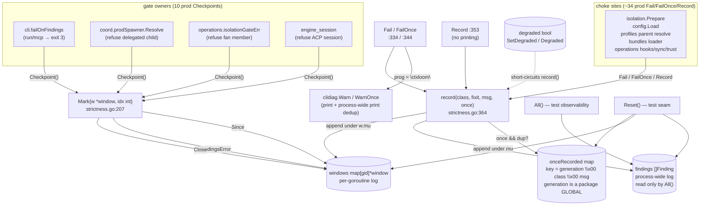

# `internal/shared/strictness` — the strict/degraded policy and the findings collector

`strictness` is ctxloom's fail-loudly policy layer: it turns a warn-and-continue diagnostic at a startup choke into a classified, fix-it-carrying `Finding` that a gate owner can abort on, and it owns the single process-wide `--degraded` switch that reverts every choke back to pure warn-and-continue. Choke sites call `Fail`/`FailOnce`/`Record`; gate owners bracket a region with `Checkpoint()` and read it back with `Since`/`FindingsError`, then abort the process, refuse a session, refuse a delegated child, or refuse one fan member. Findings are collected **per goroutine** — the `window` type exists so a gate only ever sees faults its own goroutine recorded.

It is a leaf package with one internal dependency (`internal/shared/clidiag`) precisely so that the three mutually-unimportable consumers — `internal/cli`, `internal/agentcoord/coord`, `internal/operations` — can all reach it. It does **not** gate parsing or validation itself: parsers and validators call into it, and the decision to stop is always the gate owner's.

## Structure

## Inventory — types and package state

| Symbol | file:line | Purpose |
|---|---|---|
| `Class` | `internal/shared/strictness/strictness.go:35` | String enum bucketing a finding for the class-tagged abort listing. Each constant's doc comment states its **inclusion rule** — that rule, not the string, is the load-bearing part. |
| `ClassConfig` | `internal/shared/strictness/strictness.go:40` | Config file could not be loaded, parsed, or validated. |
| `ClassMigration` | `internal/shared/strictness/strictness.go:43` | A schema migration was lossy or refused. |
| `ClassSync` | `internal/shared/strictness/strictness.go:47` | Bundle/remote sync fault. |
| `ClassRef` | `internal/shared/strictness/strictness.go:50` | An unresolvable reference (e.g. a profile parent not installed). |
| `ClassApply` | `internal/shared/strictness/strictness.go:53` | Applying resolved content to the workspace failed. |
| `ClassBundle` | `internal/shared/strictness/strictness.go:56` | Bundle load/parse fault. |
| `ClassTrust` (`"trust-store"`) | `internal/shared/strictness/strictness.go:58` | Trust-store fault; the "denying all items" path lands here. |
| `ClassIsolation` | `internal/shared/strictness/strictness.go:70` | Only an **explicitly requested** container runtime that could not be honoured; the ambient host default degrades silently and never lands here. This is the one class an out-of-package gate filters on by value. |
| `ClassTask` | `internal/shared/strictness/strictness.go:78` | Task-store fault (`--seed-task` path). |
| `Finding` | `internal/shared/strictness/strictness.go:83` | `{Class Class; Message string; FixIt string}` — one collected fatal fault. `Message` is already formatted, so the type stays comparable and loggable. |
| package globals | `internal/shared/strictness/strictness.go:89-115` | One `sync.Mutex` guards four unrelated things: `degraded bool`, `findings []Finding` (process-wide log, `:96`), `generation int`, `onceRecorded map[string]struct{}` (`:115`). `windows`/`windowsMu` are separate. |
| `window` | `internal/shared/strictness/strictness.go:132` | `{gid int64; mu sync.Mutex; findings []Finding}` — one goroutine's privately-owned findings log. `gid` is needed by `Close`, which may run on a different goroutine. |
| `Mark` | `internal/shared/strictness/strictness.go:207` | `{w *window; idx int}` — a checkpoint into one goroutine's window. The zero value is deliberately meaningful: "from the very start", and cannot crash `Since`. |
| `prog` (const `"ctxloom"`) | `internal/shared/strictness/strictness.go:30` | The `prog` string handed to `clidiag`. This package is ctxloom-specific; `clidiag` is family-wide. |

## Inventory — functions

| Function | file:line | Purpose |
|---|---|---|
| `currentWindow` | `internal/shared/strictness/strictness.go:139` | Get-or-create the calling goroutine's `*window` under `windowsMu`. The whole per-goroutine ownership model. |
| `goroutineID` | `internal/shared/strictness/strictness.go:158` | Parses the gid out of `runtime.Stack`'s `"goroutine N [running]:"` preamble. A `ParseInt` failure yields **0** for every affected goroutine, collapsing them into one shared window. |
| `SetDegraded` | `internal/shared/strictness/strictness.go:172` | Sets the process-wide `degraded` flag under `mu`. Called from `cmd/ctxloom/main.go:22` and `internal/cli/root.go:89`. |
| `Degraded` | `internal/shared/strictness/strictness.go:180` | Reads `degraded` under `mu`. 6 production readers, some on hot paths, all contending with `record`. |
| `Checkpoint` | `internal/shared/strictness/strictness.go:220` | Bumps the global `generation` and returns `Mark{w: currentWindow(), idx: len(w.findings)}` — opens a gate window on the calling goroutine. |
| `Since` | `internal/shared/strictness/strictness.go:238` | Copies the mark's window findings from `idx` onward. Returns `nil` for a stale or zero mark. |
| `All` | `internal/shared/strictness/strictness.go:255` | Copies the process-wide `findings` slice under `mu`. Cross-goroutine observability; no production reader. |
| `Close` | `internal/shared/strictness/strictness.go:270` | Deletes the mark's window from the registry **only if** `windows[gid] == mark.w`, so a successor window is never deleted. Safe on a zero `Mark`. |
| `FindingsError` | `internal/shared/strictness/strictness.go:291` | Renders `Since(mark)` as one `error`: `"fatal startup findings:"` then `"  - <msg> (fix: <fixit>)"` per finding. Returns `nil` when the window is empty **or** when degraded. |
| `Reset` | `internal/shared/strictness/strictness.go:311` | Clears the global log, `generation`, `onceRecorded`, and every window. Labelled a test seam; no production caller. |
| `Fail` | `internal/shared/strictness/strictness.go:334` | `clidiag.Warn(prog, ...)` + `record(..., once=false)`. The print/record composition is the package's point. |
| `FailOnce` | `internal/shared/strictness/strictness.go:344` | `clidiag.WarnOnce(prog, ...)` + `record(..., once=true)`. |
| `Record` | `internal/shared/strictness/strictness.go:353` | `record(..., once=false)` with **no printing** — for callers that own their own stderr line (or return a gRPC status). |
| `record` | `internal/shared/strictness/strictness.go:364` | Degraded short-circuit; `once` dedup keyed `generation\x00class\x00msg`; append to the global log under `mu`, then to the calling goroutine's window under `w.mu`. |

## Invariants and contracts

**Goroutine ownership**

- The goroutine that calls `Checkpoint` **must be** the goroutine that records the faults the gate intends to see. `record` appends to `currentWindow()`, resolved from `runtime.Stack`'s gid; a fault raised on a helper goroutine lands in that goroutine's window and is invisible to the parent's `Mark`.
- `Since` must be called **before** `Close`. Every current production caller honours this; all five per-request `Checkpoint` sites (`coord/spawner.go:337`, `operations/oneshot.go:362`, `operations/delegate.go:255`, `operations/engine_session.go:115`, `:719`) read before closing.
- `Mark` carries no nesting depth or refcount. `Close(inner)` on a goroutine that also holds a live **outer** mark deletes the shared window entry, so the goroutine's next `record` builds a fresh window and the outer mark reads an orphaned one. Nesting marks on one goroutine is unsupported and undetected.
- The zero `Mark` means "since the very start of the process" and is safe to pass to `Since`, `Close`, and `FindingsError`.

**Dedup scoping**

- There are **two independent dedup mechanisms** with different lifetimes, and they must not be unified:
  - `clidiag.onceSeen` dedups **printing**, keyed by the full rendered line, process-wide and permanently.
  - `strictness.onceRecorded` dedups **recording**, keyed `generation\x00class\x00msg`, so a fault re-fired in a later checkpoint window records again.
- Consequence of the asymmetry: a legitimately re-fired `FailOnce` in a later window **records a finding whose stderr line is suppressed**. The finding still reaches the user through the abort listing.
- The record-dedup key reads the **package-global `generation`** at record time, not the generation of the recording goroutine's own window. Two concurrently-open windows therefore share one dedup scope, and the second window's identical `FailOnce` message is dropped from that window.
- `Class` participates in the record key; `clidiag`'s print key has no class dimension. The same message text raised under two classes records two findings but prints one line.

**Degraded mode**

- `SetDegraded(true)` must be set before any choke runs — both callers do it at root-command setup (`cmd/ctxloom/main.go:22`, `internal/cli/root.go:89`).
- When degraded, `record` returns having done nothing, and `FindingsError` returns `nil` unconditionally. `Fail`/`FailOnce` **still print**; only `Record` becomes a total no-op, and all three `Record` call sites own their own stderr line first, so no fault vanishes silently.

**Rendering and gating**

- `nil` from `FindingsError`/`Since`/`All` is the documented "no faults, proceed" signal, never a swallowed error. The abort decision belongs to the gate owner, never to this package.
- `FixIt == ""` is a sentinel meaning "the message already says how to fix it"; all three renderers check it identically.
- `record` places no guard on an empty `msg`: an empty formatted message produces `"ctxloom: warning: "` on stderr and a `Finding{Message: ""}` that every renderer emits as a bare bullet.
- There are three renderers of `[]Finding`, and they are genuinely distinct: `strictness.FindingsError` (a keeps-running error), `cli.formatFindings` (`internal/cli/startup_helpers.go:108`, a class-tagged abort listing with the `--degraded` hint), and `operations.isolationGateErr` (`internal/operations/oneshot.go:286`, a class-**filtered** member refusal).
- The class→gate mapping is unwritten. `operations.isolationGateErr` hard-tests `f.Class == ClassIsolation`; adding a class that ought to refuse a fan member is a silent no-op unless that function is edited too.

**Lifetime and locking**

- The process-wide `findings` slice and `onceRecorded` map are append-only and never pruned in production (`Reset` has no production caller). In long-lived processes (`ctxloom acp`, the coordinator daemon) both grow for the life of the process.
- `record`'s two appends are **not atomic together**: `mu` is released before `w.mu` is taken, so a concurrent `All()` can observe a finding the window has not got yet.
- One `sync.Mutex` guards `degraded`, `findings`, `generation`, and `onceRecorded`, so every `Degraded()` read contends with every `record`.

## Real vs documented

- `FailOnce`'s doc claims "per-process dedup … the finding records at most once"; the real behaviour is that **print** dedup is process-wide (via `clidiag`) while **record** dedup is scoped to the current checkpoint generation, and `TestFailOnce_RefiresAcrossCheckpoints` pins the re-firing.
- The comment at `strictness.go:106-113` claims "two concurrently-opened windows simply get two different generations … concurrency-safe as-is"; the generation is never captured into the `Mark`, so concurrent windows share the record-dedup scope.
- `FindingsError`'s doc says all three of `internal/cli`, `internal/agentcoord/coord`, and `internal/operations` used to carry a byte-identical copy of its render; `internal/cli` does not call `FindingsError` today (it renders via `cli.formatFindings`).
