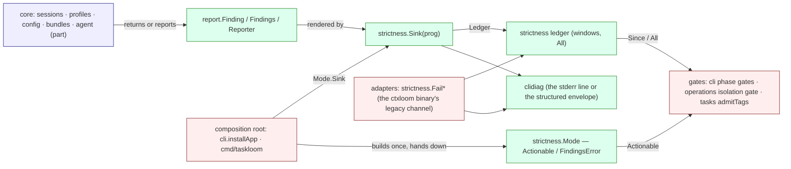

# `internal/shared/strictness` and `internal/shared/report` — findings, the ledger, and the mode as a value

`report` is the toolbox leaf a core component reports THROUGH: a `Finding{Kind, Text, Remedy}` is what a core function returns (`Findings`) or hands to the `Sink` it was given (`Reporter`), never a write to the process's stderr. It imports nothing of ours, so every ring may hold one. An empty `Kind` is an advisory; any other `Kind` is a fail-loudly class the startup gate can refuse on. `Once` marks a finding whose repeat is noise; `NonDegradable` marks one `--degraded` cannot waive; `Quiet` records without rendering.

`strictness` is the fail-loudly policy layer beneath the CLI: the ledger of fail-loudly findings (per-goroutine windows opened by `Checkpoint`, read by `Since`, closed by `Close`; `All` for cross-goroutine observability; `Reset` as the test seam), the ONE rendering sink (`Sink(prog)`: the family's `<prog>: warning:` line through `clidiag`, then `Ledger` for the fail-loudly ones), and `Mode`.

## The mode is a value

`Mode{Prog, Degraded}` is the posture ONE composition runs under. The composition root builds it — the cli's `strictnessMode` from `CTXLOOM_DEGRADED` and `--degraded` (the flag wins), taskloom's from its own flag and program name — and hands it down as a value: `operations.App.Strictness`, `operations.Cells`, `tasksops.TaskContext.Strictness`, the cli's phase gates. Two compositions in one process may differ, and neither can change the other's (`TestMode_TwoModesInOneProcessDoNotInterfere`).

The mode is consulted in exactly one way: `Mode.Actionable` filters findings to what a gate must act on — everything in strict mode, only the `NonDegradable` ones under `Degraded` — and `Mode.FindingsError` renders those as the per-call error. A gate that filters by class filters its own class and then passes the result through `Actionable`; it never tests `Degraded` itself (`TestArch_DegradeDiscipline_EveryBranchIsJustified` pins the readers of a composition's mode).

## Who reports how

```mermaid
flowchart LR
  classDef core fill:#eef,stroke:#228
  classDef tool fill:#dfe,stroke:#282
  classDef adapter fill:#fee,stroke:#822
  CORE["core: sessions · profiles · config · bundles · agent (part)"]:::core
  REP["report.Finding / Findings / Reporter"]:::tool
  SINK["strictness.Sink(prog)"]:::tool
  CD["clidiag (the stderr line or the structured envelope)"]:::tool
  LED["strictness ledger (windows, All)"]:::tool
  MODE["strictness.Mode — Actionable / FindingsError"]:::tool
  ROOT["composition root: cli.installApp · cmd/taskloom"]:::adapter
  GATE["gates: cli phase gates · operations isolation gate · tasks admitTags"]:::adapter
  LEG["adapters: strictness.Fail* (the ctxloom binary's legacy channel)"]:::adapter
  CORE -->|returns or reports| REP
  ROOT -->|builds once, hands down| MODE
  ROOT -->|Mode.Sink| SINK
  REP -->|rendered by| SINK
  SINK --> CD
  SINK -->|Ledger| LED
  LEG --> CD
  LEG --> LED
  LED -->|Since / All| GATE
  MODE -->|Actionable| GATE
```

Core never imports `clidiag` or `strictness`; the ratchet in `archrules.LayeringRules` holds the exhausted edges deleted. The engine base (`core/agent`) still carries `agent.Warn` for the sites that fan out through `BaseLifecycle`, `LaunchBackend` and the managed package writers; those convert when the engines hand a `Reporter` in.

## Invariants

- A `Once` finding through `Sink` records once per ledger window and re-fires in the next (`TestSink_OnceFindingLedgersOncePerWindowAndRefiresInTheNext`), so a long-lived server refuses the next session over an unfixed config rather than deduping it away; its rendering is deduped by text for the life of the process (`clidiag`'s once-memory).
- Recording never consults the mode: degraded suppresses FATALITY, not the audit trail.
- The rendered text of a finding is byte-identical to what the site printed when it called `clidiag` itself (`TestDiagnosticSink_RendersWhatClidiagRenderedToday`).
- `Fail`, `FailOnce`, `FailAlways`, `Record`, `RecordOnce` render under the ctxloom name: they are that binary's channel for adapters that have not yet been handed a `Reporter`. A family binary renders under its own name through `Mode.Sink`.
