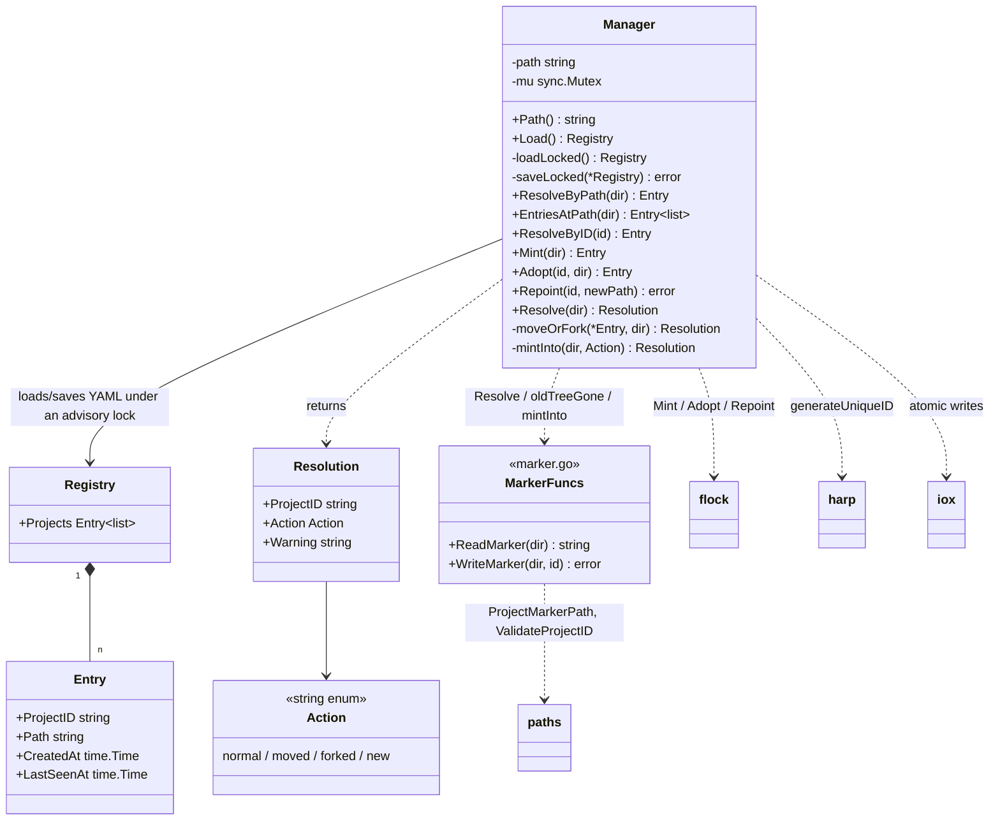

# Project identity — marker, registry, resolve

`internal/shared/tasks/projectid` resolves a stable, path-independent identity for a project directory and maintains the home-rooted registry mapping each project-id to its current path. Identity lives in two places that are meant to heal each other: a gitignored in-tree marker (`<projectDir>/.ctxloom/project-id`) that travels with the working tree, and the registry (`~/.ctxloom/projects/index.yaml`) that every task log is keyed on. ADR 0025 is the governing decision.

The package's real job is a decision procedure — **move vs copy vs new vs skew** — and everything else exists to serve it. Its contract: `Resolve` never blocks on ambiguity; it always returns a concrete project-id, and communicates doubt only through `Resolution.Warning`.

Resolution order in `Resolve` (`internal/shared/tasks/projectid/resolve.go:39`): registry-by-path → in-tree marker → mint-new. When a marker is present: resolve-by-id → adopt-if-unknown → heal-if-same-path → `moveOrFork`, which probes the old tree via `oldTreeGone` and either re-points the id or mints a fork.

## Inventory

### Types and constants

| Symbol | file:line | Purpose |
|---|---|---|
| `Entry` | `internal/shared/tasks/projectid/registry.go:28` | One registry row: `{ProjectID, Path, CreatedAt, LastSeenAt}`, all YAML-tagged (this is the on-disk schema). `ProjectID`/`Path` are read constantly; both timestamps are written and never read by any code. |
| `Registry` | `internal/shared/tasks/projectid/registry.go:36` | The YAML document root: `{Projects []Entry}`. Exported but named by no caller outside the package. |
| `Manager` | `internal/shared/tasks/projectid/registry.go:43` | Owns load/save of one registry file under `mu` + a cooperative file lock. Fields: `path`, `mu`. |
| `Action` | `internal/shared/tasks/projectid/resolve.go:10` | String enum for what `Resolve` decided. |
| `ActionNormal` = `normal` | `internal/shared/tasks/projectid/resolve.go:15` | Registry already knew this path (fast path). |
| `ActionMoved` = `moved` | `internal/shared/tasks/projectid/resolve.go:17` | Marker id re-pointed to a new path; the old tree is provably gone. |
| `ActionForked` = `forked` | `internal/shared/tasks/projectid/resolve.go:20` | The old tree still looks live (or the probe was inconclusive), so a fresh id was minted. |
| `ActionNewProject` = `new` | `internal/shared/tasks/projectid/resolve.go:22` | Nothing known about this directory; a brand-new project was minted. |
| `Resolution` | `internal/shared/tasks/projectid/resolve.go:26` | `{ProjectID, Action, Warning}`. Production callers read `ProjectID` and `Warning` only; `Action` is read by this package's tests alone. |

### Functions and methods

| Function | file:line | Purpose |
|---|---|---|
| `ReadMarker` | `internal/shared/tasks/projectid/marker.go:18` | Reads and trims the in-tree marker. Returns `("", nil)` when absent or blank, the raw error when unreadable, and a wrapped error naming the dir when the content fails `paths.ValidateProjectID`. The marker is third-party-writable (it can be committed), so a crafted value must never become identity. |
| `WriteMarker` | `internal/shared/tasks/projectid/marker.go:43` | `MkdirAll(.ctxloom)` then atomically writes `id + "\n"`. Atomicity is deliberate: a torn marker could later be trimmed and validated into a *different* identity. Applies no validation to `id` — the writer is more permissive than the reader. |
| `Open` | `internal/shared/tasks/projectid/registry.go:50` | Returns a `Manager` for the home registry, or for an override path (the seam that makes the package testable); creates the parent dir. |
| `(*Manager).Path` | `internal/shared/tasks/projectid/registry.go:66` | Returns `m.path`. Zero call sites anywhere, including tests. |
| `(*Manager).Load` | `internal/shared/tasks/projectid/registry.go:70` | `mu`-guarded `loadLocked`. No caller outside this file. |
| `(*Manager).loadLocked` | `internal/shared/tasks/projectid/registry.go:76` | Reads and unmarshals the YAML; a missing file or zero bytes yields an empty `Registry` (the first-run and truncated-file paths). |
| `(*Manager).saveLocked` | `internal/shared/tasks/projectid/registry.go:94` | Marshals and atomically writes the whole registry. |
| `(*Manager).ResolveByPath` | `internal/shared/tasks/projectid/registry.go:104` | First entry whose `cleanPath` matches. Returns `(nil, nil)` for "not found" — a deliberate tri-state every caller handles. |
| `(*Manager).EntriesAtPath` | `internal/shared/tasks/projectid/registry.go:127` | **Every** entry at a path, not just the first — the accessor that exists because a path *can* be registered under two ids. |
| `(*Manager).ResolveByID` | `internal/shared/tasks/projectid/registry.go:143` | Entry with the given id, or nil. |
| `(*Manager).Mint` | `internal/shared/tasks/projectid/registry.go:158` | Under `mu` + the advisory lock: re-checks for an existing entry at this path (a real TOCTOU fix — two processes first-launching the same tree can both reach here), else appends a fresh unique id and saves. |
| `(*Manager).Adopt` | `internal/shared/tasks/projectid/registry.go:202` | Under `mu` + the advisory lock: re-points an entry matching **the id**, else appends it. Performs no path-collision check. Its early-return path returns a populated `Entry` alongside a possibly non-nil save error — the only return in the file that does not zero its value on failure. |
| `(*Manager).Repoint` | `internal/shared/tasks/projectid/registry.go:234` | Under `mu` + the advisory lock: updates an id's path; errors when the id is absent. Package-internal. |
| `cleanPath` | `internal/shared/tasks/projectid/registry.go:265` | Canonicalises via `EvalSymlinks`, falling back to lexical `filepath.Clean` on error. The comparison key for every path lookup. |
| `generateUniqueID` | `internal/shared/tasks/projectid/registry.go:279` | `harp.UniqueFrom(used, harp.GenerateName)` — project-ids come from the harp generator; a collision with a session harp is harmless. |
| `Resolve` | `internal/shared/tasks/projectid/resolve.go:39` | The decision procedure: registry-by-path → marker → resolve-by-id → adopt / heal / `moveOrFork` → mint. |
| `moveOrFork` | `internal/shared/tasks/projectid/resolve.go:82` | Probes the old tree; `Repoint`s on a proven move, mints a fork otherwise. Distinguishes "probe said copy" from "probe failed" in the warning text. |
| `mintInto` | `internal/shared/tasks/projectid/resolve.go:109` | `Mint` then `WriteMarker` — names the "an id is not established until the marker is written" invariant. Not atomic across the two steps. |
| `oldTreeGone` | `internal/shared/tasks/projectid/resolve.go:124` | True when the old path is absent, is not a directory, or its marker is missing or names a different id. An error return means *inconclusive*, and the caller forks on inconclusive (the safe direction). |

## Invariants and contracts

**Locking and mutation**

- All registry mutation goes through `Mint`, `Adopt`, and `Repoint`. Each must take `mu` **then** the cooperative file lock **then** `loadLocked` — in that order. The ordering is encoded only as three copy-pasted 8-line preambles (`registry.go:159`, `:203`, `:235`); a fourth mutator written without the lock would compile, pass single-process tests, and corrupt the registry only under concurrency.
- `Manager` is the sole writer of `~/.ctxloom/projects/index.yaml`. Exporting `Registry` and `Load` leaks the on-disk representation and would let a caller mutate `reg.Projects` outside the lock — the exact invariant `Manager`'s doc exists to protect. No caller does today.
- `saveLocked` writes the *whole* registry atomically; there is no partial update.
- `Mint` re-checks for an entry at the target path **after** acquiring the lock. That re-check is the entire defence against two processes minting two ids for one brand-new tree. `Adopt` has no equivalent check.

**Identity resolution**

- `Resolve` never fails on ambiguity — it always returns a concrete `ProjectID`. A wrong resolution is distinguishable from a right one only via `Warning`, which every production caller treats as advisory text.
- `Resolve`'s fast path (registry match by path) returns without ever consulting the marker. So when a path is registered under two ids, the authoritative in-tree marker is ignored in exactly the case where it would disambiguate.
- One directory **can** be registered under two project-ids: `Adopt` re-points only an entry matching its own id and otherwise appends, never checking whether `projectDir` is already registered under a different id. Nothing detects or repairs the collision; `ResolveByPath` then returns whichever entry `slices.IndexFunc` hits first, i.e. YAML slice order decides. `EntriesAtPath` exists precisely to expose this, and the only user-facing signal anywhere is `operations.missingLogSiblingNote`, which fires only while one of the two logs is still absent.
- Healing is **one-directional**. Only `mintInto` ever writes a marker, and only for a newly minted id. `Resolve`'s `ActionNormal` path never re-writes a missing marker, so a tree whose gitignored marker was deleted (`git clean -xdf` is routine) stays markerless indefinitely.
- `oldTreeGone` treats a **missing** marker and a **changed** marker as the same evidence ("moved"). Combined with the above, a markerless original tree can have its id `Repoint`ed to a copy, after which the original misses by path, has no marker, and mints a fresh identity with an empty task log.
- `mintInto` is a non-atomic two-step: the registry entry is persisted first, then the marker is written. A marker-write failure returns an error while the id is *already committed* to the registry, producing a markerless registered project.
- `ReadMarker` validates through `paths.ValidateProjectID` before returning an id; `WriteMarker` does not validate at all, so a value the reader would reject can be written. `WriteMarker(dir, "")` succeeds, writing a file containing only `"\n"`, which `ReadMarker` then reports as "no marker".
- `ProjectMarkerPath` (in `internal/shared/tasks/paths`) has no empty-dir guard, so `WriteMarker("", id)` would `MkdirAll` and write a project identity into the process cwd. Both production callers happen to pass a resolved directory.

**Path comparison**

- Every path lookup compares `cleanPath(p)` values, never raw paths. `cleanPath` resolves symlinks; on `EvalSymlinks` failure it silently falls back to lexical `Clean`, which for a symlinked tree is a *different* string than the registry's stored resolved path. A transient permissions or mount problem therefore makes a live tree compare unequal to itself, which `Resolve` reads as "not registered" → mint or fork. The comment above `cleanPath` records that this class of miss once orphaned a project's task log.

**Field semantics**

- `Entry.LastSeenAt` is written by `Mint`, `Adopt`, and `Repoint` only — never on `Resolve`'s read fast path. It means "last mutated", not "last seen"; the name overstates.
- `Entry.CreatedAt` and `LastSeenAt` have no code reader anywhere. They exist as a forensic trail.
- `Resolution.Action` and all four `Action` constants are read only by this package's own tests. No frontend branches on `ActionForked`, so a silent fork surfaces only as advisory `Warning` text.

**Consumers**

- `internal/shared/tasks/operations` (`ResolveProjectIdentity`, `ResolveLogPath`, `resolveTaskStore`) turns a resolved id into a task-log path; `cmd/taskloom/scope.go` uses `ResolveByPath`/`ReadMarker` to ask whether a directory is an *established* project **without** minting one.
- `operations.resolveTaskStore` discards `ReadMarker`'s error, collapsing "invalid or unreadable marker" into "no marker" — so a corrupt or planted marker produces *less* warning than a valid mismatching one.
