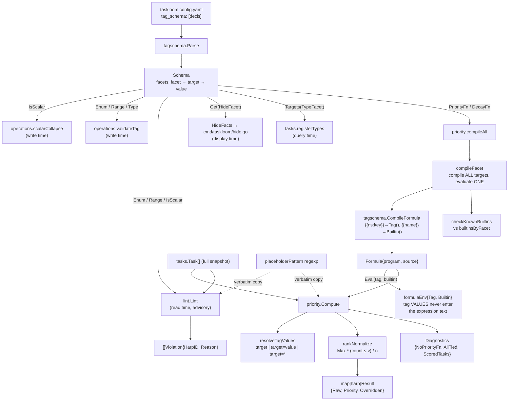

# Tag schema, priority, lint

Three packages implement the project's declared tag vocabulary and everything derived from it. `internal/shared/tasks/tagschema` parses `tagma.<facet>:"<target>"=<value>` declarations (which arrive only from taskloom's `config.yaml`) into a queryable `Schema`, and compiles the `priority_fn`/`decay_fn` formula strings those declarations carry into evaluable programs. `internal/shared/tasks/priority` derives a display priority at read time — never stored — by evaluating those formulas per task and rank-normalising the results onto `[0, Max]`. `internal/shared/tasks/lint` is the read-time advisory sweep that reports tasks violating the schema, catching foreign, hand-edited, or pre-schema data that no writer ever rejected.

The contract these three share: the schema is the single source of truth for what a tag means, and every check against it is a *separate* implementation in a different package.

## Inventory — `internal/shared/tasks/tagschema`

Leaf package, zero internal dependencies. Consumers: `cmd/taskloom`, `internal/shared/tasks`, `lint`, `operations`, `priority`, `internal/taskloom/config`.

### Types and constants

| Symbol | file:line | Purpose |
|---|---|---|
| `FacetNamespace` = `tagma` | `internal/shared/tasks/tagschema/tagschema.go:47` | The reserved declaration namespace. `operations.validateTag` rejects any user tag in it, which is why declarations can only come from config. |
| `ArityFacet` = `arity` | `internal/shared/tasks/tagschema/tagschema.go:65` | Enforced at write time by `operations.scalarCollapse`. |
| `ArityScalar` = `scalar` | `internal/shared/tasks/tagschema/tagschema.go:66` | The only arity value with meaning. |
| `PriorityFnFacet` = `priority_fn` | `internal/shared/tasks/tagschema/tagschema.go:67` | Read time, by `priority.Compute`. |
| `DecayFnFacet` = `decay_fn` | `internal/shared/tasks/tagschema/tagschema.go:68` | Read time, by `priority.Compute`. |
| `EnumFacet` = `enum` | `internal/shared/tasks/tagschema/tagschema.go:69` | Write time (`validateTag`) **and** read time (`lint.Lint`). |
| `RangeFacet` = `range` | `internal/shared/tasks/tagschema/tagschema.go:70` | Write time and read time. |
| `HideFacet` = `hide` | `internal/shared/tasks/tagschema/tagschema.go:71` | Display time, by `cmd/taskloom/hide.go`. |
| `TypeFacet` = `type` | `internal/shared/tasks/tagschema/tagschema.go:72` | Query time, by `tasks.registerTypes`. |
| `SemverTypeName` = `semver` | `internal/shared/tasks/tagschema/tagschema.go:83` | The one shipped comparison type; implemented by `tasks.semverComparator`. |
| `Schema` | `internal/shared/tasks/tagschema/tagschema.go:87` | Single field `facets map[string]map[string]string`. Every accessor is nil-receiver-safe, so a `nil` `*Schema` means "nothing declared" without any caller needing a nil check. |
| `placeholderPattern` | `internal/shared/tasks/tagschema/formula.go:16` | `\{\{\s*([^{}]+?)\s*}}` — the authoritative placeholder syntax, since `CompileFormula` is what rewrites with it. Copied verbatim into `lint` and `priority`. |
| `formulaEnv` | `internal/shared/tasks/tagschema/formula.go:35` | `{Tag func(string) float64, Builtin func(string) float64}` — the fixed shape `expr` type-checks every formula against. |
| `Formula` | `internal/shared/tasks/tagschema/formula.go:42` | `{program *vm.Program, source string}` — compile once, `Eval` per task. |

### Functions and methods

| Function | file:line | Purpose |
|---|---|---|
| `Parse` | `internal/shared/tasks/tagschema/tagschema.go:99` | Builds a `Schema` from a declaration list; first error wins. `Parse(nil)` returns a valid empty `Schema` and a nil error. |
| `(*Schema).add` | `internal/shared/tasks/tagschema/tagschema.go:109` | Parses one declaration; rejects unparseable, namespace-less, wrong-namespace, and value-less forms, each with an error naming the declaration and the expected form. Stores `facets[facet][key] = value`. |
| `(*Schema).Get` | `internal/shared/tasks/tagschema/tagschema.go:143` | Two-level map lookup; the single place nil-receiver safety is implemented, delegated to by every other accessor. |
| `(*Schema).Targets` | `internal/shared/tasks/tagschema/tagschema.go:163` | Sorted target list for a facet; `nil` for an unknown facet or a nil schema. |
| `(*Schema).IsScalar` | `internal/shared/tasks/tagschema/tagschema.go:181` | `Get(ArityFacet, target) == ArityScalar` — collapses "declared **and** equals scalar" into the concept every write path asks for. |
| `(*Schema).PriorityFn` | `internal/shared/tasks/tagschema/tagschema.go:189` | One-line alias for `Get(PriorityFnFacet, target)`. |
| `(*Schema).DecayFn` | `internal/shared/tasks/tagschema/tagschema.go:196` | One-line alias for `Get(DecayFnFacet, target)`. |
| `(*Schema).Type` | `internal/shared/tasks/tagschema/tagschema.go:206` | One-line alias for `Get(TypeFacet, target)`. |
| `(*Schema).Enum` | `internal/shared/tasks/tagschema/tagschema.go:215` | Splits the declared value on `,`, trims, drops empties. Returns `(members, ok)` — no error return, so a declaration containing no usable member yields an empty-but-present list. |
| `(*Schema).Range` | `internal/shared/tasks/tagschema/tagschema.go:237` | Parses `"min,max"` as two floats; three distinct errors naming the target and the bad component. The model decoder for the package. |
| `(*Schema).HideFacts` | `internal/shared/tasks/tagschema/tagschema.go:268` | Decodes every `hide` declaration into `tagma.HideFact`, silently skipping an uninterpretable value. |
| `Target` | `internal/shared/tasks/tagschema/tagschema.go:296` | Reconstructs `"ns:key"` (or bare `"key"`) from a parsed tag. The identity concept the whole schema keys on; three packages must agree with it. |
| `CompileFormula` | `internal/shared/tasks/tagschema/formula.go:65` | Rewrites `{{ns:key}}` → `Tag("ns:key")` and `{{name}}` → `Builtin("name")` (the split is on `":"`), then compiles via `expr` with `AsFloat64`. Errors name both the original mustache form and the rewritten source. |
| `(*Formula).Eval` | `internal/shared/tasks/tagschema/formula.go:91` | Runs the program with the caller's two resolvers; type-asserts the result rather than blind-asserting. |
| `(*Formula).Source` | `internal/shared/tasks/tagschema/formula.go:104` | The only way to re-scan a compiled formula's text; used by `priority.checkKnownBuiltins` and `priority.referencedTagTargets`. |

## Inventory — `internal/shared/tasks/priority`

### Types and package-level values

| Symbol | file:line | Purpose |
|---|---|---|
| `ExploitedInWildTarget` = `triage:exploited-in-wild` | `internal/shared/tasks/priority/priority.go:40` | Presence of this tag forces `Priority = Max`, bypassing the formula. |
| `Max` = `5.0` | `internal/shared/tasks/priority/priority.go:44` | Top of the normalized scale; the highest-ranked task always sits exactly here. |
| `BuiltinAgeDays` = `age_days` | `internal/shared/tasks/priority/priority.go:57` | Formula builtin: days since `CreatedAt`. |
| `BuiltinAgeFactor` = `age_factor` | `internal/shared/tasks/priority/priority.go:61` | Formula builtin: the evaluated `decay_fn` result, available to `priority_fn` only. |
| `Result` | `internal/shared/tasks/priority/priority.go:65` | `{HarpID, Raw, Priority, Overridden}`. `HarpID` duplicates the map key; `Raw` has no in-module reader (it exists so a frontend can explain a number). |
| `Diagnostics` | `internal/shared/tasks/priority/priority.go:94` | `{NoPriorityFn, AllTied, ScoredTasks}` — the report that "this ranking exists but is meaningless". Consumed together by `cmd/taskloom`'s `priorityDiagnosticWarning`. |
| `builtinsByFacet` | `internal/shared/tasks/priority/priority.go:255` | `{priority_fn: age_days + age_factor, decay_fn: age_days}` — the closed builtin whitelist per facet. |
| `formulaTagPlaceholderPattern` | `internal/shared/tasks/priority/priority.go:331` | Third verbatim copy of `tagschema.placeholderPattern`. |

### Functions

| Function | file:line | Purpose |
|---|---|---|
| `Compute` | `internal/shared/tasks/priority/priority.go:134` | Compiles both formulas, then per task: resolves tag values, computes age, evaluates decay (skipped for Deferred), evaluates priority, records the exploited-in-wild override, collects non-terminal ids and the scored count; then computes `AllTied`, rank-normalises, and assembles the result map. `now` is injected, never read internally. |
| `compileAll` | `internal/shared/tasks/priority/priority.go:235` | Compiles the single `priority_fn` and single `decay_fn`. Names the "exactly one of each" contract. |
| `checkKnownBuiltins` | `internal/shared/tasks/priority/priority.go:265` | Rejects a `{{name}}` placeholder (no `:`) that is not in `builtinsByFacet[facet]`. Closes the bug where an unrecognised builtin compiled clean and silently resolved to 0, zeroing a whole multiplicative term. |
| `sortedBuiltinNames` | `internal/shared/tasks/priority/priority.go:282` | Sorted key list, so the rejection message above is deterministic. |
| `compileFacet` | `internal/shared/tasks/priority/priority.go:297` | Compiles **every** target declaring the facet (so all are syntax-checked), then returns the one compiled formula or an ambiguity error listing every declared target. Never silently picks. |
| `referencedTagTargets` | `internal/shared/tasks/priority/priority.go:338` | Collects bare tag targets (`ns:key`, with `=value` stripped) from the formulas' source text. |
| `hasAnyTarget` | `internal/shared/tasks/priority/priority.go:363` | Whether a task's resolved-value map carries any referenced target — the `ScoredTasks` predicate. |
| `lookup` | `internal/shared/tasks/priority/priority.go:376` | Wraps a `map[string]float64` as `func(string) float64`. A Go map returns 0 for a missing key, which is exactly "absent tag". |
| `resolveTagValues` | `internal/shared/tasks/priority/priority.go:419` | Builds the `Tag(...)` lookup map with three key kinds in one flat namespace: bare `target` → numeric value (0 if unparseable), `target=value` → 1.0, `target=*` → 1.0. |
| `isTerminal` | `internal/shared/tasks/priority/priority.go:447` | `Done \|\| Archived`. A hand-copy of the store's unexported `statusIsDone`. |
| `rankNormalize` | `internal/shared/tasks/priority/priority.go:461` | Maps each population member's raw score to `Max * (count ≤ v) / n` by walking a sorted copy in tie-groups. Ties are free and the maximum is always exactly `Max`. |

## Inventory — `internal/shared/tasks/lint`

Exactly one consumer: `operations.LintTasks`, called by exactly one frontend, `cmd/taskloom/lint.go`'s `runLintCmd`.

| Symbol | file:line | Purpose |
|---|---|---|
| `SchemaViolationHarpID` = `(schema)` | `internal/shared/tasks/lint/lint.go:28` | Synthetic harp for schema-level (not task-level) violations. `"("` sorts before every lowercase harp word, so schema violations sort first. Nothing marks it as synthetic beyond the name; a frontend looking it up as a real task gets "task not found". |
| `Violation` | `internal/shared/tasks/lint/lint.go:31` | `{HarpID, Reason string}`. Serialized straight to JSON by `clifmt.Render` with no struct tags, so the Go identifiers are the `--json` output contract. |
| `Lint` | `internal/shared/tasks/lint/lint.go:73` | Builds enum/range lookup tables from the schema, seeds the result with `formulaEnumRefViolations`, runs three per-task checks (enum membership, range parse + bounds, scalar arity) over every task, and sorts by `(HarpID, Reason)`. |
| `formulaPlaceholderPattern` | `internal/shared/tasks/lint/lint.go:149` | Second verbatim copy of `tagschema.placeholderPattern`. |
| `formulaEnumRefViolations` | `internal/shared/tasks/lint/lint.go:158` | Scans every declared `priority_fn`/`decay_fn` for a `{{ns:key=value}}` placeholder whose value is not a member of `ns:key`'s declared enum. Silently continues on four conditions, one of which (`!hasEnum`) is a genuine unchecked reference it declines to report. |
| `groupByTarget` | `internal/shared/tasks/lint/lint.go:197` | Parses each raw tag string and groups value-carrying tags' values by `tagschema.Target`. Silently skips unparseable tags (lenient read side). Does **not** dedupe, despite the doc calling the grouped values distinct. |
| `contains` | `internal/shared/tasks/lint/lint.go:213` | Linear membership test; twin of `operations.containsString`, both reimplementing `slices.Contains`. |

## Invariants and contracts

**Schema ownership and provenance**

- Declarations reach `Parse` only from taskloom's `config.yaml`. `operations.validateTag` rejects any user tag in the reserved `tagma.*` namespace, so a task tag can never become a schema declaration.
- `Schema` is immutable after `Parse`; nothing mutates `facets` afterwards.
- A `nil` `*Schema` is a legal value everywhere and means "nothing declared" — `Get`, `Targets`, and `HideFacts` are all nil-receiver-safe, and every consumer relies on that instead of nil-checking.
- `tagschema.Target` is the one definition of tag identity that `operations`, `lint`, and `priority` must all agree with. They do not agree on *value* identity: `operations.scalarCollapse` compares raw strings, `lint.groupByTarget` compares parsed-but-undeduped values, `priority.resolveTagValues` uses composite string keys.
- `add` validates the facet against the closed set `tagschema.KnownFacets()` returns, so a typo'd facet (`tagma.arty:…`) is a returned error naming the facet and listing the known ones. Without that check the declaration was misfiled rather than dropped — the same effect as losing it, with no signal, and nothing upstream catches it: the taskloom config JSON Schema constrains `tag_schema` only to an array of strings.
- `add` is last-wins on a duplicate `facet`+`target`, silently. Note lists replace rather than concatenate across config layers (`confload.Merge`) and `ResolvedTagSchema` picks one list whole, so both declarations always come from a single file — the "a later line is more specific intent" rationale does not describe any real layering. Deliberately pinned by `TestParse_LastDeclarationWins`; escalated as U126-F03.

**Malformed-declaration policy: reported everywhere but one named exception**

The rule is stated once in `TestMalformedDeclarationPolicy`, which is the executable form of this table:

| Site | Behaviour |
|---|---|
| `Parse` / `add` | Hard error naming the declaration — unparseable, no namespace, wrong namespace, unknown facet, no value. |
| `Range` | Hard error naming the target and bad component. |
| `Enum` | Hard error naming the target and the unusable raw value. |
| `HideFacts` | **The one exception.** A non-`true`/`false` value is skipped and configures nothing. Deliberate, pinned by `TestHideFacts_UninterpretableValueIsSkipped`; escalated as U126-F04 rather than changed, because making it loud changes what an existing `config.yaml` does. |

A DUPLICATE declaration is a separate axis and is still silently last-wins — see U126-F03, escalated for the same reason.

- `Enum`'s empty-but-present result makes every value on that target a violation: `operations.validateTag` blocks every write with "is not one of … declared enum values `[]`", and `lint.Lint` emits the same nonsense for every task carrying the tag. One config typo becomes a total write-block.

**Formula compilation and evaluation**

- A formula is compiled once and `Eval`'d per task. **But** `Compute` calls `compileAll` on every invocation, so both formulas are recompiled from source on every `taskloom list --sort priority` and every `task_list` with `sort="priority"`; the reuse guarantee holds within a call, not across calls.
- A task's tag **values never enter the expression text**. They flow only through the `Tag`/`Builtin` closures' return values, so no arithmetic-looking tag value can alter the formula's structure. This is the package's central security property.
- Placeholder names are baked into the compiled source at compile time by `CompileFormula`'s rewrite, which is what makes `checkKnownBuiltins`' whitelist a compile-time guarantee.
- `compileFacet` compiles every target declaring a facet even though only one is evaluated, so a formula declared on the wrong target is still syntax-checked. More than one declaring target is an ambiguity **error** listing all of them — never a silent pick.
- The placeholder regexp exists in three places (`tagschema/formula.go:16`, `lint/lint.go:149`, `priority/priority.go:331`) with only `tagschema`'s being authoritative. Changing the syntax there silently stops `lint`'s schema-reference check and `priority`'s `checkKnownBuiltins` from matching, with no compile error and no test failure.

**Priority computation**

- Priority is derived at read time and **never stored**. `Task.DerivedPriority` is set only by this package's caller.
- `Compute` must be given the **full snapshot**, never a filtered or limited page — `operations.ComputeTaskPriorities` enforces this by calling `Store.Snapshot()` directly. Ranking against a page would produce percentiles of the page.
- Only non-terminal tasks enter the normalization population. `Result.Priority`'s documented contract is that a terminal task is left at 0. **Real behaviour diverges**: the exploited-in-wild override is applied without a terminality test, so a Done or Archived task carrying `triage:exploited-in-wild` reports `Priority = Max` and sorts above every live task in any listing that includes completed work.
- `rankNormalize` uses "count of population members ≤ v", so ties are free and the top-ranked task always sits at exactly `Max`.
- With `schema == nil` or no declared `priority_fn`, every raw score is 0, the single tie-group spans the population, and **every task is returned at `Priority = Max`** — a maximally plausible ranking derived from nothing. `Diagnostics.NoPriorityFn` reports this and `cmd/taskloom` checks it first, but the payload itself is not honest.
- `Diagnostics.ScoredTasks` is a numerator with no denominator: the non-terminal population size is a local in `Compute` and is never returned, so a caller cannot tell 3-of-4 from 3-of-400 — the mismatch the field exists to detect.
- `now` is injected into `Compute` and never read from `time.Now()` internally. The package holds this without exception.
- `resolveTagValues` puts `target`, `target=value`, and `target=*` in one flat map namespace, so a tag whose *key* contains `=` (legal inside a quoted tagma component) can collide with another tag's composite entry.
- `Compute` validates neither `CreatedAt` nor the score it stores. A zero `CreatedAt` (which is what the store's `repair()` produces) yields `age_days` ≈ 739,000 and pins the task to the extreme of the decay curve — a plausible number, indistinguishable from a genuinely ancient task. A future `CreatedAt` yields a negative age, and at exactly −90 days the shipped default `decay_fn` divides by zero.
- `isTerminal` is a hand-maintained copy of the store's unexported `statusIsDone`, and the same two-constant rule is restated in prose in two doc comments. Adding a third terminal status to `tasks` would silently leave this package ranking those tasks as live work.

**NaN passes every guard**

`strconv.ParseFloat` accepts `"NaN"`, and `NaN` is a legal tagma bare token. All three range checks use the NaN-blind predicate `f < min || f > max`, whose branches are both false for NaN:

- `operations.validateTag` (`operations/operations.go:513`) **accepts** the tag at write time. `Inf`/`-Inf` *are* caught by one of the two comparisons, which is what makes the NaN hole easy to miss.
- `lint.Lint`'s range check (`lint/lint.go:73`) reports the store **clean**.
- `priority.resolveTagValues` stores a real NaN, which flows through `Eval` into the raw score, and `rankNormalize`'s tie-grouping loop cannot advance on it (`raw[sorted[j]] == v` is false immediately, so `j` never passes `i`). The result is an **unbounded infinite loop** — `taskloom list --sort priority` produces no output, no error, and never terminates.

**Lint scope and availability**

- Lint is advisory and never blocks a write; `operations.LintTasks` never filters what it inspects.
- Every check is keyed off `schema.Targets(facet)`, which returns `nil` for a nil schema and for one declaring no enum/range/arity facet. `Lint` returns no violations and reports no scope, so `taskloom lint` prints "no triage-standard violations found" and exits 0 identically whether the project is clean or **zero checks ran** — while the command's own help positions it as a CI gate.
- `Lint` can emit exactly-duplicate `Violation` rows (two raw tags parsing to the same target/value), and the final sort orders but never collapses equals; `cmd/taskloom` then prints the line twice and over-counts.
- `groupByTarget` not deduping produces the self-contradicting scalar message `"triage:kind carries 2 distinct values [defect defect]"` when a tag is stored in two spellings (`triage:"kind"=defect` and `triage:kind=defect` parse to one tag).
- Lint's availability is gated by the store's collision anomaly: `LintTasks` reads via `Store.Snapshot()`, which fails hard on an unresolved harp collision. The advisory sweep goes dark exactly when the log is most damaged, while writes keep succeeding.
