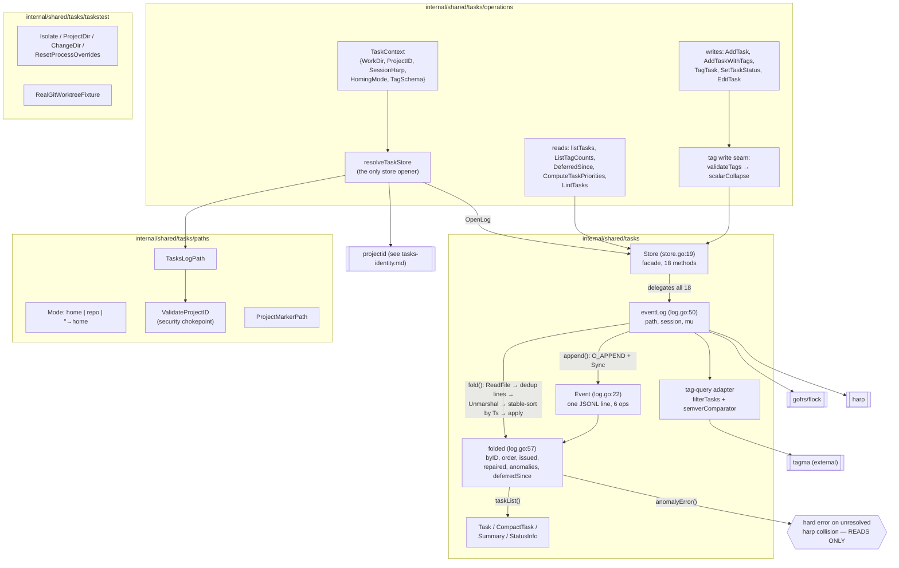

# Task store — log, fold, Store, paths, operations

The per-project task store is an append-only JSONL event log (`~/.ctxloom/tasks/<project-id>.jsonl`, or `<repoRoot>/.taskloom/tasks.jsonl` in repo-homed mode; ADR 0025) plus the fold that reduces it to current state. `internal/shared/tasks` owns the log format, the fold, and the `Task` value type; `internal/shared/tasks/paths` owns every filesystem path and the project-id validation chokepoint; `internal/shared/tasks/operations` is the frontend-agnostic layer that resolves *which* store to open and wraps each result for a renderer; `internal/shared/tasks/taskstest` supplies the isolation fixtures every test in the shared tree depends on.

The contract: task state is never mutated in place. Every change is one `\n`-terminated JSON line appended under an exclusive cross-process lock, and current state is always a full replay of the file sorted by timestamp.

## Inventory — `internal/shared/tasks` (log, store, task model, compaction)

### Types and package-level values

| Symbol | file:line | Purpose |
|---|---|---|
| `Event` | `internal/shared/tasks/log.go:22` | The on-disk wire record: one JSON line. Tagged union flattened into one struct; which fields are live depends on `Op`. |
| op constants (`opAdd`, `opStatus`, `opText`, `opRemove`, `opTag`, `opUntag`) | `internal/shared/tasks/log.go:34` | The six legal ops. An unknown op is a hard fold error — an old binary cannot read a newer log. |
| `eventLog` | `internal/shared/tasks/log.go:50` | Unexported backend: `path`, `session`, `mu`. Owns locking, folding, appending, and every query. |
| `folded` | `internal/shared/tasks/log.go:57` | One fold's projection: `byID`, `order`, `issued`, `repaired`, `anomalies`, `deferredSince`. |
| `parsedEvent` | `internal/shared/tasks/log.go:87` | `{ev, lineNo}` — carries the source line number through the timestamp reorder so apply errors can still name `path:line`. |
| `Store` | `internal/shared/tasks/store.go:19` | Public facade over `eventLog`; single field `log`. Its only structural job is keeping `eventLog` unexported. |
| status constants (`StatusInProgress`, `StatusToDo`, `StatusDeferred`, `StatusDone`, `StatusArchived`) | `internal/shared/tasks/task.go:23` | The five statuses. |
| `DefaultStatusOrder` | `internal/shared/tasks/task.go:32` | Canonical status ordering; drives `Statuses()`. Exported but has no consumer outside the package. |
| `StatusInfo` | `internal/shared/tasks/task.go:38` | Exported taxonomy row `{Name, Order, Terminal, RequiresTrigger}` so `cmd/taskloom` need not hardcode statuses. |
| `ErrTriggerRequired` | `internal/shared/tasks/task.go:64` | Sentinel for "Deferred needs a trigger". No `errors.Is` consumer outside the package. |
| `Task` | `internal/shared/tasks/task.go:81` | The domain value type and the cross-surface JSON contract (CLI `--json` and MCP emit identical snake_case keys). |
| `Summary` | `internal/shared/tasks/task.go:125` | `{Counts map[string]int, InProgress []string}`. |
| `ErrTagQuery` | `internal/shared/tasks/task.go:164` | Wraps every malformed-tag-query failure; a bad query is never degraded to empty or unfiltered results. |
| `presenceNamespace` | `internal/shared/tasks/task.go:273` | `taskloom.internal` — reserved namespace for the query adapter's marker tags. |
| `typeConfigItemID` | `internal/shared/tasks/task.go:280` | `taskloom.internal:type-config` — the synthetic tagma item carrying type declarations. |
| `HeadlineWidth` | `internal/shared/tasks/compact.go:12` | 80 runes. |
| `CompactTask` | `internal/shared/tasks/compact.go:52` | Bulk-listing projection `{HarpID, Status, Checked, Tags, Headline}`; deliberately omits Text/Trigger/TextHash/OriginSession/CreatedAt. |
| `tagmaTypeNamespace` | `internal/shared/tasks/type_comparator.go:18` | `tagma.type` — the facet namespace the query adapter emits config tags under. |
| `semverComparator` | `internal/shared/tasks/type_comparator.go:63` | `tagma.TypeComparator` for SemVer 2.0.0 precedence, registered under `tagschema.SemverTypeName`. |

### Functions — log and fold

| Function | file:line | Purpose |
|---|---|---|
| `newFolded` | `internal/shared/tasks/log.go:75` | Allocates the four maps; establishes the non-nil-map invariant. |
| `(*eventLog).fold` | `internal/shared/tasks/log.go:129` | The core reduction: ReadFile → skip blanks → byte-identical-line dedup → Unmarshal → stable-sort by `Ts` → `apply` each. Missing file → empty state, nil error. Any malformed line is a hard error naming `path:line`. |
| `(*folded).apply` | `internal/shared/tasks/log.go:180` | Folds one event. Unknown or empty op → hard error. |
| `(*folded).taskList` | `internal/shared/tasks/log.go:260` | Materializes live tasks in `order`, skipping tombstoned ids. |
| `(*folded).anomalyError` | `internal/shared/tasks/log.go:283` | Builds a loud error describing every unresolved harp collision. |
| `(*eventLog).append` | `internal/shared/tasks/log.go:306` | The sole write primitive: marshal → MkdirAll → `O_CREATE\|O_APPEND\|O_WRONLY` → Write → `Sync`. |
| `(*eventLog).lock` | `internal/shared/tasks/log.go:331` | Takes `mu` then the exclusive flock; returns a paired release closure, unwinding `mu` if the flock fails. |
| `(*eventLog).add` | `internal/shared/tasks/log.go:344` | `addWithTags(text, status, trigger, nil)`. |
| `(*eventLog).addWithTags` | `internal/shared/tasks/log.go:351` | validate → lock → fold → mint unique harp → append `add`. |
| `(*eventLog).setStatus` | `internal/shared/tasks/log.go:396` | lock → fold → resolve effective trigger → validate → append `status`. |
| `(*eventLog).setText` | `internal/shared/tasks/log.go:436` | lock → fold → append `text`. |
| `(*eventLog).remove` | `internal/shared/tasks/log.go:464` | lock → fold → append `remove` tombstone. No shipped CLI or MCP surface reaches this. |
| `(*eventLog).addTags` | `internal/shared/tasks/log.go:488` | normalize → reject empty set → lock → fold → append `tag`. |
| `(*eventLog).removeTags` | `internal/shared/tasks/log.go:518` | normalize → reject empty set → lock → fold → append `untag`. |
| `(*eventLog).currentTags` | `internal/shared/tasks/log.go:551` | Shared-locked fold; returns one task's tag set. |
| `(*eventLog).snapshot` | `internal/shared/tasks/log.go:568` | Shared-locked fold + `anomalyError` + `taskList`. The single read entry point. |
| `(*eventLog).deferredSince` | `internal/shared/tasks/log.go:595` | Shared-locked fold; filters the map to *currently* Deferred tasks (stale entries are tolerated in the map and dropped here). |
| `(*eventLog).list` | `internal/shared/tasks/log.go:617` | `listWithTagQuery(statuses, term, "", nil)`. |
| `(*eventLog).listWithTagQuery` | `internal/shared/tasks/log.go:627` | `snapshot()` then `filterTasks(...)` — names the read-then-filter seam. |
| `(*eventLog).summarize` | `internal/shared/tasks/log.go:635` | Counts per status; collects in-progress harps. |
| `(*eventLog).repair` | `internal/shared/tasks/log.go:653` | For each unrepaired anomaly, mints a fresh harp and appends a re-`add` carrying `RepairOf`. The re-add does **not** carry the anomaly's `Tags` or `Ts`, so a repaired task loses its tags and its `CreatedAt` becomes the repair time. |
| `defaultStatus` | `internal/shared/tasks/log.go:689` | `""` → `StatusToDo`; applied at two sites that must agree (`apply`, `repair`). |
| `anomalyKey` | `internal/shared/tasks/log.go:699` | `hashText(task \x00 text \x00 session \x00 RFC3339Nano ts)`. `anomalyError` and `repair` must compute an identical key or repair never resolves. |

### Functions — Store facade

| Function | file:line | Purpose |
|---|---|---|
| `OpenLog` | `internal/shared/tasks/store.go:27` | Validates path non-empty, constructs a `Store`. The only constructor. |
| `(*Store).Path` | `internal/shared/tasks/store.go:35` | The only accessor to the unexported log path. |
| `(*Store).List` | `internal/shared/tasks/store.go:40` | Status/term listing. |
| `(*Store).ListWithTagQuery` | `internal/shared/tasks/store.go:54` | Status/term listing plus a postfix tag query evaluated against a `tagschema.Schema`. |
| `(*Store).Add` | `internal/shared/tasks/store.go:60` | `AddWithTrigger(text, status, "")`. Test-only. |
| `(*Store).AddWithTrigger` | `internal/shared/tasks/store.go:66` | Validates then appends an `add`. |
| `(*Store).AddWithTags` | `internal/shared/tasks/store.go:76` | Validates then appends an `add` with initial tags. |
| `(*Store).AddTags` | `internal/shared/tasks/store.go:87` | Appends a `tag` event (union). |
| `(*Store).RemoveTags` | `internal/shared/tasks/store.go:95` | Appends an `untag` event (subtract). |
| `(*Store).CurrentTags` | `internal/shared/tasks/store.go:104` | One task's current tag set. |
| `(*Store).Remove` | `internal/shared/tasks/store.go:110` | Appends a tombstone. Test-only — no CLI command and no MCP tool reaches it. |
| `(*Store).SetStatus` | `internal/shared/tasks/store.go:116` | `SetStatusWithTrigger(harpID, status, "")`. Test-only. |
| `(*Store).SetStatusWithTrigger` | `internal/shared/tasks/store.go:125` | Status change, optionally setting/keeping a revive trigger. |
| `(*Store).SetText` | `internal/shared/tasks/store.go:132` | Replaces a task's text. |
| `(*Store).Snapshot` | `internal/shared/tasks/store.go:137` | Full unfiltered task list. |
| `(*Store).Repair` | `internal/shared/tasks/store.go:143` | Resolves harp collisions. Test-only — no shipped surface calls it, though `anomalyError`'s message names it as the remedy. |
| `(*Store).Summarize` | `internal/shared/tasks/store.go:148` | Per-status counts + in-progress harps. |
| `(*Store).DeferredSince` | `internal/shared/tasks/store.go:159` | harp → time each currently-Deferred task entered Deferred. |

### Functions — task model, tag query, compaction

| Function | file:line | Purpose |
|---|---|---|
| `Statuses` | `internal/shared/tasks/task.go:48` | Builds the exported taxonomy from `DefaultStatusOrder`, deriving `Terminal` and `RequiresTrigger`. |
| `ValidateStatusTrigger` | `internal/shared/tasks/task.go:69` | Deferred ⇒ non-empty trigger. Enforced at five in-package sites; exported but has no external consumer. |
| `effectiveTrigger` | `internal/shared/tasks/task.go:132` | Non-empty new value wins, else keep existing — "an empty trigger never clears". |
| `statusIsDone` | `internal/shared/tasks/task.go:139` | `Done \|\| Archived`. Unexported, which is why `priority` hand-copies it. |
| `hashText` | `internal/shared/tasks/task.go:143` | sha256 of trimmed text, first 12 hex chars. Four sites must agree on the truncation. |
| `uniqueHarpIDFromSet` | `internal/shared/tasks/task.go:153` | `harp.UniqueFrom(used, harp.GenerateShortName)` — pins the short-harp choice. |
| `filterTasks` | `internal/shared/tasks/task.go:194` | Status/term prefilter, then a tagma index over the *candidates* and `QueryPostfix`. |
| `presenceTag` | `internal/shared/tasks/task.go:288` | Returns the reserved `taskloom.internal:candidate` marker so every candidate participates in `not` queries. |
| `tagsToTagmaTags` | `internal/shared/tasks/task.go:301` | Parses stored tag strings, silently skipping unparseable ones (lenient read side). |
| `normalizeTags` | `internal/shared/tasks/task.go:316` | Trim, drop empties, dedupe, sort; returns `nil` when empty — which is what makes the callers' empty-set rejection work. |
| `unionTags` | `internal/shared/tasks/task.go:342` | The `tag` fold rule. |
| `subtractTags` | `internal/shared/tasks/task.go:352` | The `untag` fold rule (set difference preserving sort). |
| `Headline` | `internal/shared/tasks/compact.go:23` | First line, right-trimmed, capped to 80 **runes** with `…`. |
| `(Task).Compact` | `internal/shared/tasks/compact.go:62` | `Task` → `CompactTask`. |
| `registerTypes` | `internal/shared/tasks/type_comparator.go:25` | Registers `semverComparator` on a tagma index; the extension point for future comparators. |
| `typeConfigTags` | `internal/shared/tasks/type_comparator.go:37` | Turns `tagschema` TypeFacet declarations into tagma config tags. |
| `(semverComparator).Compare` | `internal/shared/tasks/type_comparator.go:72` | Strict SemVer compare; `(0, false)` (NotComparable) when either side won't parse. |

## Inventory — `internal/shared/tasks/paths`

Pure leaf: zero internal imports, no I/O beyond `os.UserHomeDir`. Consumed by `cmd/taskloom`, `operations`, `projectid`, `internal/taskloom/config`, `internal/shared/plans`, `internal/projectroot`, `internal/lm/isolation`.

| Symbol | file:line | Purpose |
|---|---|---|
| `AppDirName` = `.ctxloom` | `internal/shared/tasks/paths/paths.go:22` | Home/in-tree app dir name. Duplicated by `internal/paths.AppDirName` — the split is drift, not a forced cycle break. |
| `ProjectsDir` = `projects` | `internal/shared/tasks/paths/paths.go:26` | Registry subdir. No consumer outside this file. |
| `IndexFileName` = `index.yaml` | `internal/shared/tasks/paths/paths.go:29` | The **project registry** index — value-equal to but conceptually distinct from `internal/paths.IndexFileName` (the session index). |
| `TasksDir` = `tasks` | `internal/shared/tasks/paths/paths.go:33` | Home-rooted task-log directory name. |
| `ProjectMarkerFileName` = `project-id` | `internal/shared/tasks/paths/paths.go:38` | In-tree marker filename. No consumer outside this file. |
| `TasksLogExt` = `.jsonl` | `internal/shared/tasks/paths/paths.go:41` | Home-mode log extension. |
| `RepoDirName` = `.taskloom` | `internal/shared/tasks/paths/paths.go:49` | Repo-homed dir; re-exported as `internal/taskloom/config.DirName`. |
| `RepoTasksFileName` = `tasks.jsonl` | `internal/shared/tasks/paths/paths.go:53` | Repo-homed log filename. |
| `Mode` | `internal/shared/tasks/paths/paths.go:60` | String enum selecting the homing convention; deserialized straight from taskloom's YAML/env/flag config. |
| `ModeHome` / `ModeRepo` | `internal/shared/tasks/paths/paths.go:66`, `:71` | `"home"` / `"repo"` — these literals are the on-disk config values. |
| `HomeProjectsDir` | `internal/shared/tasks/paths/paths.go:76` | `~/.ctxloom/projects`. Only consumer is `ProjectRegistryPath`. |
| `ProjectRegistryPath` | `internal/shared/tasks/paths/paths.go:86` | `~/.ctxloom/projects/index.yaml`. |
| `HomeTasksDir` | `internal/shared/tasks/paths/paths.go:96` | `~/.ctxloom/tasks` — referenced independently by container mounts and global listing. |
| `TasksLogPath` | `internal/shared/tasks/paths/paths.go:120` | The store's single path chokepoint: repo → `<root>/.taskloom/tasks.jsonl` (empty root → error), home/`""` → validate id then `~/.ctxloom/tasks/<id>.jsonl`, unknown mode → error. Never falls back silently. |
| `ValidateProjectID` | `internal/shared/tasks/paths/paths.go:148` | Rejects empty, >255 bytes, any char outside `[A-Za-z0-9._-]`, `..` anywhere, and a leading dot. The path-traversal boundary for `--project`, `CTXLOOM_PROJECT_ID`, and a committed marker file. |
| `ProjectMarkerPath` | `internal/shared/tasks/paths/paths.go:174` | `<projectDir>/.ctxloom/project-id`. Takes no error return; `projectDir == ""` yields a cwd-relative path rather than failing (asymmetric with `TasksLogPath`'s explicit empty-root guard). |

## Inventory — `internal/shared/tasks/operations`

| Symbol | file:line | Purpose |
|---|---|---|
| `TaskContext` | `internal/shared/tasks/operations/operations.go:29` | The input bundle every exported operation takes: `{WorkDir, ProjectID, SessionHarp, HomingMode, TagSchema}`. |
| `TaskListResult` | `internal/shared/tasks/operations/operations.go:63` | Listing result: payload (`Tasks`, `Summary`), provenance (`Path`, `ProjectID`, `ProjectDir`, `Warning`), and the truncation ledger (`HiddenCompleted`, `HiddenDeferred`, `OmittedByLimit`). |
| `TaskResult` | `internal/shared/tasks/operations/operations.go:98` | Single-mutation result `{Path, Task, Warning, ProjectID, ProjectDir}`. |
| `TagCount` | `internal/shared/tasks/operations/operations.go:604` | `{Tag, Active, Total}` — split counts so a finished workstream is distinguishable from a typo. The only JSON-tagged type here (serialized by the MCP tag-vocabulary resource). |
| `TagListResult` | `internal/shared/tasks/operations/operations.go:611` | `{Path, Tags, Warning, ProjectID, ProjectDir}`. |
| `projectIdentity` | `internal/shared/tasks/operations/operations.go:726` | Unexported `{ID, Dir}` pair naming the resolved project and its registered root. |
| `ResolveProjectIdentity` | `internal/shared/tasks/operations/operations.go:115` | Opens the registry and resolves `workDir` to `(projectID, warning)`, minting on first sight. Hides `projectid` from `internal/cli`. |
| `ResolveLogPath` | `internal/shared/tasks/operations/operations.go:135` | Resolves the log path without opening the store; returns `("", path)` in repo mode. |
| `ListTasks` | `internal/shared/tasks/operations/operations.go:166` | `listTasks` with no tag query. |
| `ListTasksWithTagQuery` | `internal/shared/tasks/operations/operations.go:175` | `listTasks` with a postfix tag query. |
| `listTasks` | `internal/shared/tasks/operations/operations.go:187` | Resolve → list → apply the default active-only filter (counting what it hid) → apply the row limit (counting what it cut) → summarize independently of the limit. |
| `AddTask` | `internal/shared/tasks/operations/operations.go:238` | Resolve → `Store.AddWithTrigger` → wrap. |
| `AddTaskWithTags` | `internal/shared/tasks/operations/operations.go:263` | Validate tags → intra-list scalar collapse → resolve → `Store.AddWithTags` → wrap. Discards `scalarCollapse`'s retraction list (no prior state to retract). |
| `TagTask` | `internal/shared/tasks/operations/operations.go:303` | Validate → read current tags → scalar-collapse against them → `RemoveTags` for displaced values → `AddTags` → `RemoveTags` for the caller's explicit removals. |
| `scalarCollapse` | `internal/shared/tasks/operations/operations.go:360` | Drops non-last duplicates per scalar target from `incoming`; returns the existing tags on a surviving scalar target whose value differs, for retraction. Compares surviving values by **raw string**, though target identity is decided by parsing. |
| `scalarTargetOf` | `internal/shared/tasks/operations/operations.go:413` | Parses a raw tag; returns `(target, schemaSaysScalar)`. A `(target, false)` with a non-empty target means "parsed but not scalar". |
| `validateTags` | `internal/shared/tasks/operations/operations.go:436` | `validateTag` over a slice; first error rejects the whole call. |
| `validateTag` | `internal/shared/tasks/operations/operations.go:513` | Rejects reserved operator words, ungrammatical tags, the reserved `tagma.*` namespace, off-enum values, out-of-range values, and non-SemVer values on a `type=semver` target. |
| `containsString` | `internal/shared/tasks/operations/operations.go:560` | Linear membership test (duplicate of `lint.contains` and of `slices.Contains`). |
| `SetTaskStatus` | `internal/shared/tasks/operations/operations.go:572` | Resolve → `Store.SetStatusWithTrigger` → wrap. |
| `EditTask` | `internal/shared/tasks/operations/operations.go:587` | Resolve → `Store.SetText` → wrap. |
| `ListTagCounts` | `internal/shared/tasks/operations/operations.go:625` | Lists every task across all statuses, tallies each tag active/total, sorts by name. |
| `DeferredSince` | `internal/shared/tasks/operations/operations.go:661` | Resolve → `Store.DeferredSince`. Feeds trigger evaluation. |
| `ComputeTaskPriorities` | `internal/shared/tasks/operations/operations.go:693` | Resolve → `Store.Snapshot` → `priority.Compute` against the **full** snapshot, never a filtered page. |
| `LintTasks` | `internal/shared/tasks/operations/operations.go:710` | Resolve → `Store.Snapshot` → `lint.Lint`. Never filters what it inspects. |
| `resolveTaskStore` | `internal/shared/tasks/operations/operations.go:737` | Mode dispatch; project-id from pin or live registry; registered-dir lookup; pin-vs-cwd mismatch note; missing-log sibling note; path build; `OpenLog`. |
| `missingLogSiblingNote` | `internal/shared/tasks/operations/operations.go:823` | Returns a note when the resolved id has no log but the same path is registered under another id that does — best-effort, returns `""` on any registry error. |
| `resolveRepoHomedStore` | `internal/shared/tasks/operations/operations.go:858` | Opens the checked-in `.taskloom/tasks.jsonl`; errors on an empty `WorkDir` and warns that `--project` is being ignored rather than ignoring it silently. |

## Inventory — `internal/shared/tasks/taskstest`

Test-isolation primitives for the whole `internal/shared` tree. The tree must stay self-contained (it cannot import `internal/testsupport`, so it can split back out as a companion module), so the canonical bodies live here and `testsupport` delegates. Declares no types.

| Symbol | file:line | Purpose |
|---|---|---|
| `EnvKeys` | `internal/shared/tasks/taskstest/taskstest.go:20` | `{CTXLOOM_SESSION_HARP, CTXLOOM_PROJECT_ID, CTXLOOM_ROOT}` — the vars `Isolate` clears. Silently narrower than `internal/testsupport.EnvKeys` (~18 entries); nothing links the two. |
| `Isolate` | `internal/shared/tasks/taskstest/taskstest.go:30` | `t.TempDir()` → `HOME`/`USERPROFILE`; clears each `EnvKeys` var via `t.Setenv`; calls `ResetProcessOverrides`. Incompatible with `t.Parallel` by construction. |
| `ResetProcessOverrides` | `internal/shared/tasks/taskstest/taskstest.go:52` | Canonical body: resets `confload`'s process-wide override capture and registers the same as cleanup. `testsupport` delegates here to avoid an import cycle. |
| `ProjectDir` | `internal/shared/tasks/taskstest/taskstest.go:61` | `Isolate` + fresh `t.TempDir()` + `ChangeDir`. Byte-duplicated in `testsupport`. |
| `ChangeDir` | `internal/shared/tasks/taskstest/taskstest.go:78` | Canonical body: saves cwd, `os.Chdir`, registers a restoring cleanup. `forbidigo` forbids bare `os.Chdir` in test files precisely so callers route here. The cleanup's restore error is discarded. |
| `RealGitWorktreeFixture` | `internal/shared/tasks/taskstest/gitfixture.go:24` | `git init` + config + one commit + `git worktree add -b wt-branch`; returns both roots symlink-resolved (macOS `/tmp` → `/private/tmp`). `t.Skip`s when git is not on PATH. |
| `runGit` | `internal/shared/tasks/taskstest/gitfixture.go:54` | Fail-loud `exec.Command` wrapper; `t.Fatalf`s with combined output. |

## Invariants and contracts

**Log format and fold**

- The log is append-only. `(*eventLog).append` is the **only writer** of the JSONL file, and every mutator reaches it. It must emit exactly one `\n`-terminated line; `fold` breaks otherwise.
- `fold()` sorts by `Event.Ts` (stable) before applying, so **replay order is timestamp order, not file order**. `folded.order` is therefore timestamp order too, despite its comment saying "file order".
- Task identity is *derived, not fixed*: which of two colliding `add`s keeps a harp is decided by minimum `Ts` at fold time. A git union-merge that introduces a backdated `add` can retroactively reassign a harp between folds. This property is not written down in the source.
- The log file is checked into git under `merge=union` in repo-homed mode, so concurrent branches produce interleaved lines that the timestamp sort reorders.
- An unknown or empty `Event.Op` is a **fold error**, not a skip. That fail-closed rule is the only forward-compatibility guard; a log carrying `tag`/`untag` is rejected outright by a pre-tag binary.
- A malformed line is a hard error naming `path:line` — `fold` never skips lines. (A doc comment on `snapshot` still describes a "malformed-line skip"; there is none.)
- `apply` silently ignores `status`/`text`/`tag`/`untag` events addressed to an unknown harp — it does not distinguish "tombstoned" from "never existed".
- `opRemove` deletes from `byID` but leaves the harp in `order`; `taskList`'s nil check is what keeps the two consistent. Harps are never reused.
- `anomalyKey` must be computed identically by `anomalyError` and `repair`, or a repair never resolves the anomaly it targets.

**Locking**

- Write paths (`addWithTags`, `setStatus`, `setText`, `remove`, `addTags`, `removeTags`, `repair`) take `mu` **then** a *required* exclusive flock, and the lock spans fold-and-append. `lock()` must be called before any mutation and its returned closure deferred — enforced only by convention.
- Read paths (`snapshot`, `deferredSince`, `currentTags`) take `mu` plus a **best-effort** shared flock: a lock-acquire failure is silently downgraded to an unlocked read, because reads must never block.
- Cross-process serialization of concurrent `add` and `tag` writers is proven by `tests/taskloom/crossprocess_test.go`.

**Read/write asymmetry on collisions**

- `folded.anomalyError` gates **reads only** (`snapshot`, `deferredSince`). On an unresolved harp collision every read surface fails — `taskloom list`, `summary`, `tags`, `lint`, `--sort priority`, MCP `task_list`, all trigger evaluation — while every write keeps succeeding, because the mutators call `fold()` directly and never `anomalyError`.
- The error names `Store.Repair()` as the remedy; no CLI command and no MCP tool exposes it.
- `repair()` re-adds a displaced task **without** `Tags` and **without** the original `Ts`, so a repaired task loses its tags and its `CreatedAt` becomes the repair time (which then feeds `priority`'s age computation).

**Empty input**

- Every writer in the store fails loudly on empty input: `addWithTags`/`setText` reject empty text, `setStatus` rejects an empty status, `addTags`/`removeTags` reject an empty post-normalize tag set. `normalizeTags` returning `nil` on empty is what makes those rejections work.
- `append` itself validates nothing about the event it is handed — a zero-value `Event` would be written durably and then poison every future fold.
- `listTasks` never returns an unexplained empty page: `HiddenCompleted`, `HiddenDeferred`, and `OmittedByLimit` always account for what was dropped, and `missingLogSiblingNote` exists to stop "(no tasks)" from being an honest-looking lie.

**Status and trigger**

- `ValidateStatusTrigger` is the one shared invariant (Deferred ⇒ non-empty trigger), enforced at five in-package sites. `Store.AddWithTrigger`/`AddWithTags` call it and then `eventLog.addWithTags` calls it again — the validation runs twice on every add.
- `effectiveTrigger` encodes "an empty trigger never clears an existing one"; `setStatus` persists a trigger only when it changed.
- `Statuses()` is the exported taxonomy so frontends need not hardcode the five statuses; `cmd/taskloom/commands.go` nonetheless restates the Deferred-requires-trigger rule as help-text prose rather than reading `RequiresTrigger`.
- `Task.Checked` and `Task.TextHash` are denormalized derivations of `Status` and `Text`. Six construction sites recompute them by hand (`apply` opAdd/opStatus/opText, `addWithTags`, `setStatus`, `setText`); they must stay in step.

**Paths and project identity**

- `TasksLogPath` is the **only** place a project-id becomes a filesystem path, and `ValidateProjectID` runs inside it on the home-mode branch. Any new path construction must route through it.
- `TasksLogPath` fails on every invalid input — empty repo root, empty/invalid project id, unknown mode — and never falls back to a default. `ProjectMarkerPath` does not follow that rule: it returns a cwd-relative path for an empty `projectDir`.
- `Mode("")` means `ModeHome`. Every production call site passes a literal `ModeHome`/`ModeRepo` constant, so the `""` arm is defence-in-depth only.
- In `ModeRepo`, the **repo is the identity** — no project-id, no registry lookup; `ResolveLogPath` returns `("", path)`.

**Operations layer**

- `resolveTaskStore` is the **only** function that opens a store; every read and write operation goes through it. It is also the only edge between the package's two halves (store/project resolution vs task operations).
- `TaskContext` carries two load-bearing zero-value conventions: `HomingMode == ""` means `ModeHome`, and `TagSchema == nil` means "skip the entire tag write seam" (no scalar collapse, no enum/range validation).
- `validateTags` runs to completion **before** the store is touched, so a rejected tag never reaches the log.
- `TagTask`'s scalar collapse is a **non-atomic two-write sequence**: the retraction `untag` is appended first, then the `add`. A failure between them leaves the task having lost its previous scalar value and gained nothing, with no compensating write. The doc's "the log still records BOTH events" is about history, not about both events happening.
- `ComputeTaskPriorities` and `LintTasks` always operate on `Store.Snapshot()` — the full population — never on a filtered or limited page.
- The reserved `tagma.*` namespace is rejected by `validateTag`, which is why schema declarations can only arrive from taskloom's own `config.yaml` and never from a task tag.

**taskstest**

- `taskstest.ResetProcessOverrides` and `taskstest.ChangeDir` are the canonical bodies; `internal/testsupport` delegates to them. `Isolate` and `ProjectDir` are byte-duplicated in `testsupport` instead of delegating, which is what permits the two `EnvKeys` lists to diverge.
- `Isolate` clears 3 of the ~18 variables `testsupport.Isolate` clears, and `TestEnvKeysCoversProductionReads` builds its known-set from `testsupport.EnvKeys` only — so `taskstest.EnvKeys` can drift with nothing failing. Tests using `taskstest.Isolate` are not isolated from e.g. `CTXLOOM_MCP_SOCKET`.
- `RealGitWorktreeFixture` claims to be canonical and sanctions exactly one frozen copy (`internal/config/worktree_signpost_test.go:178`); a third copy exists at `tests/integration/testenv/environment.go:333`. It `t.Skip`s without git on PATH, so all 16 worktree-boundary tests vanish silently in a minimal container while the suite reports PASS.
- This package has **zero tests of its own**, and its failure mode is silent by construction: a dropped `EnvKeys` entry or a missed cleanup weakens every dependent test without failing anything.

**Unreachable surfaces**

- `Store.Remove` / `eventLog.remove` / the `opRemove` fold branch are complete and correct but reachable from no shipped CLI command or MCP tool — task deletion is not exposed.
- `Store.Repair`, `Store.Add`, and `Store.SetStatus` have no production callers.
- `ValidateStatusTrigger`, `ErrTriggerRequired`, and `DefaultStatusOrder` are exported with no consumer outside the package.
- `paths.ProjectsDir`, `paths.ProjectMarkerFileName`, and `paths.HomeProjectsDir` have no consumer outside `paths.go`.
