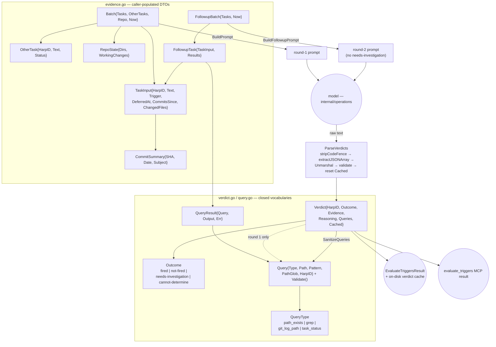

# Revive triggers — evidence, prompt, parse, verdict

`internal/shared/tasks/triggers` is the pure, I/O-free core of revive-trigger triage: it shapes gathered evidence into a batch-triage prompt, defines the closed vocabulary of outcomes and of the follow-up evidence queries a model may request, validates those queries for repo containment, and parses the model's JSON verdicts back out. It performs no I/O and makes no LLM call — `internal/operations` (`task_triggers.go`, `task_triggers_query.go`, `task_triggers_cache.go`) does all the git, filesystem, and model work and owns the verdict cache; `internal/mcp/mcp_tools_triggers.go` re-exports `Verdict` verbatim as the `evaluate_triggers` MCP wire type.

The contract: everything here is deterministic. That purity is what makes this the only fuzz-tested, property-asserted part of the trigger path.



## Inventory

`evidence.go` and `triggers.go` declare no functions.

### Evidence DTOs

| Symbol | file:line | Purpose |
|---|---|---|
| `TaskInput` | `internal/shared/tasks/triggers/evidence.go:9` | One Deferred task plus its pre-gathered evidence: `{HarpID, Text, Trigger, DeferredAt, CommitsSince, ChangedFiles}`. Read only by `writeTaskEvidence`; populated by `operations.buildBatch` and hashed by `fingerprintTask`. |
| `CommitSummary` | `internal/shared/tasks/triggers/evidence.go:29` | `{SHA, Date, Subject}` — one commit's evidence line. The seam that keeps `internal/git` out of this package's imports. |
| `OtherTask` | `internal/shared/tasks/triggers/evidence.go:38` | `{HarpID, Text, Status}` — status snapshot of a task not under evaluation, for cross-reference. `Status` is a bare `string`, not `tasks.Status`, to keep the leaf a leaf. |
| `RepoState` | `internal/shared/tasks/triggers/evidence.go:55` | `{Dirs, WorkingChanges}` — repo-global "what exists NOW", as distinct from "what changed since". Exists to stop existence-style triggers being answered `not-fired` from a silent history window. |
| `Batch` | `internal/shared/tasks/triggers/evidence.go:71` | Round-1 prompt input `{Tasks, OtherTasks, Repo, Now}`. `Now` is injected, which is what makes `BuildPrompt` pure. |
| `FollowupTask` | `internal/shared/tasks/triggers/evidence.go:82` | Embedded `TaskInput` + `Results []QueryResult`. The embedding makes "round 2 shows the same evidence" structural rather than a copy discipline. |
| `FollowupBatch` | `internal/shared/tasks/triggers/evidence.go:91` | Round-2 prompt input `{Tasks, Now}`. Deliberately carries no `Repo` and no `OtherTasks`. |

### Outcome vocabulary

| Symbol | file:line | Purpose |
|---|---|---|
| `Outcome` | `internal/shared/tasks/triggers/verdict.go:6` | Closed four-value verdict vocabulary (string newtype). |
| `Fired` = `fired` | `internal/shared/tasks/triggers/verdict.go:10` | The trigger condition is met. |
| `NotFired` = `not-fired` | `internal/shared/tasks/triggers/verdict.go:12` | The condition is demonstrably not met. |
| `NeedsInvestigation` = `needs-investigation` | `internal/shared/tasks/triggers/verdict.go:16` | Round-1 only — escalates to a round-2 evidence query. |
| `CannotDetermine` = `cannot-determine` | `internal/shared/tasks/triggers/verdict.go:23` | The escape hatch that prevents a false revive. |
| `Outcomes` | `internal/shared/tasks/triggers/verdict.go:28` | The four outcomes in most-to-least-conclusive order. Test-only — zero production callers. |
| `(Outcome).Valid` | `internal/shared/tasks/triggers/verdict.go:33` | Whitelist membership; the parser's gate. |
| `(Outcome).String` | `internal/shared/tasks/triggers/verdict.go:42` | Returns the underlying string. No explicit caller; `%q` formats a string newtype identically without it. |
| `Verdict` | `internal/shared/tasks/triggers/verdict.go:58` | The model's judgment for one task: `{HarpID, Outcome, Evidence, Reasoning, Queries, Cached}`. Re-exported verbatim as the MCP wire type, so its JSON tags are a public contract. |

### Query whitelist

| Symbol | file:line | Purpose |
|---|---|---|
| `QueryType` | `internal/shared/tasks/triggers/query.go:13` | Closed whitelist of evidence-request shapes. |
| `QueryPathExists` = `path_exists` | `internal/shared/tasks/triggers/query.go:17` | Uses `Path`. |
| `QueryGrep` = `grep` | `internal/shared/tasks/triggers/query.go:20` | Uses `Pattern` and optional `PathGlob`. |
| `QueryGitLogPath` = `git_log_path` | `internal/shared/tasks/triggers/query.go:22` | Uses `Path`. |
| `QueryTaskStatus` = `task_status` | `internal/shared/tasks/triggers/query.go:24` | Uses `HarpID`. |
| `QueryTypes` | `internal/shared/tasks/triggers/query.go:29` | The four types in prompt order. Test-only — zero production callers. |
| `(QueryType).Valid` | `internal/shared/tasks/triggers/query.go:34` | Membership check; the gate `Validate` opens with. |
| `Query` | `internal/shared/tasks/triggers/query.go:49` | One untrusted, model-authored evidence request. A tagged union flattened into a struct — each `Type` uses only the subset of fields it needs. |
| `(Query).Validate` | `internal/shared/tasks/triggers/query.go:72` | Type whitelist + per-type required-field check + repo containment. The unreachable `default` arm returns an error rather than accepting. |
| `validateRepoPath` | `internal/shared/tasks/triggers/query.go:103` | Rejects blank, NUL-containing, backslash-containing, unix-absolute, drive-lettered, and post-`Clean` `..` paths. |
| `SanitizeQueries` | `internal/shared/tasks/triggers/query.go:134` | Filters to valid queries, order-preserving, capped at `maxPerTask`. Drops the bad ones and keeps the good ones. |
| `QueryResult` | `internal/shared/tasks/triggers/query.go:154` | `{Query, Output, Err string}` — the deterministic answer to one query, carried into round 2. `Err` is a string, not an `error`, because the value crosses into a prompt as pure data. |

### Parsing

| Function | file:line | Purpose |
|---|---|---|
| `ParseVerdicts` | `internal/shared/tasks/triggers/parse.go:21` | Extracts a JSON array from raw model text, unmarshals to `[]Verdict`, rejects a blank `harp_id` or an unrecognized `outcome`, and force-resets `Cached` to false. All-or-nothing: no partial results. |
| `extractJSONArray` | `internal/shared/tasks/triggers/parse.go:50` | First `[` to last `]` substring after fence stripping; returns `""` when not found (the caller converts that to an error). |
| `stripCodeFence` | `internal/shared/tasks/triggers/parse.go:63` | Removes a wrapping ```` ``` ````/```` ```json ```` fence. |

### Prompt building

| Function | file:line | Purpose |
|---|---|---|
| `dateLayout` / `timeLayout` | `internal/shared/tasks/triggers/prompt.go:10`, `:11` | `2006-01-02` and `2006-01-02T15:04:05Z`. |
| `BuildPrompt` | `internal/shared/tasks/triggers/prompt.go:18` | Assembles the round-1 batch-triage prompt: outcome vocabulary, repo state, per-task evidence, other tasks, query protocol, response contract. |
| `writeQueryProtocol` | `internal/shared/tasks/triggers/prompt.go:69` | Writes the whitelisted-query section, enumerating every `QueryType` **by constant** so the prompt and the whitelist cannot drift. |
| `BuildFollowupPrompt` | `internal/shared/tasks/triggers/prompt.go:86` | Assembles the round-2 (final) prompt; withholds `needs-investigation` from the offered vocabulary. |
| `writeQueryResults` | `internal/shared/tasks/triggers/prompt.go:122` | Renders each executed query's answer. An errored query still prints and does not stop the loop; an empty result renders `"(no matches)"`. |
| `describeQuery` | `internal/shared/tasks/triggers/prompt.go:143` | Renders a `Query` as the label the model used to request it — round-2 evidence attribution depends on it. Unknown type falls back to the raw type string. |
| `writeRepoState` | `internal/shared/tasks/triggers/prompt.go:166` | Writes the repo-global existence evidence; writes **nothing at all** when both halves are empty. |
| `writeTaskEvidence` | `internal/shared/tasks/triggers/prompt.go:188` | Writes one task's evidence block, saying "unknown" / "(none gathered)" rather than rendering a zero value or a blank. |
| `writeResponseContract` | `internal/shared/tasks/triggers/prompt.go:210` | Writes the round-1 JSON response contract. The round-2 contract is written inline instead, duplicating one line verbatim. |
| `shortSHA` | `internal/shared/tasks/triggers/prompt.go:219` | Trims a hash to 10 chars, never slicing past the end. |

## Invariants and contracts

**Purity**

- This package performs no I/O, spawns no process, and makes no model call. All git, filesystem, and LLM work happens in `internal/operations`. `Batch.Now` and `FollowupBatch.Now` are injected so prompt building is deterministic and prompt tests are exact-string.
- The package doc justifies the purity with "so taskloom can import it safely". Nothing under `cmd/taskloom` imports it — the real, currently-paying justification is determinism and testability.

**Ordering — the round-1 → round-2 pipeline**

1. `BuildPrompt(Batch)` → model → `ParseVerdicts`.
2. Verdicts with `Outcome == NeedsInvestigation` have their `Queries` passed through `SanitizeQueries` before *any* query is executed. `SanitizeQueries` must be called before the caller dispatches on `Query.Type` — it is the only place `Validate` runs in the live path.
3. `internal/operations` executes the surviving queries and builds `FollowupBatch` → `BuildFollowupPrompt` → model → `ParseVerdicts`.
4. The caller nils out `Verdict.Queries` before the verdict escapes to the MCP result or the on-disk cache.

**Trust directions inside `Verdict`**

The struct fuses three field groups with three different trust directions, each policed by a single line in a *different* package:

| Fields | Direction | Policed by |
|---|---|---|
| `HarpID`, `Outcome`, `Evidence`, `Reasoning` | model → caller wire contract | `ParseVerdicts` validates `HarpID` and `Outcome` only |
| `Queries` | internal round-1 → round-2 control signal; must never leave the process | `internal/operations/task_triggers.go:287` sets `verdicts[i].Queries = nil` |
| `Cached` | caller-stamped provenance; must never come *in* | `internal/shared/tasks/triggers/parse.go:41` force-resets it |

- If a future caller omits the `Queries = nil` line, model-authored `Query` paths leak into both the MCP result and the on-disk verdict cache. Nothing in this package prevents it.
- `ParseVerdicts` validates `HarpID` (non-blank) and `Outcome` (whitelist) and **nothing else**. `Evidence` and `Reasoning` are never validated, so `[{"harp_id":"a","outcome":"fired"}]` parses clean and reaches the human as a proposal to revive a task carrying zero justification — despite `Verdict`'s own doc resting the whole design on the human reading those two fields. Neither field has `omitempty`, so the MCP result renders `"evidence":null,"reasoning":""`.

**Security — model-authored paths**

- Every `Query` is untrusted input. The containment contract is deliberately **split across two packages**: syntactic containment here (`validateRepoPath` — no absolute paths, no drive letters, no backslashes, no NUL, no post-`Clean` `..`), and symlink-resolved containment in `internal/operations` (`safeRepoPath`, `task_triggers_query.go:88`). Both doc comments name the other. Neither is sufficient alone.
- `Validate`'s `default` arm is unreachable given the `Type.Valid()` gate above it, and it still returns an error rather than accepting — belt and braces on the whitelist.
- `SanitizeQueries` swallows every `Validate` error, so the caller cannot distinguish "the model asked for nothing" from "the model asked for four things and all four were rejected". `escalateNeedsInvestigation` treats both as the former.

**Prompt construction rules**

- An empty section is not neutral: a header with nothing beneath it reads to the model as positive evidence. `writeRepoState` therefore writes nothing at all when both halves are empty, and `writeTaskEvidence` writes explicit `"unknown"` / `"(none gathered)"` rather than blanks.
- **`BuildPrompt` and `BuildFollowupPrompt` violate that rule for an empty batch**: both emit the `=== Deferred tasks ===` header with nothing under it and return a full prompt with no error, asking a model to judge zero tasks. The behaviour is pinned as correct by `TestBuildPrompt_EmptyBatchDoesNotPanic`. No live path reaches it — the guards are in `internal/operations` (`chunkMissTasks` returns nil for an empty set; `escalateNeedsInvestigation` returns early) — so the invariant lives one package away from the builder.
- Every executed query is accounted for in the round-2 prompt: a failed query still gets a line, and an empty result renders `"(no matches)"` rather than vanishing.
- `writeQueryProtocol` enumerates `QueryType` values by constant. The **outcome** vocabulary is not treated the same way: the response contracts hardcode `"fired|not-fired|needs-investigation|cannot-determine"` (round 1) and `"fired|not-fired|cannot-determine"` (round 2) as string literals, with nothing pinning them to the `Outcome` constants.
- Round 2 sees **less** global evidence than round 1: `FollowupBatch` carries no `RepoState` and no `OtherTasks`, so a task escalated because "does X exist" was ambiguous is re-asked without the directory inventory — unless the model happened to request a `path_exists`/`grep` query in round 1.
- `needs-investigation` is offered in round 1 only. Round 2 forces any remaining `needs-investigation` down to `cannot-determine`.

**Parsing robustness**

- `ParseVerdicts` is all-or-nothing and wraps its errors with `%w`; there are no partial results (fuzz-asserted).
- Empty or fence-only model output degrades **loudly**: no `[` means an error, and `internal/operations` additionally rejects a non-zero exit, retries, and only then falls the whole chunk back to `cannot-determine`. A content-free document is never written over a good one.
- `stripCodeFence` unconditionally drops the entire fence-opener *line*. When the model puts the array on that same line (```` ```json [{…}]\n``` ````), the array is destroyed and `extractJSONArray` returns `""`, burning the chunk's retry.
- `extractJSONArray`'s "first `[` to last `]`" scan is broken by any bracketed prose *before* the array (`Sure [see below]:\n[{…}]`), producing a span that fails to unmarshal.

**Caller-side invariants this package cannot enforce**

- `TaskInput.CommitsSince` and `ChangedFiles` are documented as already bounded by the caller (`maxFilesPerTask`, `defaultMaxCommitsPerTask` live in `internal/operations`); this package never re-truncates and never checks.
- `internal/operations` chunks a batch by shallow-copying it and replacing only `Tasks` (`chunkBatch := batch; chunkBatch.Tasks = c.inputs`). That is safe only because `Repo` and `OtherTasks` are read-only downstream — an undocumented cross-package assumption about shared backing arrays.
- The cache-eligibility invariant stated at `internal/operations/task_triggers.go:113` ("degraded / cannot-determine fallback verdicts are never written to the cache") does not hold: round 1 marks a `needs-investigation` harp cacheable, and a round-2 degradation or omission `continue`s without clearing the flag, so the fallback is written to disk. The same paths leave `result.Degraded` false and `result.Warning` empty, because both are set before escalation runs.
