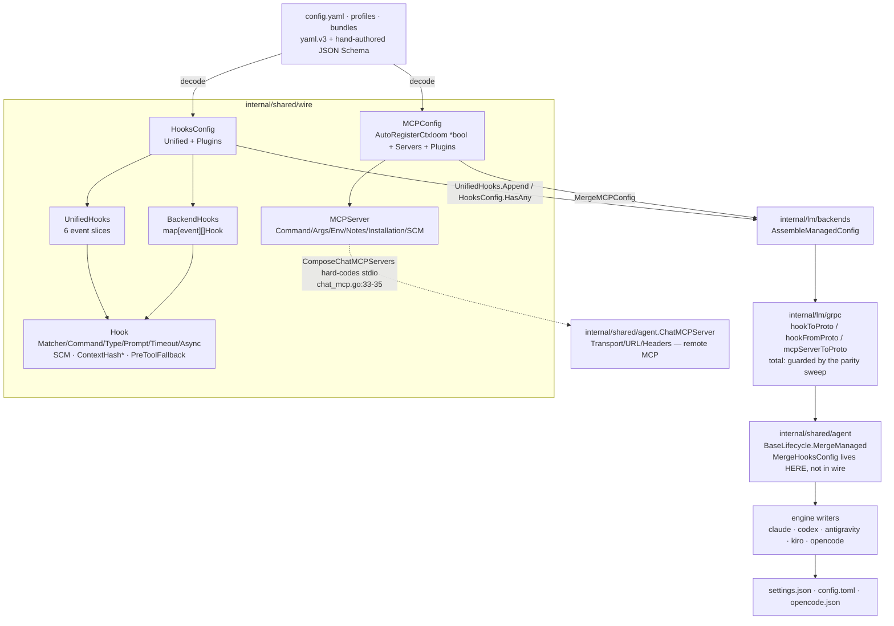

# Wire types — hooks and MCP

`internal/shared/wire` is the engine-agnostic vocabulary for the two things ctxloom delivers into every backend — lifecycle hooks and MCP server registrations — plus the three operations the assembly pipeline needs on them (merge, append, default-resolve). It is a true leaf: zero internal imports, twelve internal importers, two files, no cross-talk between them.

The contract it owns: **these types are simultaneously the on-disk config shape, the gRPC payload shape, and the input shape for every engine's native settings writer.** A field added here has to be threaded through four hand-written translation layers that no compiler check binds together.

`*` `Hook.ContextHash` is in-process only (`yaml:"-" json:"-"`) and is deliberately re-derived agent-side by `agent.NewContextInjectionHooks` (`internal/shared/agent/context_hooks.go:24-76`), so its non-serialization is compensated.

> **History (2026-07-25, `40b49a7f`).** `PreToolFallback` had **no proto field** and was dropped in both directions, so it arrived `false` at every backend and the Antigravity fallback was dead code. It is now `Hook.pre_tool_fallback = 8` and carried both ways. This converter is hand-written, which is why the drop was invisible for so long — the durable guard is the total-struct parity sweep described under *Serialization* below, not this diagram.

## `internal/shared/wire` — types

### `Hook` — `internal/shared/wire/hooks.go:14`

One lifecycle action (shell command, prompt, or agent invocation) plus the metadata each engine writer needs to place and re-identify it.

| Field | file:line | Serialized as | Read by |
|---|---|---|---|
| `Matcher string` | `hooks.go:15` | `matcher` | every engine writer |
| `Command string` | `hooks.go:16` | `command` | every engine writer |
| `Type string` | `hooks.go:17` | `type` | every engine writer; free-form, `"command"`/`"prompt"`/`"agent"` by convention, no constant and no validation in this package |
| `Prompt string` | `hooks.go:18` | `prompt` | every engine writer |
| `Timeout int` | `hooks.go:19` | `timeout` | claude only (`internal/claude/claude.go:613`) and codex (`internal/codex/settings.go:360`) |
| `Async bool` | `hooks.go:20` | `async` | claude only (`internal/claude/claude.go:614`) |
| `SCM string` | `hooks.go:21` | `_ctxloom` | the remove-all-then-re-add reconciler (`internal/claude/claude.go:567,834`) |
| `ContextHash string` | `hooks.go:30` | never (`yaml:"-" json:"-" mapstructure:"-"`) | `internal/antigravity/antigravity.go:381`, `internal/kiro/settings.go:136` |
| `PreToolFallback bool` | `hooks.go:38` | `pre_tool_fallback` | `internal/antigravity/antigravity.go:388` only |

### `wire.UnifiedHooks`

The backend-agnostic seven-event bundle. All seven are `[]Hook` and are only ever touched as a group. The `file:line` column is gone from this table deliberately: every number in it was wrong, and a stale line misleads silently where a stale symbol name fails loud.

| Field | Serialized as (yaml and json alike) |
|---|---|
| `PreTool` | `pre_tool` |
| `PostTool` | `post_tool` |
| `SessionStart` | `session_start` |
| `SessionEnd` | `session_end` |
| `TurnEnd` | `turn_end` |
| `PreShell` | `pre_shell` |
| `PostFileEdit` | `post_file_edit` |

`TurnEnd` sits beside `SessionEnd` in the struct but is APPENDED to `bundles.hookEventOrder`, not slotted in beside it: that slice is the enumeration order a bundle hook's trust identity is reported in, and reordering it would move every hook report against a baselined one.

### `HooksConfig` — `internal/shared/wire/hooks.go:52`

The persisted hook document.

| Field | file:line | Serialized as |
|---|---|---|
| `Unified UnifiedHooks` | `hooks.go:53` | `unified` |
| `Plugins map[string]BackendHooks` | `hooks.go:54` | `plugins` |

### `BackendHooks` — `internal/shared/wire/hooks.go:76`

Named map type, `map[string][]Hook`. Keys are engine-*native* event names (`"PreToolUse"` for Claude Code, `"beforeShellExecution"` for Cursor). Constructed at eight production sites: `internal/config/config_resolve.go:61,188`, `internal/shared/agent/context_hooks.go:105,109`, `internal/lm/backends/managed.go:234,409`, `internal/lm/grpc/managed.go:190,193`.

### `MCPServer` — `internal/shared/wire/mcp.go:10`

One MCP server registration.

| Field | file:line | Serialized as | Notes |
|---|---|---|---|
| `Command string` | `mcp.go:11` | `command` | executable surface; read by every writer and by `cloneMCPServer` |
| `Args []string` | `mcp.go:12` | `args` | deep-copied by `cloneMCPServer` |
| `Env map[string]string` | `mcp.go:13` | `env` | deep-copied by `cloneMCPServer` |
| `Notes string` | `mcp.go:14` | `notes` | human-only, explicitly not sent to AI; read by `internal/cli/bundle_list.go:244`, `internal/operations/review.go:396` |
| `Installation string` | `mcp.go:15` | `installation` | human-only; same readers |
| `SCM string` | `mcp.go:16` | `_ctxloom` | ctxloom-managed marker |

### `MCPConfig` — `internal/shared/wire/mcp.go:20`

The persisted MCP document.

| Field | file:line | Serialized as | Notes |
|---|---|---|---|
| `AutoRegisterCtxloom *bool` | `mcp.go:23` | `auto_register_ctxloom` | tri-state: unset / true / false. Read only by `ShouldAutoRegisterCtxloom`; written by `MergeMCPConfig` |
| `Servers map[string]MCPServer` | `mcp.go:26` | `servers` | unified servers |
| `Plugins map[string]map[string]MCPServer` | `mcp.go:30` | `plugins` | per-backend passthrough servers |

## `internal/shared/wire` — functions

| Function | file:line | Purpose | Call sites |
|---|---|---|---|
| `(HooksConfig).HasAny() bool` | `internal/shared/wire/hooks.go:59` | True if any of the seven unified slices or any plugin event slice is non-empty. "Plugin present but empty" is a distinguished case | 1 production: `internal/config/config_save.go:288`. Note `internal/config/config_bundles.go:650` calls a *different* method, `bundles.BundleHooks.HasAny` (`internal/bundles/bundles.go:165`) |
| `(*UnifiedHooks).Append(other UnifiedHooks)` | `internal/shared/wire/hooks.go:79` | Appends each of the seven per-event slices from `other` onto the receiver, skipping any hook the event already carries | 5 production: `internal/config/config_bundles.go:262,270,289,468`, `internal/lm/backends/managed.go:279` |
| `(*MCPConfig).ShouldAutoRegisterCtxloom() bool` | `internal/shared/wire/mcp.go:35` | Resolves the tri-state, defaulting true; **nil-receiver safe** | 7 production: `internal/codex/settings.go:443`, `internal/claude/claude.go:695`, `internal/opencode/settings.go:445`, `internal/operations/manage.go:125`, `internal/operations/mcp_servers.go:57`, `internal/shared/agent/chat_mcp.go:38`, `internal/shared/agent/mcpfile.go:86` |
| `MergeMCPConfig(dest, src *MCPConfig)` | `internal/shared/wire/mcp.go:49` | Merges `src` into `dest` — later wins per server name — deep-copying each server via `cloneMCPServer` (`:64`, `:76`). Guard at `:50`; `AutoRegisterCtxloom` assigned at `:56`; maps allocated at `:60-70` | 6 production: `internal/profiles/profiles.go:852,935`, `internal/config/config_resolve.go:164`, `internal/lm/backends/managed.go:128,134,146`, `internal/shared/agent/base_lifecycle.go:55` |
| `cloneMCPServer(s MCPServer) MCPServer` | `internal/shared/wire/mcp.go:84` | Copies an `MCPServer`, duplicating `Args` and `Env` so the copy never aliases | 2, both in-file. Semantically identical twins exist at `internal/config/accessors.go:120` and, as proto converters, at `internal/lm/grpc/managed.go:204-227` |

## Invariants and contracts

**Direction of flow**

- One way, always: `internal/config` + `internal/profiles` + `internal/bundles` parse user YAML into these structs → `internal/lm/backends.AssembleManagedConfig` folds them into one `ManagedConfig` → `internal/lm/grpc` serializes that onto `RunStart` → `internal/shared/agent.BaseLifecycle` re-merges it agent-side → the five engine packages translate it into each engine's native settings file.
- **The host-side assembly (`ApplyHooks`) and the agent-side assembly (run) must produce identical hooks**, or the remove-all-then-re-add reconcile drops them; this is documented at `internal/shared/agent/base_lifecycle.go:26-38`.
- `Hook.SCM` (`_ctxloom`) is the key that reconcile identifies ctxloom-managed entries by. `MCPServer.SCM` is its MCP twin.

**Serialization**

- These types carry **no version field**. Schema evolution happens one layer out, in the document-level upgraders (`internal/config/upgrade.go`, `internal/bundles/upgrade.go`, `internal/profiles/upgrade.go`) plus the hand-authored JSON Schema.
- **Unknown YAML keys are not rejected here** — yaml.v3 without `KnownFields` ignores them silently. They are caught only by `additionalProperties: false` in `resources/schema/input/config-schema.json`, whose drift gate (`internal/config/arch_test.go`) covers **top-level keys only**. Round-tripping is total only for the fields the outer schema happens to know about.
- Schema asymmetry to know about: the `mcpServer` def is `additionalProperties: false` and does **not** list `_ctxloom`, while the `hook` def is `additionalProperties: true` (which is how the same marker is tolerated on hooks). No production writer currently persists an SCM-marked server, so this is latent.
- Tag sets are inconsistent: `Hook` and `MCPServer` carry `json` tags; `UnifiedHooks`, `HooksConfig`, `BackendHooks`, and `MCPConfig` carry none, so a `json.Marshal` of any container would emit Go field names (`"PreTool"`, `"AutoRegisterCtxloom"`) while its elements emit snake/marker names. No production code marshals the containers today.
- Real vs documented: every `mapstructure` tag in this package (~13) is dead metadata. viper was deliberately removed (`internal/shared/confload/confload.go:90`, `internal/config/config.go:1400`), the only non-test `mapstructure.Decode` (`internal/lm/backends/config_registry.go:37`) decodes `agent.BackendConfig` implementations rather than wire types, and docs are generated from the JSON Schema (`internal/docsgen/config.go:13-18`) rather than from tags. `hooks.go:30`'s `mapstructure:"-"` is an exclusion tag for a decoder that never runs.
- **`Hook.PreToolFallback` survives the gRPC round-trip** (since `40b49a7f`). The proto `Hook` message (`internal/lm/grpc/llm.proto:516`) carries `pre_tool_fallback = 8`, and both `hookToProto` and `hookFromProto` (`internal/lm/grpc/managed.go:180`, `:196`) carry it. The flag is set from bundles at `internal/config/config_bundles.go:685` and is the only thing `internal/antigravity/antigravity.go:388` keys on.
  **This used to be dropped, and that history is why the parity gate exists.** The field had no proto number at all, so it arrived `false` at every backend on every `ctxloom run` — and because it is part of the **signed** executable preimage (`internal/bundles/bundles.go:632-641`), the hook *delivered* differed from the bytes the trust grant covered. Note what was *not* broken: the preimage is built host-side from the `wire.Hook` that always carried the true flag, so the gate never hashed a wrong value and no signature, hash or grant changed when the field was added.
- **The durable guard is a total-struct parity sweep** (`internal/lm/grpc/arch_test.go`, `40b49a7f`). It populates every field at every depth with distinguishable non-zero values, round-trips, and requires the whole struct back; it **names no field**, so a field added later is covered without anyone updating the test. It covers all 27 hand-mirrored pairs in `internal/lm/grpc`, with an AST-walking gate that fails when a pair is added without a sweep entry. This replaced a round-trip test that asserted one *named* field (`req.MCPServers == back.MCPServers`) rather than `req == back` — which is precisely why eight dropped fields were invisible to it.

**Merging**

- `MergeMCPConfig` semantics: **later wins per server name**, and each merged server is deep-copied so `dest` never aliases `src`'s `Args` or `Env` slices/maps. The aliasing this prevents is real — callers inject env vars post-merge (`internal/agentcoord/coord/enginehost.go:665-681`).
- `MergeMCPConfig(dest, nil)` is a deliberate no-op ("no MCP declared"), and every production caller guards it anyway (`internal/shared/agent/base_lifecycle.go:54`).
- `MergeMCPConfig(nil, src)` **silently discards the entire src payload** rather than panicking — the same `if src == nil || dest == nil { return }` guard covers both. No live call site passes a nil dest (five take `&struct`; the sixth is guarded by `ensureMCP()` at `base_lifecycle.go:42`), and `mcp_test.go:29-32` enshrines the behaviour as "must not panic".
- Real vs documented: the doc promises `dest` is independent of `src`, but `AutoRegisterCtxloom` is copied as a **shared `*bool`** (`mcp.go:56`). `internal/config/accessors.go:149` (`cloneBoolPtr`) does duplicate it; the only in-tree mutator assigns a fresh pointer (`internal/operations/mcp_servers.go:412`), so there is no live write-through today.
- `dest.Servers` and `dest.Plugins` are allocated **unconditionally** (`mcp.go:60-70`), so merging an empty-but-non-nil `src` converts "nil = nothing declared" into "empty map = declared, empty". That distinction is read elsewhere: `internal/config/config_resolve.go:247`, `internal/operations/mcp_servers.go:263,276`, and `internal/lm/grpc/managed.go:228-232` (whose doc explicitly preserves nil to match the host's "no bundle servers" shape).
- `ShouldAutoRegisterCtxloom`'s **nil-receiver safety is load-bearing**: `internal/shared/agent/chat_mcp.go:38` calls it before its own `if mcp != nil` guard at line 41.
- `UnifiedHooks.Append(UnifiedHooks{})` is a correct no-op; whether zero hooks is an error is decided by the caller (`ResolveBundleHooks`), not here.
- **The hooks half now HAS its merge primitive here.** `wire.HooksConfig.Append` owns the rule, unified half and plugin half alike, and dedups on the hook's whole executable content scoped to its event. `agent.MergeHooksConfig` no longer re-spells those appends — it delegates, and adds only the diagnostic wire cannot emit (a nil destination reports the SIZE of what it dropped). That collapse is what `TestMergeHooksConfig_UnifiedHalfMatchesWireAppend` was written to make provably behaviour-preserving.

**Shape limits**

- `MCPServer` can express **only a stdio (command) server**. Remote MCP exists end-to-end through a second, parallel type — `internal/shared/agent.ChatMCPServer` (`chat.go:248-267`) with `Transport`/`URL`/`Headers`, consumed by `internal/opencode/settings.go:133-135` and `internal/acp/session.go:524` — but everything sourced from config, profiles, or bundles goes through `ComposeChatMCPServers` (`internal/shared/agent/chat_mcp.go:33-35`), which always builds the stdio form. Two MCP representations coexist with asymmetric capability.
- `ComposeChatMCPServers` passes `s.Env` through **without cloning**, bypassing the aliasing protection `MergeMCPConfig` provides. `internal/agentcoord/coord/enginehost.go:665-681` then writes into `servers[i].Env`; it is safe only because the mutation targets the entry named `agent.MCPServerName`, which is constructed with a nil `Env` and gets a fresh map.
- Three of eight `Hook` fields are silently ignored by most consumers, and **no consumer declares which fields it honours**. Adding a unified event is not a one-line change: `turn_end`, the seventh, touched this type, `bundles.BundleHooks` plus its const/`hookEventOrder`/`eventHooks`/`(*reader).appendHook`, the proto `UnifiedHooks` message, the JSON Schema `unifiedHooks` def, `backends.HookEvents`/`unifiedEventHooks`/`setUnifiedEventHooks`/`gateProfileHooks`, `config.extractHooksFromBundle`/`filterMissingCompanionHooks`/`builtinBundleCompanionMissing`, `convert.hookEvents`, `profiles.Profile.HasContent`, `agent.countHooks`, and each engine writer's route table. NONE of those is a compile error if missed — every one of them is a silent drop, which is why each is now covered by a test that reflects over the struct rather than re-listing the events.
- `Hook`'s field set is connascent-by-algorithm with `bundles.BundleHook`, which hashes `Matcher+Type+Command+Prompt+PreToolFallback` as the signed preimage a trust grant binds to (`internal/bundles/bundles.go:632-641`), and with the proto `Hook` message. All three must gain a field together. **Two of the three legs are now enforced** — the parity sweep fails if `wire.Hook` gains a field the proto does not carry — but nothing binds the *preimage* leg, so a field added to `wire.Hook` and to the proto without being added to `ContentPayload` still passes CI.
