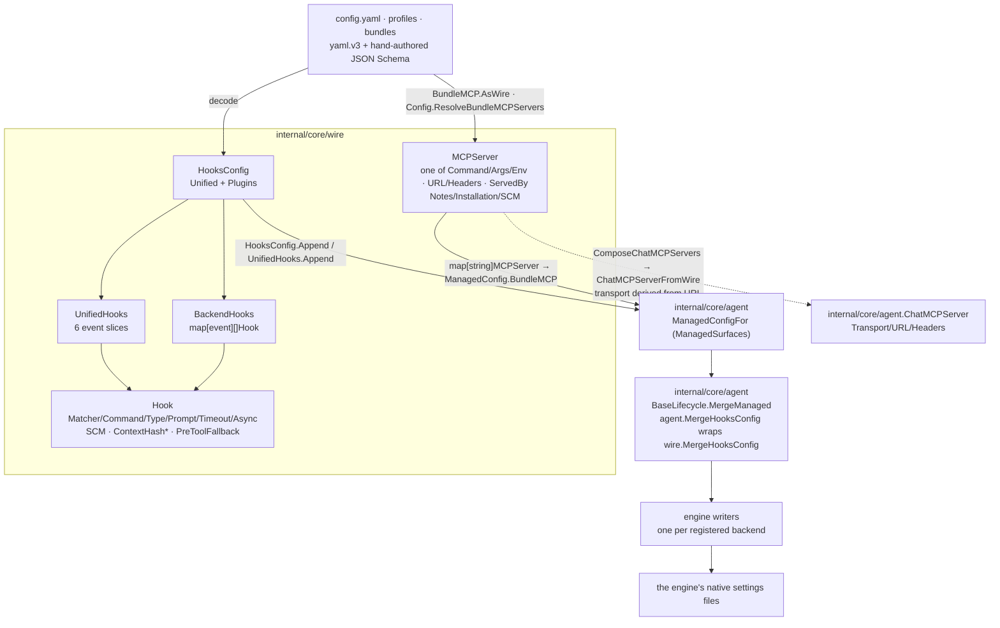

# Wire types — hooks and MCP

`internal/core/wire` is the engine-agnostic vocabulary for the two things ctxloom delivers into every backend — lifecycle hooks and MCP server registrations — plus the operations the assembly pipeline needs on them (hook merge and append, MCP server validation and cloning). It is a true leaf: zero internal imports.

The contract it owns: **these types are simultaneously the on-disk config shape, the gRPC payload shape, and the input shape for every engine's native settings writer.** A field added here has to be threaded through four hand-written translation layers that no compiler check binds together.

```mermaid
flowchart TD
    subgraph wire["internal/core/wire"]
        HC["HooksConfig<br/>Unified + Plugins"]
        UH["UnifiedHooks<br/>6 event slices"]
        BH["BackendHooks<br/>map[event][]Hook"]
        H["Hook<br/>Matcher/Command/Type/Prompt/Timeout/Async<br/>SCM · ContextHash* · PreToolFallback"]
        MS["MCPServer<br/>one of Command/Args/Env · URL/Headers · ServedBy<br/>Notes/Installation/SCM"]
        HC --> UH
        HC --> BH
        UH --> H
        BH --> H
    end

    YAML["config.yaml · profiles · bundles<br/>yaml.v3 + hand-authored JSON Schema"] -->|decode| HC
    YAML -->|"BundleMCP.AsWire · Config.ResolveBundleMCPServers"| MS
    HC -->|"HooksConfig.Append / UnifiedHooks.Append"| ASM["internal/core/agent<br/>ManagedConfigFor (ManagedSurfaces)"]
    MS -->|"map[string]MCPServer → ManagedConfig.BundleMCP"| ASM
    ASM --> LIFE["internal/core/agent<br/>BaseLifecycle.MergeManaged<br/>agent.MergeHooksConfig wraps wire.MergeHooksConfig"]
    LIFE --> WRITERS["engine writers<br/>one per registered backend"]
    WRITERS --> NATIVE["the engine's native settings files"]

    CHAT["internal/core/agent.ChatMCPServer<br/>Transport/URL/Headers"]
    MS -.->|"ComposeChatMCPServers → ChatMCPServerFromWire<br/>transport derived from URL"| CHAT

```

`*` `Hook.ContextHash` is in-process only (`yaml:"-" json:"-"`) and is deliberately re-derived agent-side by `agent.NewContextInjectionHooks` (`internal/core/agent/context_hooks.go:24-76`), so its non-serialization is compensated.

## `internal/core/wire` — types

### `Hook` — `internal/core/wire/hooks.go`

One lifecycle action (shell command, prompt, or agent invocation) plus the metadata each engine writer needs to place and re-identify it.

| Field | file:line | Serialized as | Read by |
|---|---|---|---|
| `Matcher string` | `hooks.go` | `matcher` | every engine writer |
| `Command string` | `hooks.go` | `command` | every engine writer |
| `Args []string` | `hooks.go` | `args` | exec form: claude's hook `args`; the mock spawns it with no shell. `Hook.Line()` renders Command+Args as one shell line, the hook's identity everywhere one string stands for it |
| `Type string` | `hooks.go` | `type` | every engine writer; free-form, `"command"`/`"prompt"`/`"agent"` by convention, no constant and no validation in this package |
| `Prompt string` | `hooks.go` | `prompt` | every engine writer |
| `Timeout int` | `hooks.go` | `timeout` | claude (`internal/engines/claude/claude.go:613`) |
| `Async bool` | `hooks.go` | `async` | claude only (`internal/engines/claude/claude.go:614`) |
| `SCM string` | `hooks.go` | `_ctxloom` | the remove-all-then-re-add reconciler (`internal/engines/claude/claude.go:567,834`) |
| `ContextHash string` | `hooks.go` | never (`yaml:"-" json:"-"`) | set by `agent.NewContextInjectionHooks`; no reader in the tree |
| `PreToolFallback bool` | `hooks.go` | `pre_tool_fallback` | no writer reads it: every registered engine has a session-start event (see the field's own doc) |

### `wire.UnifiedHooks`

The backend-agnostic seven-event bundle. All seven are `[]Hook` and are only ever touched as a group. The `file:line` column is gone from this table deliberately: every number in it was wrong, and a stale line misleads silently where a stale symbol name fails loud.

| Field | Serialized as (yaml and json alike) |
|---|---|
| `PreTool` | `pre_tool` |
| `PostTool` | `post_tool` |
| `SessionStart` | `session_start` |
| `SessionEnd` | `session_end` |
| `TurnEnd` | `turn_end` |
| `PreShell` | `pre_shell` |
| `PostFileEdit` | `post_file_edit` |
| `TurnStart` | `turn_start` |

`TurnEnd` and `TurnStart` are APPENDED to `bundles.hookEventOrder`, not slotted in beside their siblings: that slice is the enumeration order a bundle hook's trust identity is reported in, and reordering it would move every hook report against a baselined one (`TestBundleHooks_TrustIdentityIsStableUnderVocabularyGrowth` pins the baseline). A new event is wired at every site the reflective hook tests enumerate; those tests, not this table, are the checklist.

### `HooksConfig` — `internal/core/wire/hooks.go`

The persisted hook document.

| Field | file:line | Serialized as |
|---|---|---|
| `Unified UnifiedHooks` | `hooks.go` | `unified` |
| `Ext map[string]BackendHooks` | `hooks.go` | `ext` — engine name → native event → hooks; a document still spelling the retired `plugins` key is REFUSED at decode (`HooksConfig.UnmarshalYAML`, `ErrRetiredHooksExtKey`) rather than silently dropped |

### `BackendHooks` — `internal/core/wire/hooks.go`

Named map type, `map[string][]Hook`. Keys are engine-*native* event names (`"PreToolUse"` for Claude Code, `"beforeShellExecution"` for Cursor).

### `MCPServer` — `internal/core/wire/mcp.go`

One MCP server, as a bundle's `mcp:` block declares it and as it reaches an engine's settings. It is EXACTLY ONE of a stdio server (`Command`, with `Args`/`Env`), a network-hosted server (`URL`, with `Headers`), or a server served by the running session's endpoint (`ServedBy` = `ServedBySessionEndpoint`). `MCPServer.Validate` is the checked form of that rule (`ErrMCPServerNoTarget`, `ErrMCPServerTwoTargets`, `ErrMCPServerServedBy`, `ErrMCPServerURLScheme`). There is no stored transport field: the URL's scheme is the transport.

| Field | Serialized as | Notes |
|---|---|---|
| `Command string`, `Args []string`, `Env map[string]string` | `command`, `args`, `env` | the stdio target |
| `URL string`, `Headers map[string]string` | `url`, `headers` | the remote target; the scheme must be http or https |
| `ServedBy string` | `served_by` | only `ServedBySessionEndpoint`; carries nothing executable |
| `Notes string`, `Installation string` | `notes`, `installation` | human-facing, not sent to AI |
| `SCM string` | `_ctxloom` | ctxloom-managed marker |

## `internal/core/wire` — functions

| Function | file | Purpose |
|---|---|---|
| `(HooksConfig).HasAny() bool` | `hooks.go` | True if any hook is configured, unified or engine-specific. Not to be confused with `bundles.BundleHooks.HasAny` |
| `(*HooksConfig).Append` / `(*UnifiedHooks).Append` | `hooks.go` | Appends each per-event slice from `other` onto the receiver, skipping any hook the event already carries |
| `MergeHooksConfig(dest, src *HooksConfig) (dropped int)` | `merge.go` | Appends `src` into `dest` through `HooksConfig.Append`; a nil `dest` drops `src` and reports its size (`HooksConfig.Count`). `agent.MergeHooksConfig` wraps it to name the drop |
| `(MCPServer).Validate() error` | `mcp.go` | The one-of-three target rule above |

## Invariants and contracts

**Direction of flow**

- One way, always: `internal/core/config` + `internal/core/profiles` + `internal/core/bundles` parse user YAML into these structs → `agent.ManagedConfigFor` folds them into one `ManagedConfig` → the launch carries it to the runner → `internal/core/agent.BaseLifecycle` re-merges it agent-side → each engine package translates it into its native settings file.
- **The host-side assembly (`ApplyHooks`) and the agent-side assembly (run) must produce identical hooks**, or the remove-all-then-re-add reconcile drops them; this is documented at `internal/core/agent/base_lifecycle.go:26-38`.
- `Hook.SCM` (`_ctxloom`) is the key that reconcile identifies ctxloom-managed entries by. `MCPServer.SCM` is its MCP twin.

**Serialization**

- These types carry **no version field**. Schema evolution happens one layer out, in the document-level upgraders (`internal/core/config/upgrade.go`, `internal/core/bundles/upgrade.go`, `internal/core/profiles/upgrade.go`) plus the hand-authored JSON Schema.
- **Unknown YAML keys are not rejected here** — yaml.v3 without `KnownFields` ignores them silently. They are caught only by `additionalProperties: false` in `resources/schema/input/config-schema.json`, whose drift gate (`internal/core/config/arch_test.go`) covers **top-level keys only**. Round-tripping is total only for the fields the outer schema happens to know about.
- Schema asymmetry to know about: the `mcpServer` def is `additionalProperties: false` and does **not** list `_ctxloom`, while the `hook` def is `additionalProperties: true` (which is how the same marker is tolerated on hooks). No production writer currently persists an SCM-marked server, so this is latent.
- Tag sets are inconsistent: `Hook` and `MCPServer` carry `json` tags; `UnifiedHooks`, `HooksConfig`, and `BackendHooks` carry none, so a `json.Marshal` of any container would emit Go field names (`"PreTool"`) while its elements emit snake/marker names. No production code marshals the containers today.
- **Every persisted `wire.Hook` field must reach the engine**, and `PreToolFallback` is the one that shows why. It is part of the **signed** executable preimage, built host-side from the `wire.Hook` — so a field dropped between preimage and wire leaves every signature, hash and grant unchanged while the hook *delivered* to the engine differs from the bytes the grant covered. `internal/core/config/preimage_wire_parity_test.go` gates the preimage → wire half on surviving bytes.

**Merging**

- `UnifiedHooks.Append(UnifiedHooks{})` is a correct no-op; whether zero hooks is an error is decided by the caller (`ResolveBundleHooks`), not here.
- **The hooks merge primitive lives here.** `wire.HooksConfig.Append` owns the rule, unified half and plugin half alike, and dedups on the hook's whole executable content scoped to its event. `wire.MergeHooksConfig` applies it and returns the size of a dropped `src`; `agent.MergeHooksConfig` only names that drop. `TestMergeHooksConfig_UnifiedHalfMatchesWireAppend` binds the two.

**Shape limits**

- `agent.ChatMCPServerFromWire` is the one conversion from `MCPServer` to the chat/engine-file shape (`agent.ChatMCPServer`), and the one place a transport is DERIVED: a URL entry becomes an http-transport server carrying `URL` and `Headers`, a session-endpoint declaration an http server with no URL (rendered at delivery; a file writer refuses it unrendered, `ErrMCPServerUnrendered`), anything else a stdio command.
- `ChatMCPServerFromWire` passes `Env` and `Headers` through **without cloning**, so a composed `ChatMCPServer` shares its maps with the source `MCPServer`; a caller that mutates them writes into the resolved bundle set.
- Three of eight `Hook` fields are silently ignored by most consumers, and **no consumer declares which fields it honours**. Adding a unified event is not a one-line change: `turn_end`, the seventh, touched this type, `bundles.BundleHooks` plus its const/`hookEventOrder`/`eventHooks`/`(*reader).appendHook`, the proto `UnifiedHooks` message, the JSON Schema `unifiedHooks` def, `backends.HookEvents`/`unifiedEventHooks`/`setUnifiedEventHooks`/`gateProfileHooks`, `config.extractHooksFromBundle`/`filterMissingCompanionHooks`/`builtinBundleCompanionMissing`, `convert.hookEvents`, `profiles.Profile.HasContent`, `agent.countHooks`, and each engine writer's route table. NONE of those is a compile error if missed — every one of them is a silent drop, which is why each is now covered by a test that reflects over the struct rather than re-listing the events.
- `Hook`'s field set is connascent-by-algorithm with `bundles.BundleHook`, which hashes `Matcher+Type+Command+Prompt+PreToolFallback` as the signed preimage a trust grant binds to (`internal/core/bundles/bundles.go:632-641`), and with the proto `Hook` message. All three must gain a field together. **Two of the three legs are now enforced** — the parity sweep fails if `wire.Hook` gains a field the proto does not carry — but nothing binds the *preimage* leg, so a field added to `wire.Hook` and to the proto without being added to `ContentPayload` still passes CI.
