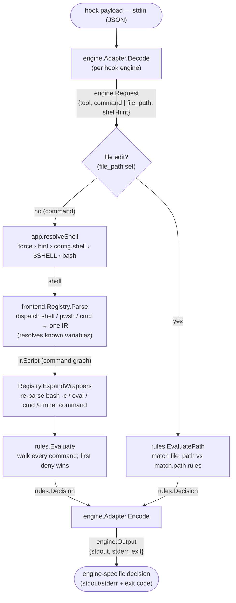

# Architecture

`llm-tool-killer` (`ltk`) is invoked as a **pre-tool hook** by an LLM coding
agent. It reads the proposed action on stdin — a **shell command** (Bash/
PowerShell tool) or a **file edit** (Edit/Write/MultiEdit/NotebookEdit tool) —
decides whether to allow or deny it, and—on a denial—hands the model a reason and
a suggested alternative so it can retry the right way (e.g. "don't run `go test`,
use `just test`", or "don't hand-edit `VERSION`").

The two paths share the engine and rule model but diverge at evaluation: a
command is parsed to an IR and matched against **command rules**; a file edit
carries a `file_path` and is matched against **`match.path` rules** (no shell
parsing). See the file-edit branch below the diagram.



**File-edit branch.** When `engine.Request.FilePath` is set (the agent invoked an
editing tool), `app.Decide` skips shell resolution and parsing entirely and calls
`rules.EvaluatePath`, which matches the path against the `match.path` rules (first
deny wins, same `mode`/`confirm`/`message`/`suggest` semantics as command rules).
The `@submodules` sentinel is resolved against `.gitmodules` (`internal/scm`) and
expanded to one directory pattern per submodule before evaluation, keeping the
`rules` package free of filesystem I/O. Path globbing is doublestar (`**`), tried
against basename, full path, and an implicit `**/` prefix so repo-relative
patterns match the absolute paths the tools pass — see [the rules reference](https://ctxloom.dev/ltk/rules/#matching-file-edits-matchpath).

Two interfaces carry all the variation:

- **`frontend.Frontend`** — one shell dialect → the IR. The rule engine and
  adapters never depend on a concrete parser.
- **`engine.Adapter`** — one hook protocol → `engine.Request`/`engine.Output`.
  The core never speaks a specific engine's wire format.

`engine.Output{Stdout, Stderr, ExitCode}` is deliberately general so that adding
an engine is *additive*: no existing signature changes.

## Shell resolution

The shell to parse with is *resolved*, not sniffed from command text. The LLM
picks a **tool**, and the tool largely determines the shell. Precedence:

1. `--shell` flag — operator force / escape hatch.
2. Adapter hint — a per-call, tool-derived shell (authoritative when present).
3. `defaults.shell` in the YAML — explicit operator config.
4. `$SHELL` — the user's login shell (Claude Code's Bash tool runs in it).
5. `bash` — final fallback.

Content sniffing is intentionally **not** used: `$(...)` and `${...}` are
ambiguous between bash and PowerShell, so guessing from text is unreliable.

## Rules

Rules are matched against the IR, never against raw text. The matching model —
program/positional/option args and its cross-shell portability — is
documented in [the rules reference](https://ctxloom.dev/ltk/rules/).

## Understanding (catching trivial workarounds)

Rather than block "scary" constructs, the pipeline *understands* them before
matching:

- **Variable resolution** (shell frontend, `mvdan.cc/sh/v3/expand`): words are
  expanded against the process environment (the hook inherits the callee's env)
  plus assignments seen earlier in the script, so `t=test; go $t` resolves to
  `go test`. Command/process substitutions are captured as nested scripts (so
  their commands are still matched) but never executed; unknown values expand to
  empty and are not matched.
- **Wrapper re-parsing** (`Registry.ExpandWrappers`): the inner command of a
  trivial wrapper — `bash -c "…"`, `eval "…"`, `cmd /c "…"`, `pwsh -Command "…"` —
  is re-parsed (by the inner shell, via the registry) into `Nested`, so a denied
  command can't be smuggled through it. Bounded recursion handles nested wrappers.

> Scope is **cooperative** ("LLM wrangling"), not a security boundary. If an agent
> is told to evade a rule it can re-implement, recompile-and-rename, or symlink
> the tool — see the README. Deeper intent-based detection is aspirational. For
> hard isolation, run the agent in a sandbox/container.

### Gated tools: an unrecognized tool is denied, not allowed

Each engine adapter carries one hand-maintained list (`claudeGatedTools`)
that is the single source of truth for **both**
directions: it derives the installed `PreToolUse` matcher (a regex, engine
protocol permitting) *and* the runtime check `engine.Request.ToolUngated` that
`Decode` uses to recognise a payload's fields. Two hand-maintained lists over a
vendor-owned, mutating tool set would drift out of sync silently; one list
can't.

But one list over a vendor-owned tool set can still go *stale* — the vendor
ships or renames a tool the list doesn't know, and the installed matcher fires
on it anyway while `Decode` doesn't recognise the exact name. An engine whose
matcher is an unconditional, unanchored regex fires on a tool whose name merely
*contains* a gated one — a hypothetical `safe_run_command` alongside
`run_command`.
**Claude Code is narrower today, but not immune:** its matcher takes the
unanchored-regex path only when it contains an actual regex metacharacter;
one built purely from plain identifiers and `|` (what `claudeMatcher` always
is right now) is instead matched as an *exact* name list (verified,
[code.claude.com/docs/en/hooks](https://code.claude.com/docs/en/hooks),
"Matcher patterns" — the `SmartEdit`-shaped bypass below is demonstrated by
invoking `ltk evaluate` directly, not by a substring collision Claude Code's
current matcher would actually produce). It stops being narrow the moment
someone hand-edits `settings.json` to widen the matcher (`.*`, a stray `+`,
…), or a future gated tool name isn't a plain identifier — both put Claude
Code on that unanchored-regex path. Either way, once
the installed matcher fires on a name `Decode` doesn't recognise, that's
`ToolUngated`.

Everywhere else in ltk, an unresolvable command *allows* (the rules reference's fail-open
default). `ToolUngated` is the one deliberate exception: `cmd/ltk/evaluate.go`
denies it instead, because the alternative isn't "a slightly weaker guard" —
it's a tool the operator explicitly told ltk to watch (it's in the installed
matcher) silently evaluating as though no rule existed at all. The deny names
the tool and points at the fix: add it to the engine's gated tools and re-run
`ltk manage install`. A tool that never matches the installed matcher (`Read`,
`Grep`, `WebSearch`, …) never invokes `evaluate` in the first place, so it
never reaches this check and stays fail-open as always — the exception's blast
radius is exactly the tools ltk was already told to gate.

---

# Engine compatibility

The implemented engines are the `engine.Engine` values `engine.All` returns.
Each target engine must expose a deny-capable pre-execution hook that runs an
external program reading JSON on stdin and returning a decision. The
differences each engine adapter absorbs:

| Engine | Hook event | Shell signal | Deny mechanism |
|---|---|---|---|
| **Claude Code** | `PreToolUse` | `tool_name`: `Bash` → user's `$SHELL`; `PowerShell` → pwsh | JSON `permissionDecision: deny` on **stdout**, exit **0** |

### How another engine slots in (no rework needed)

- **Adapter only.** A new `engine.Engine` (`Decode`/`Encode`) registered in
  `engine.All`; `manage` and `evaluate` already dispatch polymorphically. The
  `Output{Stdout,Stderr,ExitCode}` shape already expresses a stdout/exit-0
  deny path.
- **Shell hint, not `$SHELL`.** An engine that forces a fixed shell has its
  adapter emit a **strong hint** for that shell (precedence step 2), which
  bypasses the `$SHELL` detection that Claude's Bash tool relies on.
  `internal/shellenv` is shared for any `$SHELL` parsing it does need.
- **No frontend work** for an engine whose commands are still POSIX-shell:
  they reuse the existing frontends.

### Verified Claude Code PreToolUse contract (May 2026)

- **Input (stdin):** `{ session_id, transcript_path, cwd, permission_mode,
  hook_event_name: "PreToolUse", tool_name, tool_input }`. For `Bash`,
  `tool_input` is just `{ "command": "..." }` — no shell field, no description.
- **Deny:** stdout
  `{"hookSpecificOutput":{"hookEventName":"PreToolUse","permissionDecision":"deny","permissionDecisionReason":"…"}}`
  with exit `0`. The reason is fed back to the model.
- **Allow / pass-through:** emit nothing, exit `0`. (`permissionDecision:"allow"`
  would *skip the prompt* but not bypass deny rules — we don't use it.)
- **Registration (`settings.json`):**
  ```json
  {
    "hooks": {
      "PreToolUse": [
        { "matcher": "Bash",
          "hooks": [ { "type": "command",
                       "command": "${CLAUDE_PROJECT_DIR}/bin/ltk evaluate --config ${CLAUDE_PROJECT_DIR}/.ltk.yaml" } ] }
      ]
    }
  }
  ```
  Matchers are literal tool names with `|` alternation (e.g. `Bash|PowerShell`),
  not a general regex. `$CLAUDE_PROJECT_DIR` is available to the command.

---

# Design rationale: is there a standard we should be using instead?

Verdict, recorded here so it isn't re-litigated: **no.** ltk's matcher — argv
prefix + tree-sitter/mvdan-sh unwrap of trivial wrappers + env-prefix/variable
resolution — is the right shape for its job, and no existing standard covers
"match a parsed shell command line with allow/deny." [OpenAI Codex
independently converged on the identical
architecture](https://github.com/openai/codex) (argv-prefix matching, shell
unwrap, env-prefix handling) for the same problem, which is corroborating
evidence, not a coincidence to explain away — two independent implementations
converging on the same shape for the same problem is what "the right shape"
looks like in practice.

Two categories of existing technology were considered and rejected, for
different reasons:

- **Policy languages — OPA/Rego, Cedar, CEL.** These are general-purpose
  authorization engines: given a set of structured facts (a request, a
  principal, a resource), they evaluate a policy over those facts and return
  allow/deny. They do not *produce* the facts. None of them parse a shell
  command line, resolve `$VAR`, unwrap `bash -c`, or classify a token as a
  POSIX operand vs. an option — that parsing and classification (the actual
  hard part of this problem, see "Matching commands" in
  [the rules reference](https://ctxloom.dev/ltk/rules/#matching-commands)) is exactly what ltk's frontend +
  matcher do, and no policy engine does it for you. Adopting one would mean
  building the same shell-parsing pipeline ltk already has, then handing its
  output to a second engine to re-express the same allow/deny logic in a
  different syntax — pure overhead, no capability gained.
- **LSMs — AppArmor, SELinux, seccomp, Landlock.** These are kernel-level
  mandatory access controls. They match **binaries** (by path or hash),
  **filesystem paths**, and **syscalls** — never `argv`. A seccomp filter can
  say "this process may call `unlink()`" but has no notion of "this process may
  run `git clean` but not `git clean -fdx`" — argv is userspace-interpreted
  text the kernel enforcement layer never inspects as a value; from the
  kernel's perspective `/usr/bin/git clean` and `/usr/bin/git status` are the
  same binary making the same syscalls with different opaque bytes on the
  stack. LSMs are also the *correct* tool for what they do (hard, kernel-
  enforced isolation — the "run it in a sandbox/container" ltk itself points
  to for that need), so this isn't "LSMs are worse," it's "LSMs solve a
  different problem one layer down, and ltk's problem is a layer up."

# Not yet built

- More `match` operators.

Done: POSIX-shell frontend, real **pwsh** frontend (native parser), **cmd**
frontend (hand-written lexer), rule engine, Claude Code engine (`evaluate` +
`manage install`/`uninstall`), **file-edit
(`match.path`) rules** — full-glob (doublestar `**`) matching, directory
subtrees (`vendor/`), and the `@submodules` sentinel that blocks edits inside
every git submodule, with the shipped defaults guarding `.gitmodules` and
submodule contents.

The shape of the whole system is one idea: every shell dialect lowers into one
IR, and everything downstream — understanding, rule matching, engine I/O —
speaks only that IR. Adding a shell or an engine is additive, never a rewrite.
If you remember one thing, remember that seam.
