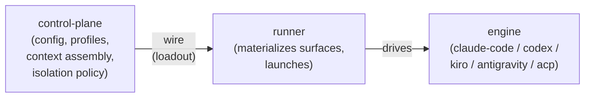
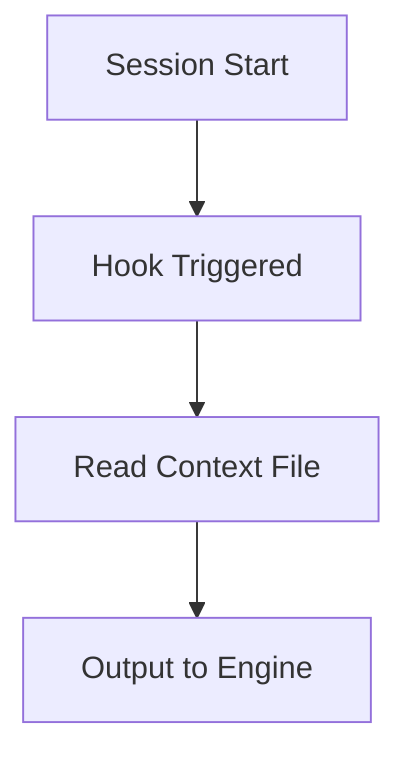
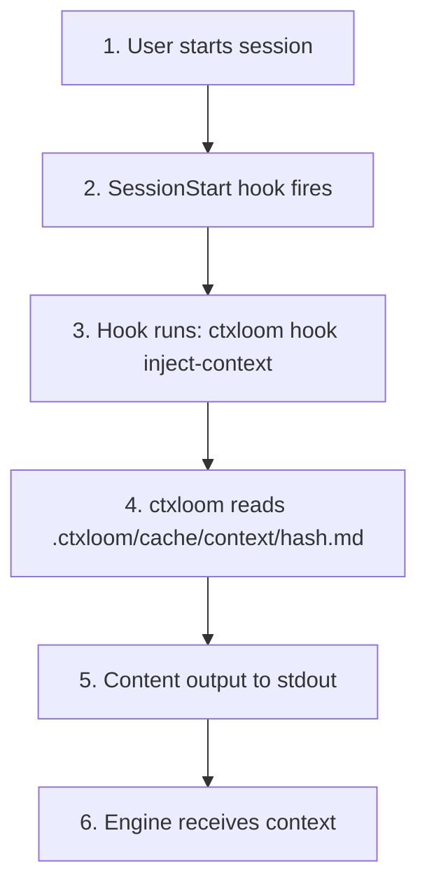
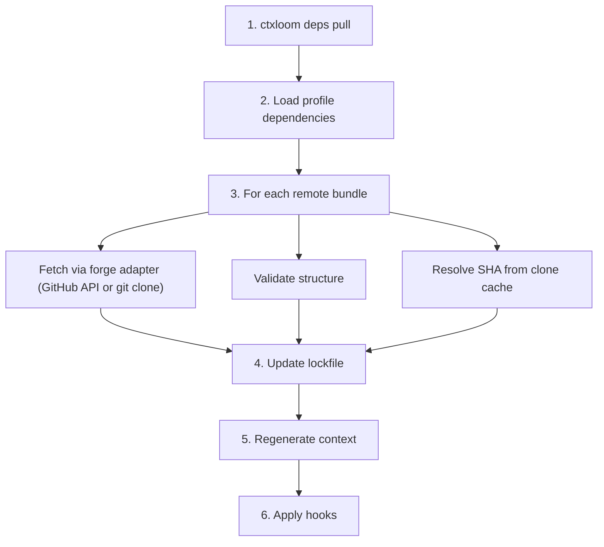
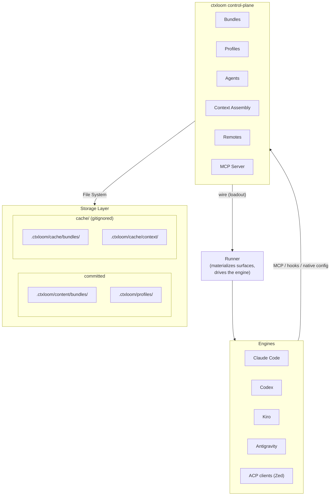

Every AI coding tool wants its own copy of your standards, and every fresh session starts blank. You paste the same conventions into Claude Code, then into Codex, then retype them again next week once the context window fills up and you clear it. Nothing ties those copies together, so they drift.

ctxloom replaces the copies with one layered system: author context once, and bundles, profiles, hooks, and the MCP server all read from the same assembled source, so every engine and every session sees the same rules without you re-entering them.

## Vocabulary

This page uses the project's canonical launch-architecture terms (defined in
`GLOSSARY.md` at the repo root). The ones you need here:

| term | meaning |
|---|---|
| **engine** | The thing ctxloom drives to produce agent behavior — Claude Code, Codex, Kiro, Antigravity, or any ACP-speaking client. Not "backend", not "AI tool". |
| **agent** | A ctxloom actor: a profile in action. The primary you launch with `run --agent`, and each delegated worker it spawns. |
| **engine agent** | The engine's *own* internal subagent (claude's `--agent`, ACP's `agent` field). Always qualified — bare "agent" never means this. |
| **session** | One launched ctxloom run, harp-named. Hosts the primary agent and its delegated agents. |
| **surface** | One managed deliverable: **context**, **MCP**, **hooks**, **commands**, or **settings**. |
| **loadout** | The composed set of all five surfaces for a session — what gets handed to the runner. |
| **control-plane** / **wire** / **runner** | Everything before the handoff / the transport / everything after it. See below. |

## The launch pipeline

A run travels a fixed path. The **control-plane** turns your configuration into a
loadout; the **wire** carries it; the **runner** materializes each surface into
the session's own isolated workspace and drives the **engine**.



The wire is network-agnostic: it carries **data**, not file handles, so nothing
on one side reaches across to touch the other side's filesystem. That is what
lets a runner live in a container — or, later, on another machine — without the
control-plane knowing or caring.

The loadout it carries is always the same five surfaces:

- **context** — the model-facing instructions (assembled fragments)
- **MCP** — the MCP servers the engine should connect to
- **hooks** — the lifecycle hooks to register
- **commands** — slash-command exports
- **settings** — engine-native settings

Each engine materializes those five into whatever native files it actually reads.
See [Delivery per engine](#delivery-per-engine).

## Core Components

### Bundles

**Purpose:** Package related fragments, commands, MCP server configs, profiles, and hooks.

**Structure:**
```yaml
version: "1.0"
fragments:
  name:
    content: "..."
    tags: [...]
commands:
  name:
    content: "..."
mcp:
  server-name:
    command: "..."
profiles:
  name:
    bundles: [...]
hooks:
  session_start:
    - command: "..."
```

**Key behaviors:**
- Versioned for dependency management
- Support distillation for token efficiency
- Fragment tags enable flexible selection (see `select_tags` below)

### Profiles

**Purpose:** Named configurations that assemble bundles and fragments. A profile
is an agent's *definition*; an agent is a profile in action.

**Structure:**
```yaml
description: "..."
llm: sonnet                       # preferred config label (overridable by -l)
parents: [profile1, profile2]     # inheritance
bundles: [bundle1, bundle2]       # whole bundles
bundle_items:                     # cherry-picked items
  - remote/bundle:fragments/name
fragments:                        # direct fragment refs
  - name: some-fragment
select_tags: [go, testing]        # fragment tags that SELECT content
tags: [team, backend]             # descriptive only — for listing/discovery
prompts: ["bundle#prompts/name"]  # curated slash-command exports
variables:
  key: value
mcp: {}                           # MCP servers (inherited)
hooks: {}                         # hooks (inherited)
exclude_fragments: []             # filters applied after inheritance
```

The distinction that trips people up: **`tags` selects nothing.** It is
descriptive metadata for listing and discovery. The key that pulls fragments into
your context is **`select_tags`**.

**Key behaviors:**
- Inheritance through `parents`
- Merge bundles and select_tags from all ancestors
- Exclusions apply after inheritance resolves
- The default context is the **default agent**'s composed profile list
  (`default_agent` → `agents.<name>.profiles` in config.yaml); all entries load
  together

### Agents

**Purpose:** Bind a profile set to an engine and a runtime, so "who is working"
and "what they know" are one selectable thing.

An agent names the profiles it composes, the engine that runs it, and its
isolation/permissions. `ctxloom run --agent <name>` launches one as the session's
primary; `ctxloom agent default` shows which one supplies the default context.
Local agent definitions live under the `agents:` key of `.ctxloom/config.yaml`.

Agents are also the unit of **delegation**: a primary agent can spawn child
agents as full child sessions — each with its own composed profiles, engine, and
isolation — and exchange messages with them. That surface is exposed over MCP
(see below). See [Agent Delegation](/concepts/agent-delegation/) for how a
child's grant is resolved and journaled.

### Context Assembly

**Purpose:** Combine fragments from profiles into injectable context.

**Process:**
1. Start from the default agent's composed profile list (or the agent named by `--agent`)
2. Resolve each profile's parent inheritance chain
3. Collect all referenced bundles and cherry-picked bundle items
4. Gather fragments whose tags match the profiles' `select_tags`
5. Apply exclusions
6. Deduplicate by content hash
7. Write to the context cache

**Output:** Single markdown file in `.ctxloom/cache/context/<hash>.md`

### Remotes

**Purpose:** Share bundles across teams and projects via Git repositories.

**Components:**
- **Registry:** Tracks configured remotes in `.ctxloom/remotes.yaml`
- **Fetcher:** A GitHub REST adapter, plus a generic `git` adapter (clone + local read) for every other host — GitLab, Gitea, self-hosted
- **Discovery:** Search GitHub for ctxloom repositories

### Hooks

**Purpose:** Inject context into engine sessions automatically.

**Flow:**


The context file is a persistent, content-addressed cache entry — the hook reads
it and leaves it in place. That is deliberate: several hooks may read the same
file (chunked injection), and a later session with the same content reuses it.

### MCP Server

**Purpose:** Expose ctxloom's retrieval and delegation surfaces to engines via
Model Context Protocol.

**Retrieval tools:**
- `assemble_context` — assemble context from profiles, fragments, or tags
- `search_content` / `search_library` — search installed and remote content
- Session memory: `compact_session`, `load_session`, `recover_session`, `get_previous_session`

**Delegation tools** (agent-to-agent, on the same server):
- `agent_run` — launch a configured ctxloom agent as a child session
- `agent_send` / `agent_recv` — the message bus between coordinator and children
- `agent_stop` — stop a child session
- `roster` — list live agents
- `agent_report` — file a structured report
- `agent_fetch_artifact` — retrieve a child's artifact

**Resources:** listings are exposed as MCP resources rather than tools —
`ctxloom://fragments`, `ctxloom://profiles`, `ctxloom://commands`,
`ctxloom://remotes`, `ctxloom://mcp-servers`, `ctxloom://sessions`, and
`ctxloom://help`.

There are no management tools: creating or editing bundles, profiles, and
remotes is done with the ctxloom CLI.

## Data Flow

### Context Injection Flow



### Remote Pull Flow



## Directory Structure

### Project Level (`.ctxloom/`)

```
.ctxloom/                     # committed:
├── config.yaml          # Project configuration
├── remotes.yaml         # Remote registry
├── lock.yaml            # Dependency lockfile
├── allowed_signers      # Trusted signing keys (OpenSSH allowed-signers format)
├── content/             # The project's own authored, published content
│   └── bundles/         # Authored bundles (ctxloom:local refs resolve here;
│       └── local-bundle.yaml  # what `bundle create` writes and `sign --all` signs)
├── profiles/            # Profile definitions
│   └── default.yaml
├── agents/              # Local agent definitions (engine + profiles + runtime)
│   └── <name>.yaml
├── approvals/           # Committable countersignatures (review decisions)
│
│                              # gitignored:
├── project-id           # Stable project identity (keys the task log)
├── sessions/            # Distilled project sessions
└── cache/               # Regeneratable, safe to delete
    ├── bundles/         # Remote-pulled bundle artifacts only, NOT authored content
    ├── context/         # Generated context files
    │   └── <hash>.md
    ├── repos/           # Clone cache for remote repositories
    ├── trust/           # Approved-content snapshot objects
    └── vendor/          # Vendored assets
```

Everything above the blank line is committed — it's the project's own
content, config, and trust state. Everything below is gitignored: fetched
remote clones, assembled context, trust snapshots, vendor, plus session and
identity state — all regenerable or purely local, never hand-authored, safe
to delete.

Trust is not a file of grants you edit — it is a store of **signatures**.
Approving a bundle writes a countersignature into `approvals/`; a key you trust
is listed in `allowed_signers`. The signature *is* the approval, so no plain-file
write can forge one.

### User Level (`~/.ctxloom/`)

```
~/.ctxloom/
├── config.yaml          # User defaults
├── content/
│   └── bundles/         # User-wide authored bundles
├── cache/
│   └── bundles/         # Remote-pulled bundle artifacts only
├── sessions/            # Session index and per-harp session state
│   ├── index.yaml
│   └── <harp>/essence.md
├── projects/            # project-id → project path registry
│   └── index.yaml
├── tasks/               # Per-project task logs (<project-id>.jsonl)
├── approvals/           # Personal countersignatures ("my approvals follow me")
├── allowed_signers      # Personal trust root
└── remotes.yaml         # User-wide remotes
```

## Configuration Resolution

There is **no merge chain**. ctxloom resolves exactly one config file and loads
it:

1. `$CTXLOOM_ROOT/.ctxloom`, if set
2. Otherwise, the nearest project `.ctxloom` found by walking up from the working directory
3. Otherwise, `~/.ctxloom` as a fallback

**First found wins.** A project config *replaces* the user config; it does not
layer on top of it. There is no environment-variable layer.

The one overlay is a narrow one: the shipped default config fills **LLM-role
gaps only**, so an empty config still resolves a primary and a fast model. Your
keys always win — a default is added only where you set nothing.

## Delivery per engine

Each engine reads different native files. The runner materializes the loadout's
five surfaces into whatever the target actually looks at.

### Claude Code

| surface | delivered as |
|---|---|
| context | `CLAUDE.md` (or `--append-system-prompt-file`) |
| MCP | `.mcp.json` at the project root (or `--mcp-config`) |
| hooks + settings | `.claude/settings.json` (hooks live inside settings) |
| commands | `.claude/commands/` |

Note that MCP registration goes to **`.mcp.json`**, not to `.claude/settings.json`.
Only hooks and settings live there.

### Antigravity

| surface | delivered as |
|---|---|
| context | ctxloom-managed section in `.agents/AGENTS.md` |
| MCP | `.agents/mcp_config.json` (managed entries tracked in `.agents/.ctxloom-mcp-managed`) |
| hooks | `.agents/hooks.json` → `hooks.PreToolUse` (agy has no SessionStart event) |

### Codex

| surface | delivered as |
|---|---|
| hooks + MCP + settings | `.codex/config.toml` (one atomic writer) |
| context | injected by the SessionStart hook declared in `config.toml` |
| commands | `$CODEX_HOME/prompts` (with `CODEX_HOME` scoped to the session's cell) |

### Kiro

| surface | delivered as |
|---|---|
| engine agent + hooks | `.kiro/agents/ctxloom.json` |
| MCP | `.kiro/settings/mcp.json` |
| context | `.kiro/steering/` |
| commands | `.kiro/skills/<name>/SKILL.md` |

### ACP (generic)

:::caution[Experimental]
Experimental — interfaces may change and it is not yet verified against all editors.
:::

`ctxloom acp` speaks the Agent Client Protocol, and an `acp` engine drives any
ACP-capable client chosen by config (`claude-code-acp`, `kiro-cli acp`, a Zed
external agent). A *generic* ACP target has no known native config format, so it
deliberately registers no settings writer and no command exports — context still
reaches the run in-band.

:::caution[Experimental engines]
The `kiro`, `codex`, and `antigravity` engines are **experimental**: implemented and
hermetically tested, but live operation is not fully verified. `kiro` in particular
cannot run under container isolation with a subscription login — its credential
lives in a sqlite store (`~/.local/share/kiro-cli/data.sqlite3`) that can't be
mounted into a container, so a containerized kiro run needs `KIRO_API_KEY` (headless
auth). `antigravity` has the same shape with its credential in the OS keyring. Use
these engines knowing the live path may have gaps; `claude-code` is the exercised
default.
:::

## Extension Points

### Custom Engines

An engine is driven through the `Backend` contract
(`internal/shared/agent/backend.go`):

```go
type Backend interface {
    // Identity
    Name() string
    Version() string
    SupportedModes() []ExecutionMode

    // History exposes conversation history (transcripts) and /clear recovery.
    History() SessionHistory

    // Execution lifecycle
    Setup(ctx context.Context, req *SetupRequest) error
    Execute(ctx context.Context, req *ExecuteRequest, stdout, stderr io.Writer) (*ExecuteResult, error)
    Cleanup(ctx context.Context) error
}
```

It deliberately carries no hook/command/context/MCP accessors: those are an
engine's internal setup wiring, not something the runner calls. Surfaces are
delivered through a separate per-engine surface set, registered alongside the
backend in the engine registry.

### Custom Fetchers

Remote fetchers implement (`internal/remote/fetcher.go`):

```go
type Fetcher interface {
    FetchFile(ctx context.Context, owner, repo, path, ref string) ([]byte, error)
    ListDir(ctx context.Context, owner, repo, path, ref string) ([]DirEntry, error)
    ResolveRef(ctx context.Context, owner, repo, ref string) (string, error)
    SearchRepos(ctx context.Context, query string, limit int) ([]RepoInfo, error)
    ValidateRepo(ctx context.Context, owner, repo string) (bool, error)
    GetDefaultBranch(ctx context.Context, owner, repo string) (string, error)
    Forge() ForgeType
}
```

## Design Principles

### Fail Loudly

ctxloom does not quietly launch you into a broken session. Startup **aborts** by
default when it finds a fatal problem:

```
ctxloom: aborting startup: 2 fatal finding(s); fix them, or rerun with
--degraded (env CTXLOOM_DEGRADED=1) to launch anyway
```

Fatal findings are: a broken config, unresolvable profiles or bundles, and failed
hook applies. The reasoning is that a silently-degraded session is worse than no
session — you would be working with an engine that is missing the very standards
you configured, and you would not know.

`--degraded` (or `CTXLOOM_DEGRADED=1`) is the escape hatch: it downgrades those
fatal findings to warnings and launches anyway.

### Content Addressable

Context files use content-based hashing:

- Same content → same hash → same filename
- Changed content → new hash → new file
- Enables caching and deduplication

### Separation of Concerns

- **Bundles:** Content packaging
- **Profiles:** Definition/selection
- **Agents:** Profiles bound to an engine and a runtime
- **Remotes:** Distribution
- **Loadout surfaces:** Delivery
- **MCP:** Retrieval and delegation interface

Each layer has a single responsibility.

### Minimal Dependencies

ctxloom aims to work with minimal external dependencies:

- No database required
- File-based storage
- Standard Git hosting (no custom server)
- Works offline with cached content

## System Diagram


