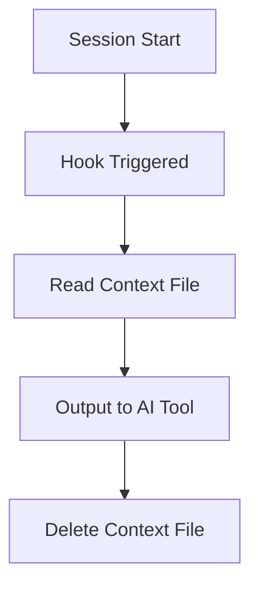
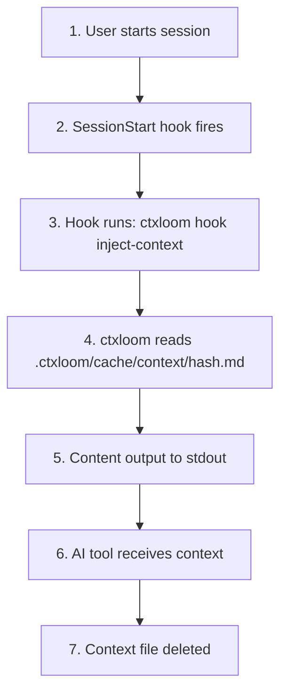
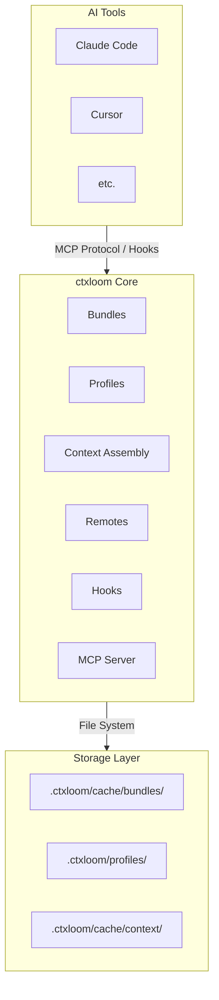

Every AI coding tool wants its own copy of your standards, and every fresh session starts blank. You paste the same conventions into Claude Code, then into Cursor, then retype them again next week once the context window fills up and you clear it. Nothing ties those copies together, so they drift.

ctxloom replaces the copies with one layered system: author context once, and bundles, profiles, hooks, and the MCP server all read from the same assembled source, so every tool and every session sees the same rules without you re-entering them.

## Overview

ctxloom (Context Loom) manages that context through a small set of cooperating layers — bundles package content, profiles select it, context assembly renders it, and hooks/MCP deliver it to whichever AI tool is running. A full diagram of how these pieces connect is at the [end of this page](#system-diagram).

## Core Components

### Bundles

**Purpose:** Package related fragments, skills, MCP server configs, profiles, and hooks.

**Structure:**
```yaml
version: "1.0"
fragments:
  name:
    content: "..."
    tags: [...]
skills:
  name:
    content: "..."
mcp:
  server-name:
    command: "..."
profiles:
  name:
    bundles: [...]
hooks:
  session_start:
    - command: "..."
```

**Key behaviors:**
- Versioned for dependency management
- Support distillation for token efficiency
- Tags enable flexible selection

### Profiles

**Purpose:** Named configurations that assemble bundles and fragments.

**Structure:**
```yaml
description: "..."
parents: [profile1, profile2]
bundles: [bundle1, bundle2]
tags: [tag1, tag2]
```

**Key behaviors:**
- Inheritance through parents
- Merge bundles and tags from all ancestors
- The default context is the **default agent**'s composed profile list (`default_agent` → `agents.<name>.profiles` in config.yaml); all entries load together

### Context Assembly

**Purpose:** Combine fragments from profiles into injectable context.

**Process:**
1. Load default profile
2. Resolve parent inheritance chain
3. Collect all referenced bundles
4. Gather fragments matching tags
5. Deduplicate by content hash
6. Write to context file

**Output:** Single markdown file in `.ctxloom/cache/context/<hash>.md`

### Remotes

**Purpose:** Share bundles across teams and projects via Git repositories.

**Components:**
- **Registry:** Tracks configured remotes in `.ctxloom/remotes.yaml`
- **Fetcher:** A GitHub REST adapter, plus a generic `git` adapter (clone + local read) for every other host — GitLab, Gitea, self-hosted
- **Discovery:** Search GitHub for ctxloom repositories

### Hooks

**Purpose:** Inject context into AI tool sessions automatically.

**Flow:**


### MCP Server

**Purpose:** Expose ctxloom's retrieval surface to AI tools via Model Context Protocol.

**Tools:**
- `assemble_context` — assemble context from profiles, fragments, or tags
- `search_content` / `search_library` — search installed and remote content
- Session memory: `compact_session`, `load_session`, `recover_session`, `get_previous_session`

**Resources:** listings are exposed as MCP resources rather than tools —
`ctxloom://fragments`, `ctxloom://profiles`, `ctxloom://skills`,
`ctxloom://remotes`, `ctxloom://mcp-servers`, `ctxloom://sessions`, and
`ctxloom://help`.

There are no management tools: creating or editing bundles, profiles, and
remotes is done with the ctxloom CLI.

## Data Flow

### Context Injection Flow



### Remote Pull Flow


## Directory Structure

### Project Level (`.ctxloom/`)

```
.ctxloom/
├── config.yaml          # Project configuration
├── cache/               # Regeneratable content (safe to delete)
│   ├── bundles/         # Local bundles
│   │   └── local-bundle.yaml
│   ├── context/         # Generated context files
│   │   └── <hash>.md
│   └── repos/           # Clone cache for remote repositories
├── local/               # Committed project-authored content
│   └── bundles/         # (referenced via ctxloom:local)
├── profiles/            # Profile definitions
│   └── default.yaml
├── agents/              # Local agent bindings (engine <-> profiles)
│   └── <name>.yaml
├── sessions/            # Distilled project sessions
├── remotes.yaml         # Remote registry
├── trust.yaml           # Per-item trust grants and blacklists
└── lock.yaml            # Dependency lockfile
```

### User Level (`~/.ctxloom/`)

```
~/.ctxloom/
├── config.yaml          # User defaults
├── cache/
│   └── bundles/         # User-wide bundles
├── sessions/            # Session index and per-harp session state
│   ├── index.yaml
│   └── <harp>/essence.md
├── tasks/               # Per-project task logs
└── remotes.yaml         # User-wide remotes
```

## Configuration Hierarchy

Settings are merged from multiple sources (later overrides earlier):

1. **Built-in defaults**
2. **User config** (`~/.ctxloom/config.yaml`)
3. **Project config** (`.ctxloom/config.yaml`)
4. **Environment variables**
5. **Command-line flags**

## Integration Points

### Claude Code

- **Hooks:** `.claude/settings.json` → `hooks.SessionStart`
- **MCP:** `.claude/settings.json` → `mcpServers.ctxloom`

### Antigravity

- **Hooks:** `.agents/hooks.json` → `hooks.PreToolUse` (agy has no SessionStart event)
- **Context:** ctxloom-managed section in `.agents/AGENTS.md` (read by agy at session start)
- **MCP:** `.agents/mcp_config.json` → `mcpServers.ctxloom` (managed entries tracked in `.agents/.ctxloom-mcp-managed`)

## Extension Points

### Custom Backends

The backend system is extensible:

```go
type Backend interface {
    Name() string
    WriteSettings(config) error
    ReadSettings() (config, error)
}
```

### Custom Fetchers

Remote fetchers implement:

```go
type Fetcher interface {
    FetchFile(ctx context.Context, owner, repo, path, ref string) ([]byte, error)
    ListDir(ctx context.Context, owner, repo, path, ref string) ([]DirEntry, error)
    SearchRepos(ctx context.Context, query string, limit int) ([]RepoInfo, error)
    ValidateRepo(ctx context.Context, owner, repo string) (bool, error)
}
```

## Design Principles

### Fault Tolerance

ctxloom prioritizes availability over strict correctness:

- Missing remotes → warning, continue
- Invalid bundles → skip, continue
- Hook failures → log, continue
- Network errors → use cached, continue

The user should always end up in their AI tool, even if some features degrade.

### Content Addressable

Context files use content-based hashing:

- Same content → same hash → same filename
- Changed content → new hash → new file
- Enables caching and deduplication

### Separation of Concerns

- **Bundles:** Content packaging
- **Profiles:** Configuration/selection
- **Remotes:** Distribution
- **Hooks:** Integration
- **MCP:** AI tool interface

Each layer has a single responsibility.

### Minimal Dependencies

ctxloom aims to work with minimal external dependencies:

- No database required
- File-based storage
- Standard Git hosting (no custom server)
- Works offline with cached content

## System Diagram


