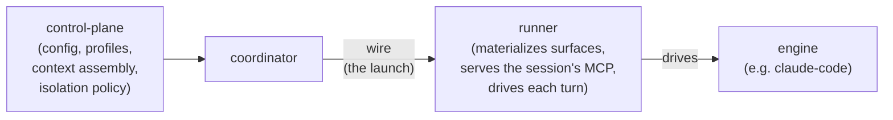
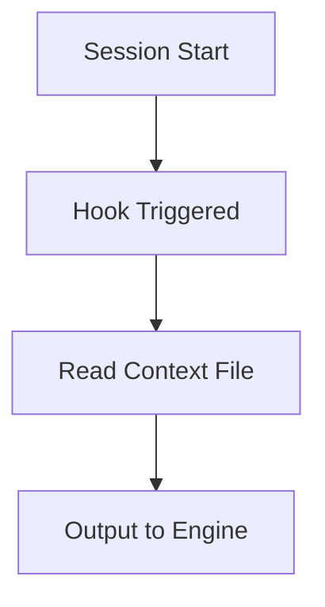
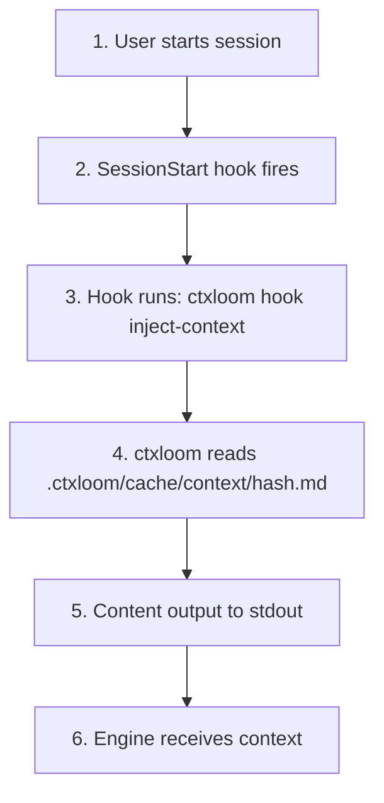
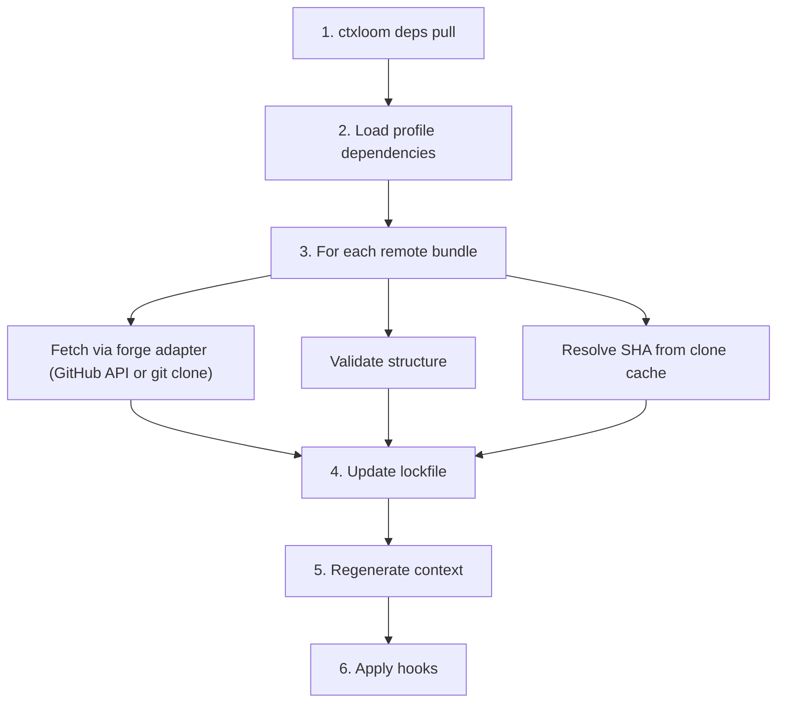
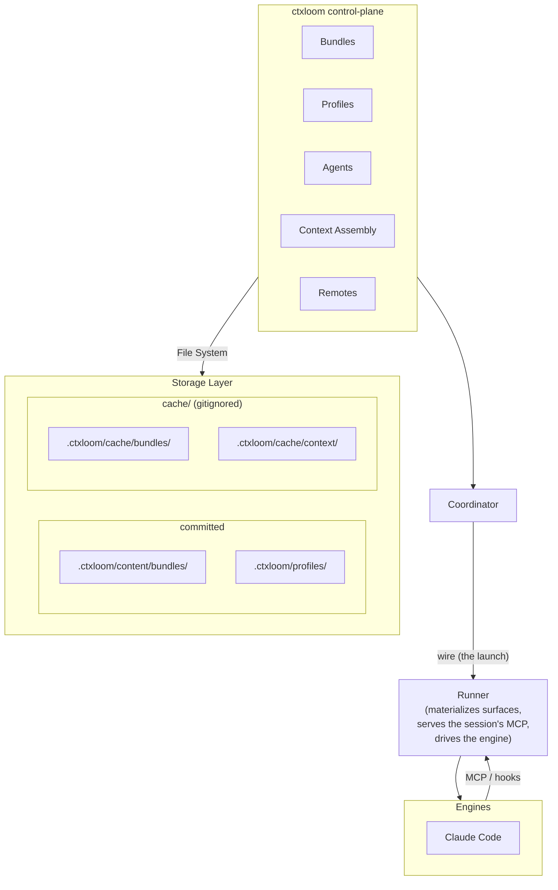

Every AI coding tool wants its own copy of your standards, and every fresh session starts blank. You paste the same conventions into one tool, then another, then retype them again next week once the context window fills up and you clear it. Nothing ties those copies together, so they drift.

ctxloom replaces the copies with one layered system: author context once, and bundles, profiles, hooks, and the MCP server all read from the same assembled source, so every engine and every session sees the same rules without you re-entering them.

## Vocabulary

This page uses the project's canonical launch-architecture terms (defined in
`GLOSSARY.md` at the repo root). The ones you need here:

| term | meaning |
|---|---|
| **engine** | The thing ctxloom drives to produce agent behavior — e.g. Claude Code. Not "backend", not "AI tool". |
| **agent** | A ctxloom actor: a profile in action. The primary you launch with `run --agent`, and each delegated worker it spawns. |
| **engine agent** | The engine's *own* internal subagent (claude's `--agent`). Always qualified — bare "agent" never means this. |
| **session** | One launched ctxloom run, harp-named. Hosts the primary agent and its delegated agents. |
| **surface** | One managed deliverable: **context**, **MCP**, **hooks**, **commands**, **skills**, or **settings**. |
| **loadout** | The composed set of every surface for a session, which is what gets handed to the runner. |
| **control-plane** / **wire** / **runner** | Everything before the handoff / the transport / everything after it. See below. |
| **coordinator** | The process that owns a session's runners: it starts each one, hands it its launch, and carries messages between the primary agent and its delegated children. |

## The launch pipeline

A run travels a fixed path. The **control-plane** turns your configuration into a
loadout. The **coordinator** starts a **runner** (`ctxloom runner <engine>`, on the
host or as a container's foreground process) and sends it the launch over the
**wire**. The runner materializes each surface into the session's own home and
drives the **engine**.


```mermaid
flowchart LR
    CP["control-plane<br/>(config, profiles,<br/>context assembly,<br/>isolation policy)"] --> C["coordinator"]
    C -->|"wire<br/>(the launch)"| R["runner<br/>(materializes surfaces,<br/>serves the session's MCP,<br/>drives each turn)"]
    R -->|drives| E["engine<br/>(e.g. claude-code)"]
```

There is one runner per live session, and it lives exactly as long as the
session does. The engine process it drives is started per turn.

The wire is network-agnostic: it carries **data**, not file handles, so nothing
on one side reaches across to touch the other side's filesystem. That is what
lets a runner live in a container without the control-plane knowing or caring.

The loadout it carries holds these surfaces:

- **context**: the model-facing instructions (assembled fragments)
- **MCP**: the MCP servers the engine should connect to
- **hooks**: the lifecycle hooks to register
- **commands**: slash-command exports
- **skills**: Agent Skill directories
- **settings**: engine-native settings

Each engine materializes them into whatever native files it actually reads.
See [Delivery per engine](#delivery-per-engine).

## Core Components

### Bundles

**Purpose:** Package related fragments, commands, MCP server configs, profiles, and hooks.

**Structure:**
```yaml
version: "1.0"
fragments:
  name:
    content: "..."
    tags: [...]
commands:
  name:
    content: "..."
mcp:
  server-name:
    command: "..."
skills:
  name: {}
profiles:
  name:
    bundles: [...]
hooks:
  session_start:
    - command: "..."
```

**Key behaviors:**
- Versioned for dependency management
- Support distillation for token efficiency
- Fragment tags enable flexible selection (see `select_tags` below)

### Profiles

**Purpose:** Named configurations that assemble bundles and fragments. A profile
is an agent's *definition*; an agent is a profile in action.

**Structure:**
```yaml
description: "..."
llm: sonnet                       # preferred config label (overridable by -l)
parents: [profile1, profile2]     # inheritance
bundles: [bundle1, bundle2]       # whole bundles
bundle_items:                     # cherry-picked items
  - remote/bundle:fragments/name
fragments:                        # direct fragment refs
  - name: some-fragment
select_tags: [go, testing]        # fragment tags that SELECT content
tags: [team, backend]             # descriptive only — for listing/discovery
commands: ["bundle#commands/name"] # curated slash-command exports
skills: ["bundle#skills/name"]     # curated Agent Skill exports
variables:
  key: value
hooks: {}                         # hooks (inherited)
exclude_fragments: []             # filters applied after inheritance
exclude_mcp: []
```

The distinction that trips people up: **`tags` selects nothing.** It is
descriptive metadata for listing and discovery. The key that pulls fragments into
your context is **`select_tags`**.

**Key behaviors:**
- Inheritance through `parents`
- Merge bundles and select_tags from all ancestors
- Exclusions apply after inheritance resolves
- The default context is the **default agent**'s composed profile list
  (`default_agent` → `agents.<name>.profiles` in config.yaml); all entries load
  together

### Agents

**Purpose:** Bind a profile set to an engine and a runtime, so "who is working"
and "what they know" are one selectable thing.

An agent names the profiles it composes, the engine that runs it, and its
isolation/permissions. `ctxloom run --agent <name>` launches one as the session's
primary; `ctxloom agent default` shows which one supplies the default context.
Local agent definitions live under the `agents:` key of `.ctxloom/config.yaml`.

Agents are also the unit of **delegation**: a primary agent can spawn child
agents as full child sessions — each with its own composed profiles, engine, and
isolation — and exchange messages with them. That surface is exposed over MCP
(see below). See [Agent Delegation](/concepts/agent-delegation/) for how a
child's grant is resolved and journaled.

### Context Assembly

**Purpose:** Combine fragments from profiles into injectable context.

**Process:**
1. Start from the default agent's composed profile list (or the agent named by `--agent`)
2. Resolve each profile's parent inheritance chain
3. Collect all referenced bundles and cherry-picked bundle items
4. Gather fragments whose tags match the profiles' `select_tags`
5. Apply exclusions
6. Deduplicate by content hash
7. Write to the context cache

**Output:** Single markdown file in `.ctxloom/cache/context/<hash>.md`

### Remotes

**Purpose:** Share bundles across teams and projects via Git repositories.

**Components:**
- **Registry:** Tracks configured remotes in `.ctxloom/remotes.yaml`
- **Fetcher:** A GitHub REST adapter, plus a generic `git` adapter (clone + local read) for every other host — GitLab, Gitea, self-hosted
- **Discovery:** Search GitHub for ctxloom repositories

### Hooks

**Purpose:** Inject context into engine sessions automatically.

**Flow:**

```mermaid
flowchart TD
    A["Session Start"] --> B["Hook Triggered"]
    B --> C["Read Context File"]
    C --> D["Output to Engine"]
```

The context file is a persistent, content-addressed cache entry — the hook reads
it and leaves it in place. That is deliberate: several hooks may read the same
file (chunked injection), and a later session with the same content reuses it.

### MCP Server

**Purpose:** Expose ctxloom's retrieval and delegation surfaces to engines via
Model Context Protocol.

ctxloom's MCP server exists only while a session runs. Each session's runner
serves it as the session's own endpoint, and the session's registry names it
(URL plus bearer credential). Nothing is registered in the project at rest.
ctxloom declares the server in its own companion loadout, so it reaches the
engine through the same bundle path as any other MCP server.

The endpoint serves retrieval tools (context assembly, content search, session
memory) and the delegation tools (`agent_run`, `agent_send`, `agent_recv` and
the rest of the coordination set). Catalog listings are MCP resources
(`ctxloom://...`), not tools. The [MCP Tools Reference](/reference/mcp-tools/)
is generated from the live registrations and lists every tool and resource.

There are no management tools: creating or editing bundles, profiles, and
remotes is done with the ctxloom CLI.

## Data Flow

### Context Injection Flow


```mermaid
flowchart TD
    A["1. User starts session"] --> B["2. SessionStart hook fires"]
    B --> C["3. Hook runs: ctxloom hook inject-context"]
    C --> D["4. ctxloom reads .ctxloom/cache/context/hash.md"]
    D --> E["5. Content output to stdout"]
    E --> F["6. Engine receives context"]
```

### Remote Pull Flow


```mermaid
flowchart TD
    A["1. ctxloom deps pull"] --> B["2. Load profile dependencies"]
    B --> C["3. For each remote bundle"]
    C --> D["Fetch via forge adapter (GitHub API or git clone)"]
    C --> E["Validate structure"]
    C --> F["Resolve SHA from clone cache"]
    D --> G["4. Update lockfile"]
    E --> G
    F --> G
    G --> H["5. Regenerate context"]
    H --> I["6. Apply hooks"]
```

## Directory Structure

### Project Level (`.ctxloom/`)

```
.ctxloom/                     # committed:
├── config.yaml          # Project configuration (agents live under its agents: key)
├── remotes.yaml         # Remote registry
├── lock.yaml            # Dependency lockfile
├── .gitignore           # Generated; ignores the private state below
├── allowed_signers      # Trusted signing keys (OpenSSH allowed-signers format)
├── distrusted_signers   # Embedded keys this project distrusts
├── content/             # The project's own authored, published content
│   └── bundles/v2/      # Authored bundles (ctxloom:local refs resolve here;
│       └── <name>.yaml  # what `bundle create` writes and `sign --all` signs;
│                        # a bundle may also be a <name>/ directory)
├── profiles/            # Profile definitions
│   └── default.yaml
├── approvals/           # Committable countersignatures (review decisions)
│
│                              # gitignored:
├── project-id           # Stable project identity (keys the task log)
├── sessions/            # This machine's distilled session records
├── state/               # Local-only checkout state
│   └── trust/objects/   # Approved-content snapshots that review diffs against
└── cache/               # Regeneratable, safe to delete
    ├── bundles/         # Remote-pulled bundle artifacts only, NOT authored content
    ├── context/         # Generated context files
    │   └── <hash>.md
    └── repos/           # Clone cache for remote repositories
```

Everything above the blank line is committed: it's the project's own
content, config, and trust state. Everything below is gitignored. The cache is
regenerable and safe to delete. `project-id`, `sessions/` and `state/` are
purely local; deleting them costs what they record (the task log's key, the
distilled sessions, the snapshots review diffs against). `ctxloom doctor` walks
the same classification.

Trust is not a file of grants you edit — it is a store of **signatures**.
Approving a bundle writes a countersignature into `approvals/`; a key you trust
is listed in `allowed_signers`. The signature *is* the approval, so no plain-file
write can forge one.

### User Level (`~/.ctxloom/`)

```
~/.ctxloom/
├── config.yaml          # User defaults
├── content/
│   └── bundles/         # User-wide authored bundles
├── cache/
│   └── bundles/         # Remote-pulled bundle artifacts only
├── sessions/            # One directory per session, named by its harp
│   └── <harp>/
│       ├── session.yaml # The session's record; a directory with one IS a session
│       ├── essence.md   # Distilled essence, once distilled
│       ├── persist/     # Transcript, *.plan.md, the delegation message spool
│       └── ephemeral/
├── coord/               # Coordinator state (owner locks, journals)
├── tasks/               # Per-project task logs (<project-id>.jsonl)
├── approvals/           # Personal countersignatures ("my approvals follow me")
├── records/             # Undo records for config files ctxloom patches but does not own
├── allowed_signers      # Personal trust root
└── remotes.yaml         # User-wide remotes
```

When ctxloom patches a config file it does not own, such as an `.mcp.json` or a
`settings.json`, it writes an undo record under `records/`. To undo a change, a
record keeps the previous value of each key it undoes, in plaintext. If that
key held a secret, the record holds a copy of it. So `records/` and every
record in it are owner-only.

## Configuration Resolution

ctxloom first picks the project directory:

1. `$CTXLOOM_ROOT/.ctxloom`, if set
2. Otherwise, the nearest project `.ctxloom` found by walking up from the working directory
3. Otherwise, `~/.ctxloom` as a fallback

It then layers config values, lowest precedence first:

1. `~/.ctxloom/config.yaml` (the home layer), when a project was found
2. The project's `config.yaml`
3. `CTXLOOM_CONFIG_*` environment variables
4. `--config-set <dotted.path>=<value>` flags

The two files are deep-merged key by key. Lists replace rather than
concatenate, and a value the project sets explicitly, including a zero value,
beats one inherited from home. Each file is upgraded and schema-checked on its
own, so a bad key is reported against the file that holds it. Some keys may
only be set in particular layers; which agent a bare `ctxloom run` binds
(`default_agent`), for example, is project policy.

When no layer configures any LLM, the shipped default LLM registry fills in so
an empty config still resolves a primary and a fast model.

## Delivery per engine

Each engine reads different native files. The runner materializes the loadout's
surfaces into whatever the target actually looks at.

By default every surface lands under the **session's own home**, so a session
never writes into the tree other sessions read. An agent binding can instead
select the **project root** for a surface kind (`roots:` on the agent, or
`ctxloom agent create --root <kind>=project-root`). That is an explicit, unsafe
choice, never a fallback, and the launch names it.

### Claude Code

| surface | session home (default) | project root (when selected) |
|---|---|---|
| context | a system-prompt file named on `--append-system-prompt-file` | appended to `CLAUDE.md` |
| MCP | a `.mcp.json` named on `--mcp-config` | the project's `.mcp.json` |
| hooks + settings | the session's `settings.json` (hooks live inside settings) | `.claude/settings.json` |
| commands | the session's `commands/` | `.claude/commands/` |
| skills | the session's `skills/<name>/` | `.claude/skills/<name>/` |

Note that MCP registration goes to a **`.mcp.json`**, not to `settings.json`.
Only hooks and settings live there.

## Extension Points

### Custom Engines

An engine is a declarative value, `engine.Definition` in `internal/core/engine`,
with one typed approach field per surface kind: how that engine takes context,
MCP, settings, hooks, commands and skills. The core reads those declarations and
never branches on an engine's name. An engine that cannot carry a surface the
operation needs refuses loudly rather than falling back to another approach.
Each engine is its own package under `internal/engines/`.

### Custom Fetchers

Remote fetchers implement (`internal/adapters/remote/fetcher.go`):

```go
type Fetcher interface {
    FetchFile(ctx context.Context, owner, repo, path, ref string) ([]byte, error)
    ListDir(ctx context.Context, owner, repo, path, ref string) ([]DirEntry, error)
    ResolveRef(ctx context.Context, owner, repo, ref string) (string, error)
    SearchRepos(ctx context.Context, query string, limit int) ([]RepoInfo, error)
    ValidateRepo(ctx context.Context, owner, repo string) (bool, error)
    GetDefaultBranch(ctx context.Context, owner, repo string) (string, error)
    Forge() ForgeType
}
```

## Design Principles

### Fail Loudly

ctxloom does not quietly launch you into a broken session. Startup **aborts** by
default when it finds a fatal problem:

```
ctxloom: aborting startup: 2 fatal finding(s); fix them, or rerun with
--degraded (env CTXLOOM_DEGRADED=1) to launch anyway
```

Fatal findings are: a broken config, unresolvable profiles or bundles, and failed
hook applies. The reasoning is that a silently-degraded session is worse than no
session — you would be working with an engine that is missing the very standards
you configured, and you would not know.

`--degraded` (or `CTXLOOM_DEGRADED=1`) is the escape hatch: it downgrades those
fatal findings to warnings and launches anyway.

### Content Addressable

Context files use content-based hashing:

- Same content → same hash → same filename
- Changed content → new hash → new file
- Enables caching and deduplication

### Separation of Concerns

- **Bundles:** Content packaging
- **Profiles:** Definition/selection
- **Agents:** Profiles bound to an engine and a runtime
- **Remotes:** Distribution
- **Loadout surfaces:** Delivery
- **Coordinator and runner:** Session lifetime and delegation
- **MCP:** Retrieval and delegation interface

Each layer has a single responsibility.

### Minimal Dependencies

ctxloom aims to work with minimal external dependencies:

- No database required
- File-based storage
- Standard Git hosting (no custom server)
- Works offline with cached content

## System Diagram


```mermaid
flowchart TB
    subgraph Engines["Engines"]
        direction LR
        claude["Claude Code"]
    end

    subgraph Core["ctxloom control-plane"]
        direction LR
        bundles["Bundles"]
        profiles["Profiles"]
        agents["Agents"]
        assembly["Context Assembly"]
        remotes["Remotes"]
    end

    Core --> Coord["Coordinator"]
    Coord -->|"wire (the launch)"| Runner["Runner<br/>(materializes surfaces,<br/>serves the session's MCP,<br/>drives the engine)"]
    Runner --> Engines
    Engines -->|"MCP / hooks"| Runner

    Core -->|"File System"| Storage

    subgraph Storage["Storage Layer"]
        direction LR
        subgraph StorageCommitted["committed"]
            direction TB
            sbundles[".ctxloom/content/bundles/"]
            sprofiles[".ctxloom/profiles/"]
        end
        subgraph StorageCache["cache/ (gitignored)"]
            direction TB
            scachebundles[".ctxloom/cache/bundles/"]
            scontext[".ctxloom/cache/context/"]
        end
    end
```
