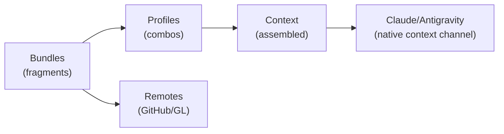

import { Card, CardGrid } from '@astrojs/starlight/components';

## Why Use ctxloom?

<CardGrid>
  <Card title="Save Hours Per Week" icon="rocket">
    Write context once, reuse across all sessions. Stop re-explaining your coding standards.
  </Card>
  <Card title="Consistent Across Projects" icon="document">
    Store your standards in a git repo, pull into any project.
  </Card>
  <Card title="Share Across Teams" icon="github">
    Shared remotes for org standards, personal remotes for yours.
  </Card>
  <Card title="Multi-LLM Support" icon="random">
    Write once, run everywhere. Same context works with Claude Code, Antigravity CLI, and more.
  </Card>
</CardGrid>

:::note[Why not just CLAUDE.md?]
Claude Code has `CLAUDE.md`, Antigravity has `AGENTS.md` - but these are **project-level only** and encourage intermingling project-specific context with general best practices. ctxloom separates concerns: your standards in a personal remote, project context in `.ctxloom/`, team standards in shared remotes. Fragments and commands can also be distilled by a cheap, fast LLM, so a long guideline costs fewer tokens every session.

**ctxloom replaces the native context file, it does not merge with it.** `ctxloom run` assembles context itself and launches the engine in isolation, ignoring `CLAUDE.md` entirely. And if you install ctxloom's hooks into an externally-launched Claude Code, the assembled context is written to `CLAUDE.md` as the whole file - a hand-written `CLAUDE.md` is overwritten. Keep your standards in fragments, not in `CLAUDE.md`.
:::

## What ctxloom Does

| Capability | Description |
|------------|-------------|
| **Context Assembly** | Combine fragments into profiles, deliver to Claude/Antigravity through the engine's own context channel |
| **Slash Commands** | Commands become `/commands` in Claude Code and Antigravity automatically |
| **Session Memory** | Persist context across `/clear`, recover seamlessly |
| **Remote Pull** | Pull bundles from GitHub/GitLab, lockfile for reproducibility |
| **Token Optimization** | Distill fragments and commands with a cheap, fast LLM |

## Quick Example

```bash
# Initialize
ctxloom init

# Review what the remotes shipped - pulled content is withheld until you accept it
ctxloom review

# Run with context fragments (-f takes FRAGMENT names, not bundle names)
ctxloom run -f go-rules -f tdd "implement auth"

# Pull in a whole bundle's worth of context by tag
ctxloom run -t security "implement auth"

# Use a profile (pre-configured bundle/fragment set)
ctxloom run -p backend-developer "review this PR"

# Reference a remote bundle in a local profile, then pull
ctxloom profile create testing -b ctxloom-default/testing
ctxloom deps pull
```

## Slash Commands

Commands in bundles become slash commands in Claude Code and Antigravity CLI:

```yaml
# .ctxloom/content/bundles/my-tools.yaml
commands:
  code-review:
    description: "Review code for issues"
    content: |
      Review this code for:
      - Security vulnerabilities
      - Performance issues
      - Best practice violations
```

Then in your AI CLI:
```
/code-review src/auth.go
```

## Session Memory

Claude Code's `/compact` has a fundamental flaw: it needs context space to run, but you only think to use it when context is almost full. You try `/compact`, it fails, and you're stuck.

**ctxloom works after exhaustion:**

1. **Clear** - Run `/clear` when you hit context limits
2. **Recover** - `/recover` distills this session's transcript from disk
3. **Continue** - The summary is loaded back in, you keep working

```bash
# When you hit context limits
/clear
/recover
```

ctxloom reads the raw JSONL transcript from disk and uses a separate LLM (default: Haiku) to distill it - operating outside your exhausted context window.

ctxloom includes a built-in command:
- `/recover` - Recover context from the **current** session after `/clear`. `/clear` keeps the same session alive, so this is the post-`/clear` path. To pull in an **earlier** session instead, use the `get_previous_session` MCP tool.

## How It Works



1. **Bundles** contain fragments (context), commands (slash commands), and MCP servers
2. **Profiles** combine bundles with inheritance and exclusions
3. **Context** is assembled and handed to the engine on its own context channel - Claude Code is launched with `--append-system-prompt-file`, Antigravity reads `.agents/AGENTS.md`. No MCP is involved in delivery; `ctxloom mcp serve` is a separate, opt-in surface your agent can *retrieve* from mid-session.
4. **Remotes** provide team sharing and community bundles. Pulled content is withheld from the agent until you accept it with `ctxloom review`

## Core Concepts

| Concept | What It Is |
|---------|------------|
| **Fragment** | A piece of context (guidelines, patterns, examples) |
| **Command** | A saved prompt template, exported as a slash command |
| **Bundle** | A versioned YAML containing fragments + commands + MCP servers |
| **Profile** | A named configuration referencing bundles/tags |
| **Remote** | A GitHub/GitLab repository containing bundles |

## Installation

**macOS (Homebrew):**
```bash
brew install ctxloom/tap/ctxloom-full   # or ctxloom for the lighter build
```

**Linux (script):**
```bash
curl -fsSL https://raw.githubusercontent.com/ctxloom/ctxloom/main/scripts/install.sh | bash
```

**Windows (PowerShell):**
```powershell
irm https://raw.githubusercontent.com/ctxloom/ctxloom/main/scripts/install.ps1 | iex
```

[More options](/getting-started/installation/) (manual download, build from source, security verification)

## Running

```bash
# Standalone (wraps Claude/Antigravity)
ctxloom run -p developer "help with code"

# As MCP server (integrate with existing Claude Code)
ctxloom mcp serve
```

## Configuration

```yaml
# .ctxloom/config.yaml
llm:
  defaults:
    primary: claude-code

# The always-bound default agent. Its composed profiles are the context
# you get when you run with no -p/-f/-t.
default_agent: go-developer
```

## Next Steps

<CardGrid>
  <Card title="Installation" icon="laptop">
    [Full installation guide](/getting-started/installation/)
  </Card>
  <Card title="Quick Start" icon="rocket">
    [Create your first bundle](/getting-started/quickstart/)
  </Card>
  <Card title="Bundles" icon="puzzle">
    [Fragment and command structure](/concepts/bundles/)
  </Card>
  <Card title="Session Memory" icon="open-book">
    [Preserve context across sessions](/getting-started/memory/)
  </Card>
  <Card title="taskloom" icon="list-format">
    Companion tool — [per-project tasks](/taskloom/) your agents and you share one store for.
  </Card>
  <Card title="llm-tool-killer (ltk)" icon="approve-check">
    Companion tool — [guide the commands your agent runs](/ltk/), not just its context.
  </Card>
</CardGrid>

---

:::note[LLM Compatibility]
ctxloom is primarily tested with **Claude Code** (Anthropic's CLI). Secondary testing is performed with **Antigravity CLI** (`agy`), which is the next LLM to receive comprehensive testing coverage. Other LLM backends may work but are not actively tested.
:::

:::note[Pre-release]
Active development. Core features stable, API may evolve.
:::
